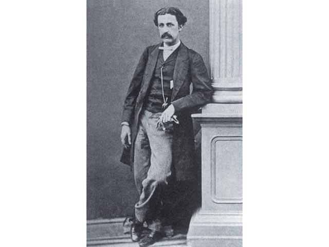

# 帶路黨的宗師

陶傑 20190113
蘋果日報 果籽 名采 

大陸民間敢怒不敢言，像一座地下的火山，據說內心支持川普總統的民意極眾。  

因為於現實感到絕望，亟希望為川普和美國人能做出一番「倒迫改革」的大事，亦即希望借助帝國主義外力，摧漽顛覆本國政權，大陸因此有「帶路黨」之說。這種人的行為，當然不可效法。  

所謂帶路黨，典出於八國聯軍膺懲清國。英美法等文明國家軍隊，殺入北京城，北京平民百姓自告奮勇替洋兵帶路，找梯子幫忙翻圍牆，或指點進那一座城門能最快打進紫禁城，令西方文明國家大為詫異。  

其實北京人的帶路現象，早於八國聯軍。英法聯軍進入北京，當時為英軍任翻譯的資深外交家史雲浩（Robert Swinhoe），已經發現：北京的平民不但對外國侵略者毫不反感，還爭着與英法聯軍做買賣，歡迎英法聯軍進城。  

**史雲浩的中文很流利，天津大沽口上岸之後，奉英軍司令之命與北京平民交談，問他們為何天生吃裏扒外？北京帶路黨平民說：洋人一向講道理，做買賣出手闊，答應過給的錢，一定不會拖欠。**  

史雲浩是一個很了不起的人。最初奉派台灣高雄，是英國在台灣的第一位領事。他學習中文和閩南語，而且是觀鳥專家，尤其對台灣的鳥類十分有興趣。台灣的鳥類百科，是史雲浩一人搜集得的品種，還有野生動物。  

在日本人佔領台灣之前，對台灣的自然風物、山川地理、風土人情，史浩雲了解得最深入，發現二百七十種鳥類，四十種哺乳類動物。因為同時期的達爾文遠征南太平洋，競相走向世界，發現新的鳥類和野獸品種，欣賞而研究，而不是一見到動物飛鳥就想到捕殺烹食，是那個時代文明精英階級的人文探險風氣。  

史雲浩臨危受命，與英軍進北京，目睹火燒圓明園，同時發現了中國人之間有一個叫做「帶路黨」的奇怪品種，在台灣的鳥獸之外，於是也記錄下來，今日在大英圖書館，輸入他的名字，閱覽當年英國人和北京的市民最初接觸的深厚友誼，有如梵高情感澎湃的油彩，今日讀來仍炙熱感人。  

但這位奇才死得很早，得了性病，奉派回國就醫，逝世時才四十一歲。此病從何傳染，是不是讓帶路黨在北京帶他去八大胡同冶遊逛了幾夜之後惹來的，殊不可考。  

後來英國領事館也搬去台北。今日去台灣旅行，若有空去台北市郊的淡水海港，爬上一個小山，找到當年英國人從前的領事館，叫做紅毛城，那座紅磚房子裏還有史雲浩用過的書桌，不妨對着那張桌子，以及窗外居高臨下霞光照眼的台灣海峽，肅立三分鐘致敬。

------

原网址: [访问](https://hk.lifestyle.appledaily.com/lifestyle/columnist/%E9%99%B6%E5%82%91/daily/article/20190113/20589651)

创建于: 2019-01-13 22:20:47

