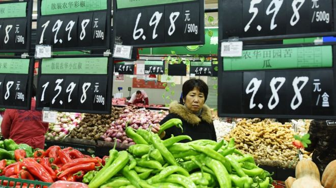
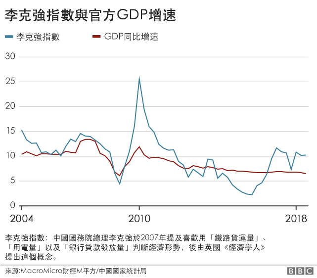
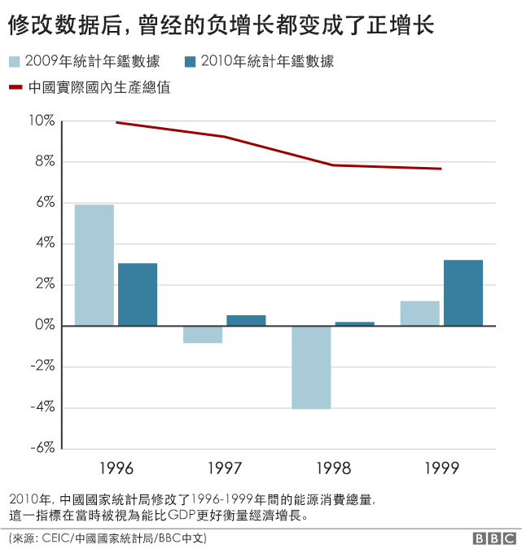
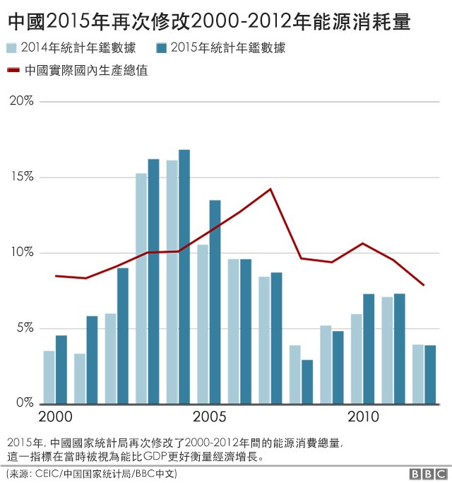
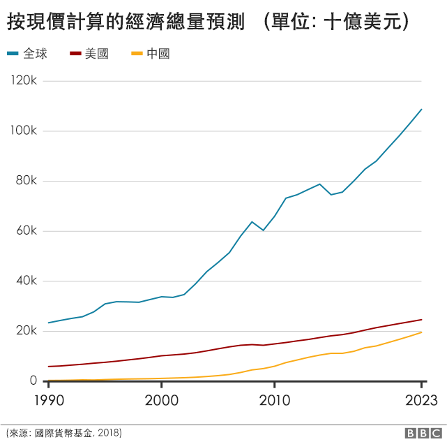
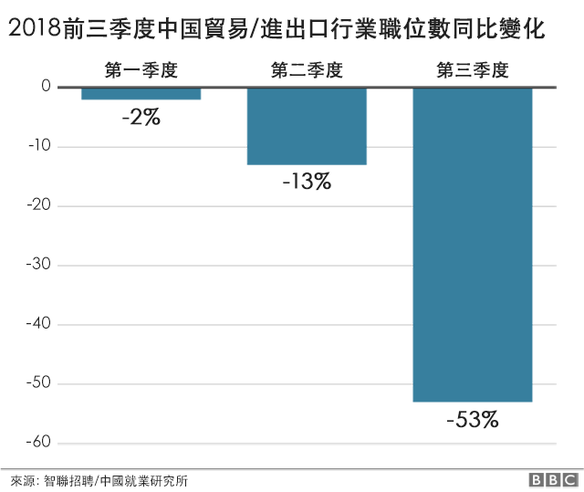

# 中国经济放缓是否严重：从数据看真实走向 - BBC News 中文

周卫 BBC中文记者  2019年 1月 14日

 
图片版权 Getty Images 

近期，中国国家统计局局长宁吉喆称，中国能较好实现2018年经济增长6.5%左右的预期。2018年经济总量预计将达到90万亿人民币，增长8万亿。中国2017、2016、2015年的GDP增速分别为6.9%、6.7%以及6.9%。

然而，在近期的一次演讲中，中国人民大学国际货币研究所理事兼副所长向松祚称，他看到“一个非常重要的机构的研究小组的内部报告”，两种测算方法分别显示，中国2018年GDP增速为1.67%甚至负值。

该视频迅速在社交网络发酵，但随即遭到删除。

[Youtube - 向松祚震撼演讲：四十年未有之大变局](https://www.youtube.com/watch?v=r6offNjTo4c)

## 官方多次修改历史数据

2010年以来，中国经济增速持续放缓。中国统计局发布的2018年前三季度的国内生产总值（GDP）为650899亿元，季度同比增长分别为6.8%、6.7%、6.5%。

多年来，媒体和学界对中国统计局发布的数字一直有质疑。2017年初，辽宁省公开承认此前数年经济数据连续造假。2018年，内蒙古、天津、云南、湖南、吉林、重庆等省份相继自曝或被曝存在经济数据作假问题。

- [下个承认GDP造假的是谁？中国经济数据注水背后的误解与真相](https://www.bbc.com/zhongwen/simp/business-42744639)
- [中国经济现十年来最慢增速 恐持续放缓](https://www.bbc.com/zhongwen/simp/chinese-news-45915821)
- [IMF推演：贸易战持续下去究竟会有多糟](https://www.bbc.com/zhongwen/simp/business-45795803)

早在2007年，时任辽宁省委书记的李克强告诉来访的美国驻华大使，他更喜欢通过三个指标来追踪辽宁的经济动向：全省铁路货运量、用电量和银行已放贷款量，以挤掉统计数字的水分。 2010年，英国《经济学人》分别依25%、40%及35%的权重编制出李克强指数。多名经济学家告诉BBC中文，在最初几年，该指数的确很有参考价值，但是随着中国经济结构变化，加上该指数与其他经济领域、特别是消费支出的关系很弱，2015年以后，该指数与GDP增速的正相关性越来越被质疑。

 

对此，宁吉喆曾表示，地方数据的问题不影响全国数据的真实可靠性。

但BBC中文记者梳理1999-2018年统计年鉴发现，中国国家统计局分别在2010年和2015年对历史数据做了大改动。

从1990年代开始，欧美学界经常将能源消耗量作为衡量GDP增速的替代指标，视其为衡量经济状况的晴雨表。作为新兴经济体的中国有大量工业产出，因此能源消耗巨大。

2009年之前的历年《中国统计年鉴》显示，中国1996至1999年间的能源消费总量逐年下降，分别为138948、137798、132214、130119万吨，也就是说，中国在1997及1998年的能源消耗是负增长，但统计局当关于这四年GDP增速的数据分别是9.9%、9.2%、7.8%、7.7%。如果能源消耗量能反映经济增长势头，那这两组数据明显矛盾。

2010年，《中国统计年鉴》对这四年的能源消费负增长做了改动，此后的年鉴都显示，1996至1999年间的能源消耗总量为135192、135909、136184、140569万吨，由此，能源消费“改为”正向增长。修改后的数据显示，在1996至1999年间，中国能源消费与GDP增速一致。

 

BBC中文记者发现，2015年，中国国家统计局再次对2000至2012年的能源消费值做了修改。除了2007、2008、2009、2012四年，修改后的数据同比增长都有所上调。

 

凯源资本董事总经理陆修泉（Brock Silvers）向BBC中文表示，修改一年前的数据正常，但修改已经认定、超过一年的数据就很不正常，如果是修改十年前的数据，那几乎就不可信了。

一位接近中国国家统计局的知情人士告诉BBC中文，国家统计局喜欢修改历史数据，没有特殊的原因，“只是为了数字好看”。

## 中国经济困境

每年春天的两会上，中国政府工作报告都会提出当年GDP增速目标，而最后的统计数据几乎都会与目标值相差无二。

经济学人智库首席分析师王丹告诉BBC中文，GDP增速不可信，因为对于价格的估算和实际相差太大，地区性差异也没有反映出来。

“我们预测的GDP增速和统计局在有的年份上差别很大，比如2017年我们估计是4.2%，没想到政策刺激过头导致经济加速，最终统计局的数字是6.7%。中国从2008年之后的经济增长绝大部分是政策驱动型，宏观政策尺度不好把握。”王丹说。

国际货币基金组织（IMF）对中国2019年GDP增速预测为6.2%，陆修泉认为，IMF的预测过于保守，中国经济放缓速度已经超过预期。

 

“这不是最终危机，没有经济体会一直保持增长，中国已经经历了近代历史上时间最长、程度最深的经济增长，现在看来，这个周期已经结束了。目前中国经济衰退的严重程度似乎将在短期内增加，稳定的增长可能永远不会回到以前的水平。”陆修泉说。

2018年，中国民间投资大幅放缓，这意味着国企以及地方政府投资比例上升，最终会导致央行货币超发。

“中国经济要真正持续稳定增长、走出今天的困境，必须要改革税收体制、政府体制、国家治理体系以及教育科研体系。”宁吉喆在已经被删除的视频中提及。

## 中美贸易战阴霾下的就业

除了GDP数据，就业也是观察中国经济形势的重要依据。一些去年的就业数据显示，中美贸易战带来的就业影响也已经表现明显，贸易/进出口业的就业压力正在持续呈现。

2018年10月底，中国人社部称，三季度末，全国城镇登记失业率为3.82%，降至多年来低位。9月份全国城镇调查失业率为4.9%，同比略降。然而，中国智联招聘网站联合中国就业研究所同期发布的报告却显示了一副与官方数字完全不同的画面。

智联招聘根据自身数据库作出的分析报告称，2018年第三季度的招聘需求环比与同比同时下降，此外，还出现了供需双降的局面。其中，贸易及进出口行业招聘需求出现了连续三个季度下滑。

  

报告显示，从2018年一季度开始，贸易/进出口招聘需求整体下滑2%；第二季度行业招聘职位数更是同比下滑了13%；第三季度，贸易/进出口整体招聘需求同比下降53%。下滑较明显的地区主要集中在深圳、宁波、重庆等东部和西部地区。其中，贸易依存度较高的新一线城市受到的影响更大，如东莞、宁波和苏州等。

近年来，中国官方统计的失业率一直徘徊在4%-5%之间。2016 年，伦敦政策咨询公司 Fathom Consulting 的报告显示，中国失业率可能是官方估计值的三倍，约为 12.9%。

中国官方与第三方的数据差异之所以如此之大，源于各方采访了不同的统计方法。此前，中国只公布“城镇登记失业率”，2018年之后，改为“城镇调查失业率”，但两种方法均未包括数亿农村劳动力年龄人口。

2018年7月底中共政治局年中会议上，习近平提出六个稳定—“稳就业、稳金融、稳外贸、稳外资、稳投资、稳预期”—应对贸易战。有分析指，正是因为不稳定，所以才提出这个六个稳定需求。

2018年12月，美国花旗银行在其2019年经济展望报告中表示，2019下半年，中国的出口可能会因为贸易战降低一半，预计会造成440万左右的人失业。

------

原网址: [访问](https://www.bbc.com/zhongwen/simp/chinese-news-46841421)

创建于: 2019-01-14 21:18:14

