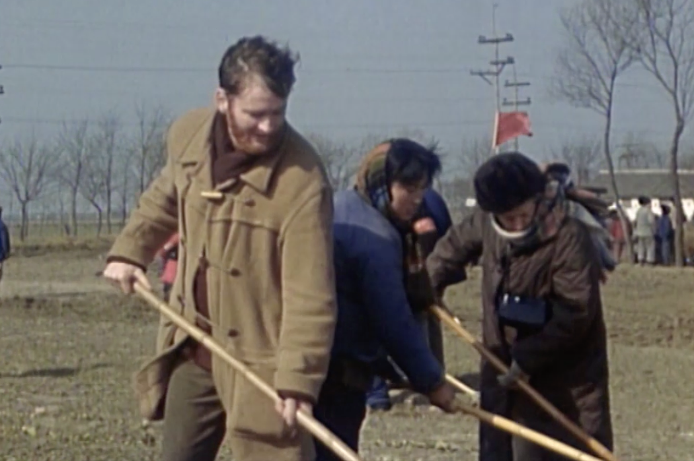
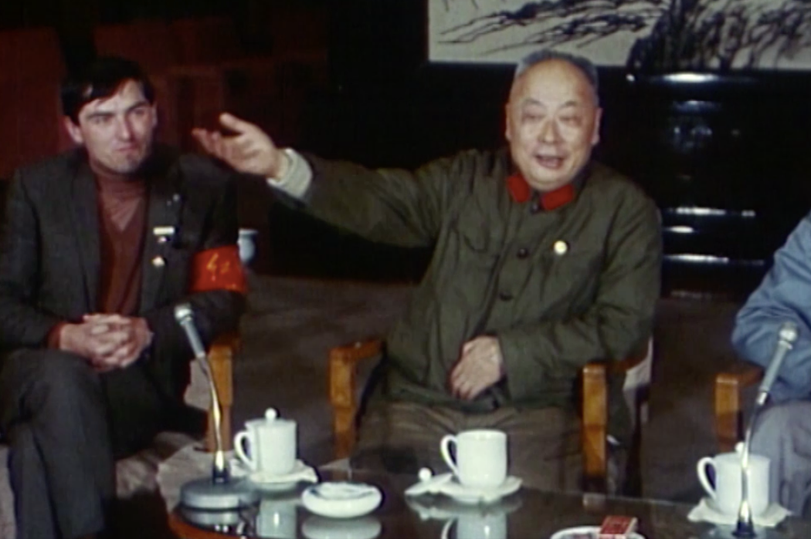
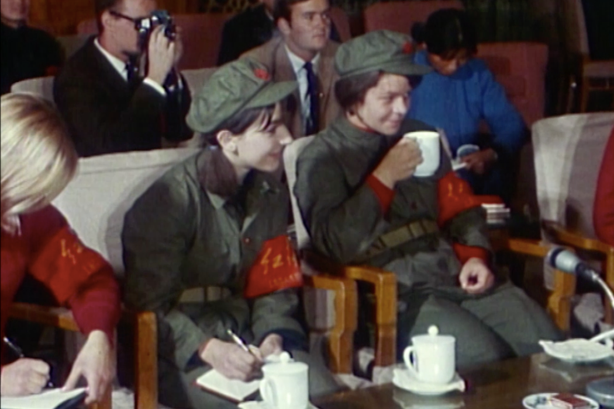
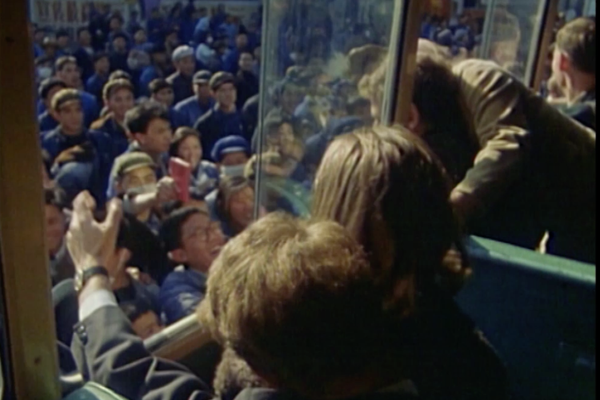
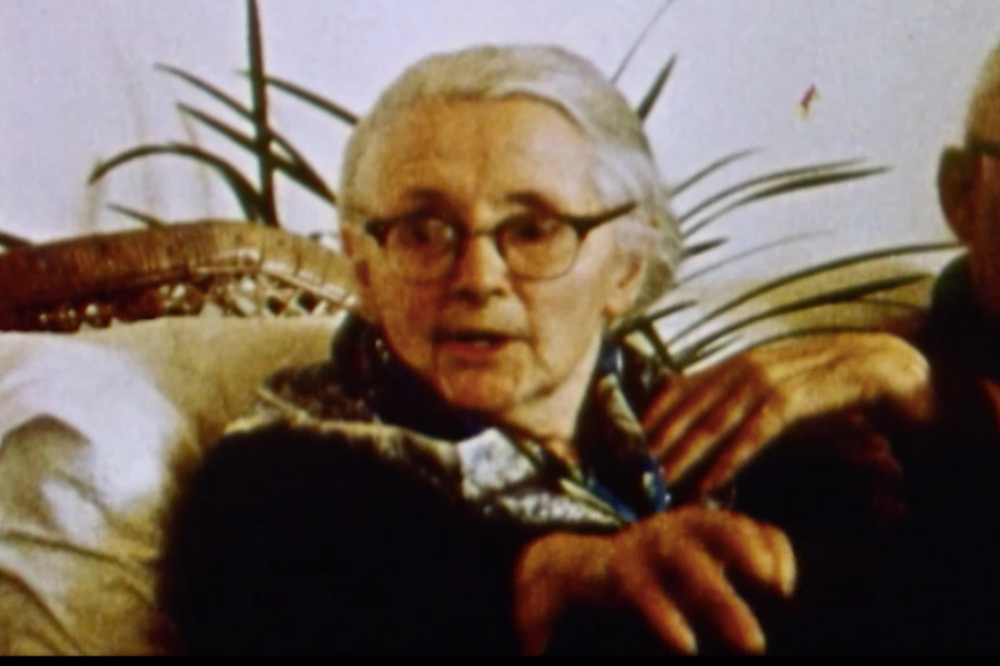
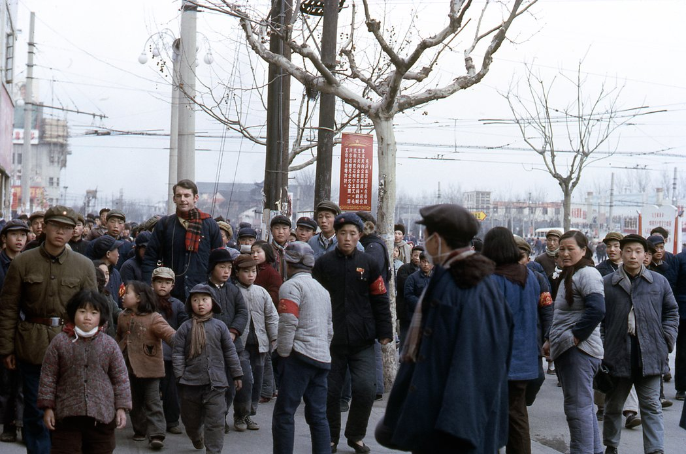
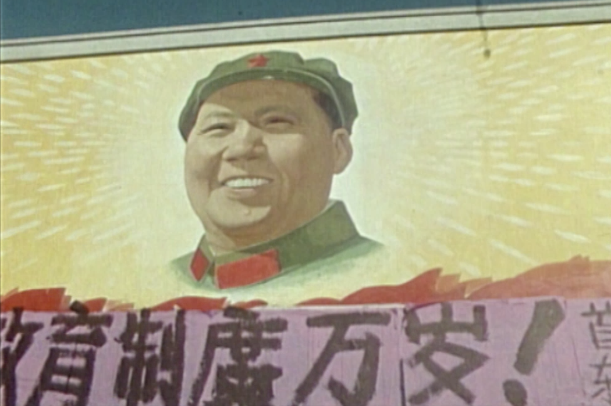

# 文革之游： 外国学生从红卫兵那里学到的一课 - 纽约时报中文网

阚超群

2019年1月14日

1968年的纪录片《红色之子》中，后来成为首任澳大利亚驻华大使的费思芬(Stephen Fitzgerald)与记者鲍勃·里斯(Bob Reece)在天安门广场上与准备被下放的一群学生谈话。 Courtesy of Roger Whittaker

想像一下这样的场景：一群西方的大学生第一次来探访今天的中国。除了几个大城市之外，他们要去的第一个地方是梁家河，中国新的红色旅游圣地，那是习近平主席在50年前的文化大革命中作为下乡青年接受贫下中农教育的地方。在习主席的第二故乡，这些洋学生们或是仔细研究习近平当年帮助老乡挖的井，或是睁大眼睛看他在村里做的化粪池。而在习主席住过的窑洞外，这些学生们全神贯注地参加当地官员运用习近平“新时代中国特色社会主义”思想展开自我批判的会议……

仅仅想一下，都会觉得这样的场景非常怪异。但是在50年前，当一群澳大利亚和新西兰的大学生来中国的时候，他们确实做了这样的朝圣，不过当初的地点是毛泽东的故乡韶山。这些学生一边被手持毛主席语录高呼毛泽东思想口号的老乡团团围住，一边在毛的故居前合影留念。他们走访了一个由昔日的孔庙改成的展出毛泽东生平和作品的文化宫。中国人虔诚地向这些外国大学生介绍韶山。“听从了翻译的意见，我们到达中国‘麦加圣地’的最后一英里采取了徒步行走的方式，象征性地做了一次短距离版的长征，”画外音介绍。

这就是《红色之子》(The Red Sons)， 一部记录57名澳大利亚和新西兰大学生在1968年的文革(1966～1976)中探访中国各地的英文纪录片。这部片子当年曾在澳大利亚国内电视台放映，是少有的记录文革高潮时期的彩色影像。对今日的中国观察者来说，这部纪录片难得地做到了以外来视角对中国尽量平衡地观察，对文革也没有那种简单地讨好西方观众式的嘲讽——虽然剧组与学生们在路上惹了不少政治麻烦。

“那时候中国还没被澳大利亚政府所承认，也被认为是一个不安全的地方，有点像今天的伊朗，” 本片的导演罗杰·惠特克(Roger Whittaker)去年在北京的一个放映会上说，“我当时根本不知道会发生什么，（来中国）是一次探险。”

1967年和1968年，惠特克作为澳大利亚广播公司(ABC)一名二十多岁的助理摄像师，先后两次跟随澳大利亚和新西兰学生代表团来到中国，并记录下所见所闻。                                        

1967年的纪录片《中国67年》中，访问团的学生在一个公社体验劳动。 Courtesy of Roger Whittaker

第一次中国之行拍摄的短片《中国67年》(China 67)仅有13分钟，是用简单的摄像设备拍摄的。这个小片子在澳大利亚ABC电视台得到了放映机会，令惠特克备受鼓舞。他决定在第二年也就是1968年再去一次中国，拍摄一部更全面、准备更充分的电影，也就是《红色之子》。

在当时强劲的毛泽东主义思潮的背景之下，那次探访并非一次简单的旅行，就像电影画外音所说，而是一个更加严肃的“寻找事实的任务”。外国学生团走过了广东、武汉、济南、北京、上海、韶山等地。一路上受到中国官方人员陪同（或者是监视）。无论在哪个城市，街头都是红黄蓝绿的大字报。毛泽东的画像、雕塑、像章无处不在。类似于“大跃进万岁”、“中国人不是好欺负的”等标语充斥在访问团所到之处。

《红色之子》记录下了在文化大革命中那种随时随地的仪式化的宣传。在人民公社里，代表团扛着一个中英双语的大旗，穿上军大衣，戴着红袖标，胸前别着毛泽东的像章，被安排简单体验如何用锄头耕地；各个城市的广场上，人们如痴如狂地喊着“毛主席万寿无疆”；济南的铅笔厂制作的铅笔上都要注明“为人民服务”。在参观一个政治宣传展的时候，宣传员向这些学生朗读“受到毛泽东思想教导”的红卫兵的那些“有崇高道德感的故事”。“毛泽东期待他们展现出中国最早一批共产党人在长征中所表现出来的那种无私，”画外音诙谐讽刺地说，“不过那已经是30年前的事了。”

**耳听为虚，眼见为实**

相对于1968年的访华，1967年访问团对中国当时的情况了解更有限，虽然该片画外音有时讽刺政治过热的地方，比如对大学停课的介绍，但他们明显对文革产生了同情。当访问团从火车站出来，当地的红卫兵接待委员会款待了他们。上千的红卫兵敲锣打鼓，拍手欢呼。“（代表团造成的）轰动程度堪比甲壳虫乐队在西方的巡演，”惠特克说。在这种欢乐气氛中，这些学生在中国乡间来了场红卫兵式的列队行走。

惠特克介绍说，当时的团队里有几个人对中国有兴趣（其中有现任《纽约时报》记者、北京分社社长Jane Perlez），有几个会说中文，但是大部分人对共产党毫无了解，甚至不知道澳大利亚的共产党领袖叫特德·希尔(Ted Hill)。他们遇见的一些中国年轻人虽然对澳大利亚也是毫无了解，但是他们知道希尔, 因为他曾访问中国并和毛泽东见过面。

“可能正是由于特德·希尔对中共的支持才让这两次访问得以进行，”惠特克说。

1967年的纪录片《中国67年》中，澳大利亚学生见到了时任中国外交部长的陈毅，他们之间的谈话气氛轻松。 Courtesy of Roger Whittaker

1967年的纪录片《中国67年》中，参访团的学生们在会见陈毅时穿着红卫兵的服装。 Courtesy of Roger Whittaker

1967年，澳洲学生甚至见到了时任中国外交部长的陈毅元帅，他们之间的谈话气氛异常轻松。当被问到当时红卫兵对他个人的批评时，陈毅说国家领导人可以被批评是好事，如果愿意的话，他也可以批评红卫兵。这次见面后不久，陈毅遭到批判并被撤销政治局委员职务。纪录片以毛泽东的一句简介有力的话结尾：“耳听为虚，眼见为实。”

“因为团队是按照官方安排好的行程活动，他们从头到尾并没有看到任何暴力活动，”惠特克回忆道。“学生们的印象就是，红卫兵不上学了，都免费搭乘火车去北京搞串联。”

1968年的行程很不一样。惠特克说，“红卫兵之中明显出现了明争暗斗，我们也没有受到相似的欢迎。在1967年我们对于结束活动恋恋不舍，但是到了1968年，我们都巴不得早点离开。”

相比于上一次有些“走马观花”的访问，1968年的中国之行更加深入，而且来访者对文化大革命有了更多思考和批判。影片试图解答一个问题，革命化的意识形态在多大程度上已经渗透到中国社会的各个方面？至少在表面上，中国人似乎相信并将这种革命造反精神和毛泽东的指导作为他们生活中的至高准则。

1967年的纪录片《中国67年》中，载着澳大利亚和新西兰的学生访问团的大巴受到热烈欢迎。上千的红卫兵敲锣打鼓，拍手欢呼。到了1968年，气氛已大不相同。 Courtesy of Roger Whittaker

1967年的纪录片《中国67年》中，欢迎参访团的红卫兵。 Courtesy of Roger Whittaker

镜头里中国人对毛泽东的个人崇拜非常极端。幼儿园的孩子们用还不清楚的发音唱着歌颂毛主席的歌曲，跳着动作一致的革命舞蹈。在广东的一个师范学校，英语系的学生们不再读含有“资产阶级思想”并“无用”的经典文学，比如莎士比亚和雪莱的作品，而主要是学习毛泽东的英语翻译作品。在武汉东湖边，一个戴眼镜的年轻人说他已去过北京三次并看见了毛主席，当被问到对此有什么感受时， 他回答，“ 非常激动、非常高兴，什么都不会说了，我愿意把我的生命、把我的一切都献给伟大的毛主席。”

和学生代表团一起加入1968年中国之行的还有一位年轻记者鲍勃·里斯(Bob Reece)，他在影片中作为采访人出境。几年之后，里斯成为了历史上最早[被新加坡政府驱逐出境的记者](https://www.nytimes.com/1971/05/18/archives/singapore-expelling-3-foreign-newsmen.html)之一。里斯犀利的提问帮助《红色之子》触及了很多敏感深刻话题，也在一些时刻导致气氛紧张，感觉冲突一触即发。

到了1968年，影片拍到的很多地方已经过了文革最狂热的时期，政府开始试图恢复秩序。武汉街头依然一片狼藉，到处飘着撕扯下来的大字报。画外音说，“残留的大字报见证了文革暴风般的规模。”

1968年的纪录片《红色之子》中，参访团在广州采访英语专业的中国学生。 Courtesy of Roger Whittaker

在天安门广场，访问团遇见了一群准备去云南农场下乡的女学生。一个学生干部对着镜头说，学校里有关于两条路线的斗争。当里斯询问细节时，她显出不悦。她们没有解释两条路线的斗争细节，而是给这群外国人唱了一首《敬爱的毛主席，心中的红太阳》。学生代表团还走访了一个北京的中学，该校的党书记在文革中丢了职，但是通过深刻的自我检讨，又恢复了工作。影片介绍，“人民解放军的三位思想政治官员被派到这个学校平息学生之间的派系斗争。”

在上海复旦大学访问期间，惠特克和里斯问一群物理系的学生文化大革命开始后他们的学习生活发生了什么变化，他们说文革之前老师是学术权威，教学是“填鸭式”的，文革之后，同学可以指出老师的错误。

当被问到“在西方，很多人认为红卫兵的做法是军事化的，有人把红卫兵和希特勒的青年纳粹团体做对比，农村有很多红卫兵打人的状况，你们怎么看” 时，这些中国学生的笑容变得尴尬，现场陷入了沉默，甚至气氛也紧张起来。这时，一个学生出来以很官方、呆板的口气说，“毛主席从意识形态的角度鼓励向走资派宣战，通过大字报的形式批判他们。他个人是反对武斗的，大部分的红卫兵都遵从毛主席的指导，当然这场伟大的运动里也有缺点。”

里斯的采访翻译是在1973年成为第一任澳大利亚驻华大使的费思芬(Stephen Fitzgerald)，受到了毛泽东和周恩来的接见。从影片中可以看出费思芬对中国人民是抱有同情的，并深谙中国式的交流方式，尽管也能看出他对毛领导之下中国的清醒批判。  

“我觉得今天我们看到的最令人不安的事情是对毛主席的个人崇拜，” 费思芬在影片的开头对里斯说，这种疯狂崇拜可能会导致“对毛的神化”，“如果这样的事情发生了，那么毛的继任者们就需要相互竞争，证明自己是毛挑选出来的门徒。”

1968年的纪录片《红色之子》中，里斯采访了在中国生活了30多年的美国记者安娜·路易斯·斯特朗 (Anna Louise Strong)。她是一名共产党员，以“毛泽东的朋友”的身份自豪。 Courtesy of Roger Whittaker

费思芬的观点和美国传奇记者安娜·路易斯·斯特朗 (Anna Louise Strong)支持毛的观点形成了对应。斯特朗是一名共产党员，以“毛泽东的朋友”自豪。1946年，当中共被迫离开延安时，斯特朗曾经采访过毛泽东。正是在那次采访中，毛泽东的一句话成了后来不断被提及的经典语录：“一些反动派都是纸老虎。”在文革初期，斯特朗戴着“红卫兵”袖章走上天安门，毛泽东曾在她手中捧着的《毛主席语录》上签名，而这一场景被拍了下来，刊登在了《人民日报》上。

在来到广州的时候，里斯采访了斯特朗， 这也成为斯特朗在她30多年中国生活中留下的难得的一段视频采访。斯特朗说，中国人对毛泽东的巨大崇拜是西方人非常难以理解的，一半的中国人记得，1949年前，“他们的母亲被饿死，他们眼看着父亲被军队抓走……但现在他们有饭吃，有地种，有过冬的棉衣，有自尊心，而他们知道这一切——如果说是来自某一个人的话，就是来自于毛。”

惠特克从一些细节中微妙地捕捉到了这场革命讽刺的地方。那种官僚主义、那种俗套的对外表演，在50年后的今天恐怕依然能让在中国的外国人产生共鸣。

中国人一遍遍重复的宣传内容让这些外国年轻人无聊、烦闷、昏昏欲睡。“我们所到之处，活动都会以一个所谓的‘简单介绍’开始，” 电影画外音说，”但是即使是对中国有着最大好奇的人，也会很快对这种重复的、千篇一律的、持续三个小时的宣传感到无聊。”

1968年的纪录片《红色之子》中，拿着《毛语录》的老人站在人群中。 Courtesy of Roger Whittaker

在上海附近的农村，代表团和一家农民住在一起。村民们在集会上批判刘少奇因为支持农民保留各户耕地而造成了“恶劣影响”，另一面却在自家门前偷偷耕种自留地，这点他们也乐于向澳洲学生承认。

中国人太急于向外界传达他们的“无产阶级文化大革命”了。在武汉东湖边，一群中国青年人围坐在两个外国来访者身边，谈论他们眼里的外部世界。“澳大利亚的封建主义者和资本主义者把老百姓当做炮灰送到朝鲜战场和越南前线，” 一名男青年认真地说，“我们确信，在不久的将来，澳大利亚人民会将封建主义和资本主义推翻。”电影的画外音这样总结，“尽管中国人很少有和外国人交流的机会，但是见面的时候他们更乐于做的是向外国人讲述他们自己，而不是询问对方的情况。”

**惹恼了红卫兵**

由于国有旅行社大部分时间对团队活动管理非常严格，拍摄红卫兵的揭发批判活动非常困难，惠特克回忆说，只有一些学生自己偷偷地溜出去看了这样的活动。

“大家没有机会看到一个完整的文革图景，所以很多学生是同情文革的，”当年访问团里一位叫做谢莉(Shelly Warner)的女士说。“但是后来的年代里，慢慢接触到更多关于文革的知识，开始觉得当时是被洗脑了。”

1967年，澳大利亚广播公司(ABC)助理摄像师罗杰·惠特克(Roger Whittaker)跟随澳大利亚和新西兰学生代表团来到中国。站在人群中，身形高大的他十分显眼。 Courtesy of Roger Whittaker

不过，在1968年的访问中，也出现了一些惊险的经历。惠特克在采访中回忆，学生团成员被中国人要求“自我检讨”过好几次。一些厌烦了官方安排的学生擅自离队去街上拍摄自己觉得有意思的老房子或者老石碑的时候，会被中国人报告给警察。“可能他们觉得这些旧的东西会向外界传递出一个落后的中国形象吧，”惠特克这样理解。

还有学生被指控“侮辱毛泽东”。一个学生给印刷品中的毛泽东像画上了调皮的小胡子，另一个在纸上涂鸦了经典卡通形象史努比(Snoopy)狗，并在旁边配上了“Long Live Chairman Mao” （毛主席万岁）几个字，这惹恼了红卫兵。红卫兵严厉地让这些学生道歉并自我反省。

在上海，另一个团队成员在扔垃圾的时候顺手把印有毛主席画像的纸扔了出去，结果一个酒店女工被激怒，认为这个外国人侮辱了毛主席。在争论中，红卫兵坚持要带这个学生出去接受人民群众的审判。情形已经非常紧张，直到驻扎在附近的军人带枪赶来，外国学生和红卫兵的冲突才化解。

“在红卫兵试图向同伴展示他们的‘红’和对毛的忠诚时，我们这些外国人就成了最好的、最安全的攻击目标，”惠特克说。

为什么没有在记录片中加上这些冲突内容？惠特克解释说，除了来不及或不容易拍到画面的原因，“这有一定的危险性，而且我们当时也有自我审查的成分，因为我们不希望（因为加入这些）导致完全不能拍摄。而且我知道任何关于红卫兵的暴力行动都会被西方或者美国媒体抓住，对其的关注度会不成比例得超过片子里任何其他部分。”

1967年，纪录片《中国67年》中，惠克特拍下了毛泽东的肖像随处可见的情景。隔年，惠克特再次来到中国拍摄《红色之子》。他表示，当时有参访团的学生被指控“侮辱毛泽东”，红卫兵要他们道歉并自我反省。 Courtesy of Roger Whittaker

《红色之子》的制作过程也有些曲折。在行程出发前几天，惠特克被中方告知拍摄后的胶片需要留在中国洗印。中方对拍摄还做了规定：不能出现军队形象，拍摄老百姓时要征得对方同意，不能拍大字报。前两项容易做到，可是避开大字报非常困难，惠特克说。

当团队快要离境的时候，惠特克发现他的一部分被拿去洗印的胶片完成了，随便地扔在一个木箱子里，上面落着灰。惠特克一看，洗印的质量实在太差，颜色都不对，比如太阳是蓝色的。惠特克很沮丧，觉得这些拍摄内容都毁了。他把情况上报给行程组织者，组织者说回去要跟上级“传达一下批评意见”，可是仍旧坚持让他把剩下的胶片留在中国。六个月后，惠特克在香港收到了剩下的洗印好的胶片，发现质量同样差，不过好在什么都没有剪掉。幸运的是，回到澳大利亚之后，经过修复，图象还能看，声音也还可以。

惠特克之前也在中国做过放映活动，包括在一个大学的电影制作课上。据他介绍，现场有很多年轻观众，观看的时候很安静和投入。

“我知道他们中的很多人并没有公开地学习过关于文革的历史，他们的家人也很少告诉他们详细的经过，” 惠特克说，“不过有个学生说她看到过关于文革的影像，不过是黑白的，我的片子是她第一次看到的彩色文革影像。”  

阚超群(Karoline Kan)， 中外对话编辑，《纽约时报》北京分社前研究员，非虚构作品《Under Red Skies: Three Generations of Life, Loss, and Hope in China》将于2019年3月在美国出版。

------

原网址: [访问](https://cn.nytimes.com/china/20190114/revisiting-red-children-50-years-on/?utm_source=tw-nytimeschinese&utm_medium=social&utm_campaign=cur)

创建于: 2019-01-15 21:25:43