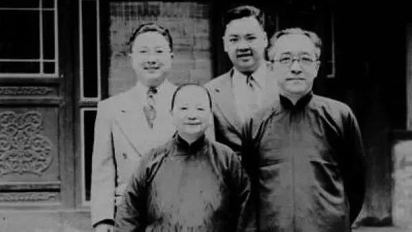
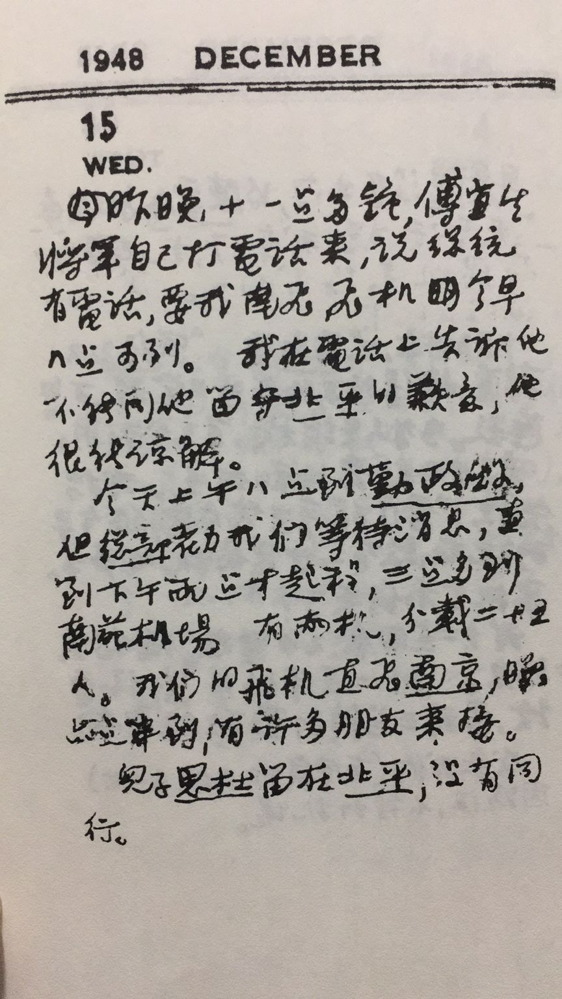
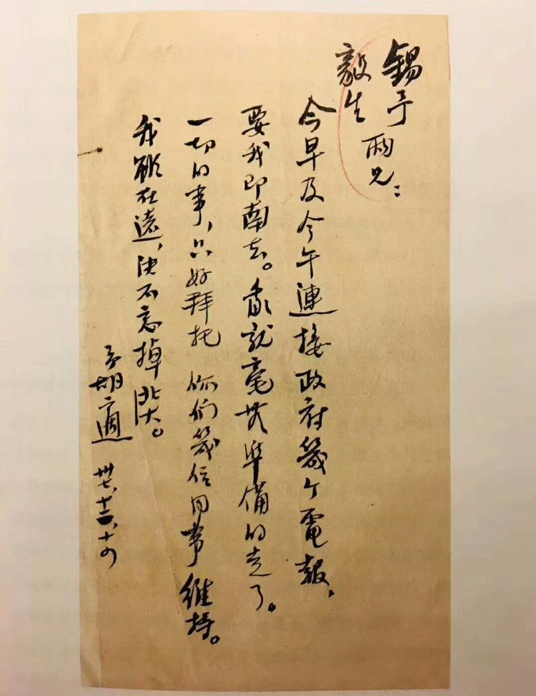

# 生死两茫茫：胡适小儿子思杜自杀前后

[_东方历史评论_](https://www.weibo.com/u/1980953575)    作者： 沈卫威     发布于 2019-01-14 16:54:11  

​​**撰文：沈卫威**

## 1

在撰写《胡适传》(河南大学出版社1988年10月初版)过程中，我曾就胡适的小儿子胡思杜的死进行了一番调查，走访了在大陆的胡适的亲属和朋友。《胡适传》出版后，有朋友向我提出传中关于思杜之死写得模糊，且有错误，建议我再下些功夫，写出个真相来。于是我又走访了有关知情者，将思杜之死及前后的相关事件作一梳理，供海内外胡适研究者参考。引文中模糊处，加有按语。

  胡适与江冬秀所生两儿一女，依次是祖望、素斐、思杜。思杜少时患肺病，小学时读时辍，后来胡适便让自己的学生罗尔纲(后为太平天国史研究专家，著有回忆与胡适交往的《师门辱教记》等)做家庭教师，教思杜及祖望学习，同时帮他整理父亲胡传的遗作。后来思杜入校读书，但非聪颖之辈，善交朋友，贪玩乐。抗战开始后胡适出任驻美大使，1939年，先让长子祖望到美国，入康乃尔大学，仍留思杜随母亲在国内。上海成为“孤岛”之后，江冬秀一度带着思杜避难于上海租界，思杜也入上海的学校读书。胡适把思杜委托给友人竹垚生代为管教。1940年11月9日，竹垚生致信在美国的胡适，说：“小三(胡适在日记中称思杜为小三)在此读书，无甚进境，且恐沾染上海青年恶习，请兄要赶快注意。”

  

前排胡适与江冬秀，后排左起长子胡祖望，次子胡思杜

一次在美国朋友施太尔先生所拍摄的录像片中，胡适见思杜走路“有点摇头摆耳的神气”，立即给江冬秀写信，告诫她：“我盼望你时时注意，叫他自己留心，不要养成这种不好看的样子。” 

在这一年(1940)3月21日，胡适在一封致思杜的信中，曾表示让思杜到昆明西南联大读书，说：“你应该明白。学社会科学的人，应该到内地去看看人民的生活实况。你二十年不曾离开家庭，是你最不幸的一点。你今年二十了(十八岁半)，应该决心脱离妈妈去尝尝独立自治的生活。” 

对此，胡适有些着急，怕思杜沦为他(胡适)当年(1909-1910年)在上海中国公学时的荒唐境地，便于1941年5月，让思杜到美国学习。1948年夏，胡适托朋友把思杜从美送回北平。

关于思杜的详情，思杜的远房堂弟胡恒立(原北京师范大学党委副书记，1988年8月去世)1986年8月接受我的采访时说：

思杜是个平时不好读书的人，他喜欢交朋友，喜欢玩。我们在北京的十几位堂兄弟姐妹中，他最幽默风趣，会说俏皮话，有时办事(行动上)也滑稽可笑。因为我们是作为胡适的远房亲属移居北京(当时叫北平)谋生的，生活上自然也多得胡适的照护。其中我兄妹几个能读大学并在大学里工作，也主要是因胡适的影响所致。思杜长得圆(胖)乎乎的，一说话就笑，我们兄弟姐妹聚会时，只要他在，气氛就会很活跃。他花钱大方，交朋友也大方。生活中是个乐天派。他到后来自杀身亡，纯属不得已，是精神上完全崩溃了。

思杜自美国回到北平及为何没有随胡适南下之事，胡适的学生、秘书，北京大学历史系教授邓广铭先生(曾任历史系主任)，在1986年8月对我谈道：

我作为胡适的学生(邓广铭为三十年代胡适得意的从事史学的三大弟子之一，另二位为吴晗、罗尔纲。邓先生于1986年8月、1992年4月、1992年7月，先后三次与我谈他与胡适的交往，笔者受益颇多。吴晗1949年以后没有写批判胡适的文章，曾引起许多人的惊叹)，日本投降后，北京大学从昆明西南联大分离出来，迁回北平，傅斯年为代校长，我为校长办公室秘书，历史系副教授。胡适从美国回来任校长时，我仍为校长办公室秘书，协助他工作。1948年夏，思杜从美国回到北平后，因他在美国是学历史的，又是胡适的儿子，所以不少人看重胡适的面子，纷纷要给思杜介绍工作，或请思杜到大学任教，其中山东大学历史系最为积极。这件事为胡适所拒绝。他知道这是朋友们在看重他的面子，他怕思杜日后毁了这种友好的情份，只好说思杜学业不成，不是研究学问的人才。当然，朋友们也知道胡适这是怕思杜不成器，有伤他胡适个人的声望。后来，胡适只同意让思杜到北平图书馆工作。

1948年12月，北平被共产党的军队包围，12月14日，蒋介石派飞机到北平来接胡适等文化名流。来使告诉胡适说这是南下的最后一次机会。胡适打电话约辅仁大学校长陈垣一起南下，被陈拒绝了。他又打电话给清华研究院教授陈寅恪，但不知陈的去向。胡适为此很着急，我劝他不要急，并说我知道陈寅恪在什么地方。因为陈寅恪时常在他哥嫂家（陈衡恪1923年去世后，留在北京的家人），那里我常去。最后我把陈寅恪找来了，陈便随胡适一起飞到了南京(15日)。当时思杜不愿意随胡适南飞，他刚从美国回北平不久，对国内这几年的情况不熟悉，他说：我又没有做什么有害共产党的事，他们不会把我怎么样。结果胡适夫妇就把他留下来了。

傅作义放胡适离开北平，儿子思杜留下。胡适日记手迹

胡适在傅作义将军的帮助下离开北平之事，我在《胡适传》中已作了明确的交代。思杜留下后的情况，据江泽涵夫妇(江泽涵为胡适夫人江冬秀的堂弟，曾任北京大学数学系主任，胡适离开北平时，江泽涵在瑞士作访问学者)1986年8月在北京大学燕南园向我回忆：

胡适和冬秀离开北京时，因思杜执意要留下，冬秀很难过，不愿意扔下他，但又没有其他办法，只好给思杜留下了许多细软和金银首饰，说是让思杜结婚时用。共产党的军队进城后，思杜被组织派到华北革命大学(中国人民大学的前身)学习、改造。去学习前，他把冬秀留给他的一皮箱细软和金银首饰等都放在我们这里。等他学习、改造结束后，他来把这一皮箱东西取走了，说是要把这些东西上交给共产党的上级组织，他以后用不着这些东西了。同时他还说要加入中国共产党。思杜在华北革命大学学习改造结束后，被分配到唐山铁道学院(此校后来迁至四川，改名西南交通大学)“马列部”教历史。后来他也常来我们这里，那时他表现很积极，说要与他父亲划清界限，并积极要求加入共产党组织。他上交母亲留给他的东西，就是向共产党组织表示他的忠心。他还写了批判他父亲的文章。

胡适飞到南京后，很快就被蒋介石派往美国作非正式的民间外交使者，请求美援。胡适到美国后不久，香港共产党控制的左派报纸立即登出了一封《北平辅仁大学校长陈垣给胡适的公开信》(北京《人民日报》1949年5月11日登出)。对此，胡适于1950年1月9日写了《共产党统治下决没有自由》即《跋所谓〈陈垣给胡适的一封公开信〉》，用考据的方法，认定这封信不是出自陈垣之手，是有人代写，或陈垣有此类信，但经过官方加工过。同年9月23日，台湾《中央日报》第二版上刊登了9月22日路透社香港电“胡适的儿子胡思杜今日在左翼的《大公报》发表一文，斥其父为‘反动分子，其罪行早和美帝有关’。胡思杜刻在北平，他声言和他父亲脱离关系，因为胡适是‘人民的敌人’”。

1948年12月14日胡适离开北大，准备南飞前给汤用彤、郑天挺的信。

这则消息登出后，胡适的学生、台湾大学校长傅斯年于9月28日致函《中央日报》，就他所知思杜的情况及中共的方针政策发表声明，因为胡适此时在美国。傅斯年的信被登在9月29日《中央日报》上。他说思杜少年多病，学业不成，尚属天性醇厚之人。1948年夏由在美朋友送其回国。最后，傅斯年在信中说：“共产党对于不作他们工具乃至于反对他们的教育界中人，必尽其诬蔑之能事，《大公报》上这一文，也不过一例罢了。陈垣、胡思杜等都是在极其悲惨的命运中。因为不能出来，别人代他写文，我们也不必责备他了!”

当时胡适对此事的态度是有口难言，他对记者说：“我们早知道，在共产主义国家里，没有言论的自由；现在我们更知道，连沉默的自由，那里也没有。”这就是“没有说话的自由，也没有不说话的自由”。

胡思杜的文章登在香港，大陆的《中国青年》等刊物都有转载。这是胡思杜在华北革命大学学习、改造时写的。这篇文章是否真的出自思杜之手，或者说全部是思杜的话，我无法得知，但其中有一段，颇使胡适难堪，当然也是他根本不曾想到过的。

今天，我受了革命的教育，我再不怕那座历史上的“大山”，敢于认识它，也敢于推倒它，也敢于以历史唯物主义的天平来衡量他对人民的作用。从阶级分析上，我明确了他是反动阶级的忠臣、人民的敌人。在政治上他是没有什么进步的。1930年做北大文学院长以后，更积极地参加巩固加强匪邦的工作，成为反动政权的忠实走狗。这次出走，并在美国进行第三党活动，替美国国务院掌管维持中国留学生的款项(企图培养大批民主个人主义者，忠实于美帝的信徒)。这一系列的反人民的罪恶和他的有限的(动机在于在中国开辟资本主义道路的)反封建的进步作用相比，后者是太卑不足道。

此文与在香港《大公报》上发表的文字略有出入。这篇题为《对我父亲——胡适的批判》在当时海内外影响很大，思杜也因此受到共产党官方的表扬，华北革命大学的学习结束后，他才得以在唐山铁道学院“马列部”(“马克思、列宁、斯大林、毛泽东思想基本理论教研部”)教历史。

写作《胡适传》时，关于思杜的情况，我主要依据胡恒立、邓广铭、江泽涵夫妇提供的材料。其实最了解思杜的胡思孟(思杜的远房堂兄)，我曾于1986年7月、1987年7月两度到北京寻访他，都未曾得见，直到1990年9月中旬在北京，我们才得以第一次会面。

胡思孟先生是思杜在父母离开北平后，接触最多的亲人。思杜1957年9月21日因被打成“右派”分子而自杀前留下的遗书就是写给他的，同时也是胡思孟到唐山铁道学院参与处理思杜的后事的。胡思孟向我回忆起思杜的往事时，还十分伤感，视思杜如亲兄弟一般。胡思孟目前因心脏病、白内障及听力下降等病症，他的回忆断断续续，我将其连缀成段，并加上按语：

我在上海时，他(思杜)没有上学，请家教(此时家教不是罗尔纲，罗到北平时才做思杜的家庭教师)。我比思杜大几岁，十四岁时到上海当学徒三年。到北平时，是找我叔叔(胡恒立的父亲)，他介绍我到天津私人开设的印刷局当学徒。“七·七”事变后，我到北平的铁路上工作。我没有文化，小学还没有上毕业。他(思杜)妈在北平、上海时对我很好，因为我从小没有父母，到上海当学徒时，胡适在上海中国公学当校长，他想让我读书，我读不下去。

1948年，胡适、冬秀去南京，让思杜走，他不走，思想很进步。共产党进北平后，他和北平市市长何思源一起学习、改造。后来唐山铁道学院把他要去。他在唐山是讲师，教历史的。

1957年秋，思杜被打成“右派”，批斗他得很厉害，他受不了，就上吊自杀啊。自杀的原因，他事先告诉了他的一个同事，是个共产党员，一个系的(系是一个部)。他死前，给我留了个遗书，是写好后压他枕头下，他单位的人发现后，给我打电报，让我去唐山。我收到电报时哭了。我到唐山后，他已经死了，装在棺材里，我们在郊外挖了坑，把他埋下，并立了一个小木牌，现在恐怕已不知在什么地方了(如今墓地也找不到了)。

遗书我看后要带回来，他的单位的人不肯，留下了，只给我抄了一份。我是到唐山后，他的组织上的人告诉我，他是畏罪上吊自杀的。遗书的内容我现在记不大清了，但基本内容还记得，大意是：现在我没有亲人了，也只有你了。你来后我一定不在了。找我的一个同事，他会告诉你我的一些情况。你是我最亲的人了。现在我已经死了，你不要难过。你能吃苦、耐劳，我剩下的六百多元钱(现金)，公债券二百多元，你的孩子若能上学的话，供给他们上大学。一个手表也给你，留个纪念。希望你们努力工作，你的孩子们好好学习，为社会主义立点功。其实当时还有江泽涵、胡恒立等亲人，他是怕连累他们，因为胡恒立兄弟都是共产党员。我是没文化的工人，不怕连累。

我到唐山后，看到满院子的大字报，都是批判他的，也有批判胡适的。我把他的书和衣物装了一架车托拉回北京。其中《新华月刊》就有一大箱子，还有许多外文书。家里没有多余的房子放他的书刊，我就把大部分当废品卖掉了，卖了几十元钱。因我有六个孩子，没有一个上大学的，他们也不读思杜的书。衣服没有什么好衣服，一个旧皮袄，一件呢子衣服。他也是艰苦朴素，钱不多，平时还接济我，让我的孩子上学。思杜也没有对象(女朋友)，找不到对象，别人一介绍女方，女方一听说他是胡适的儿子，是战犯的儿子，女方都不愿意了。有对象他也许就不会死了。

我在铁路局的印刷厂工作(当印刷工)，因思杜的关系，在“文革”时被打倒(成了黑帮分子)，逼着我到火车车辆段当工人，不久又把我赶出北京，押送到宝鸡修铁路，直到“文革”后退休了才回北京。“文革”开始后“红卫兵”抄家，我害怕了，就把思杜的书大部分都烧了，有些外文书我也看不懂，只要有胡适和思杜写的字，签的名，都撕下来烧了，现在仅存十几本外文书了。

他写给我的遗书，“文革”时，我也是因害怕，把它撕了，只保存一点，颜振吾拿去了(保存下来的一小块，为一张纸的一个角，不是思杜手迹原件，为抄件。1987年交给胡适家乡绩溪县政协副主席颜振吾，颜先生曾将这份残稿出示给中国社会科学院近代史所耿云志先生，耿抄写了十几个字及日期：“工作，好好学习，为社会主义立点功。”“五十一元也留给你们”，“九月二十一日”。1990年9月下旬我与耿云志先生谈起此事时方得知。同时推测思杜自杀的日期为9月21日以后，即写完遗书之后。但具体日期无法确实)。

其中思杜自杀的原因，据胡恒立1986年8月对我说：

思杜自从登出批判他父亲的文章后，想争取入党，他上交财产(指江冬秀给他留用的东西)也是出于这样的动机。到唐山后，他积极、努力工作，觉得父亲是有罪，他是在为父亲赎罪。反“右”之前，共产党自上而下让群众给领导提意见，即所谓的“百花齐放，百家争鸣”。思杜不知这是一场政治运动的预示，他因为想入党，就积极、主动地给他所在院、部的领导提了关于教学改革的建议，但马上学院领导把他定为“右派”分子，说他是向共产党进攻，并抬出他的父亲胡适，一齐批判。批、斗大会开了许多次，他精神上崩溃了，最后绝望而自杀。

思杜自杀之事，报纸并没有报道，在海外的胡适及江冬秀、胡祖望等都长时间不知此事。1957年6月4日，胡适在美国纽约预立的遗嘱中有(七条遗嘱的第六条)：“去世以后，如果留有遗产，留给夫人江冬秀女士，如江女士先行去世，则留给两子胡祖望、胡思杜，如两个仅一个留在，则留给该子。如两子均已去世，则留给孙子。”

胡适立遗嘱，是因心脏病发作，他是直到1962年才病逝台北的。立遗嘱的时候，思杜尚未自杀，但他们父子已失去了联系，后来思杜自杀的事逐渐传到海外，胡适、祖望隐约听到，但又无法证实消息是否确切。据江泽涵夫妇1986年8月对我说：

祖望在“文革”后期，大约是1974——1975年前后，从美国给我们写信，我们作为他的舅舅、舅母，也是长时间与他失去了联系。他信的内容主要是了解我们的近况，同时问及他弟弟思杜是否还活着。他大概是在海外听到关于思杜自杀的消息了。因为胡适遗嘱上说到他们兄弟俩分遗产的事，他想证实思杜是否还在人世。当时，我们全家因为与胡适的关系，也是被整得几十年抬不起头，喘不过气，不敢给祖望回信，怕再因“海外关系”、“胡适关系”惹出祸端来，就把这封信交给学校的领导，征求他们的意见，结果学校没有明确答复我们。我们也不敢随便、轻意写回复祖望的信。直到一九七六年以后，中国的情况发生了大的变化，我们才与祖望恢复了联系。

思杜之死，是作为他个人的悲剧的结束。作为胡适的家庭悲剧——“覆巢之下，安有完卵”？同时“反右”作为一场政治运动，又何尝不是中华民族特定历史时代的社会悲剧？

## 2

胡适看到纽约《华侨日报》上刊出《胡适被自己儿子声讨为帝国主义走狗及人民公敌》的报道，并剪贴在日记上。

随后，胡适在致徐大春（徐新六之子，思杜在美国读书时的朋友）的信中说思杜的“学习总结”是他自己写的。“我这样想，所以我当时只说他没有缄默的自由，从没有责怪他之意。老实说，他的这篇文字写的还不坏，比裴文中、冯友兰诸人的自白高明多了”。

1951年12月30日，胡适在另一封给徐大春的信中特别发出自己的作为父亲、朋友老师，对大陆批判表态的者看法：

我因此想起，思杜的自白一文，的确是大有功于我的许多朋友学生的！他给他们开了一条生路。我当时在《纽约时报》上说的“没有缄默的自由”一句话，也正是要“宣传”思杜开的这条“生路”。我愁铁幕里的朋友们不看见我这句话。现在有朱光潜此文“宣传”我的“名言”——“在共产党之下没有缄默的自由”，——我的朋友们可以大胆地走这条“生路”了。

胡适的弟子门生和朋友，要想在新体制下生存，就必须发出批判胡适的声音。随后，大陆胡适的朋友学生被发动起来，纷纷发别对胡适的批评文章，胡适在美国多能通过香港辗转读到。精明的胡适却能从不同人的“批胡”文字里读出真话、假话，或有无个人恩怨流露。

对此，胡适在1952年1月16日给徐大春的信中进一步强调：

我说思杜的自白替许多朋友开了一条“生路”，这是说，（1）我的儿子尚且说我是他的敌人，我的朋友学生也可以照样办，至少心理可以减少一点不安。（2）我对思杜的自白，只说，这是意料之中的事，因为在共产党统治之下，不但没有说话的自由，并且没有“不说话的自由”，这是表示我能谅解思杜。同样的事件，我也当然能谅解。朱光潜此文里提起我为了思杜自白说的没有“缄默的自由”一句话。不论朱君能否见到我此话，但此话的发表至少可以使我的朋友学生得着一点慰安。

鲁迅之子周海婴在《鲁迅与我七十年》一书中披露，1957年罗稷南在一次座谈会上向毛泽东提出了一个大胆的疑问：要是今天鲁迅还活着，他可能会怎样？

胡适作为思想家和哲人，他的深刻、睿智和先知让我们有些内在的紧张，在1957年毛泽东还没有表达他对鲁迅的个人意见之前，胡适已经先替他想到了。

1955年10月23日，胡适在给赵元任的信中，特别引了胡风的信和鲁迅1935年9月给胡风的信。他最后的结论是：

鲁迅若还活着，也是应该被清算的！

1956年4月1日，胡适在给雷震的信中说：

你们在台北若找得到《鲁迅书简》，可以看看鲁迅给胡风的四封信（1935年9月12日，九四六——九四八页），就可以知道鲁迅若不死，也会砍头的！

胡适所说的鲁迅给胡风的四封信，特别是1935年9月12日的信，收入1981年版《鲁迅全集》第13卷第211—212页，主要是谈对“工头”和“元帅”的不满。正如法国当代思想家亨利·拉伯里所说的，反抗者一旦结群，便立刻沦为新的群体的屈从。逃亡才是个人最后的出路。

大陆对胡适的客观认识，是在1978年“实践是检验真理的唯一标准”的讨论之后。那是思想解放，改革开放的初期。有了客观的认识，才是随后实事求是的研究的一个起点。

我参加1999年9月在安徽大学召开的“胡适思想国际研讨会”时，得见海外著名的五四运动研究专家周策纵先生从美国发来他的手书。他说：

五十年代中期胡先生曾告我：“鲁迅是个自由主义者，决不会为外力所屈服，鲁迅是我们的人。”今言犹在耳，恍如昨日也。

2001年1月1日李慎之将周策纵的手书补录他的《回归五四  学习民主》一文中。同时，他在文中披露了1982年胡乔木曾对他说过的话：“鲁迅若在，难免不当右派。”

关于胡思杜所留下的十多册书，在1988年前后，胡思孟先生已无力保存，他便向来访的程法德先生(居浙江杭州，为胡适亲戚，现已去世)、胡明先生(居北京，为胡适同宗)展示，程、胡两先生共挑出三册带走。其余的十多册由我本人带到南京大学，后又转到河南大学。经过多次搬家之后，有几册丢失，现存六册全英文精装大开本，在我本人的书房中，与胡适的全集相伴。这大概是胡思杜所留下的最后遗物了。

  

（注释略去，括号内按语为作者所加）

  

**相关阅读**

- [胡适的本来面目](http://mp.weixin.qq.com/s?__biz=MjM5OTA5MzAwMQ==&mid=2654511714&idx=1&sn=c7986337afcd0795c130d5285c0e9783&chksm=bd0cb4048a7b3d12d4f72eae87068bd16d5d400c471089345891482be260cc1f8690bc2da32f&scene=21#wechat_redirect)  
- [胡适与司徒雷登——两个跨文化人的历史命运](http://mp.weixin.qq.com/s?__biz=MjM5OTA5MzAwMQ==&mid=2654512797&idx=1&sn=ec0ef89c3fdcff75ac6a5b8e116b9398&chksm=bd0cb0fb8a7b39eda64e276630bd32b8265bc9a551d19c512c2404588182db8cf997631f091f&scene=21#wechat_redirect)  

- [胡适帮助过的十个学者](http://mp.weixin.qq.com/s?__biz=MjM5OTA5MzAwMQ==&mid=2654513114&idx=1&sn=e6c96be66a25e4fa60978386c5624065&chksm=bd0cb1bc8a7b38aa7f2f33b8b2d9fc009cfe1ee2b4612e968673551794c20a1b17999b66f22a&scene=21#wechat_redirect)

------

原网址: [访问](https://www.weibo.com/ttarticle/p/show?id=2309404328406752823029)

创建于: 2019-01-15 09:50:05
