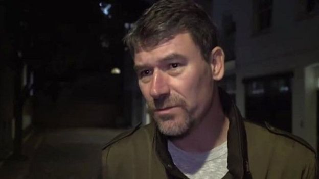

# 中国北平陈年旧案 英国女孩被谋杀引发的文学对决 - BBC News 中文

BBC记者 麦迪文 （ Stephen McDonell ）

2019年 1月 14日

图片版权 Werner 
19岁的帕米拉·沃纳在1937年北平一个寒冷的冬夜被残忍杀害，此案一直未破。

1937年1月一个寒冷的夜晚，19岁的白人女孩帕米拉•沃纳（Pamela Werner） ——一个前英国外交官的养女，跟朋友告别之后，骑上自行车…踏上了死亡之路。

这桩谋杀案震惊了整个北京 —— 当时叫“北平”，并被很多人认为是这座古城迄今未能破案的最惨烈的谋杀案之一。

80年过去了，世事变迁，北平早已成为北京，这桩未决谋杀案本该被人遗忘埋没在故纸堆中。可是近年来的一场文学对决，又将这起尘封多年的谋杀案翻出来，展示给21世纪的读者。

2011年一位叫保罗•弗兰奇（ Paul French ）的作者出版了一本源自此案的小说《午夜北平》（Midnight in Peking），十分畅销；现在一个退休英国警官格雷姆•谢泼德（ Graeme Sheppard ）也根据此案写了另一本小说，挑战保罗•弗兰奇有关这起谋杀案的版本。

## 谋杀案始末

事发当夜，帕米拉和朋友曾在北平使馆区的冰场滑冰，她过几天就要去伦敦继续学业。大约晚上7点她与朋友告别，没想到一去不归。

图片版权 out of copyright 
20世纪30年代时的北平外国使馆区。

次日清晨，人们在城市中一段古城墙根下冰冻的土地上发现了她的尸体残骸。令当时和今天有关此案的调查者迷惑不解的是，为什么帕米拉的遗体会被如此残忍地肢解，不仅被肢解，而且内脏器官全部消失。

当警察抵达现场时，一些关键证据仍在，可见杀人者行事草率或是匆忙离去的。

警察在现场发现了帕米拉的冰场出入证和一枚昂贵的手表—— 曾经是她母亲的。据报，手表的时间停止在午夜过去几分钟。尽管尸体已经难以辨认，这些证据使得警方很快查明了死者身份。

当时，日军已经逼进北平，报纸上披露的这桩谋杀案更加令人惶惶不安。一个有影响的英国外交官的女儿竟然在离家不远的地方被残忍谋杀并被肢解，谁还能安全呢？帕米拉在北平生活多年，会说汉语，并不是初来乍到不了解这座城市的人。

## 扑朔迷离

当时北平人口剧增，充满了难民，既有来自日军占领区的难民，也有来自战乱中的俄罗斯的逃难者。帕米拉的亲生父母就是俄国难民。她两岁时被英国人沃纳夫妇收养，不过她5岁时养母去世。

帕米拉被谋杀后，她的养父，已经年届70的爱德华•沃纳（ Edward Werner ）伤心欲绝，他在晚年中一直追查线索，决意将谋杀帕米拉的凶手绳之以法。他查找的大量凶案线索文件有的在中国警方，有的在伦敦。

图片版权 Edward Werner 
爱德华·沃纳在晚年中一直查找线索，决意将谋杀帕米拉的凶手绳之以法。

当保罗•弗兰奇在伦敦的国家档案馆偶然发现了有关此案的文件时，在他面前出现了一个扑朔迷离的险恶世界。

他主要根据帕米拉父亲的书信内容，创作了《午夜北平》的小说，可以说是透过这位饱经丧女之痛的父亲的眼光来看这起谋杀案。而这部小说的成功也意味着，很多人接受这就是真实发生的事件。

然而退休警官格雷姆•谢泼德在读了这部小说之后，他有自己的原因质疑小说还原的事件，他继续翻阅历史文档，写出了另一个版本的有关此案的小说《北平凶杀案》（ A Death In Peking ）。

两位作者都同意的是官方给出的死因 —— 头部受到打击而亡。然而，涉及到凶手的身份，作案地点，作案动机，以及尸体如何被转移到最后被发现的地方，两位作者有相当大的不同解释。

## 色情派对理论

帕米拉的父亲认为，他女儿当夜被骗去参加一个动机不良的派对，很可能还有其他年轻女性。

保罗·弗兰奇认为，帕米拉谋杀案是因为一起外国人圈子里的色情派对失控。

“现在我们会认为是诱骗，”弗兰奇在接受BBC采访时说，“这些人诱骗女孩子来派对进行色情活动。当帕米拉意识到不对劲后，似乎她头部受到打击而亡，之后这些人不得不想办法处理尸体。”

事件发生在20世纪30年代的北京，弗兰奇说，他能想象帕米拉当天晚上的情景和她即将离开这座她喜爱的城市之前的激动心情。

离开冰场之后，她或许先跟一个学校朋友吃晚餐 —— 根据谢泼德的理论这个朋友在案件中至关重要。

而根据弗兰奇的理论，离开冰场后她前往美国牙医温特沃斯•普林蒂斯（ Wentworth Prentice ）家参加一个家庭派对。

在一个动荡年代的混乱城市里，这些养尊处优的外国人可以在城市里随意行动。据认为普林蒂斯和他的一帮朋友过着堕落享乐的生活。

图片版权 Getty Images 
当时的妓院街区就在如今的北京火车站后西北角。

而帕米拉不会介意到普林蒂斯的公寓去，因为她是这位牙医的客户，或许也认识他的那些朋友。所以，当这些人决定大家一起去一个酒吧庆祝俄罗斯东正教圣诞节时，她也跟着去了。虽然她知道这个酒吧是在有不少妓院的街区 —— 在北京火车站西边继续往北那一带。现在这片街区安静多了，有一些胡同里的家庭客栈，基本没变样。

弗兰奇说，正是在这里，帕米拉发现不对劲了，她独自与一群男人在一起，并没有什么庆祝派对，而是在一家妓院的房间里。“或许她反抗了，她拒绝像之前的一些女孩一样屈服，惹得那些男人生气了…也许他们恐慌了，只想让她不要喊叫，其中一个男人重击了她的头部。”弗兰奇写道。

之后，帕米拉的父亲在查寻凶手时，去了那个妓院查看，只称其“28号”。他猜测，帕米拉死在那里，但尸体后来被迫移走，因为妓院不想卷入其中。

根据他的理论，这些凶手把死者的血抽出，使尸体更轻，然后裹起来，用三轮车运到一段老城墙下：这里没有路灯，一片黑暗，不容易被过路人发现。在那里，他们肢解了尸体。

这些做法听起来似乎十分极端，但弗兰奇说，据死者父亲的看法，这是一个不同寻常的群体，他们会在北平郊区的山里举办裸体派对，除了肆意的性活动、酗酒、吸毒，他们还进行狩猎活动，对屠杀并不陌生。

“在沃纳先生看来，这就像猎人肢解鹿或其他猎物的手法。”弗兰奇说，“他们都携带刀子。我认为这种分析有道理，不少经过那个时代的人也都同意这种说法。”

他写道：“他们会把尸体肢解掉，抛弃在使馆区以外的地区，以避嫌，让人难以确定死者身份，并令人怀疑凶手可能是一个疯子，很可能是个中国人。”

## 提出挑战的另论

而格雷姆•谢泼德对弗兰奇几乎所有推论 —— 由此也延及爱德华•沃纳的结论——都提出质疑。在他的书中没有怎么提及弗兰奇本人，但对弗兰奇的中心论点进行了抨击。

英国退休警官格雷姆·谢泼德认为，凶手是一个跟帕米拉关系密切的中国学生。

“那是一本畅销书，读起来很有意思，是个好故事。但我从警察的观点来看，很多都不合情理。”谢泼德对BBC说，“我不明白为什么英国和中国的警方都没有查出那位父亲所查到的事实。当时北平的使馆区范围就那么大点儿，我不能理解。”

根据老警官谢泼德的分析，没有证据证明帕米拉是那种能出现在妓院街区的女孩，尽管她认识其中一些男人。

谢泼德认为，帕米拉在滑冰结束后遇见凶手，他指出这人应该是帕米拉认识并可能相恋过的人。

“我想最可能的是帕米拉以前学校里的中国朋友，名叫韩守志（音译）。”他在BBC采访中说，“我这样认为的原因是英国有关此案的负责警官确信如此。”

谢泼德说，这位负责警官的观点来自当时的警方情报。

但弗兰奇对依赖警方怀疑这一点表示异议，说根本没有警方提问这位中国少年的记录。

“设想，一个年轻学生突然决定谋杀他曾经的恋人，抽干她的血液，将其肢解，然后就无影无踪了，没有任何警方询问他的记录。这在我看来实在太离奇了。”

而谢泼德认为，这个嫌疑对象有可能具有屠夫技巧，并携带刀具。他还认为，很可能他杀了帕米拉之后，有其他人来帮助肢解尸体，将内脏器官卖给了一些当时盛行的中医行业。而他对这个学生的怀疑也来自帕米拉父亲的一些信件。

帕米拉父亲的信中的确提到，曾经因这个男孩与帕米拉的恋爱关系而一拳打在男孩的鼻子上。或许这里可以看出一些紧张关系？

## 家庭连系

不管怎样，弗兰奇对谢泼德最主要的质疑是，他做不到客观公正。

他妻子的祖父尼古拉斯•菲茨莫里斯（ Nicholas Fitzmaurice ）在此案发生时任英国驻华总领事，负责此案调查，结果…没有结果。

帕米拉的前外交官父亲，与菲茨莫里斯关系并不好，对帕米拉谋杀案调查的不了了之只能加深他们之间的恶感。

数十年过去了，似乎这一交恶仍然未消。菲茨莫里斯的后代感到气愤的是，在保罗•弗兰奇的书中菲茨莫里斯被描写成一个无所作为的官僚。谢泼德的妻子虽然并没有见过自己的祖父，但她仍然认为要捍卫祖父的名誉，并将其丈夫拽进这个案件中。

而谢泼德说，这不过是使他关注这个案件的最初原因，他为此进行了大量调查研究，并研究了弗兰奇没有用过的一些材料，最后成书。

在他的书中，爱德华•沃纳是一个孤单的、多疑而“喜欢争执”的人，并且有些证据是沃纳花钱买的。

## 在日本集中营

故事的延续发生在离北平遥远的地方。

1943年，在日本人占领下的北平，外国人都被抓走，关进集中营。爱德华•沃纳不仅不得不放弃他的广泛收藏，而且不得不放弃对女儿谋杀案的调查。

图片版权 Getty Images 
在山东的日本集中营，当时也关押了许多在中国的外国人。

在山东省的集中营里，沃纳发现他所怀疑的杀害女儿的凶手英国牙医温特沃斯•普林蒂斯也在那里，正在用简陋工具给其他人看牙。

弗兰奇写道：“有些被关押的人回忆，沃纳指着普林蒂斯大叫，‘你杀害了她！我知道是你杀害的帕米拉。就是你！’有时他又指着其他人这样说。人们担心他是不是神智不清了，但都原谅他。”

沃纳在日本人的集中营里幸存下来，但那时他已经80多岁，很难说服战后的英国外交部和警方继续调查在北平发生的谋杀案。战后普林蒂斯回到北平使馆区，于1947年死在那里。

据沃纳说，那个叫韩守志的学生后来被日本军警杀害。但谢泼德写道：“那个报告也许是真的，也许不是…死亡报告是躲避警方继续追查案件的最好诡计。”

沃纳战后一直待在中国，甚至在共产党掌权之后，到1951年10月，他是居住在北京的大约30个英国人之一。

他最后终于返回英国，这是他1917年离开后第一次回国，他比这个故事中所有的人都活的长。他89岁去世时，他认识的人都已先他而去，没有熟人参加他简单的葬礼。

而他那被谋杀的养女，据认为被深深埋在北京二环路某处地下。

---------------------------------------------------

原网址: [访问](https://www.bbc.com/zhongwen/simp/world-46856729?ocid=socialflow_twitter)

创建于: 2019-01-15 11:17:41
