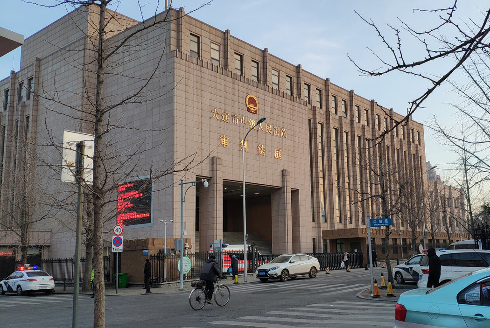

# 加拿大公民因走私毒品在华被判死刑 - 纽约时报中文网

储百亮

2019年1月15日

中国大连的中级人民法院。加拿大人罗伯特·劳埃德·谢伦伯格因毒品走私指控在这里接受重审。 Reuters

北京——中国与加拿大的外交冲突周一急剧升级。中国一家法院在对一名加拿大人进行了一天的重审后，因走私毒品罪当庭判其死刑。法院下令对此案进行重审数周前，一名中国高管在不列颠哥伦比亚省被逮捕。

中国东北的一家法院对加拿大人罗伯特·劳埃德·谢伦伯格(Robert Lloyd Schellenberg)宣判死刑前，对他的案件只进行了一天的审理，没有迹象表明，对他的判决有可能减为有期徒刑。加拿大当局上个月逮捕了一名中国科技企业高管之后，谢伦伯格的命运很可能会成为北京与渥太华之间外交关系的一个不稳定因素。

谢伦伯格因走私冰毒已被判处15年有期徒刑，他提出上诉之后，法院上个月下令对他进行重审。但在中国与加拿大的紧张关系急剧加剧的背景下，法院[支持了检方的要求](https://cn.nytimes.com/world/20190102/china-canada-drug-trial/)，对他做出了更严厉的判决。

“证据确实、充分，指控罪名成立，”大连市中级人民法院在网上发布的[官方判决书](https://www.chinacourt.org/article/detail/2019/01/id/3705304.shtml)中写道。“谢伦伯格系主犯。”

加拿大总理贾斯汀·特鲁多(Justin Trudeau)对谢伦伯格被判死刑作出回应，表示他的政府会试图为该案求情。  

“作为政府，我们对此事极为关心，我们的国际朋友及盟友也应当如此，”在这样的案子里，“中国选择开始武断地适死刑”，他在渥太华告诉记者。

谢伦伯格的姑妈劳莉·纳尔逊—琼斯(Lauri Nelson-Jones)一直是其家族发言人。她从马里兰州通过电话表示，这个判决是“最坏的情况”，并补充说，“我们最担心的事情已经发生。”她说，她正在联系他的直系亲属。

“我没想到我们会这么快就得到判决，”纳尔逊—琼斯说。“这令人震惊，尤其是从北美人对事情发展的角度来看。”

检察官和法官在周一的法庭审理上向人们展示了一个失败的毒品走私行动，他们的描述与谢伦伯格的证词有明显的差异。

中国的中央电视台[在网上的一篇报道](http://www.ecns.cn/news/society/2019-01-14/detail-ifzcpxvf8626248.shtml)中说，谢伦伯格告诉法庭，他是一名“来中国旅行的游客，被犯罪分子陷害了”。

但法院认为，谢伦伯格作为参与者对这个走私计划知情且技术娴熟，该计划涉及试图将222公斤的冰毒放在装有塑料颗粒的轮胎里走私到澳大利亚。

法院的判决书说，谢伦伯格对谋划犯罪使用的设备——包括轮胎、内胎和集装箱——进行过评估，还建议推迟毒品的运输，以便做更多的准备工作。

去年12月，中国电信设备制造商华为的首席财务官孟晚舟在加拿大不列颠哥伦比亚省温哥华市被逮捕，[令中国政府非常愤怒](https://cn.nytimes.com/business/20181206/huawei-cfo-arrest-canada-extradition/)，这之后，法院以异乎寻常的速度对谢伦伯格的上诉做出对他进行重审的裁决。

纳尔逊—琼斯说，重审前，谢伦伯格的家人对他有可能成为北京寻求释放孟晚舟谈判的筹码表示过担心。

“他已成为一个棋子，”她说。“虽然我们只能猜测，但这的确看起来是这样，令人非常担忧。”

谢伦伯格似乎是近年来在中国宣判死刑的首位北美人。这个死刑判决仍须经过最高人民法院的审核批准。

在宣判谢伦伯格死刑之前，中国当局在上个月逮捕了另外两名加拿大人：前外交官[康明凯](https://cn.nytimes.com/china/20181212/michael-kovrig-china-canada/)(Michael Kovrig)和商人[迈克尔·斯帕沃尔](https://cn.nytimes.com/world/20181213/michael-spavor-canadian-detained-china/)(Michael Spavor)。

这两人被控“危害国家安全”，这是一个笼统的指控，可能包括从事间谍活动。不过，警方尚未宣布任何具体说法，这两人目前[受到秘密拘留](https://cn.nytimes.com/asia-pacific/20181224/canada-china-detention/)，中方拒绝让律师和家人前去探视。中国外交部发言人华春莹周一说，康明凯不享有外交豁免权，否认了加拿大总理贾斯汀·特鲁多(Justin Trudeau)的说法。特鲁多上周五曾[暗示康明凯](https://www.cbc.ca/news/politics/trudeau-diplomatic-immunity-michael-kovrig-1.4975759)享有外交豁免权。

为国际危机组织(International Crisis Group)工作的康明凯，正在从加拿大全球事务部(Global Affairs Canada)休假，该部门相当于加拿大的外交部。为解决冲突提供建议的国际危机组织[坚决否认](https://www.crisisgroup.org/who-we-are/people/michael-kovrig)康明凯做过任何伤害中国的事情。

一些外国专家说，中国在这三个案件中采取迅速行动，似乎是为了向加拿大施压，让加拿大释放孟晚舟，将她送回中国，而不是将她送往美国。他们说，谢伦伯格被执行死刑的可能性构成了一个强有力的威胁。

“把案件送回重审，让中国有了做出死亡威胁，并只要有必要就让这个威胁持续下去的机会，”乔治·华盛顿大学法学院中国法律方面的专家、教授郭丹青(Donald Clarke)上周在关于国家安全的Lawfare博客上的[一篇评论中写道](https://www.lawfareblog.com/chinas-hostage-diplomacy-0)。

“这个案件似乎加强了此前拘留加拿大人康明凯和迈克尔·帕斯沃尔所暗示的信息，即中国认为扣留人质是进行外交的一种可接受方式，”郭丹青写道。

谢伦伯格现年36岁，2014年被逮捕前，是一名愿意冒险的旅行者，他用自己在艾伯塔省的油田工作挣的钱在亚洲旅行，纳尔逊—琼斯在电话中说。

谢伦伯格在不列颠哥伦比亚省阿伯茨福德市的一个大家庭中长大。纳尔逊—琼斯说，他在亚洲各地，特别是在泰国旅行时，与家人保持着不定期的联系。

“他打电话告诉他父亲——我兄弟——他要去中国，当时的感觉是‘好吧，怎么都行’，”她说。大约一个月后，谢伦伯格的家人得知他被抓了。

谢伦伯格在首次接受审理之前已被关押了15个月，等到法庭宣布他有罪，判处他15年监禁时，已经又过去了32个月。

自从孟晚舟被逮捕以来，谢伦伯格案件的节奏加快了。孟晚舟现已在加拿大[获得保释，处于软禁之中](https://cn.nytimes.com/technology/20181212/huawei-executive-canada-bail-decision/)，待法院决定是否将她引渡到美国。美国检察官指控她欺诈银行，让其从事违反美国制裁的与伊朗有关的商业交易。

法院上个月听取谢伦伯格的上诉时，检察官说，新出现的证据表明，他在一个贩毒网络中起到了更大的作用，因此对他的初审判决过轻。

检方在重审时传唤了证人许清，他作证指控了这名加拿大人。但[据法新社报道](http://news.rthk.hk/rthk/en/component/k2/1437978-20190114.htm)，谢伦伯格说，他是在不知情的情况下被许清招募到该计划中来的。法新社是获准进入法庭旁听的三家外国新闻机构之一。

据法新社报道，谢伦伯格说，“（许清）是个国际毒品走私犯，是个骗子。”

中国外交部否认重审谢伦伯格案，以及逮捕康明凯和斯帕沃尔与孟晚舟被逮捕有任何关系。在[周五的例行记者会](https://www.fmprc.gov.cn/web/fyrbt_673021/jzhsl_673025/t1628901.shtml)上，外交部发言人陆慷说，批评人士不应出于政治目的破坏中国法律。

“如果没有违反，希望这些人不要因为自己把法律问题政治化，”陆慷说。

但中国官员通过暗示他们的政府在孟晚舟被逮捕后采取了“自卫行动”，已经冲淡了陆慷的说法。中国驻渥太华大使卢沙野上周[在加拿大一家报纸发表专栏文章](https://cn.nytimes.com/asia-pacific/20190111/china-ambassador-canada-white-supremacy/)说，呼吁释放康明凯和斯帕沃尔与“西方中心论”和“白人优越论”的主张等同。

“有人说，中国抓了两个加拿大人，以报复加方拘捕孟晚舟女士，这是中国对加拿大的霸凌，”卢沙野写道。“在一些人眼里，中国的任何自卫行动都是对加拿大的侵犯。”

近年来，中国法院多次强调，在对毒品犯罪进行判刑时，外国人将不会受到与中国公民不同的待遇。即使如此，在毒品走私案件中，判处西方国家公民死刑的案例仍非常少。

总部位于旧金山的中国人权观察组织——中美对话基金会(Dui Hua Foundation)的执行主任康原(John Kamm)说，在2009年到2015年间，中国对至少19名涉嫌贩毒的外国人执行了死刑，

这些被处死的人中有五名韩国人、三名日本人和一名法国人。2009年，[中国处死了一名53岁的英国男子](https://www.nytimes.com/2009/12/30/world/asia/30china.html?module=inline)阿克毛·沙伊克(Akmal Shaikh)，罪名是走私毒品，尽管他的家人和当时的英国首相都曾以他患有精神疾病为由请求对他宽大处理。

康原说，对谢伦伯格宣判的速度，以及判决的严重性让他感到震惊。康原指出，中国民族主义报纸《环球时报》总编辑胡锡进在这个判决出来前就曾警告说，如果加拿大向美国引渡孟晚舟的话，“中国的报复可要比抓一个加拿大人严厉得多。”

“这是记忆中，也许是有史以来，中国法院第一次判处北美人死刑，”康原说。“我估计渥太华和加拿大人民会做出激烈的反应。”

储百亮(Chris Buckley)是《纽约时报》驻北京记者。

Catherine Porter自多伦多对本文有报道贡献。

翻译：Cindy Hao

[点击查看本文英文版。](https://www.nytimes.com/2019/01/14/world/asia/china-canada-schellenberg-retrial.html)

------

原网址: [访问](https://cn.nytimes.com/china/20190115/china-canada-schellenberg-retrial/?utm_source=tw-nytimeschinese&utm_medium=social&utm_campaign=cur)

创建于: 2019-01-15 12:00:19