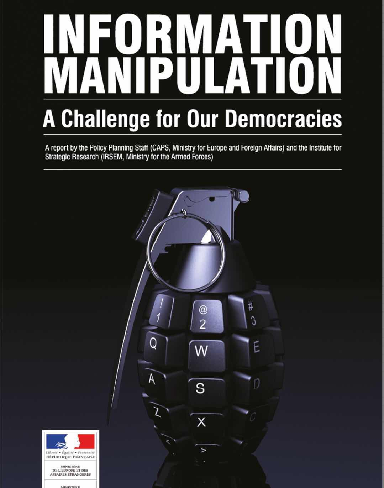
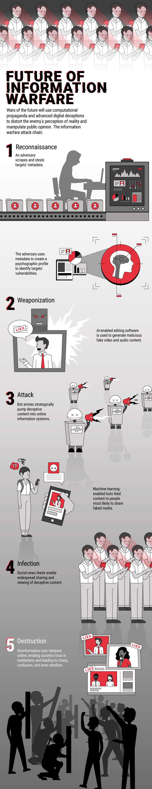
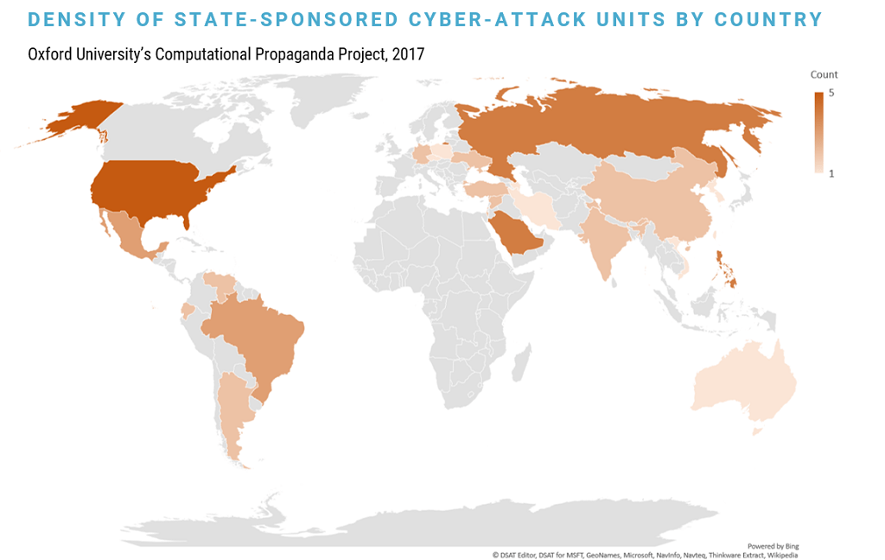
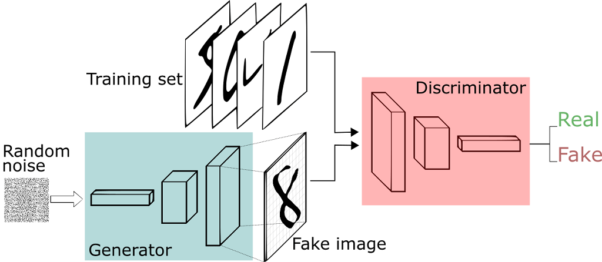
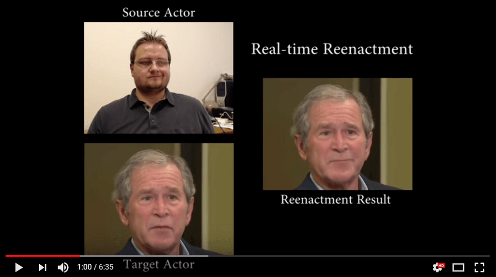
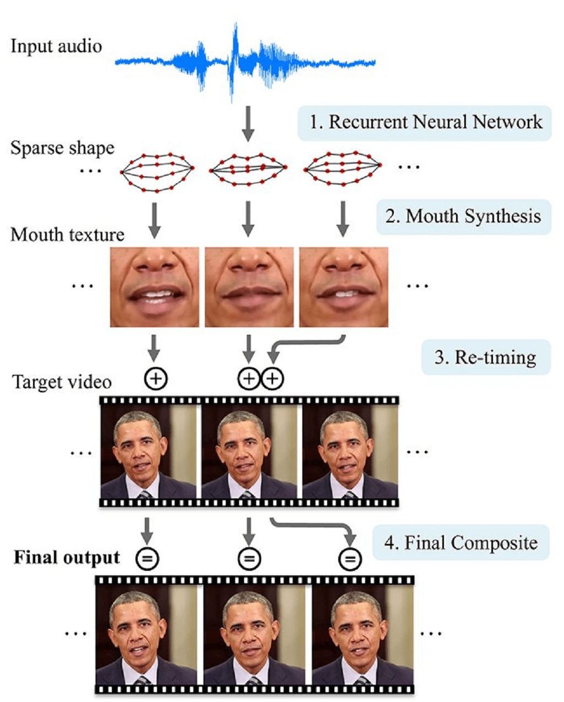
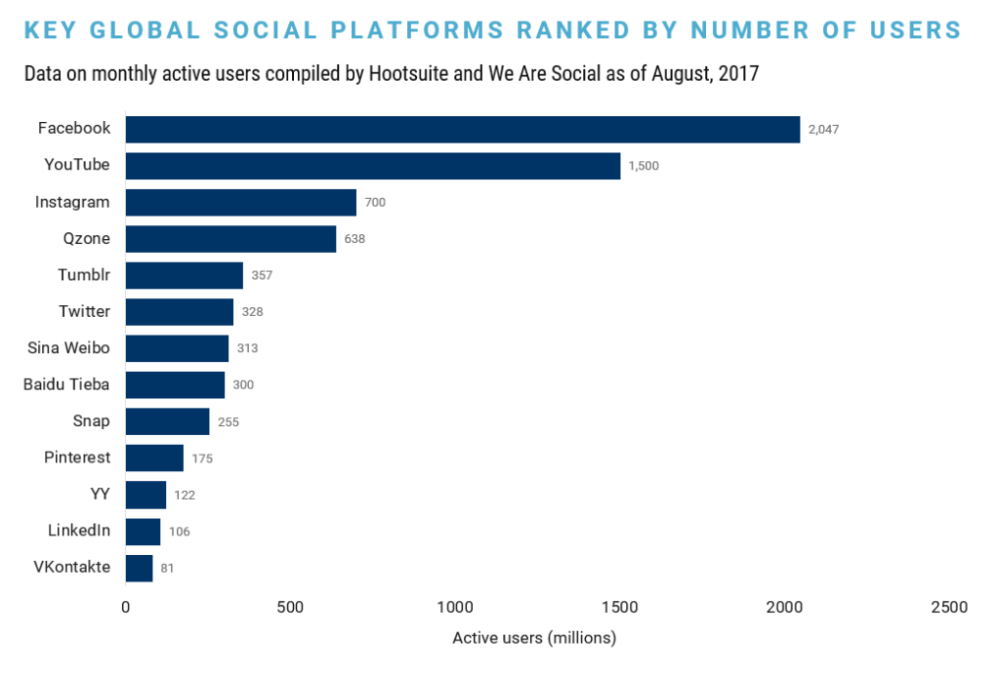
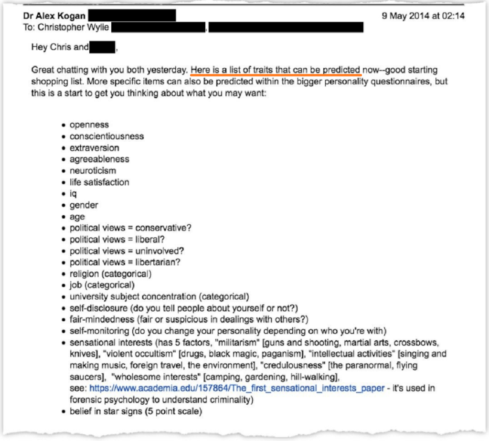
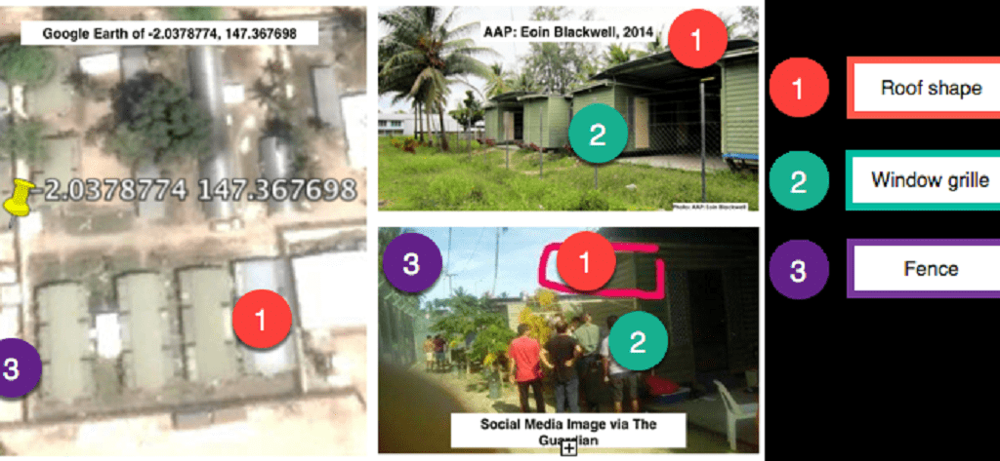
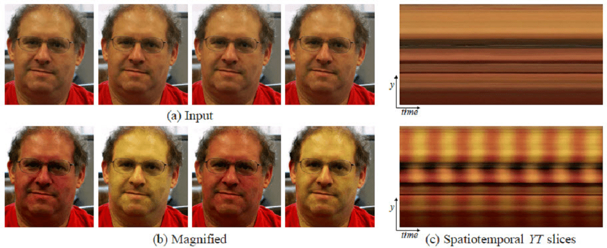

# 当恶意者掌握技术：信息战的未来究竟有多可怕？ – iYouPort – Medium

Jan 14 2019

> 现代技术和社交网络已经被变得武器化，而许多人似乎还没有能力理解信息战的新现实。我们希望战胜国家支持的虚假信息和政治宣传吗？未来的战争很可能不在战场上，而是在每个人的屏幕上和脑海里……

世界各地的军事和情报机构已经在网络空间发动起秘密的信息战。他们精心设计的假消息已经深刻地影响了公众对真相、权力和合法性的看法。

**_延伸阅读：《_**[**_真相衰变如何杀死了民主？_**](https://medium.com/@iyouport/%E7%9C%9F%E7%9B%B8%E8%A1%B0%E5%8F%98-%E5%BD%93%E6%B0%91%E4%B8%BB%E7%97%85%E5%8D%B1-%E5%8F%98%E9%9D%A9%E9%81%A5%E9%81%A5%E6%97%A0%E6%9C%9F%E6%97%B6-%E6%88%91%E4%BB%AC%E5%BA%94%E8%AF%A5%E6%80%9D%E8%80%83%E4%BB%80%E4%B9%88-9f1990b6e9f1)**_》《阴谋论是怎么来的？我们还可以怎么办？》_**

随着所谓人工智能技术的广泛应用，这种威胁只会越来越强烈，而且是迅速的。

首先考虑以下几点：

- 政权雇佣的机器人水军或“假用户”正在以社交新闻 feeds为目标，有计划与目的地传播政治宣传（参见**《**[**巨魔崛起**](https://medium.com/@iyouport/%E5%B7%A8%E9%AD%94%E5%B4%9B%E8%B5%B7-%E6%94%BF%E5%BA%9C%E8%B5%84%E5%8A%A9%E7%9A%84%E7%BD%91%E7%BB%9C%E6%B0%B4%E5%86%9B%E6%AD%A3%E9%81%8D%E5%B8%83%E5%85%A8%E7%90%83-a45710e8e431)**》**）；
- 在线状况下，真相和虚假之间的界限看起来已经很脆弱，因为研究人员开发的技术完全可以制作极难被检测出来的假音频和视频（参见**《**[**虚假信息鉴别工具箱：如何验证图片和视频的真伪？**](https://steemit.com/tools/@iyouport/2zmazk)**》**）；
- 仅在一年之内，创建高质量的数字欺骗就将达到非常容易的程度，其真实性无法轻易验证；

下面将详细介绍下一代战争的技术，策略，和其影响。

*信息战，又叫信息攻击 — 如上所述 — 可以用一个世纪以来众所周知的词语来概括：**Provokatsiya**，这是俄语，意思是“挑衅行为”。[据说](http://observer.com/2017/03/kremlingate-russia-spy-game-disinformation/)该行为是由俄罗斯的间谍实践的，可以追溯到沙皇时代。Provokatsiya 如何描述了使用障眼法和隐性武器来进行欺骗以诋毁、沮丧和混淆对手的战术。但它显然不是俄国发明的，还记得孙子兵法吗？*

> _“The terrorizing drums, banners, and gongs, of Sun Tzu’s warfare, aided by information technology … may now have evolved to the point where ‘control’ can be imposed with little physical violence.” — US Colonel Richard Szafranski, “A Theory Of Information Warfare: Preparing For 2020”, written in 1995._

国际政治干预不是唯一的目的，众所周知，当权者还会实施在其国内的数字影响力活动，就如中国当局使用水军在热点敏感事件爆发时淹没国内的异议声音。事实上相比下中国的玩法是很拙略的。特朗普的竞选活动正受到越来越多的审查，因为[据报道](https://www.nytimes.com/2018/03/17/us/politics/cambridge-analytica-trump-campaign.html)，英国剑桥分析公司签订了合同，被授权可挖掘 Facebook 数据以便在 2016 年选举前隐性干预选民的行为。

当然，中国没玩儿过操纵选民吞噬民主的游戏，并不是因为不会玩儿，最顺手的武器明明就摆在那里 — 社交网络，它如此庞大没有人会无视。中国只是不需要选举，换句话说，如果这种状况持续下去，中国就不可能有真正的选举了。

不过本文将更多关注的是外国对手攻击另一个国家（而不是国内影响力运动）的情况，以及国家支持的信息战行为（与非关联行为者的行为相反）。

您可以做一个对比，将可以发现，中国曾经一直在使用的外宣是如何的笨拙，它倾向于*要求*别人认同自己，这是低效的操作，且花费巨大，使用的不过是广告商一直在使用的人类心理弱点，即 反复出现、不断重复、无处不在全方面包围。事实上如今的信息战完全不必如此“麻烦”，**而鉴于中国对现代技术的痴迷（已经作为了其民族主义的一部分），北京全方面转变策略，仅仅是时间问题！**（参见《[北京的政治宣传模式发生改变](https://medium.com/@iyouport/%E7%8B%AC%E5%AE%B6-%E5%8C%97%E4%BA%AC%E7%9A%84%E6%94%BF%E6%B2%BB%E5%AE%A3%E4%BC%A0%E6%A8%A1%E5%BC%8F%E6%AD%A3%E5%9C%A8%E6%94%B9%E5%8F%98-%E6%88%96%E5%B7%B2%E8%B8%A9%E4%B8%AD%E4%B8%AD%E5%9B%BD%E5%BC%82%E8%AE%AE%E7%9A%84%E5%BC%B1%E7%82%B9-d1bf5ddfd412)》）

本报告将分为四个主要部分：

- 数字信息战的兴起
- 数字信息战未来的关键要素（外交和声誉操纵；间接攻击的网络钓鱼）
- 有计划的宣传（针对数字欺骗的新兴解决方案；发现隐藏的元数据以进行身份​​验证；用于将数字内容追溯到源的区块链；发现 AI 生成的虚假信息；大规模检测图像和视频操作；打击宣传）
- 最后的想法

### 数字信息战的兴起：我们是怎么到了这种地步的？

信息战是心理战的一部分（虽然不是全部），如果您还记得我们在《[心理战](https://medium.com/@iyouport/%E7%8B%AC%E5%AE%B6-%E5%8C%97%E4%BA%AC%E7%9A%84%E6%94%BF%E6%B2%BB%E5%AE%A3%E4%BC%A0%E6%A8%A1%E5%BC%8F%E6%AD%A3%E5%9C%A8%E6%94%B9%E5%8F%98-%E6%88%96%E5%B7%B2%E8%B8%A9%E4%B8%AD%E4%B8%AD%E5%9B%BD%E5%BC%82%E8%AE%AE%E7%9A%84%E5%BC%B1%E7%82%B9-d1bf5ddfd412)》那篇文章中对其曾经用法的简要介绍，就能明白，这一战略的历史之深远、以及它是如何在技术的协助下得到了脱缰之马般的肆虐。

这绝不是什么新奇的思路。它是自古以来各种战争中最为关键的部分：

> _俗话说兵不厌诈，对战获胜的重点在于：情报的真实性和情报分析的专业性和有效性，也就是说，只要能破坏情报的真实性、误导情报分析的有效性，就能导致敌方的错误判断并陷入混乱，进而取胜。_

近年来， 信息攻击正在被迅速增强。四年前，世界经济论坛就已经将“网上误报的传播”称为 2014 年第十大最值得关注的趋势。

俄罗斯**绝不是**唯一一个擅长歪曲互联网舆论和选民认知的国家。牛津大学的研究早已发现，社交媒体状态下，有组织的操纵行为**自 2010 年以来至少在 28 个国家存在！**研究还强调，**“独裁体制不是唯一的、甚至都不是最好的实施有组织社交媒体操纵的基础”，民主国家也参与其中，并且技术更加高超。**

通常情况下， 跨国信息战是由国家支持的网络部队发动的，全球有很多这样的网络部队，而美国拥有的最多。下图是来自牛津大学的研究资料：

_Source:_ [_Oxford University_](http://blogs.oii.ox.ac.uk/politicalbots/wp-content/uploads/sites/89/2017/07/Troops-Trolls-and-Troublemakers.pdf)

世界面临的现实是，造假技术迅速崛起、同时人们越来越难以分辨[**甚至无心去分辨**什么是事实什么是虚构](https://medium.com/@iyouport/%E7%9C%9F%E7%9B%B8%E8%A1%B0%E5%8F%98-%E5%BD%93%E6%B0%91%E4%B8%BB%E7%97%85%E5%8D%B1-%E5%8F%98%E9%9D%A9%E9%81%A5%E9%81%A5%E6%97%A0%E6%9C%9F%E6%97%B6-%E6%88%91%E4%BB%AC%E5%BA%94%E8%AF%A5%E6%80%9D%E8%80%83%E4%BB%80%E4%B9%88-9f1990b6e9f1)。然而截止今天，在线传播虚假信息和欺骗手段背后所依赖的技术仍处于起步阶段，信息认证的重要性及其必要的技能，也只是刚刚开始形成。

简而言之，这一切灾难只是一个开始。

没有“日内瓦公约”或联合国条约详细说明一个国家应如何定义数字信息攻击或按比例进行报复。随着新技术的普及，了解定义信息战未来的策略和环境现在比以往任何时候都更加重要。

### 数字信息战未来的关键要素

未来数字信息大战中的一个共同主题将是恐惧、不确定性和令人疑惑的故意传播（fear, uncertainty, doubt）也称为 FUD 在线。 显然，喜**欢刺激性信息、漠视调查取证及其相关技术、封闭、虚无主义和偏执的用户群体，将成为宣传的主攻目标 — — 这些特征恰恰是社交网络用户群的最普遍特征**。

_延伸阅读：《_[_互联网人为什么如此容易被骗？_](https://pao-pao.net/article/782)_》《_[_隧道生态和心理操控_](https://pao-pao.net/article/773)_》《_[_两极分化的社交网络为什么更利于操纵？_](https://medium.com/@iyouport/%E6%94%BF%E6%B2%BB%E7%9A%84%E4%B8%A4%E6%9E%81%E5%88%86%E5%8C%96%E5%A6%82%E4%BD%95%E5%9C%A8%E7%A4%BE%E4%BA%A4%E7%BD%91%E7%BB%9C%E4%B8%8A%E4%BD%93%E7%8E%B0-%E4%B8%BA%E4%BB%80%E4%B9%88%E8%BF%99%E6%A0%B7%E7%9A%84%E7%94%9F%E6%80%81%E5%BE%88%E5%AE%B9%E6%98%93%E8%A2%AB%E6%93%8D%E7%BA%B5-%E5%9B%B4%E8%A7%82-twitter-%E6%B4%BB%E5%8A%A8%E5%9C%B0%E5%9B%BE-ba5cb3aebb54)_》《_[_真相衰变已成为民主最致命的杀手_](https://medium.com/@iyouport/%E7%9C%9F%E7%9B%B8%E8%A1%B0%E5%8F%98-%E5%BD%93%E6%B0%91%E4%B8%BB%E7%97%85%E5%8D%B1-%E5%8F%98%E9%9D%A9%E9%81%A5%E9%81%A5%E6%97%A0%E6%9C%9F%E6%97%B6-%E6%88%91%E4%BB%AC%E5%BA%94%E8%AF%A5%E6%80%9D%E8%80%83%E4%BB%80%E4%B9%88-9f1990b6e9f1)_》_

在支持性技术的推动下，三项关键战术将在战争的未来发挥至关重要的作用，就如密歇根大学社交媒体责任中心首席技术官 Aviv Ovadya 所描述的那样：

- **外交和声誉操纵**：利用先进的数字欺骗技术在对手中煽动毫无根据的外交或军事反应; 冒充和破坏对手的领导者和影响者的合法性；
- **间接操纵的网络钓鱼**：使用恶意 AI来模仿值得信赖的实体，针对的是特定的高价值目标，迫使目标以其他方式采取行动，即 社交工程技术；
- **计算化宣传**：利用社交媒体、人类心理学、扭曲性的消息、八卦和不透明的算法来操纵公众舆论。

**\> 外交和声誉操纵：视频和音频的造假**

外交操纵是为了在地缘政治决策上影响对手，令其产生错误信念的行为。

华盛顿大学（UW）的研究人员已经成功地使用人工智能创建了奥巴马的伪造视频，视频中说出了“他从未说过的话”。

根据该大学[关于这项实验的论文](http://grail.cs.washington.edu/projects/AudioToObama/)，将音频剪辑嫁接到逼真的唇形同步视频上可以“改变\[奥巴马\]在目标视频中所说的内容，并能与输入音轨相匹配。”

伪装奥巴马成功意味着任何人都能被如此伪装。很容易想象这样一个被改变过的视频 — 如果足够好看，看起来很真实 — 很快就会造成严重的破坏性。**如果当权者伪造反对派和活动家的视频……不论是抹黑还是定罪，都将非常容易实现。**

人工智能的进步正在开创一个假视频和音频的新时代，这将对国内政治和外交的未来产生深远的影响。虽然该技术在大学实验中仍处于发展阶段，但不久的将来它将变得非常容易操作。

**AI 创建假冒的数字内容**

GAN（生成性对抗网络）是一种用于执行无监督机器学习的 AI 。在 GAN 中，相反的神经网络协同工作以制造越来越逼真的音频、图像和视频内容。 GAN 中的一个神经网络充当箔片，推动其他网络产生更高保真度的结果。神经网络还可以更容易伪造音频，可以将源音频的元素转换为统计属性，并且可以重新排列这些属性以制作高超的假音频剪辑。

_Sketch of a Generative Adversarial Network for creating fake images, credit DL4J_

高质量的外交操纵和政治宣传，可能会将 AI、音频和视频欺骗结合成一次致命的攻击。目前，世界各地的研究团队正在开发看似良性的技术，然而，如果我们不小心的话，这样的“机会”随时会出现。

**欺骗性的视频和音频编辑**

斯坦福大学的研究人员[发表了早期结果](http://www.niessnerlab.org/projects/thies2016face.html)，表明可以实时改变一个人预先录制的面部画面来模仿出另一个人的表情。

从本质上讲，想要冒充目标人的演员可以通过将脸部变成网络摄像头来创建数字人类木偶。 目标面部的数字再现将实时模仿演员的面部。

目前，这种技术仍然需要数小时的预先录制的目标人视频片段才能让它看起来真实。不幸的是，强大的公众人物经常可被追踪，有充足的历史录像数据足够显示他们在现实生活中的谈话和行为特征，基础素材极为丰富。

造假者使用低科技网络摄像头和这种高科技软件的事实表明，视频爱好者和复杂的宣传家都可以使用这种技术。竞争环境被平衡了，扩大了能够伪造视频进行欺骗的攻击者的范围。

_Source:_ [_Face2Face_](https://www.youtube.com/watch?v=ohmajJTcpNk)_, Stanford University_

在威斯康星大学进行的奥巴马假视频实验是由三星、谷歌、Facebook、Intel 和该大学的动画研究实验室资助的，研究人员使用了神经网络，首先从一个音频文件转换成声音的基本口形。然后系统将这些口型移植并混合到现有的目标视频上并调整时间以创建新的逼真的唇形同步视频。

_Source: University of Washington’s sketch of the process that created the fake Obama video_

制作假音频也变得越来越容易和消费化。 例如，[加拿大创业公司 Lyrebird](https://www.cbinsights.com/company/lyrebird) 正在开发一种技术，可以通过从某人的声音中录制一分钟的音频，从而以相同的声音生成更长的音频片段。同样，在 2016 年，Adobe 就推出了名为 Project VoCo 的原型（也被称为 “Photoshop for voice”）。该项目旨在让用户编辑人类语音，就像使用 PS 编辑数字图片一样简单……

显然，人工智能对视频和音频干预的广泛采用意味着对“高价值目标”的声誉攻击也将相应增加。**声誉攻击可以诋毁一个人的人格，使其不可信，甚至可以因此制造出一个逮捕的理由！**

已经有越来越多的人已经开始拍色情视频，被称为 deepfakes （“深度学习”和“假”的混成词），使用叠加名人的面孔到成人电影明星面部的软件。当一个名为“deepfakesapp”的匿名用户于2017年12月发布该技术的第一个版本时，那是 deepfake 一词首次出现在 Reddit 上。

另一位用户后来很快发布了一个名为 FakeApp 的改进版本。FakeApp 使用由 Google 开发的名为 TensorFlow 的深度学习程序，允许用户创建面部交换的逼真视频。

该应用程序及其基础技术正在获得强大的牵引力。

Deepfake Society 是一个策划使用 FakeApp 制作的深度造假视频的网站，自2月推出以来已有超过 100 万的观看次数。Deepfake Society 禁止色情内容。但**类似的网站**正如雨后春笋般涌现，作为获取执行基本的深度造假所必需的工具和技能的自由资源，例如将前副总统乔拜登的脸嫁接到特朗普的视频中。

声誉诋毁是非常有效的（至于为什么人们如此容易被欺骗，我们曾经推荐过的[这篇漫画](http://theoatmeal.com/comics/believe)非常能说明问题）。如今，声誉诋毁战术正在与人工智能的进步同步发展，完全可以制造出令人信服的细节，如眼球运动、皱纹、酒窝等等一切。

FakeApp 项目在 GitHub 上开源。

**这类技术的发展结果不仅仅是那些谦逊的人会将恶作剧信以为真，并作出严重错误的选择，而且，人们将很快能看到作为犯罪证据的视频和音频令一个人甚至一个团体被蒙冤入狱、镇压被合法化**。

**间接操纵的网络钓鱼：恶意 AI 模仿和操纵他人**

如今可用的数据量之庞大前所未有，导致个人很容易受到大量人身攻击。被称为网络钓鱼的常见攻击方式将是发动**个性化攻击**的主要手段 — 此类攻击越来越复杂，难以阻止。这就是为什么我们多次详细介绍和分析 [#社交工程](https://www.wix.com/dashboard/6fc0666c-c125-4701-93b5-303f8db9aa33/blog/5ba062b92b3b020057dcb7f0/edit/search/posts?query=%23%E7%A4%BE%E4%BA%A4%E5%B7%A5%E7%A8%8B) 攻击技术和抵制方法（[在博客中找到详细内容](https://medium.com/@iyouport)）

_延伸阅读：《_[_网络战：❗️社交工程学正被全球当权者利用来攻击活动家、异议人士和记者，如何抵御？_](https://medium.com/@iyouport/%E7%BD%91%E7%BB%9C%E6%88%98-%EF%B8%8F%E7%A4%BE%E4%BA%A4%E5%B7%A5%E7%A8%8B%E5%AD%A6%E6%AD%A3%E8%A2%AB%E5%85%A8%E7%90%83%E5%BD%93%E6%9D%83%E8%80%85%E5%88%A9%E7%94%A8%E6%9D%A5%E6%94%BB%E5%87%BB%E6%B4%BB%E5%8A%A8%E5%AE%B6-%E5%BC%82%E8%AE%AE%E4%BA%BA%E5%A3%AB%E5%92%8C%E8%AE%B0%E8%80%85-%E5%A6%82%E4%BD%95%E6%8A%B5%E5%BE%A1-2baa68643142)_》_

这种网络钓鱼攻击使用 AI 来创建逼真的人物模仿，攻击的目的是强迫其他人采取某些行动和/或不采取某些行动。

通过电子邮件进行的鱼叉式网络钓鱼攻击是最常见的有针对性的攻击形式 — 并且人工智能的加入意味着攻击者可以将更好地选择、冒充和欺骗他们的受害者。 支持 AI 的网络钓鱼操作使受害者**更有可能信任攻击者**，而自动化则加速了攻击**可能发生的规模**。

这些攻击的复杂性和规模意味着整个人群都可能会被恶意 AI 愚弄。大量的虚假信息可能来自人工智能模仿关键决策者，引起**广泛**的混淆。

并且，**随着时间的推移 — 人们充分地暴露于数字欺骗环境下 — 很可能导致对现实的冷漠 — — 即 我们分析过的《**[**真相衰变**](https://medium.com/@iyouport/%E7%9C%9F%E7%9B%B8%E8%A1%B0%E5%8F%98-%E5%BD%93%E6%B0%91%E4%B8%BB%E7%97%85%E5%8D%B1-%E5%8F%98%E9%9D%A9%E9%81%A5%E9%81%A5%E6%97%A0%E6%9C%9F%E6%97%B6-%E6%88%91%E4%BB%AC%E5%BA%94%E8%AF%A5%E6%80%9D%E8%80%83%E4%BB%80%E4%B9%88-9f1990b6e9f1)**》的原因之一**。

现实冷漠的特点是**有意识地缺乏**对事实的关注、对验证事实失去兴趣。 在美国，越来越不知情的选民已经成为了严重伤害民主的关键因素，而在专制国家，比如中国，当权者可以借此进一步加强对无知和无动于衷的公民的操纵！

**计算化宣传：数字化技术对舆论的操纵**

计算化宣传是使用算法、自动化、社交媒体和人为策划的内容来进行广泛的公共影响力活动。

社交媒体对计算化宣传的流动至关重要。集中化社交媒体的新闻提要的算法非常容易受到操纵。因为社交新闻提要受到激励的支配，**这些激励优先考虑极端观点和因刺激性而分享内容，并不是质量和真实性**。并且，只要调动水军在短时间内推高，任何假消息都能被排上热搜榜。这还是在忽略了社交媒体巨头私人党派亲疏倾向的暗箱操作情况下。（我们在四年前观察到这一现象，并分析了《[网络水军的布局](https://pao-pao.net/article/180)》，当时这种操作已经被用来抹黑异议人士）

与此同时，所有人都在气泡/隧道里，这些气泡或大或小，但共同特点是高度的视野局限和偏执，真相和批判性思考完全无法打开这些气泡，反而是有意制造的、偏执的、充满刺激性情绪的假消息，能顺利在这些气泡中流通，因为它们完全符合气泡内生态。

最具影响力的科技公司是这些宣传操纵的主要舞台。

Facebook 是被使用最广泛的社交网络，其次是谷歌的 YouTube，然后是 Facebook 拥有的 Instagram。中国的腾讯拥有的微信和QQ平台排名第四。

**如你所见，这些集中化的魔头也是开源调查的主要数据来源。开源调查技术的重要性也在此体现，对操纵性信息的源头查询和技术分析给出最专业的揭示**。

[全球 40％ 的人口](https://thenextweb.com/contributors/2017/08/07/number-social-media-users-passes-3-billion-no-signs-slowing/#.tnw_Oi2CUuNd)使用社交媒体这一事实并没有促进反抗者的连接关系，反而是加剧了欺骗操纵的恶果。根据 2017 年皮尤研究中心的[一项研究](http://www.pewresearch.org/fact-tank/2017/10/04/key-trends-in-social-and-digital-news-media/)，在美国，有超过三分之二的人（67％）在社交媒体上获得至少一些新闻。你能想象得到，**真相衰变和操纵诱导的受灾面是有多大。**

对社交媒体的使用并不受限于发达国家：皮尤研究中心对 21 个发展中国家和新兴国家进行的一项研究发现，发达经济体的人们每天使用社交媒体进行新闻获取的比重与新兴或发展中经济体基本相似（中位数分别为 36％ 和 33％）。

与此同时，自 21 世纪初以来，美国对主流媒体的信任度稳步下降，只有不到一半的人表示他们在 2017 年信任主要媒体机构。随着商业媒体接受审查的事实被不断揭露，这一趋势已经很难扭转，加之独立媒体的发展被各种条件所抑制，真相愈发难以惠及民主。

_延伸阅读：《_[_记者为什么主动要求被审查？是什么让记者主动放弃作为民主根基的新闻自由？_](https://medium.com/@iyouport/%E7%94%B5%E5%AD%90%E9%82%AE%E4%BB%B6%E8%A2%AB%E6%9B%9D%E5%85%89-%E6%8F%AD%E7%A4%BA%E8%AE%B0%E8%80%85%E4%B8%BB%E5%8A%A8%E6%8E%A5%E5%8F%97%E6%83%85%E6%8A%A5%E9%83%A8%E9%97%A8%E7%9A%84%E5%AE%A1%E6%9F%A5-%E8%BF%99%E7%A9%B6%E7%AB%9F%E6%98%AF%E4%B8%BA%E4%BB%80%E4%B9%88-d2745e575501)_》；《_[_为什么说当下的局面已经更加危险？该如何制止恶性事态发展？_](https://medium.com/@iyouport/%E7%89%B9%E6%9C%97%E6%99%AE%E6%94%BF%E5%BA%9C%E5%AF%B9%E5%AA%92%E4%BD%93%E7%9A%84%E6%88%98%E4%BA%89%E4%B8%8D%E5%90%8C%E4%BA%8E%E5%A5%A5%E5%B7%B4%E9%A9%AC%E6%97%B6%E4%BB%A3-%E5%AE%83%E5%B7%B2%E5%8F%98%E5%BE%97%E6%9B%B4%E5%8A%A0%E9%98%B4%E6%9A%97-6a12cd3fd022)_》_

值得注意的是，机器人水军是这种宣传形式不可或缺的一部分。 **安全专家认为，机器人占所有在线流量的一半以上（**[**约 52％**](https://www.incapsula.com/blog/bot-traffic-report-2016.html)**）**。

在社交网络平台上，机器人的作用是为了让一个人或一群人错误地认为存在一个“大规模的社会和政治运动”，背后的操纵者利用马太效应引诱人们上钩。

_延伸阅读：《_[_巨魔崛起：政府资助的网络水军正遍布全球_](https://medium.com/@iyouport/%E5%B7%A8%E9%AD%94%E5%B4%9B%E8%B5%B7-%E6%94%BF%E5%BA%9C%E8%B5%84%E5%8A%A9%E7%9A%84%E7%BD%91%E7%BB%9C%E6%B0%B4%E5%86%9B%E6%AD%A3%E9%81%8D%E5%B8%83%E5%85%A8%E7%90%83-a45710e8e431)_》_

**宣传机器人用于大规模挖掘目标人口的元数据。然后，他们操纵该元数据以识别高效的数字渠道以进行宣传，其目标是推出针对特定用户的完美定时目标信息**。其中社交工程学 — 即心理学 — 是主要策略来源。这就是为什么我们不断介绍并演示社交工程攻击的微妙所在。

人工智能和机器学习技术使这些宣传机器人能够实时定制他们的活动，并以类似病毒式的规模传播。从本质上讲，⚠️ **这些机器人识别并利用预先通过数据分析确定下的最容易受到数字心理操纵的人**。

[最近期的消息](https://www.propublica.org/article/dc-pro-israel-group-ran-facebook-ads-to-target-pro-palestinian-activist)：基于D.C.的亲以色列集团秘密地误导 Facebook 广告瞄准亲巴勒斯坦活动家：该活动背后的团体资金充足，与以色列政府有关。该组织将每个Facebook页面描述为“匿名数字营销活动”。该组织表示，它支付了推广该活动的费用，该活动已达到数万人。

此案提供了另一个例子，**说明资金充足的倡导组织如何使用欺骗性策略在线推广其事业**。Israel on Campus Coalition 在2016年大选季节期间推出了这些活动，同时与俄罗斯政府有关联的实体在另一系列政治问题上购买了误导性的 Facebook 广告。

信息战正在白热化。集中的社交网络唯一的价值就是给了这些操纵者一个绝佳的舞台。公民的认知被掌握在付得起高价购买操纵杆的极少数人手里，“民主”变成了木偶戏。（[在这里看到](https://medium.com/@iyouport/%E6%94%BF%E6%B2%BB%E7%9A%84%E4%B8%A4%E6%9E%81%E5%88%86%E5%8C%96%E5%A6%82%E4%BD%95%E5%9C%A8%E7%A4%BE%E4%BA%A4%E7%BD%91%E7%BB%9C%E4%B8%8A%E4%BD%93%E7%8E%B0-%E4%B8%BA%E4%BB%80%E4%B9%88%E8%BF%99%E6%A0%B7%E7%9A%84%E7%94%9F%E6%80%81%E5%BE%88%E5%AE%B9%E6%98%93%E8%A2%AB%E6%93%8D%E7%BA%B5-%E5%9B%B4%E8%A7%82-twitter-%E6%B4%BB%E5%8A%A8%E5%9C%B0%E5%9B%BE-ba5cb3aebb54)，为什么集中化互联网更容易对人们实施诱导、欺骗和操纵）

政治宣传主义者，如臭名昭著的剑桥分析公司（Cambridge Analytica）利用人们的个性特征来表明他们对不同心理操纵的敏感程度。并充分利用这种特征，量身定做宣传性信息。

来自（现已破产）公司的泄露电子邮件详细说明了此类特征的示例。**特征包括：对政党的忠诚、对枪支控制或移民等热门问题的立场**，即使一个人神经质，对他人持怀疑态度，或者相信占星术的迹象等等。如下图：

**针对数字欺骗的新兴解决方案**

没时间等待解决方案了。包括埃及、巴西和墨西哥在内的国家都在 2018 年举行大选，美国 2018 年的中期选举即将举行。全球民主正在越来越多地被社交网络宣传和先进的数字欺骗所操纵。这是进行时，而且进行的速度非常快！

我们必须开发新的技术和应用来对抗信息战。首先，我们需要一种可扩展的方式来发现高精度的假视频。

_延伸阅读：《_[_目前存在的假视频和图片的验证技术_](https://steemit.com/tools/@iyouport/2zmazk)_》_

而制止社交网络宣传是一个更复杂的问题。这不仅取决于技术掌握在谁手里，更有公民是否能对真相保持足够的热情，对民主保持足够的信念。

**发现隐藏的元数据以验证图像和视频**

国际特赦组织是世界上最大的基层人力资源组织，在争夺用户提交的侵犯人权视频证据的斗争中处于第一线。 该组织的公民证据实验室专门揭示图像和视频的背景。该实验室正在构建专业知识和技术，以验证视频捕获的时间、地点和方式。

使用的就是我们在 [#OSINT](https://www.wix.com/dashboard/6fc0666c-c125-4701-93b5-303f8db9aa33/blog/5ba062b92b3b020057dcb7f0/edit/search/posts?query=%23OSINT) 开源调查演示中多次介绍过的方法。

例如，该实验室使用谷歌地球和搜索引擎 Wolfram Alpha 交叉抓取视频中的环境和天气条件，以查看视频是否在其声称的条件下被捕获。

_Citizen Evidence Lab triangulates details in user-submitted video of a shooting in Papua New Guinea to authenticate the video’s origins. Source:_ [_Amnesty International_](https://www.amnesty.org/download/Documents/ASA3461712017ENGLISH.pdf)

Citizen Evidence 实验室还有一个名为 YouTube 数据查看器的工具，可以从 YouTube 上托管的视频中**提取隐藏的元数据**。以判断用户传递的是否是旧视频或伪造视频。

**用于将数字内容追溯到源的区块链**

支持区块链背后的加密技术还可以帮助确保数字内容来自可靠、负责任的来源。

从本质上讲，媒体可以加盖一个唯一的加密标识符，当与区块链上的记录交叉引用时 — 可以毫无疑问地证明媒体的来源。没有标识符的媒体将被视为不太可靠。

这种技术对于发现在上下文中试图欺骗的图像和视频也特别有用。然而，数字取证组和媒体密码学家仍然需要努力解决人工智能从头就开始制作的虚假视频的问题。似乎这种问题越来越多出现了，尤其是在大型的有计划的操纵运动中。

**发现 AI 生成的人物**

麻省理工学院的研究人员展示了 Eulerian 视频放大技术，该技术可以帮助在视频中发现人工智能制作的人物影像。

这种视频放大技术可以通过观察由于血流引起的皮肤颜色的细微变化来检测诸如人的心率之类的微小细节，从而区分真人与 AI 生成的人：人工智能尚不足以在假视频中创建如皮下血液流动这种真实的水平。

_Source:_ [_MIT_](http://people.csail.mit.edu/mrub/vidmag/)

交叉引用视频元数据、记录区块链上的合法内容、以及使用先进的视频放大技术是协同的步骤。然而，这些工具和技术的可扩展性不足以消除开源 AI 启用数字欺骗的迫在眉睫的威胁。我们需要一个可扩展的解决方案，因为如今几乎任何人都可以制作出高品质的假货。

**大规模检测图像和视频操作**

国防高级研究计划局（DARPA）至少发起了两项研究呼吁，以建立可扩展的数字媒体认证系统。

该媒体取证（MediFor）项目是建立一个平台，使用算法检测图像和视频操作。MediFor 有朝一日可以创建一个众包平台，观众可以集体调查视频的真实性。

DARPA 的 MEMEX 项目可以帮助构建一个庞大的在线搜索引擎，能够交叉引用整个互联网（包括暗网）的图像数据。哥伦比亚大学的[一个由 MEMEX 资助的项目](http://www.ee.columbia.edu/ln/dvmm/memex/index.html)证明了能够在数 TB 的结构化和非结构化数据中找到人类贩运受害者的类似图像。这项工作可以帮助发现源自其他来源的 AI 生成的图像和视频的各个方面。

**打击社交媒体宣传**

公民可以保护自己免受在社交媒体上的算法操纵。关键是及时发现数字宣传以采取行动。

目前，对抗社交媒体宣传的可扩展技术手段在很大程度上是理论性的，并且至多在发展的早期阶段。一些组织已经发表了关于如何打击社交媒体宣传的想法，例如利用破坏坏僵尸网络的好机器人，或者识别伪装成人类的坏机器人。

同样，解决社交网络宣传的一次性项目正在世界范围内发展。

印第安纳大学是发布 OSoMe 项目测试版的机构之一：社交媒体观察站。IU 的 OSoMe 包括“ 可视化声称和事实检查的技术 ”以及“在新闻源中检测和阻止 Twitter 机器人”的工具。

乌克兰的 Kyiv-Mohyla 新闻学校以及 KMA 数字化新闻未来推出了 [Stopfake.org](http://stopfake.org/) 事实核查网站。该网站是一个信息中心，用户可以在其中查看和分析克里姆林宫生产的在线宣传的各个方面。

**最后的想法**

打击信息战的未来依然不确定，但还是有希望的。DARPA，企业，创业公司，非营利组织和大学的强大队伍都在长期打击信息战的斗争中取得了进展。**最为关键的是，调查研究和反制技术开发均应保持独立性，远离政府和商业巨头的利益操控，让真相真正成为真相**。

必须强调的是，数字保护的责任最终将取决于用户。在可预见的未来，我们将继续负责地评估我们所消费的信息的真实性。

这意味着要意识到我们所服务的叙事，并让自己习惯于去识别证实来自个人偏见的叙事与那些挑战我们信仰的叙事。并且，希望能动员更多技术爱好者加入到保卫民主的战役中来。◾️

**_感谢帮助 iYouPort！_**

**_PayPal 捐赠渠道已开通_** [**_https://paypal.me/iyouport_**](https://paypal.me/iyouport)

------

原网址: [访问](https://medium.com/@iyouport/informationwar-115c07f0f8b0)

创建于: 2019-01-15 14:31:59