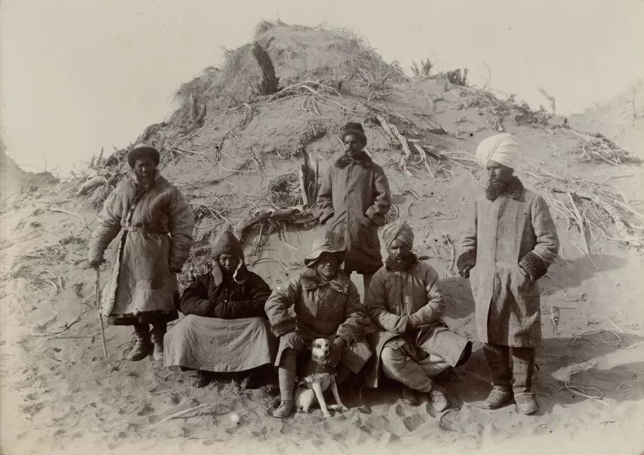
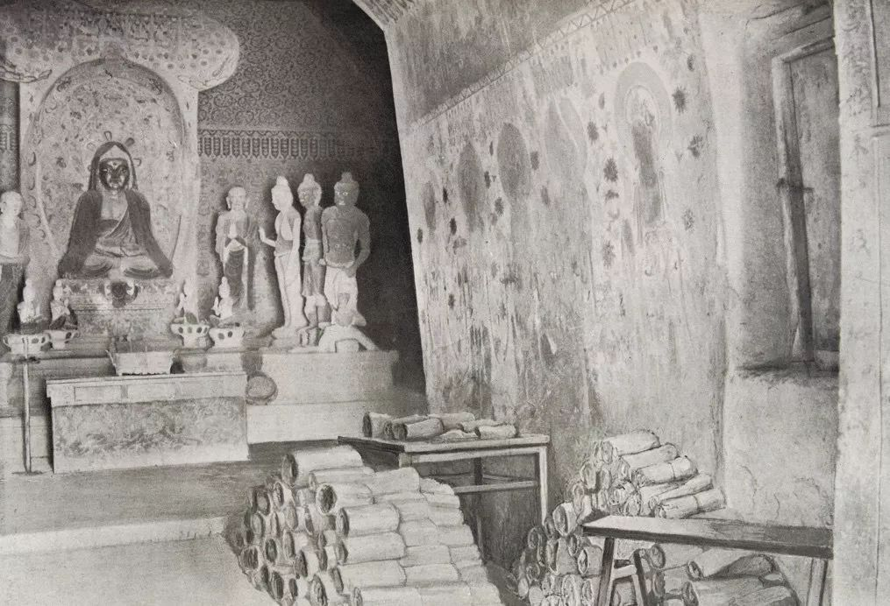
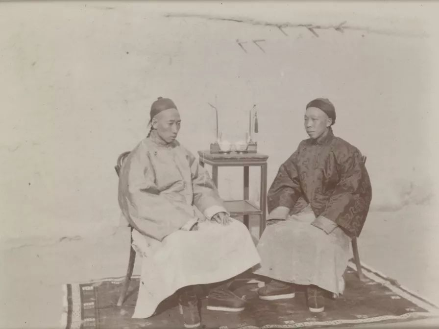
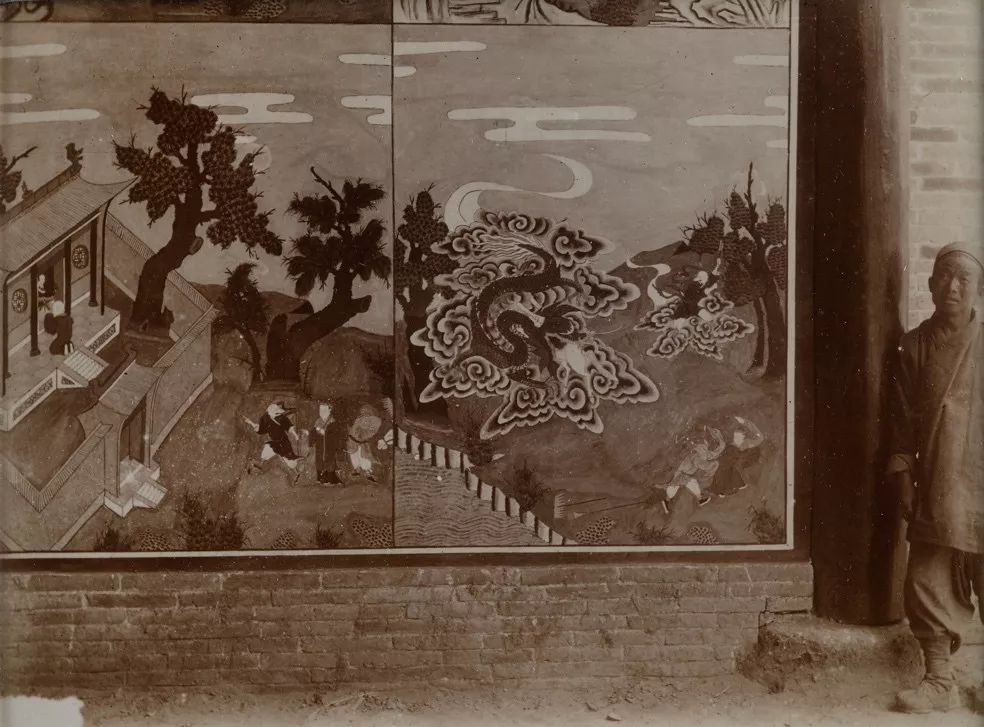
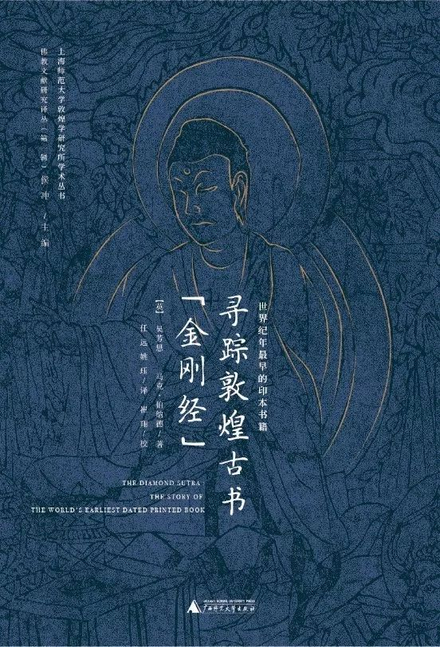
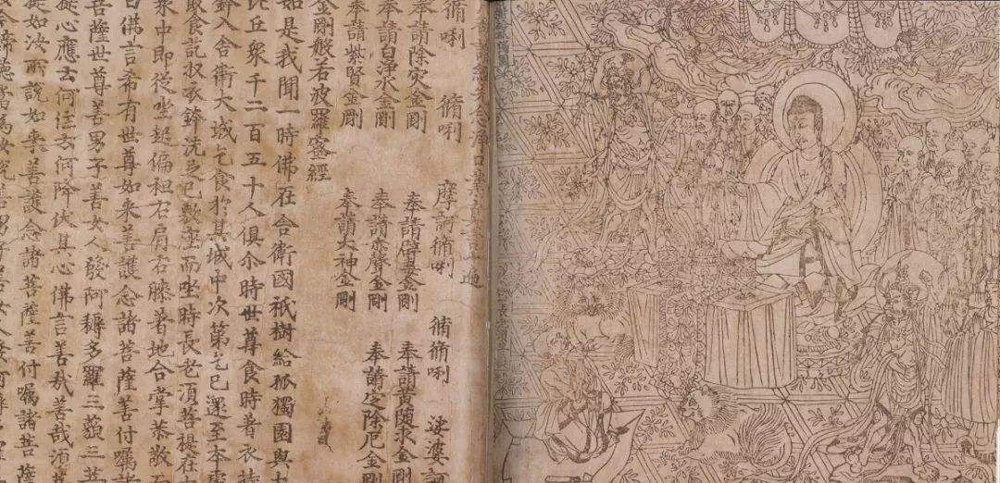
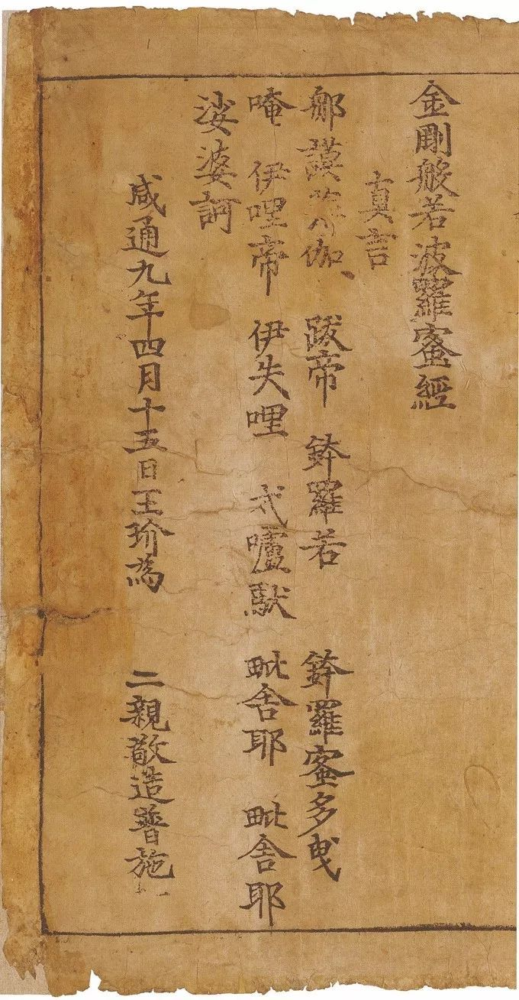
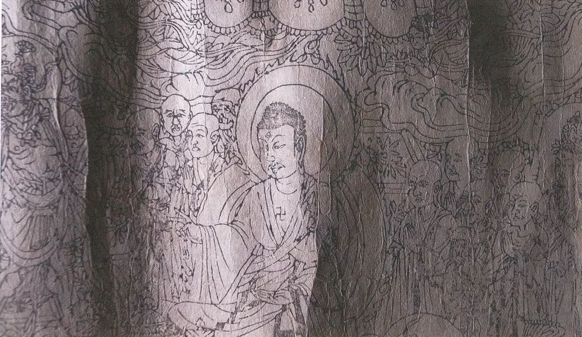
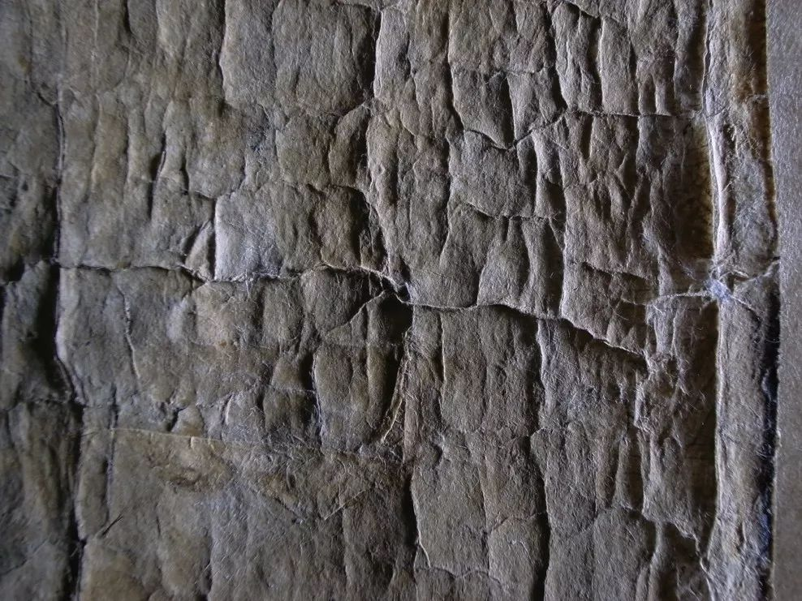
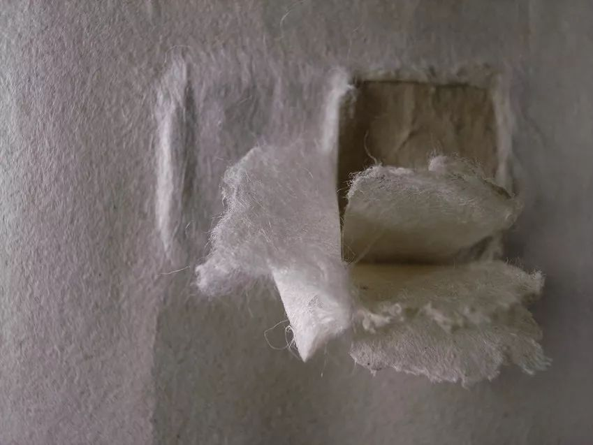

# 丝绸之路上的“考察”竞争：斯坦因与千佛洞

[_东方历史评论_](https://weibo.com/u/1980953575)      发布于 2019-01-16 14:12:32 

​​**撰文：吴芳思 马克·伯纳德**  

敦煌毗邻举世闻名的“丝绸之路”，这是一条横贯中西的商贸交通要道，它沿着中亚腹地的沙漠边缘分为北路和南路。丝绸之路不仅是商贾们从绿洲到绿洲运输丝绸等货品的通道，而且是佛教传入中土的重要通道。20世纪初，（国际考古学家）对丝绸之路遗址进行考察的竞争已日趋激烈。  

塔克拉玛干大沙漠的合影，摄于1907年秋。中间为斯坦因和他的爱犬“达什大帝”，左起为助手易卜拉欣·拜格、蒋孝琬；右侧是两名测量员；后方为厨师。  

1907 年5 月21 日，斯坦因“朝着神圣的洞窟进发”了。这座洞窟距离敦煌绿洲不远，坐落在中国西北部的罗布泊沙漠西缘。绿洲里，可见棉株点翠，白杨、榆树掩映。而绿洲之外，则是茫茫的“灰色砾石荒原”。从环绕于周边的众多沙丘下，延伸出一道长长的崖壁。在崖壁的下方，有一条小溪，岸边长着高高的白杨树。而在崖壁上共有数百个石窟，“如同蜂窝一般，大大小小、洞口开豁”。石窟中间通常有灰泥雕塑的佛陀造像，开凿石窟是为了便于僧人坐禅。在唐代，这些石窟作为佛教圣地最受欢迎。

3 月16 日，他第一次来到石窟，“走马观花地挨个浏览洞窟”，记录“成排的菩萨像……或单尊或被众多供养人围绕的佛像”“那些人物庄严肃穆的风度”“繁复多姿的花边”“华丽非凡的山水画”。不巧，自封为洞窟守护者的道士王园禄为了修葺石窟而外出化缘去了。“一位颇有头脑的乌鲁木齐突厥生意人……扎义德·拜格……提起一个传言，说……偶然间发现了大批的古代遗书。数年后，这些遗书又被藏入某处石窟。”因为研习古代遗书是斯坦因最为热衷的志趣。所以，他焦急地等待王道士的归来。直到5 月21 日，斯坦因才终于又能重返石窟。斯坦因自称：

**此间可是有着许许多多的古代写本宝藏等着来发掘！这个念头就如同一个隐秘的磁场一般，又把我拽回了千佛洞。**

斯坦因所拍摄的千佛洞

然而，斯坦因想接近敦煌石窟中那些古代遗书却委实不易。对与他初次相见的王园禄，斯坦因写道：

**看上去，他是至为小心拘谨的一个人，极度地腼腆紧张，脸上还不时地流露出一种诡秘的狡猾神情，而那绝不是在鼓励我。很明显，一开始他就是一个很难对付的人。**

斯坦因和他的中国助手师爷蒋孝琬都竭力劝说王园禄给他们看这些古代遗书，并特意援引了玄奘前往印度取经而后又将经典翻译成汉文的故事。斯坦因告诉王：“我是何等地崇拜玄奘。我又如何追随着他的足迹，从印度翻山越岭、穿过荒无人烟的沙海一路而来。又是如何随他之后，一一造访了他当年曾经去过并描述过的寺庙遗址……”

这样，斯坦因不出数日便初尝胜利果实。他在笔记中描述：

**当王园禄“鼓足勇气，为我打开了那扇紧锁住狭窄通道的陋门……里间露出的景象让我双目圆睁。在油灯昏黄闪烁的光亮下，层层叠叠地紧密堆放着大堆大堆的文书，杂乱无章地一直堆到了高约10 英尺的地方。如同后来的测量结果，这些文书的体积大约有500 立方英尺，相当于一个9 平方英尺的小厅或小礼拜堂。余下的空间，就仅够两个人驻足而立”。**

王园禄曾将第17窟的遗书全部搬出，后来又悉数放回原地。即便如此，很多遗书依然被成捆地堆在一起，通畅还用长长的纸卷包裹起来。这种捆扎在一起的方式提示斯坦因：这些古代遗书的放置绝非仓促而就。

事实上，窟中发现的许多经卷均不完整或有损坏，这也说明它们是因不再有用而被放置在一边。它们被妥善地保存下来，其中有些有1 500年以上的历史。这得益于纸张的质量和洞中黑暗、干燥的条件。

王园禄对是否让斯坦因观看这些遗书，其实颇为踌躇。最后，他还是“鼓足勇气，满足了我的愿望，只是……只要我还身在中国的领土上，就得对这些‘新发现’的所在地三缄其口。王自己也忧心忡忡地，担心夜里会在他住处以外的地方被人撞见。于是，蒋孝琬自愿充作唯一的搬运工。在此后的七个夜晚，他都带着东西来到我的帐篷。随着搬运的东西越来越沉，到最后竟然到分批运输”。

正如斯坦因自己承认的那样，他从未做过系统的调查。王园禄给他什么他就只能看什么。而且，“在那样匆忙的搜检中，我也无暇好好欣赏经手的所有古代藏品”。斯坦因描述：

**在我飞速地查阅那些混在一起的成堆写本时，我永远也不知道王对我们的纵容还能持续多久。我一方面满心欢喜，但同时那些源源不断涌入的新材料又给我们带来了巨大的压力。即便是那些文物以及我能够充分估量其价值的既非汉文又非藏文的文书，我也完全没有可能仔细查看……那时最让我纠结的，却是我的汉学素养不够。倘若能用我印度学知识的一半来换取对应的十分之一的汉文学养，那我该是何等的高兴啊！即使有蒋的热心相助，可置身于那浩瀚的令人窒息的大堆佛教典籍和其他文献中，我永远都没把握说没有漏掉那些有重要历史和文学价值的材料。**

1908 年，在斯坦因到达敦煌一年之后，他的对手伯希和也抵达此地。与斯坦因一样，伯希和也险些被藏经洞中大量的材料所吞噬：

**我尽最大努力飞快地搜检这个藏经洞……没有可能完全打开并查看15 000—20 000 个卷轴，因为这样的工作恐怕六个月也完成不了。但我得查看每一份卷轴的内容是什么，决定这里面是否有前所未见的新材料。此外，我还得做以下两种决定：这是不惜一切代价非到手不可的，还是尽量争取获得但同时若不得已也可能放弃的。即便我如此努力，这项工作也花费了三周时间。**

斯坦因把他的精力集中在非汉文资料上。他的中国助手蒋师爷对他的帮助有多大呢？蒋孝琬原是当地政府的一名小吏，斯坦因在喀什时，经由英国领事马继业的举荐而雇用了蒋孝琬。但他不熟悉佛教，对佛教术语更是一头雾水。

**我那位实诚的师爷，他对错综复杂的佛教申花和造像的所有细节，一概都是外行。在对向导满怀期望的人面前，他如何能准确无误地理解，并进行专业上的解释呢？**

只有当蒋孝琬对着懂梵文的斯坦因高声诵读他自己也丈二和尚摸不着头脑的经卷时，一切才变得明白：

**在蒋不断地往复诵读那些套话时，我听出了这样一些词，比如“菩萨”和“波罗蜜”，这是汉语里对梵文“Bodhisattva”和“paramita”两个词的读音。由此我才了解到，对一般的中国文人而言，中国佛教的术语是何等地怪异和难以理解。**

这是一部汉译的梵文佛经。

第16窟。洞窟内侧有一扇门，位于照片的右侧，通向第17窟。这张照片是经过合成加工的，叠加了成堆的文书。这样做很可能是为了造成一种错觉，以为斯坦因是在窟中完成对这些文书的搜检的。而事实上，这些卷子都是他的中国助手蒋师爷偷偷运送到他帐篷里去的。  

斯坦因决定：“既然为了研究而做抢救是我的职责所在，那么，只要有可能，就全部收藏……”当然，他也意识到：

**运出这么多车的经卷难免会让这件事暴露在众目睽睽之下。而且还很可能会引发敦煌当地宗教人士的憎恨和不满。即便不会马上就引发更严峻的后果，也肯定会危及将来在甘肃深入工作的一切机会。**

在斯坦因看来，蒋（师爷）是恪尽职守的。蒋曾经颇费周折地努力劝说王园禄：

**把这些收藏运往英国一个有学问的地方，肯定是佛陀和罗汉们都会交口称赞的虔诚善举。他还尽力主张：如果王园禄觉得敦煌太热的话，可以用那笔我已经准备好的钱（我暗示会付40 个马蹄银，约合5 000 卢比。如果有必要，我会给他两倍于这个数目的钱，这无论如何是超出我认可的经费了），回老家过清闲日子……**

王园禄非但没有同意，反而把一些文书包裹又搬回了那个“几个世纪以来阴暗幽闭的囚室”。自从他在1900年偶然发现这个洞窟以来，他已经将洞窟中的一些发现作为礼品送给了一些当地的官员，包括当地最重要的长官敦煌县令王家彦。可能是为了讨好，也可能是为了强化在他洞窟管理方面未经授权的地位，王园禄将青铜佛像、画卷和一些卷轴作为礼物送给当地官员，而那些地方官又把其中一些物品转手送给上司。当地的官员看起来似乎更偏好铜像，所以……在很短的日子里就被散发一空。

斯坦因处心积虑地要和当地官员保持良好关系……在前三次进入中国西部探险时，都避开了当时的京城北京和高级别的官场。他更情愿通过喀什悄悄进入中国，也更愿意跟级别较低的官员打交道，因为后者给予斯坦因在他们的辖区里旅行的便利……可对于王园禄这位自封的洞窟保护者来说，允许他人，尤其是外国人接触这些藏品，还是有潜在的危险。

蒋孝琬（右）和若羌办事大臣。蒋孝琬明白，为了在中亚沙漠绿洲里开展工作，打通中国官场具有重要意义。  

  

斯坦因继续坚持他的计划。“好在我们手上已经有了不少价值不菲的文书和古物，而王也确实希望得到一大笔钱款。而这最终会让我有理由宣称自己在这场外交斗争中取得了实质性的胜利。”一周后，斯坦因再做尝试。接下来，王园禄“在一份恰到好处的布施给到庙里后，投桃报李，允许我在原先挑好的文书之外，又增加了20 多包文书”。斯坦因又继续对王施压。

最终，他从敦煌运走了24 箱“文书宝藏”，还有“从同一个洞窟里拿出的满满5 箱的画卷和其他的文物”。斯坦因完全意识到他这些活动本质上是不可告人的，他极为细致严密地筹备了文物和文书的搬运工作……所以当他装箱付运时，在记录里写道：“在敦煌要想找到足够的箱子而又不让人生疑，可是有点难度的。好在我有先见之明，提前准备了一些‘空箱子’……”

自封为敦煌洞窟守护者的王园禄。照片中的壁画为现代人所绘，斯坦因对此的评价是：“造像艺术沦落到俗不可耐的境地”。  

斯坦因在和田停留，并在此将他第二次探险得到的物品全部装箱。1908年7月15日，他写道：

**总算全部都装好了箱……写本，连同一些写在木简上的文字记录等，共有30箱。蒋孝琬也只不过读完千佛洞文书的三分之一而已。**

斯坦因的第一次探险（1900—1901）和第二次探险（1906—1908）都得到印度政府和英国国家博物馆的资助，当时达成的协议是这两个单位将分享他的探险所得。

这些箱子直到1909年1月才运抵英国。他们最先被存放在自然博物馆里。英国国家博物馆为他（斯坦因）提供了一个地方，但遭到斯坦因的谴责：“地下室……光线完全不行……根本不可能在这个狭小的地下室工作。”

斯坦因猜测，无论收藏条件如何不好，欧洲学者都会急切地希望看到他的发现。他的估计没错。其中最为急切的，莫过于他在敦煌的竞争对手伯希和。

寻踪敦煌古书《金刚经》——世界纪年最早的印本书籍，（英） 吴芳思 马克·伯纳德 著（广西师范大学出版社 2019年1月），授权刊发。  

伯希和是一位杰出的法国汉学家，他还通晓多种语言。他的语言才华加上他高效的工作进度让他对第17窟遗书的取舍更具有极高的学术眼光……目前都收藏在法国国家图书馆……他因斯坦因在敦煌石窟古代遗书的发掘竞争中捷足先登而极为沮丧。他挑选出一些有纪年的写本和文献，并附上描述性的文字，以便斯坦因第二次探险的详细报告《西域考古图记》所用。此外，伯希和还为1914年的展览挑选了展品，并于1910年秋主动提出为斯坦因从敦煌带回的中国写经编制目录……

斯坦因当时最为关注的，是要让最好的语言学专家来研究他的中亚发现，以确定这些东西的内容和价值。因而他对这些遗书的保存和修复，或多或少地不是很在意。斯坦因从伯希和那里得到了他所希望得到的：伯希和为他的展览和出版物做鉴定并提供了最有价值的遗书。

王玠《金刚经》的卷首部分。佛陀在花园里回答弟子须菩提所提问题。簇拥在佛陀身边的有僧人、菩萨、护法神、飞天，右下角的皇帝、皇后。  

伯希和首先注意到（唐代王玠）《金刚经》的真正价值，是作为世界上有最早纪年的印刷书。斯坦因始终未意识到这件遗书的真正意义……还屡次把它的年代弄错。然而，1914年，作为斯坦因的考古新发现，《金刚经》第一次在英国国家博物馆被展出。在1914年展览的目录上，印制的年代是正确的。这部由中国人在868年印刷的书籍比欧洲最早的印刷品年长了约六百岁。这部书诞生的哪一年，丹麦人进犯麦西亚，而阿尔弗雷德大帝的抵抗以失败告终。

经卷的最后一行，记录了印刻年代。王玠敬献给双亲的发愿词紧随其后

在第二次世界大战期间，为了安全起见，第一批171箱（有6 000本书以及手稿）从英国国家博物馆的东方图书暨写本部被运至艾伯瑞斯特维斯的威尔士国家图书馆。另一次大规模的转运在1941年5月，是英国国家博物馆遭到几十枚燃烧弹投落之后。这一次将“余下的所有东方文书”计20 000多件全部转运撤出。几乎可以肯定的是，这部《金刚经》位于第一批转移之列。

斯坦因的著作《华夏大漠废墟记》中的图片显示，（《金刚经》）扉画上有一道延伸穿过整个页面的严重水渍，左面卷起来的部分显示背面有两大块裱补纸。在威尔士，由于战争，无法对它们进行修复，但很显然，除了战争期间之外，从1920—1960年这数十年间，为了修复这部《金刚经》出现的褶皱和裂痕，修复人员在它的背后进行了一次又一次的通卷托裱……无可争辩的是，这种托裱只能使之状态更加恶化。

由裱补纸和黏合剂造成的膨胀和收缩，导致经卷出现深深的波状褶纹

倾斜光源可见的经卷上清晰的裂纹，最早可能在12世纪以前就产生了。

随着1972年英国国家图书馆的奠基及东方文献暨印刷书部（OMPB）的创立，一个新的部门成立了，这就是修复工作室。它的目的是发挥亚洲藏品修复工作所需要的特殊的、专门的技能。而斯坦因的收藏则被单独列出，作为修复的一个专项。

时至今日，英国国家博物馆的负责人和修复人员秉持着同样的共识：敦煌遗书应当被视作一种古籍文献的收藏，而非绘画，保存它们的方式就是要尽可能地保存其原有的样式与形态。整个20世纪80年代，在管理部门和同仁的鼎力支持下……修复工作时制定了一项长期计划：第一，了解（《金刚经》）横贯卷轴首页的水渍以及纸张颜色淡化的原因。第二，尽可能地恢复该《金刚经》的“原始”状态。这样的修复工作，包括“揭去”它多达5层的托裱纸；去掉以前在增加托裱纸的过程中层层加厚而累积下来的胶水和糨糊残留物……还有最重要的是，要重新校准扉画……这部最早的印刷品“先驱”《金刚经》的修复历史，反映了自其抵达伦敦的1909年以来的100年中，英国国家博物馆与英国国家图书馆对古籍文献保护态度的不断变化。

对1平方厘米的多层裱补纸逐一分离

丝绸之路沿途所经的一处处沙堆之下，掩埋着不少古代遗址，让19世纪末，那些来自欧洲的考古学家和探险家们魂牵梦绕。德国的考古学家曾致力于发掘吐鲁番绿洲，俄国人则在丝路的北线一代探险。惊世骇俗的瑞典探险家斯文·赫定在付出了高昂的代价（包括队员丧生，他自己也数度濒临绝境）之后，终于找到了雅鲁藏布江、印度和与象泉河的源头。而斯坦因与斯文·赫定截然不同，他的历次探险都策划得极为细致周全，从未损兵折将……既一丝不苟又保密万分，在对外公布探险路线时更是如此……他铁了心要在中亚沙漠发掘古代宝藏的竞争中击败其他所有的人。他的保密工作没有白做，单凭到手的这件《金刚经》卷轴，他便完成了有史以来最重要的考古发现之一。​

------

原网址: [访问](https://weibo.com/ttarticle/p/show?id=2309404329090852204321)

创建于: 2019-01-16 15:14:17