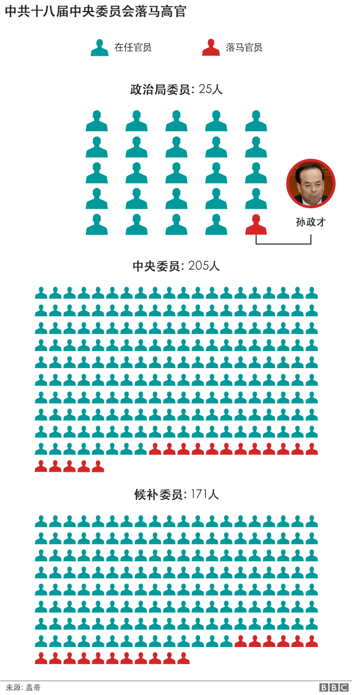

# 习近平的中国：从“秦岭违建”案看其绝对权力的强化 - BBC News 中文

邓聿文 独立学者

2019年1月17日

 
图片版权 Mark Schiefelbein-Pool/Getty Images 

（注：本文不代表BBC立场和观点）

原中共陕西省委书记、现全国人大内务司法委员会副主任赵正永被查。赵之落马原因显然包括“秦岭违建”案。中共最近制作了一部名为《一抓到底正风纪》的专题片在全国播放，该片讲述的正是“秦岭违建”的整治情况。在中国，违规建筑很多，以“秦岭违建”为题材专门拍部专题片警示全党，可见在习近平眼中，此非小事。熟悉中国政治的人都清楚，以专题片形式来教育党员干部，表明片中所指的问题已经非常严重，需要党员干部防微杜渐。而片中被点名的原陕西省委主要领导，就是赵正永。

秦岭别墅违建事件指的是在秦岭北麓西安境内多年来违规建设的一批别墅。秦岭素有国家公园之称，是重要的生态保障区，早在2003年陕西省就对秦岭北麓的生态环境进行专项整治，禁止任何单位和个人在此从事房地产开发建设、修建商品住宅和私人别墅，并在2008年专门出台《秦岭生态环境保护条例》。但自2003年来，有开发商陆续在秦岭北麓建造别墅。虽然期间媒体也曾有报道，地方政府也一直在整治，但未能根治。针对秦岭北麓违建问题，习近平在2014年5月进行了第一次批示，可直到2018年7月第六次批示后，专项整治行动才大规模展开，截止2019年1月10日，共清查出1194栋违建别墅，其中依法拆除1185栋、依法没收9栋；依法收回国有土地4557亩、退还集体土地3257亩。与这些别墅相关的腐败案例也被挖出，多个陕西地方官员被问责。

表面看起来，秦岭别墅违建案时间之长数量之多在同类案件中罕见，但比起习近平每天要面对和处理的军国大事来，这其实算不了什么，此类事情批示一次就了不起，批示两次表示非常重视了，但在前后4年中，竟劳驾习批示了六次。那么问题来了，习为何要纠缠此事不放？原因在于，它触动了习近平绝对权力的神经，这是“秦岭违建”案的本质所在。

习近平上台以来尤其是被封为核心后，中国当局一直在强调政治规矩政治纪律，强调四个意识和两个维护，然而，从该专题片披露的情况看，陕西地方政府对习的批示和指示敷衍了事，以“批示”贯彻“批示”，阳奉阴违，落实不力，简直不把习的权威放在眼里。可见，违建之事是小，习近平说话是否管用才是大问题。在习近平看来，如何对待自己的指令，在党的高级干部中说话是否管用，关乎自己的绝对权力和党国绝对主义统治能否建立以及持续的问题，这就绝不是小事。而陕西当局和赵正永正是在此事上犯了大忌，用专题片的话说，是政治站位不对。

然而，完全“指责”陕西地方当局和赵正永对习的指示批示不重视，贯彻不力，即使是站在中央的立场上，也似乎不尽然，更准确的说法应该是，赵正永和西安市委书记魏民洲等用自己的“批示”来落实习的“批示”而不亲历亲为，是迷信了书记“批示”的效用，同时与他们政治敏感性不强，没有预见习的绝对权力的发展有关。

- [观点：反腐取得“压倒性胜利”传递什么信号](https://www.bbc.com/zhongwen/simp/chinese-news-46691256)
- [观点：从十八届七中全会公报看十九大虚实](https://www.bbc.com/zhongwen/simp/chinese-news-41636598)
- [英媒：习近平反腐运动的政治代价](https://www.bbc.com/zhongwen/simp/press-review-38518348)
- [英媒：习近平反腐运动与古代朝廷如出一辙](https://www.bbc.com/zhongwen/simp/press-review-42267938)
- [习近平的反腐运动：范围有多广？目标是什么？](https://www.bbc.com/zhongwen/simp/chinese-news-41719314)

习近平对“秦岭违建”案的首次批示是在2014年5月，此时习上台也就一年半，虽然他上台伊始即表现出很大的权力，但毕竟尚未成为权力核心，估计陕西省市两级党政领导当时也就把习看作比胡锦涛强势一点的总书记，没有想到习会有后来的绝对权力。若他们预见到了这个趋势，或者习近平首次批示时就表现得像现在这样全权在手，相信他们绝对会亲历亲为，亲自挂帅去落实习的批示的。专题片重点讲述的就是陕西当局对习第一次批示落实不力的情况。到赵正永2016年4月因年龄到点转任人大时，十八届六中全会尚未召开，习的核心地位还未确立。因此，看待“秦岭违”事件应注意这个时间背景。

 
分别拥有205名正式成员和171名候补成员的中共十八届中央委员会在5年任期内有近10%落马。

在习没有成为核心的情况下，特别是在2014年或者2015年，赵正永们用老眼光对待习的权力是很有可能的，故对习的批示，也用批示来贯彻，从中共党内实际的政治生态看，不能讲不重视。这里还有一个上面所指的中共各级领导对自己的权力和批示过于自信的问题，如果习近平认为他的批示能够解决问题，赵正永们为什么就不可以同样认为，在他们的一亩三分地里，自己的批示也管用？中国素来有文件治国的说法，就实际所起作用言，领导人的指示批示讲话比政府文件管用，政府文件比法律管用，部门法律比全国法律管用，最不管用的就是宪法。所以，在这种政治规矩下，地方领导对自己的指示批示肯定也是信心满满的，认为一个批示下去，下面的官员就会去贯彻落实，不会欺骗自己，就好像他们贯彻落实习的指示批示一样。特别是就县乡基层政府而言，市委书记的批示无疑比省委书记和中央的批示好使，后者高高在上，离他们太远，而市委书记直接决定他们的乌纱帽，所以，虽然赵正永没有召开省委常委会专门研究怎样落实习的批示，也未将此事向干部传达，西安成立的调查组领头人的级别也不是市委常委，但他们的做法，在党国政治体制下也很正常，换了其他领导人，在当时情况下可能也是这么处理。

当然，在习近平看来，赵正永、魏民洲们用批示去落实，则是不可以的。虽然2014年的习近平不是2018年的习近平，但其绝对权力的心态是一样的。从绝对权力的角度看，对于最高领袖的指示批示，下属官员，不能仅仅也”批示“了事，必须亲历亲为，过问到底，直到事情获得圆满解决，否则，尤其是当事情出了差错后，会变成一个政治站位的问题。只是习近平在成为”核心“前，对赵正永们可能不便处理。现在掌握绝对权力后，不能容忍此种冒犯最高领袖权威的现象再出现，因此习近平在最后一次批示时，把它上纲上线，要求”首先从政治纪律查起，彻底查处整而未治、阳奉阴违、禁而不绝的问题“。　而我们在专题片看到，涉及此事的相关官员，都诚惶诚恐，自责没有领会好总书记的批示精神，政治站队意识不强。连与此事没多大牵连的现任陕西省委书记胡和平也只能表态称，“确实深感自责、内疚、惭愧。确确实实感受到：讲政治、遵守政治纪律、政治规矩，是非常具体的、是实实在在的。深刻反思，痛定思痛、痛下决心，知错改错、知耻后勇。”

习近平 VS. 邓小平

经过六年对官场的严厉整肃，习如今是号令天下，但他一直不能忘记秦岭别墅违建案，将赵正永们对此事件的处理看作是对自己绝对权威的挑战。对于习而言，此案让他意识到，虽然官员们见到自己唯唯诺诺，然而只要脱离视线，总有官员不会认真去贯彻落实指示，这样的官员在全国可能还不是少数。这如何让他放心？因为这样的精神状态和政治生态是不能够决战全面小康，实现中国梦的，也不能够去应对“惊涛骇浪”的出现。他要通过这个事情，杀一儆百，进一步强化其绝对权力。制作“秦岭违建”专题片，现在再查处赵正永，目的就是要告诫全党，所谓政治纪律政治规矩政治站队，说一千道一万，领导干部亲历亲为，不折不扣地贯彻落实习近平的指示批示最重要，以此强化党国绝对主义的统治和治理。

------

原网址: [访问](https://www.bbc.com/zhongwen/simp/comments-on-china-46901625)

创建于: 2019-01-17 22:14:38