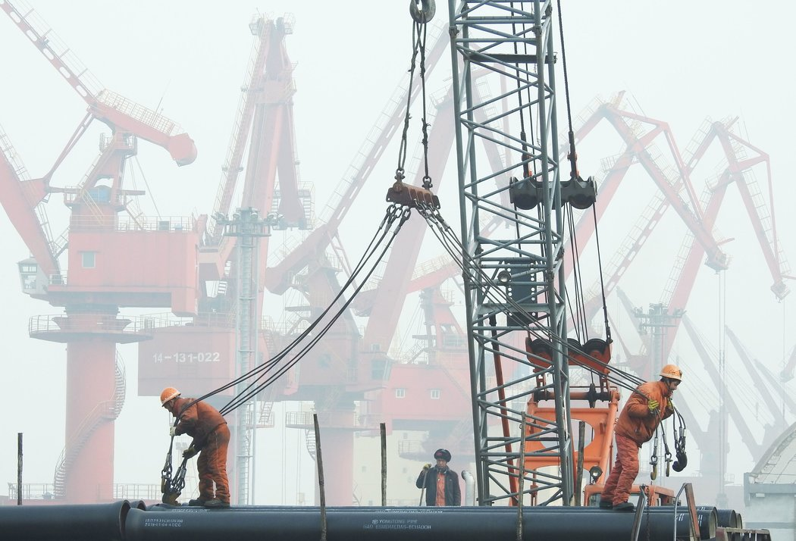
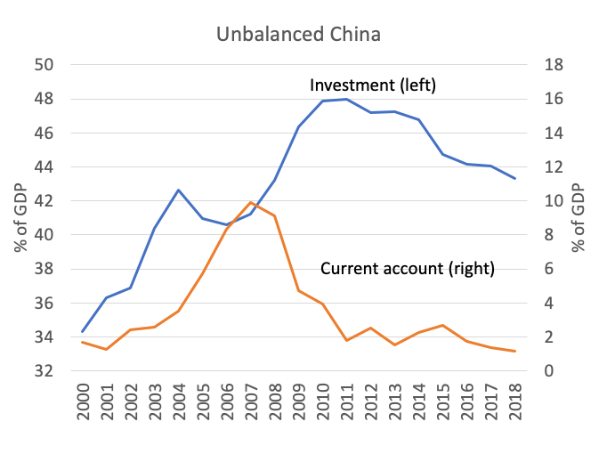
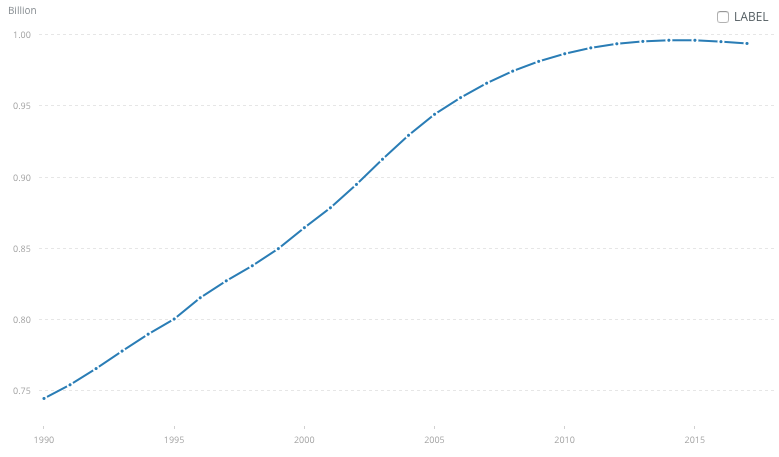
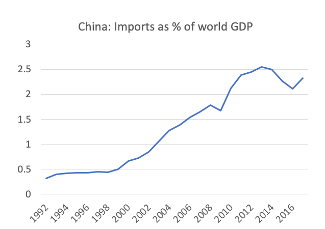

# 中国经济会撞上“万里长城”吗？ - 纽约时报中文网

专栏作者

保罗·克鲁格曼

2019年1月16日

工人们准备将管道装到中国连云港港口的船上。 Agence France-Presse — Getty Images

有一天，我发出了一个有关中国经济的警告。我说，它“正在成为一个世界经济的高危点，而世界经济此刻非常、非常害怕出现这种情况。”

不幸的是，那一天是在[六年多前](https://www.nytimes.com/2011/12/19/opinion/krugman-will-china-break.html "Link: https://www.nytimes.com/2011/12/19/opinion/krugman-will-china-break.html")。而且不只是我。很多人很久以来一直在预言一场中国危机，而它一直都没发生。

但现在中国似乎又在震荡了。众多关于大中国将有大麻烦的预言，终于要成真了吗？老实讲，我不知道。

一方面，中国的问题真实存在。另一方面，不受严格意识形态和任何类似民主政治程序的东西阻挠的中国政府，已经反复展示了它不惜一切代价支撑其经济的能力和意愿。确实，谁也说不准这次是否会不一样，又或者“不可违抗的习”能否拉动又一次复苏？

但也许这是“多恩布什定律”的又一例，这个以我昔日恩师鲁迪·多恩布什(Rudi Dornbusch)的名字命名的定律说，危机到来所需要的时间比你预想要久的多，然而发生时又比你预想要快的多。因此，似乎有必要总结一下，为何人们一直以来对中国有担忧，以及为何中国的麻烦对世界其他地方构成了一个问题。

中国经济的根本问题在于它高度失衡：它有着极高水平的投资，且似乎没有足够的国内消费来合理解释这样的投资。你可能想说这没关系，中国正好可以把过剩的产能出口到其它国家。但虽然从2000年代中到2010年代初的几年里，中国曾拥有巨额贸易顺差，但那些日子已成为过去。

图1显示出中国的投资（左侧比例尺）及其当前的账户结余（对贸易平衡的一种宽泛衡量，右侧比例尺），两者均按相对国内生产总值的百分比表示。这一投资数字按照任何人的标准衡量都是巨大的；很难想见企业如何避免陷入收益骤减的境况。

IMF

诚然，在迅速增长的经济中，超高的投资可以维持很长时间（所谓的加速器效应）。中国也的确实现了不可思议的增长。但未来增长的潜力正在下降，原因有两点。其一，随着中国的科技与发达国家的科技汇聚，通过借贷获得迅速提升的空间减少了。其二，中国的独生子女政策导致了颇类似于欧洲或日本的人口结构。图2显示中国的劳动年龄人口已停止增长。

World Bank

因而中国真的不能保持相当于国内生产总值40%多的投资了。它需要转变到更高的消费，这一点它可以通过从国有企业向公众返还更多的利润、增强社会保障网络等方式来实现。但它一直都不这么做。

相反，中国政府一直在给企业和国有企业增发贷款，促使国有企业增加支出等等。基本上，它一直在让投资持续，虽然回报很低。但这个过程势必是有极限的——当它撞上（万里）长城，很难想见消费如何能快速增长到足以填补那个豁口。

然而，如果这听起来令人信服，请记住这是我和其他人在2011年所阐明的同一个论点。所以，不妨适当怀疑一下。

如果中国真的陷入麻烦，给全球带来的后果是什么呢？这里要认识到的重要之处在于，中国不再拥有对全世界的巨额贸易顺差了（与美国的双边逆差是特例且具有欺骗性）。因此，中国已成为主要的市场。图3显示出中国从其它国家的进口占世界国内生产总值的比重；它们已变得相当大。换个角度看，2017年[中国的进口](https://data.worldbank.org/indicator/BM.GSR.GNFS.CD "Link: https://data.worldbank.org/indicator/BM.GSR.GNFS.CD")为2.2万亿美元，相比之下美国是2.9万亿美元；他们几乎是和我们一样的世界经济火车头。

World Bank, IMF

这意味着，一旦中国发生震荡，将给世界经济带来重创，出口商损失尤其惨重（包括美国的农民）。

换言之，除了特朗普和英国脱欧，还有些其他很可怕的事情。

保罗·克鲁格曼(Paul Krugman)自2000年以来一直是时报观点版面的专栏作家。他也是纽约市立大学研究生中心的杰出教授。2008年，他凭借在国际贸易和经济地理方面的成就获得诺贝尔经济学奖。欢迎在Twitter上关注他 [@PaulKrugman](https://twitter.com/PaulKrugman)。

翻译：李建芳

[点击查看本文英文版。](https://www.nytimes.com/2019/01/15/opinion/will-chinas-economy-hit-a-great-wall.html)

------

原网址: [访问](https://cn.nytimes.com/opinion/20190116/will-chinas-economy-hit-a-great-wall/)

创建于: 2019-01-17 22:19:34