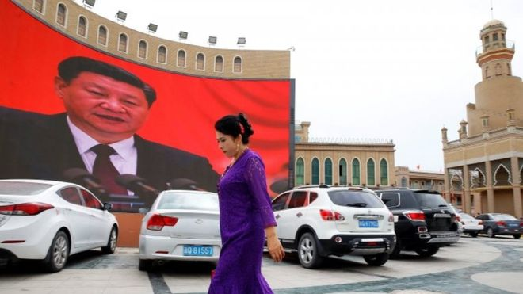
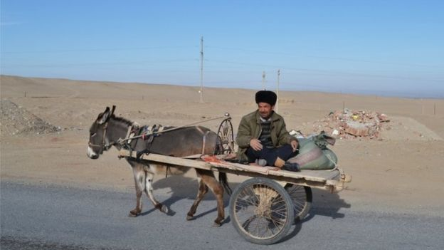
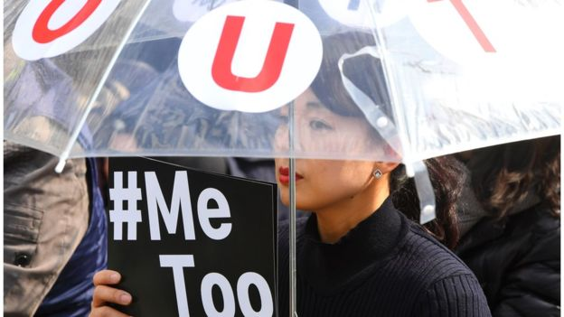

# 中国人权状况在习近平时期降至“89年民运以来最低点” - BBC News 中文

2019年 1月 18日

 
图片版权 Reuters 

在美国的人权组织说，中国在新疆拘禁100多万维族穆斯林接受再教育，强迫他们放弃伊斯兰信仰。

英国报纸引述人权观察组织年度报告说，“中国对人权的打压到达1989年天安门屠杀以来的最严重程度。”

国际人权组织——人权观察1月17日发布2019《世界人权报告》，对世界一百个国家的人权情况做了评估。报告特别提到习近平修宪滥权，镇压新疆的维吾尔族穆斯林，宗教自由，西藏等问题。

人权观察在2019年的世界报告中说，习近平领导的中国政府列入去年人权倒退最多的政权的行列，不过该报告在结论中说，全球来看，反对专制统治的运动呈现希望。

- [中国#metoo蔓延 揭权力规则下隐蔽性侵](https://www.bbc.com/zhongwen/simp/chinese-news-44982540)
- [中国面临人权考问 着重应对新疆西藏香港](https://www.bbc.com/zhongwen/simp/chinese-news-46077439)
- [美国从联合国人权理事会退群的前因后果](https://www.bbc.com/zhongwen/simp/world-44545690)

《独立报》引述总部设在纽约的人权观察负责人罗思（Kenneth Roth）在报告前言中说，中国加强了对人权的压制，达到“1989年天安门民主运动被暴力镇压”以来的最严重程度。

 
图片版权 Getty Images 

中国否认所有关于其系统地迫害穆斯林的指称（新疆和田县）。

## 中国人权

罗思特别提到了中国使用大规模监视技术，诸如识别软件，习近平取消了任期限制，特别是100多万维吾尔族穆斯林在新疆被送进“再教育”营地等问题。

中国否认所有关于其系统地迫害穆斯林的指称，罗思说，中国坚持认为他们采取必须的政策以铲除极端主义。中国之前先否认在新疆有集中营，后来在10月让国家电视台播放了15分钟的视频，显示被拘禁者在营地接受“自由的职业培训”。

另外报告还说，维权人士在中国受到“任意拘禁，关押，和强制失踪”。中国通过其"一带一路"国际基建项目，“对其他国家专制政权提供了支持”。

罗思说，中国新疆拘禁100多万维吾尔族穆斯林让他们接受再教育，强迫他们放弃伊斯兰信仰，背叛他们的民族。如果这样的事情发生在任何其他国家，都会招致极大的愤怒反应，但是中国因为有经济影响力，因此能让这个问题不了了之。

人权观察报告还注意到支持女性权利的#MeToo（我也是）运动也进入了中国，中国许多著名的学者，记者和活动人士都成为受害者指责的对象。

人权观察中国项目的负责人索菲・理查森对《独立报》说，就国内和国外危及人权方面来说，很难找到能和习近平相提并论的政府。

 
图片版权 Getty Images 

去年支持女性权利的#MeToo（我也是）运动也进入了中国，一些女性受害人公开了自己受到著名编辑和文化人性侵犯的经历。

她还提到加拿大公民谢伦伯格（Robert Lloyd Schellenberg）的案件，“（中国和加拿大）外交争端的结果是，一个加拿大公民被判死刑”。她还警告说，处理侵犯人权的国际机制本身正受到中国影响力的侵蚀。

索菲・理查森女士呼吁联合国人权委员会要采取行动，首先要成立一个委员会调查新疆被压迫的穆斯林。

“中国是个特殊的威胁，我们需要全世界和联合国这种机构认清（中国威胁）并在他们还有能力应付的时候作出反应，如果习近平，中共和中国政府没有受重要压力要他们改弦更张，那么很难看到目前的趋势会得到改善。”

人权观察的报告除了对中国侵犯人权发出警醒外，美国也受到其2019年报告的指责。人权观察的2019《世界人权报告》说，特朗普总统在主政的第二年，美国在国内和国外开人权倒车。

人权观察的报告特别指出特朗普政府制定的许多不利难民、移民、女性和许多其他族群的政策。人权观察美国事务负责人奥斯汀希乐瑞说，“美国一旦侵犯人权，其实际影响常会扩及美国国界以外。”

------

原网址: [访问](https://www.bbc.com/zhongwen/simp/chinese-news-46922629?ocid=socialflow_twitter)

创建于: 2019-01-19 22:43:37