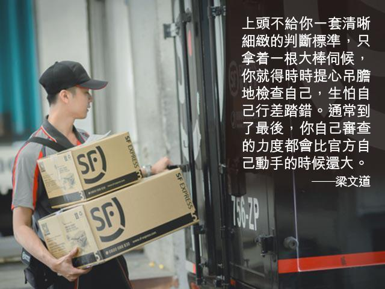

# 審查的完成 - 梁文道

蘋果日報 果籽 名采 20190120

香港的中年影迷可能還記得灣仔的「新華戲院」，這家電影院是「新華戲院」的第三代轉世，曾經以播放比較小眾的電影聞名。因為租約原因，它非常巧合地在1997年7月1日停止營業，而它最後播放的一部電影正是卡瑪（Carma Hinton）製作的紀錄片《天安門》。當年這部片子公映的時候，還閙過一陣子小風波，戲院的帶位員竟然拒絕為這部今天看來非常敏感的電影服務，醞釀罷工，他們害怕香港回歸之後會為此遭到清算。那個時候，幾乎沒有主流輿論會同情這幾個帶位員的決定，因為大家都覺得這種想法太過荒謬，先不說當時沒有太多人相信政治審查也會來到香港；更重要的是，就算清算，怎麼樣也輪不到這幾個奉命行事的小小前線員工身上吧？這件事情發生的時候，正好臺灣著名評論家南方朔先生過港，我也用調侃的口吻跟他數說那幾個帶位員太傻。靜了一會，然後他說了一句我畢生難忘的話：「你們是知識份子，對整個制度的運作過程可能會有更全面的認識。所以無論承不承認也好，你們都屬於精英階層。但你們可能不曉得，越是位處底層的人，越是不了解所謂『全局』的人，就會有更多的擔憂和恐懼。」  

忽然想起二十多年前的往事，就是因為這一個星期我還在反復想像「順豐速遞」的各種審查事件到底是怎麼發生的？  

上星期我在這個專欄的〈順豐快遞的一國兩制〉見報之後，其中最令我驚訝的地方，是原來很早就有不少朋友有過跟我類似的經歷，但卻一直沒有公開指出這是個問題。更有趣的，是在臺灣一些立場偏統及偏獨的網友，香港一些傾向反對派和親建制派的網友當中，都有不少聲音覺得我太傻，明知道「順豐速遞」是中資機構，怎麼還會為他們的書籍審查大驚小怪。換句話說，一家這麼龐大的速遞公司會用意識形態角度檢查他們運送的書刊，在大家看來原來都不是問題了。有問題的，是我對這種事情居然大驚小怪。  

後來經過媒體記者的跟進，以及各方經驗陳述，我們才看到更多「順豐速遞」的古怪審查個案。原來有人從臺灣寄書到香港，只要書籍跟中國相關就不行了；又有人從香港寄書到韓國，會過不了敏感這一關；還有人從香港寄送十字架到澳門，照樣遭到拒絕。綜合這些個案，我們幾乎總結不出任何規律和模式，看不到「順豐速遞」的審查標準何在。這就等於變相地駁斥了部分網民為「順豐速遞」的辯護，例如一位臺灣網民就在拙作下面的留言：「順豐快遞做的沒錯，反華書籍就應該禁止。你不是問怕什麼嗎？那你的美國爸爸怕什麼？華為只是賣點東西給伊朗，你們就怕成這樣」。什麼「美國爸爸」這類常見的說法，我就懶得回應了。但請注意，現在不單是「反華書籍」有問題，甚至只要書名包含了「中國」二字，都會被禁止送運，請問這又是什麼道理呢？難道所有大陸以外出版的書籍帶上了「中國」這兩個字就一定都很反華嗎？  

再說上次我提到的那三本被拒絕托運的書，一本以十九世紀英華詞典為專題的學術期刊《思想史》，一本曾經在大陸出版的西方思想史研究《大辯論》，這都不像是反華書籍吧？至於最後一本《滾出中國》，感謝我在臺北住的那家酒店員工幫忙，透過官方郵政服務，我終於收到並且第一時間讀完。曾經在香港大學任教過的畢可思（Robert Bickers）教授這部書寫得相當細緻，梳理了「百年國恥」這種概念的由來，以及現代中國民族主義的淵源。在我看來，它不止不「反華」，而且還以同情理解的態度，向外國讀者提供了一個認識殖民帝國如何創傷中國人集體記憶的角度。  

再加上「順豐速遞」近幾天的回應，於是我敢大膽地說，這林林總總的審查個案，還真可能不是出自一套固有的，清晰的審查標準，而是前線員工的個人判斷（或者用順豐的說法，是他們的溝通問題）。為什麼我敢說他們沒有一套非常清晰的審查標準，例如一份禁書清單呢？首先當然是因為諸多我聽聞過的個案背後標準都是自相矛盾，有時候一些和中國相關的書可以從臺灣直接寄到大陸，有時候卻連寄到香港都不行。更要緊的是以我所知，這幾年大陸主管宣傳和書刊的部門，並不流行直接定出一套書單。一來，若有一份白紙黑字的文件，就難免有洩露流出的風險，徒惹是非。二來，什麼東西敏感，什麼東西不敏感，就像網絡上的關鍵詞一樣，天天浮動不居，全憑時勢而定，很難及時列成一份相對穩定的清單。  

雖然確實有些絕對不能碰的東西（比如說『法輪功』），是上頭早有明令的。但今天更流行的，卻是一種靠政府部門和私人企業各級人員自己心領神會，自己揣摩忖度的方式，也就是我們平常所說的「自我審查」。事實證明，這確實是一種更加高效，更加無縫的審查方式。因為上頭不給你一套清晰細緻的判斷標準，只拿着一根大棒伺候，你就得時時提心吊膽地檢查自己，生怕自己行差踏錯。通常到了最後，你自己審查的力度都會比官方自己動手的時候還大。  

比如說「順豐速遞」，我可以替它想像實施這種審查的整個過程。首先就像他們所說，運送東西出入，先要符合各國海關標準。把和宗教相關的物品以及敏感書刊運進大陸，那當然是不行的了。在沒有完整清單的情況下，負責的管理階層絕對不能不領會「中央精神」。更簡單地講，那是一種對氛圍的嗅覺。而大家都曉得，今天大陸在意識形態管理方面的氣氛是相當緊的。所以管理階層也就要把他們聞到的這種緊張氣氛往下灌注。又因為一間公司實在很難自己整理出一份特別詳盡的清單（你能想像怎麼樣因應每天的出版物去及時更新和補充一份禁書名錄嗎？），最好的辦法可能就是透過一種管理程序去把抽象的氣氛和精神具體化。層層負責就是個我能想得到的出路。一本書在寄到大陸的時候，被海關截查下來，或者沒收或者退回，對速遞公司而言，都是一個行政跟財政上的負擔。公司內部如何分解這種責任呢？那就是一層層地分派下去，直到最前端收取托運貨品的人員身上。這些前線最基層的員工，應該要經受某種訓練，既曉得怎麼和客戶溝通，更得領會上面傳達下來的氛圍和精神。從他們的角度看，這不是抽象的政治審查，這是保不保得住飯碗的問題。就像當年「新華戲院」帶位員拒絕為《天安門》工作一樣，越是底層的人，越不瞭解上頭高來高去的政治原則，就越有可能害怕最實際最眼前的麻煩。  

那為什麼從臺灣寄書到香港會有問題呢？去年不是有很多公司因為把香港「獨立」出中國大陸範圍而出事嗎？比如說在酒店訂房系統上面分開列出「香港」和「中國」二地。身為中國最大的速遞公司，「順豐」絕對不能重蹈覆轍，很多前線員工因此大概會把從臺灣寄書去香港，自動看成是寄到大陸一樣。從香港寄書到韓國也遇到審查，或者就是大陸幾十年來各種政治運動「擴大化」的模式了，從上到下，層層加碼，從有些書寄到大陸很敏感，變成一個被懷疑為敏感的人物寄書很敏感，直到只要是書都敏感。  

久而久之，這套運作模式是大家都學得會的，即便是一個在臺灣負責接收寄件的前線員工。終於，不論政治立場，也沒有人再覺得書籍和思想的審查本身是個問題了，它合該如此，尤其是和大陸相關的時候。

[梁文道 
電郵 :](https://hk.lifestyle.appledaily.com/lifestyle/columnist/%E6%A2%81%E6%96%87%E9%81%93)[bibliophile.apple@gmail.com](mailto:bibliophile.apple@gmail.com)

------

原网址: [访问](https://hk.lifestyle.appledaily.com/lifestyle/columnist/%E6%A2%81%E6%96%87%E9%81%93/daily/article/20190120/20594838)

创建于: 2019-01-20 21:01:28

