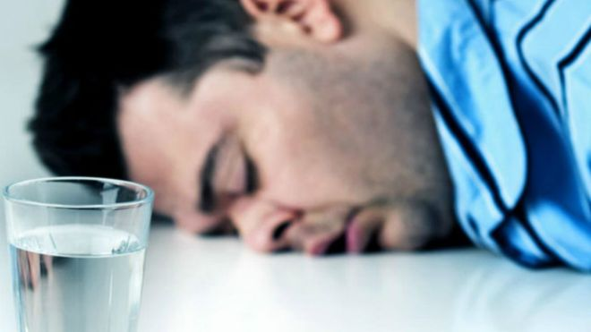
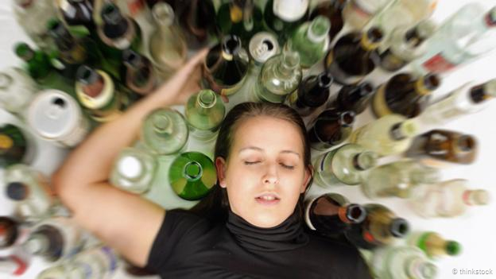
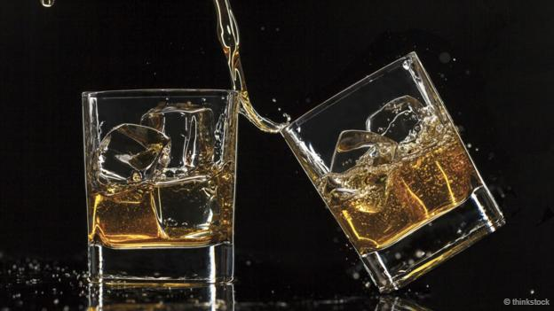

# 是混合饮用酒精饮料导致宿醉吗？ - BBC 英伦网

克劳迪娅•哈蒙德（Claudia Hammond） 2015年 8月 21日

 
Image copyright （图片来源：Getty Images)

“要么葡萄酒，要么谷子酒，千万别混着喝。”上面这句俗话流传已久，它告诫人们不要在一晚上既喝葡萄酒，又喝啤酒。宿醉之人次日醒来往往会表示自己身体不适、脱水、头痛欲裂，抱怨前一晚上不明智地混合饮用各种酒。

那么，就有这样一种关于该按怎样的顺序饮用不同种类的酒。其中一种版本是这样的：“先喝葡萄酒，再喝啤酒，会让人头晕。先喝啤酒，再喝葡萄酒，感觉会不错。”或者结果其实恰好相反？几杯酒下肚后，人要能记起当时的感觉可不那么容易。所有这些理论都回避了这些说法的可靠性。除了先喝啤酒后喝葡萄酒或者相反让宿醉更为严重这些说法外，是否还有什么证据能证明呢？

2000 年公布的一项对之前研究的报告证实，造成宿醉主要症状的原因是脱水、醛固酮和皮质醇等荷尔蒙水平变化、以及酒精自身的毒性作用。 此外，有证据表明，免疫系统也遭到破坏，这可能是造成头痛、恶心和疲劳的原因。

酒类饮料两大成分中的第一种成分对宿醉严重程度的影响是显而易见的。酒精含量越高，喝得越快，宿醉就越严重。不过，这也只是一般情况。相同数量酒精导致的宿醉程度结果并不尽相同。许多人并不会喝醉，到底是什么原因也没人知道。在一项针对年轻人假日活动的研究中，在至少喝过 12 个酒精单位（相当于四大罐或四杯 250 毫升葡萄酒）的人中，几乎有三分之一不会喝醉。

 
Image copyright BBC World Service 
许多饮酒者声称，其根本不会喝醉，但原因何在人们不得而知。（来源：Thinkstock）

混合酒精饮料并不一定会增加饮酒者摄入的酒精总量，但鸡尾酒的情况却并非如此。鸡尾酒是将三四种烈酒与其他成分混合后摇匀，人们饮用后感到喉咙干燥仅仅是因为摄入的酒精总量有所增加。

除了酒精引发醉酒外，另一种影响宿醉的主要成分就是饮料工业所称的同族元素。 同族元素是发酵过程中产生的其他物质，如丙酮、乙醛、 杂醇油以及最广为人知的丹宁酸，这些成分会让酒的颜色更深，同时还能为酒提味。例如，波本威士忌酒的同族元素含量是伏特加酒的 37 倍。

为确定这些物质对宿醉程度的影响，美国研究人员招募大学生参与研究，这些大学生会定期饮酒，但并没有酒瘾。在不同的晚上，请上述大学生分别喝下波本威士忌酒和可乐、伏特加酒和可乐、或者一种含有可乐和补品的安慰剂，在安慰剂中加入几滴波本威士忌酒或伏特加酒，使其有类似于波本威士忌酒或伏特加酒的口味。他们喝下三杯至六杯，不过，无论几倍都要让其酒精呼出浓度达到 0.11 克/100 毫升。这个浓度已经超出不同国家酒驾限值的二到五倍。随后，受试者在诊所度过一夜，次日一早 7 点叫醒他们吃早餐，随后对其进行一系列测试。受试者将为此获得一笔 450 美元的丰厚报酬。研究人员发现，喝波本威士忌酒的受试者宿醉更为严重，但有趣的是，他们在反应时间测试等任务中的表现却并不逊色。

 
Image copyright BBC World Service 
威士忌“同族元素”含量很高，这使其比稍淡的酒类所导致的宿醉更为严重。（来源：Thinkstock）

白朗姆酒、伏特加酒和杜松子酒等澄清型酒类所导致的宿醉程度要轻，原因是其同族元素的含量相对较低。也许，那些混合饮用不同酒的人由于可选择范围大，会倾向于选择深色酒类，而这些酒中同族元素含量较高。要再次强调的是，造成宿醉的原因并非混合饮用本身。

似乎还没有科学家完成过理想的平衡研究，让人随机选择先喝啤酒、再喝葡萄酒，或是先喝啤酒、再喝葡萄酒。但也许重要是并非葡萄或是谷子，而是酒劲的作用才会对判断力产生影响。啤酒的酒劲是葡萄酒的三分之一到二分之一，因而，先喝啤酒，会比先喝酒劲更大的酒喝醉几率要低。但如果先喝葡萄酒或者烈酒，由于饮酒者的判断力会受到影响，随后就会喝得更多。确实有证据表明，人们不善于判断自己的醉酒程度。微醉时，人们会过高估计血液中的酒精含量，但几杯酒下肚后，他们就会开始低估了。

因此，现有证据表明，宿醉不应归咎于混合饮用不同的酒。宿醉的原因可能是由于酒中同族元素含量很高、或者饮酒过度所导致。科学家也从上述入手治疗宿醉，2005 年《英国医学杂志》刊载的一份报告就曾尝试用各种材料治疗宿醉，其中包括：琉璃苣、洋蓟、 葡萄糖、仙人掌果等等。但坏消息是，它们没有一种能有效治疗宿醉。

请访问 [BBC Future](http://www.bbc.com/future) 阅读 [英文原文](http://www.bbc.com/future/story/20140428-does-wine-beer-huge-hangover%20)。

（责编：跃生）

------

原网址: [访问](https://www.bbc.com/ukchina/simp/vert_fut/2015/08/150821_vert_fut_does-wine-beer-huge-hangover)

创建于: 2019-01-20 21:14:41