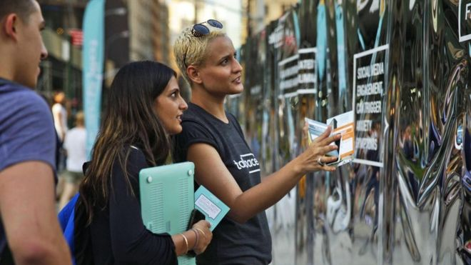
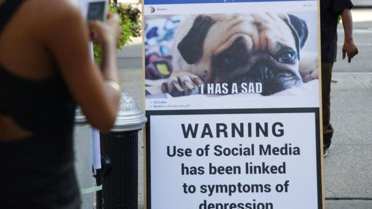
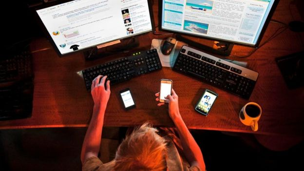

# 比染上毒瘾和酗酒成性还要糟糕的是什么？ - BBC 英伦网

阿里纳·迪兹克 （Alina Dizik） 2017年 5月 10日

 
Image copyright Talkspace 
如果忍不住在工作时间查看Facebook或Instagram，或者如果找不到智能手机或手机没有信号会令你焦虑不安，那你可能需要接受数字化干预治疗。

过去几年，很多社交媒体用户发现，当他们想要远离这些平台时，却无论如何也无法摆脱他们的引诱，因而不得不向专业人士求助。而专业人士也及时作出响应。治疗师纷纷提供咨询，正念教练也开设了各种戒瘾培训，企业健康创业公司同样在帮助人们克服手机成瘾，避免人们一天到晚不停刷屏。

正因如此，社交媒体用户现在可以通过很多方法帮助他们戒除这种习惯。大约1个小时的服务需要花费150美元，如果是持续数日的集中培训则会超过500美元。

- [谁才是真正的社交媒体之王?](http://www.bbc.com/ukchina/simp/vert_cap/2016/06/160602_vert_cap_meet-the-true-kings-and-queens-of-facebook-and-snapchat)
- [请小心分享！社交网络也会让你丢工作](http://www.bbc.com/ukchina/simp/vert_cap/2016/09/160915_vert_cap_think-before-you-overshare-yes-it-can-get-you-fired)
- [身处人群之中为什么会让我们变得愚蠢？](http://www.bbc.com/ukchina/simp/vert_fut/2016/01/160127_vert_fut_are-your-opinions-really-your-own)
- [如何摆脱断网焦虑症？](http://www.bbc.com/ukchina/simp/vert-cap-39279385)

## 寻求帮助

"我们为人们提供了驾驶课程和游泳课程，但所有人都有智能手机，却没有任何人教给他们应该如何正确地使用。"美国非营利组织媒体心理研究中心（Media Psychology Research Center）主任帕米拉·拉特利奇（Pamela Rutledge）说，"他们需要掌握一些技巧来使用各种社交服务。"

 
Image copyright Talkpsace 
提供在线咨询的Talkspace发布了一则广告， 希望让人们意识到社交媒体成瘾所产生的影响（图片来源：Talkspace）

过去几年，因为所谓的社交媒体成瘾向美国休斯顿的治疗师纳森·德里斯科尔（Nathan Driskell）求助的病人增加了20%，现在几乎占到他接诊病人总数的一半。有趣的是，因为电脑游戏成瘾而向其寻求帮助的病人似乎有所减少。

## 未获承认，但可以治疗

需要强调的是，社交媒体并未被美国精神病学会的《精神疾病诊断与统计手册》这样的医学分类文献列为正式疾病，这份手册被视作精神疾病诊断的黄金标准。至于这种情况是否应该归入其中目前仍存在争议。然而，包括德里斯科尔在内的治疗师已经开始使用治疗其他成瘾症的方式来为社交媒体成瘾患者提供帮助。

德里斯科尔表示，从某种意义上讲，Facebook、Snapchat和其他数字平台产生的心理影响比其他已经获得认可的成瘾症更难治疗。"这比酒精或药物滥用更加糟糕，原因是这种行为的互动性高得多，而且没有人以此为耻。"他说。德里斯科尔每小时收费150美元，他每周都会跟病人见面，至少持续6个月时间。

 
Image copyright Getty Images 
在社交媒体或移动设备上停留过长时间会扭曲你的自我意识（图片来源：Getty Images）

## 以毒攻毒

纽约创业公司Talkspace通过1,000名咨询师提供应需咨询服务。该公司行为健康服务副总裁琳达·萨考（Linda Sacco）表示，他们2016年开始为社交媒体成瘾患者量身定制服务，推出了为期12个星期的项目，专门帮助人们应对网瘾，并将此作为一种更加全面的治疗项目的一部分。参与该项目的治疗师会帮助病人坚定意志，还会对他们展开长达数月的追踪回访。但萨考拒绝透露该项目目前的用户总数。

该公司提供的文本治疗方案每月起价138美元，实时聊天治疗每月起价396美元。她补充道，虽然客户需要使用智能手机接受治疗，但该公司却会教给他们如何通过更警觉的方式使用手机。萨考称，多数人都会在经历多次失败的尝试后接受专业治疗。

"等到他们认为需要治疗时，已经自主尝试过一些方法来减少屏幕浏览时间，但却未获成功，甚至感觉更加糟糕。"萨考说，"主动接受治疗的人实际上承认这种行为正在掌控他们的生活。"

- [使用交友APP是怎样一种体验](http://www.bbc.com/ukchina/simp/vert_fut/2016/06/160613_vert_fut_what-i-learnt-using-a-friendship-app)
- [《精灵宝可梦Go》获得巨大成功的心理学原因](http://www.bbc.com/ukchina/simp/vert_fut/2016/08/160803_vert_fut_the-psychological-tricks-behind-pokemon-gos-success)
- [谷歌主页涂鸦标志背后的插画家](http://www.bbc.com/ukchina/simp/vert_cap/2016/05/160512_vert_cap_meet-the-man-behind-googles-doodles)
- [脸书分享心情透露出的隐藏信号](http://www.bbc.com/ukchina/simp/vert_fut/2016/11/161109_vert_fut_our-facebook-sharing-can-reveal-hidden-signals-about-you)

 
Image copyright Talkspace 
这则广告展示了社交媒体如何扭曲你的观点，并在其中使用了哈哈镜（图片来源：Talkspace）

## 帮助病人

其他人认为，糟糕的社交媒体使用习惯可以被视作一种职场问题。在研究了一本关于戒网的书之后，奥利安娜·菲尔丁（Orianna FIelding）2014在伦敦创办了Digital Detox 公司。菲尔丁目前与很多公司展开合作，帮助他们的员工正确使用社交网络，而没有完全交给他们自己来处理。这些项目最初采用了现场研讨会的形式，然后让员工参加针对他们自己的数字化触发器定制的在线模块，其中也包括来自社交网络的各种打扰。

"我们在重新构造人类与技术的关系。"菲尔丁说，她平均每天收费600英镑（748美元）。她还补充道，企业高管还可以额外注册一些以提升生产力为重点的研讨会。

## 方法得当

专家警告称，如果过于依赖正念或数字戒瘾培训，但却没有后续措施，那也并不可取。德里斯科尔认为，利用周末或一整个星期的时间进行戒瘾是个良好的开端，这往往需要通过身处自然环境来帮助人们摆脱设备的诱惑。

但与其他成瘾症状一样，客户往往至少要花半年到一年的时间才能充分明白，如何在戒瘾培训项目之外的环境中管理自己的行为。"分散精力后，戒瘾效果很好，但回去之后，又会恢复以前的生活方式。"德里斯科尔说。

## 治疗效果

有的人还不想参加这种一对一的突击式治疗，但仍然希望尝试一些方式来戒瘾，于是，有的公司从中看到了商机。

 
Image copyright Getty Images 
社交媒体成瘾"比酒精或药物滥用更糟糕，原因是这种行为的互动性高得多，而且没有人以此为耻。"（图片来源：Getty Images）

在柏林，一家名叫Offtime的公司自诩为第一家"后科技创业公司"，专门以"专注和数字再平衡"为己任。他们与用户一起通过应用控制他们的社交媒体使用量，而且还会提供很多面对面的戒瘾研讨会。

2014年参与创办该公司的心理学家亚历山大·斯登哈特（Alexander Steinhart）表示，实际效果还算不错：那些发现自己的社交媒体使用量增加，但却希望自己解决问题的人的确获得了帮助。

不应该等到问题出现再去解决，而是应该在了解了最佳实践方式后主动寻找健康的路径。拉特利奇表示，当新技术出现时，就应该遵循良好的科技使用习惯。

"人们往往会直接将其称作上瘾。"她说，"而不会认为这是一种失衡。"

访问 [BBC Capital](http://www.bbc.com/capital) 阅读 [英文原文](http://www.bbc.com/capital/story/20170417-the-addiction-thats-worse-than-alcohol-or-drug-abuse)。

------

原网址: [访问](https://www.bbc.com/ukchina/simp/vert-cap-39870706?ocid=socialflow_twitter)

创建于: 2019-01-20 21:17:31