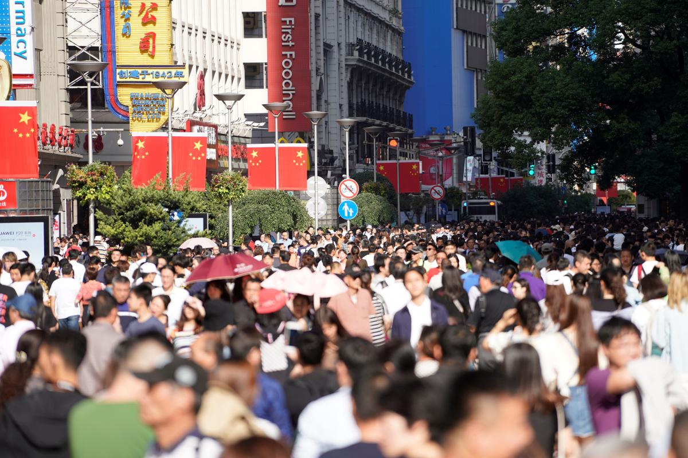

# 2018年中国人口出生率大幅降至10.94‰ 65岁以上人口持续增长 - 路透社

[中国财经](https://cn.reuters.com/news/archive/chinaNews)

2019年1月21日 / 下午1点50分 / 

Reuters Staff

1 分钟阅读

路透北京1月21日 - 尽管中国放开生育二胎政策，却未能遏止人口出生率下降的趋势。根据中国国家统计局周一发布2018年数据显示，2018年人口出生率大幅降至10.94‰，较上一年的12.43‰下降1.49个千分点。

资料图片：2018年10月，上海，南京路步行街上的人流。REUTERS/Aly Song

与此同时，老龄化社会却加速到来，2018年末65岁以上老年人口占比从前一年的11.39‰升至11.94‰，已达16,658万人，显示中国人口结构失衡问题愈发明显。也让外界猜测中国可能会全面放开生育政策。

针对中国人口红利是否会提前消失的担心，中国国家统计局局长宁吉喆在国新办举行的新闻发布会上称，“我们的劳动力资源近9亿人，就业人员7亿多，受过高等教育和职业教育的高素质人才有1.7亿，每年大学毕业生有800多万。”

他表示，中国仍然具有巨大的人口数量和劳动力大军，人口红利仍然存在，劳动的参与率还在提高。同时，人才红利正在形成，这都为中国推动高质量发展，培育经济发展新高地，提供了智力基础和支撑。

以下为中国近年来人口基本情况：（数据来源国家统计局官网）

指标 1982年 1990年 2000年 2016年 2017年 2018年

出生率(‰) 22.28 21.06 14.03 12.95 12.43 10.94

65岁以上数量 4,991 6,368 8,821 15,003 15,831 16,658

及占比(‰) 4.91 5.57 6.96 10.85 11.39 11.94

数据显示，从1999年中国开始进入人口老龄化社会到2017年，中国老年人口净增1.1亿，其中2017年新增老年人口首次超过1,000万。 　

有专家预测，到2050年前后，中国老年人口将达到4.87亿的峰值，占总人口的34.9%，意味着将近每三个人就有一个超过60岁的老年人。（完）

发稿 沈燕;审校 吴云凌

我们的标准：[汤森路透“信任原则”](https://www.thomsonreuters.cn/content/dam/openweb/documents/pdf/china/brochures/about-us-1.pdf)

------

原网址: [访问](https://cn.reuters.com/article/china-population-2018-0121-idCNKCS1PF0E1?feedType=RSS&feedName=chinaNews)

创建于: 2019-01-21 21:20:06

