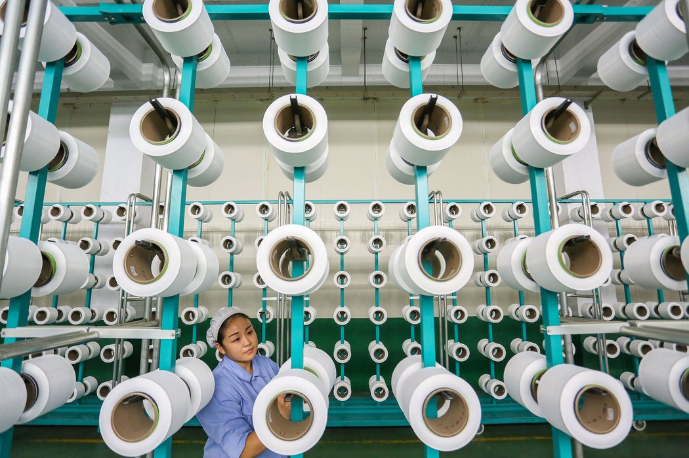
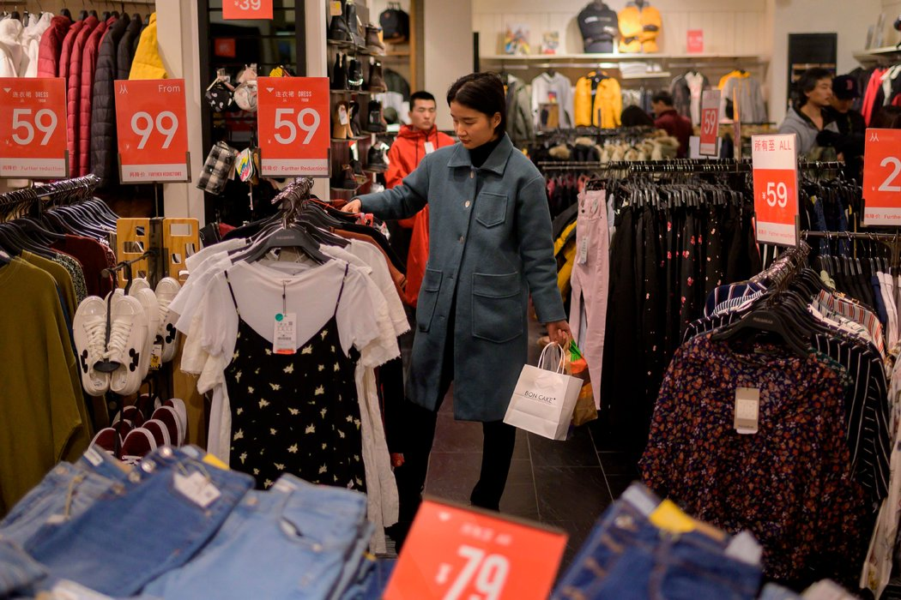
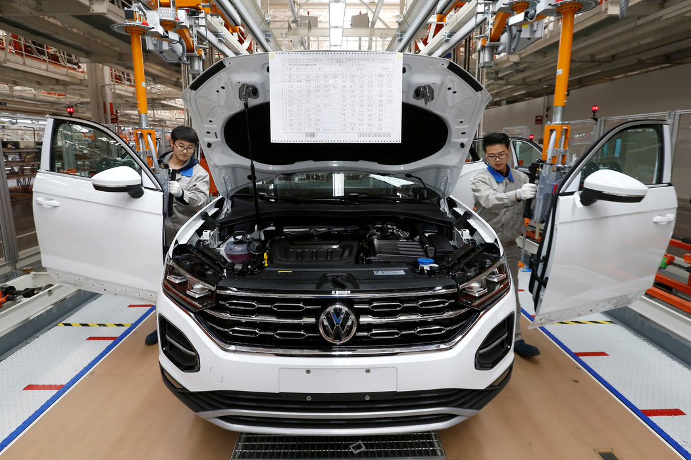

# 中国经济增速创新低，数字背后的情况可能更糟 - 纽约时报中文网

### 商业与经济

KEITH BRADSHER

2019年1月21日

去年，在中国东部省份福建晋江的纺织厂，一位工人正在检查设备。近期，中国许多出口型工厂的活动有所放缓。 Agence France-Presse — Getty Images

北京——中国经济正在放缓，而放缓的情况可能比北京所描述的更糟糕。

周一公布的官方数据显示，中国经济正在报出新的——但仍在可控范围内的——低点。2018年最后三个月，经济同比增长6.4%。这是自十年前中国努力应对全球金融危机以来的最低增速。

根据官方数字，去年全年中国经济增长了6.6%。这是自1990年以来的最弱增势，这一年，中国经济的神话在前一年天安门广场镇压事件的影响下出现震荡。

在经济放缓的同时，这些数据表明，相较于中国这样的大型成熟经济体，这只是温和的放缓。虽然这些数字已达到历史低点，但较先前水平而言只是略有下降。

周一公布的月度数据同样表明，12月的消费支出和工业生产表现好于预期，这增加了增长稳定的可能性。

而更详细的数据讲述的，却是个不同的故事。

从投资到[消费支出](https://cn.nytimes.com/business/20190104/china-consumer-economy-apple-iphone/)再到[工厂活动](https://cn.nytimes.com/business/20181217/china-economy-xi-jinping/)，中国经济在去年下半年明显放缓。这些数据也表明，与美国的贸易战给中国带来了更多的影响。

此外，12月份的上涨在很大程度上取决于北京为实现经济增长所做的努力。如果目前的努力不够，中国领导人还有很多方法可以促进经济增长，他们的选择通常需要进行艰难的取舍，可能会增加国家的债务问题，或增加其他困扰经济的不平衡问题。

**从数据上看**

北京去年底[采取措施](https://cn.nytimes.com/business/20181008/china-lending-trade-war/)以[重振增长](https://cn.nytimes.com/business/20180824/china-economy-trade/)，这在数据上有所体现。12月份零售和工业产出比11月份有所上涨，表明消费者和企业在一年结尾之时感觉稍好了一些。

上周，北京一家商场的购物者。12月，零售行业销售持续放缓。 Nicolas Asfouri/Agence France-Presse — Getty Images

但这些月度数据无法完全弥补去年后半年的黯淡表现。根据中国汽车经销商活动骤降和智能手机销售普遍疲软的情况衡量，在这六个月内，零售明显放缓。新工厂和办公楼这类固定资产的投资都很乏力。

“中国经济近几个月来已经明显下降，”大型咨询公司牛津经济研究院(Oxford Economics)的中国问题专家高路易(Louis Kuijs)说。

在更广泛的范围里，许多经济学家估计，根据更详细的数据，中国经济放缓的情况比政府数据显示得更糟。 一些经济学家估计增长只是官方数字的一小部分，尽管大多数经济学家认为真实数字只比官方数字低一或两个百分点。

眼下的问题是，12月份的改善能否持续到2019年初。中国政府正试图在不增加过去十年累积的巨额债务的情况下，推进经济增长。虽然中国仍然有很多重振经济的方式，但其中很多选项都需要进行艰难的取舍。

**贸易麻烦**

中国的经济问题始于特朗普开始给中国产品施加关税之前。也就是说，贸易战不是症结所在。

近来，许多出口型工厂的活动也有所放缓。很多工厂因担心1月1日关税增加，匆匆将货物运往美国，结果关税增加并未发生，这使得仓库里堆满了剩余货品。许多中国工厂取消了加班，并寻求其它方式削减雇佣成本。

投资银行摩根大通(JPMorgan Chase)的经济学家周一略微调低了今年前三个月的增长预期，理由是12月的贸易数据低于预期。

“过去两个季度以来，制造这艘船已从漂浮变成了抛锚停泊，”经济咨询公司中国褐皮书(China Beige Book)在上月的分析中说。

上月，一汽-大众天津制造厂大众探岳汽车生产线。汽车销售大幅下滑是中国经济放缓的最大因素之一。 China Network/Reuters

**导致经济放缓**

一些经济学家指出，致使中国零售疲软的最大因素是汽车销售的急剧下跌，一些人士估计这一部分占整体放缓的一半或以上。

汽车销售自夏季以来一直在跌，12月份同比猛跌19%。但中国在2016年向购车人提供的适度减税，在2017年有所减少，去年则全部消失。这些税收政策可能曾在2016至2017年拉动了一些需求，导致市场在去年呈现下跌趋势。

“因为17年的市场基数高，18年市场有很大压力，”中国乘用车市场信息联席会秘书长崔东树在电话采访中说。

汽车经销商的销量下滑在中国各地引发了一波装配厂减产。这反过来又削减了汽车零部件、钢铁、玻璃和其他材料的需求。

但援军可能就快到了。国家发展和改革委员会(National Development and Reform Commission)副主任连维良上周在记者会上表示，中国将起草政策以“稳定”汽车和家用电器消费。

**放缓将持续多久？**

中国政府已允许更多城市推进如建造新地铁这样的大额项目，并为金融系统注入了更多资金。中国领导人还承诺减税以支撑下滑的商业信心。

这些努力“将在今年下半年推动经济发展，”中国大型在线零售商京东首席经济学家沈建光说。

中国仍有一个重要选择：帮助房地产市场。

一些估计称，建造和装修房屋和其他建筑物占该国经济活动的四分之一。中国可以采取措施，例如放宽对抵押贷款的限制，以及释放房地产开发商购买土地和处理债务的能力。但这种方法是伴随着危险的。该行业已经过度建设并被投机行为所困扰，这是中国当局长期以来试图遏制的。

“放松房地产行业将被当做最后手段，而非优先选项，”瑞士银行瑞银(UBS)的中国经济学家汪涛说。

Keith Bradsher是《纽约时报》上海分社社长。欢迎在Twitter上关注他 _[@KeithBradsher](https://twitter.com/KeithBradsher)。_

Ailin Tang对本文有研究贡献。

翻译：纽约时报中文网

[点击查看本文英文版。](https://www.nytimes.com/2019/01/20/business/china-economy-gdp-fourth-quarter.html)

------

原网址: [访问](https://cn.nytimes.com/business/20190121/china-economy-gdp-fourth-quarter/?utm_source=tw-nytimeschinese&utm_medium=social&utm_campaign=cur)

创建于: 2019-01-22 10:25:07

目录: default

标签: 无

