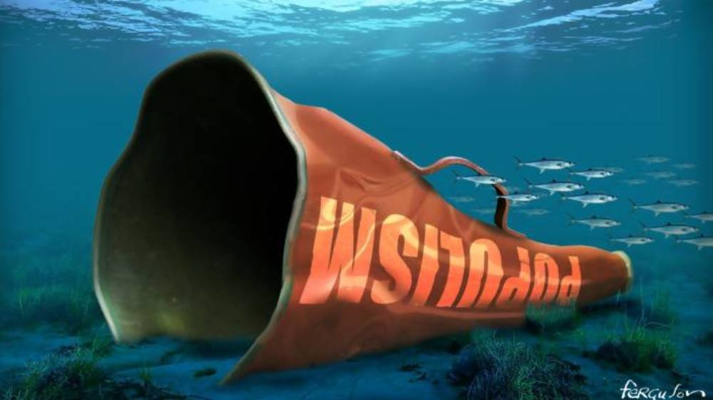

# 民粹主义的至暗时刻？ -  FT中文网

[2019前瞻](http://www.ftchinese.com/tag/2019%E5%89%8D%E7%9E%BB)

拉赫曼：传统政客需要拿出新的主张来回应民粹主义。民粹主义眼下虽遭遇了麻烦，但它的时候并未过去。

更新于2019年1月21日 07:06 作者：英国《金融时报》专栏作家 [吉迪恩•拉赫曼](http://www.ftchinese.com/search/%E5%90%89%E8%BF%AA%E6%81%A9%E2%80%A2%E6%8B%89%E8%B5%AB%E6%9B%BC/relative_byline)

今年会是民粹主义的死期吗？2016年，英国公投决定退欧、唐纳德•特朗普(Donald Trump)当选总统，令英美两国的政治建制派目瞪口呆。但2019年很可能成为民粹主义势力分崩离析的一年，因为一个日益清晰的事实是，糟糕的主张只会带来糟糕的后果。

2016年关于英国退欧的那些乐观论断已经烟消云散。特里萨•梅(Theresa May)与欧盟(EU)达成的退欧协议，被多数曾经的退欧阵营领导人谴责为背叛。但许多退欧派如今倡导的“无协议”退欧，很可能随后给英国带来艰辛和羞辱；而举行第二次公投的决定，将标志着民粹主义相对3年前鼎盛时期的一次更明显撤退。

美国民粹主义运动的前景看起来同样黯淡。特朗普的民调支持率再度下滑，而股市（他所选的衡量成功与否的标准）出现了暴跌。罗伯特•米勒(Robert Mueller)的调查很快将得出报告，并可能触发弹劾程序。或许对特朗普而言，最危险的是在中期选举受挫、国防部长吉姆•马蒂斯(Jim Mattis)辞职后，资深共和党人正变得越来越不驯服。

然而，尽管我们很想称民粹主义将开始走下坡路，但这个结论也下得过早。原因主要有三点。首先，虽然民粹主义政策陷入了困境，但推动这场运动的内在经济和文化因素依然存在。其次，民粹主义有右翼和左翼两种形式。右翼民粹主义如今在美国和英国举步维艰，但左翼民粹主义今年可能势头更猛。

第三个原因是，民粹主义如今已成为一种全球现象。从巴西利亚到布达佩斯、从罗马到马尼拉，都是民粹主义政客在掌权。意大利和巴西2018年进行的选举尤为突出。一个西欧主要国家和拉美最大国家的政府现在皆由民粹主义政党执政。

巴西总统雅伊尔•博尔索纳罗(Jair Bolsonaro)采纳了特朗普主义的一些空洞议题，包括谴责中国、“全球主义”和文化精英。但与他的北美榜样不同，博尔索纳罗可能在2019年迎来一个蜜月期——企业和消费者信心上升——部分原因是他承诺进行经济自由化改革。

意大利民粹主义代表人物马泰奥•萨尔维尼(Matteo Salvini)也可能迎来不错的一年。意大利似乎避免了与欧盟委员会(European Commission)在该国预算赤字问题上发生冲撞，许多意大利人喜欢对欧盟采取更强硬立场的政府。如果萨尔维尼的联盟党(League party)在5月的欧洲议会(European Parliament)大选中表现出色，他可能启动国内大选，使联盟党崛起为意大利主导的政治力量。意大利公共财政虚弱意味着，意大利的民粹主义很容易遭遇市场主导的反冲。但就目前而言，萨尔维尼的势头仍在上升。

许多民粹主义领导人都对特朗普大加赞赏。因此，特朗普遭弹劾肯定会影响世界各地民粹主义者的士气，英国退欧运动熄火也是如此。但是，即便英美的民粹主义先锋队遭遇麻烦，推动这一运动的全球力量看起来仍很强大。对移民的恐惧、经济上的不安全感和文化保守主义结合在一起仍然是一股强大的力量。依然会有人呼吁回到一切看上去都更为简单的过去。博尔索纳罗政府负责女性事务的部长达马雷斯•阿尔维斯(Damares Alves)不久前誓言，在新时代的巴西，“男孩穿蓝色，女孩穿粉色”。

驱动右翼民粹主义的是文化问题。与此同时，左翼民粹主义将继续强调少数群体权利和经济因素。对左翼民粹主义者来说，未来一年可能是硕果累累的一年。下届民主党总统候选人提名的角逐已经开始。民主党那边的大部分动静似乎都来自“进步派”，例如伊丽莎白•沃伦(Elizabeth Warren)、伯尼•桑德斯(Bernie Sanders)、亚历山德里娅•奥卡西奥-科尔特兹(Alexandria Ocasio-Cortez)。这些政客攻击富人和特权阶层的方式，曾是美国主流政治所忌讳的。

在英国，后退欧时代的悲观情绪很容易让杰里米•科尔宾(Jeremy Corbyn)获得成为首相的机会。科尔宾在英国的胜利将鼓舞世界各地的左翼民粹主义者，正如英国退欧让右翼民粹主义者（包括特朗普的竞选团队）相信历史潮流开始对他们有利一样。

左翼民粹主义在拉丁美洲有一个重要分支。安德烈斯•曼努埃尔•洛佩斯•奥夫拉多尔(Andrés Manuel López Obrador)在2018年当选墨西哥总统，受到了世界各地极左势力的热烈欢迎。科尔宾是洛佩斯•奥夫拉多尔的老朋友，也是后者就职典礼上的贵宾。科尔宾还曾是委内瑞拉前总统乌戈•查韦斯(Hugo Chavez)的狂热粉丝。

务实的中间派会怀疑墨西哥和巴西的民粹主义试验最终会像英国退欧和特朗普当选总统一样顺利。但中间派需要一些新调调。像法国总统埃马纽埃尔•马克龙(Emmanuel Macron)这样的政客——用老调重弹、只不过声音更大的方式回应民粹主义——有被忽略的危险。民粹主义遭遇了麻烦，但民粹主义的时候并未过去。

_译者/何黎_

版权声明：本文版权归FT中文网所有，未经允许任何单位或个人不得转载，复制或以任何其他方式使用本文全部或部分，侵权必究。

------

原网址: [访问](http://www.ftchinese.com/story/001081142?adchannelID=&full=y)

创建于: 2019-01-21 22:38:50

