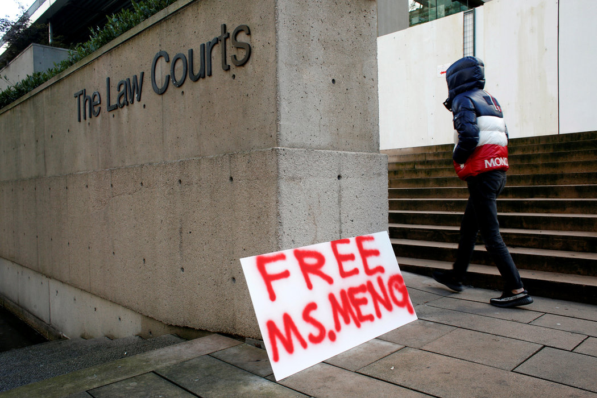
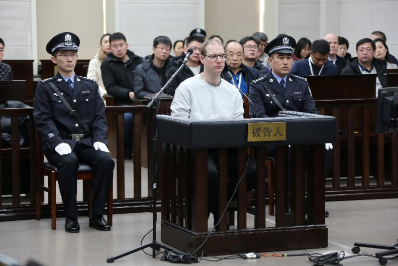

# 孟晚舟事件为何让加拿大华裔心生恐惧？ - 纽约时报中文网

观点

CHAUNCEY JUNG

2019年1月22日

去年12月，温哥华的不列颠哥伦比亚省最高法院外，呼吁释放孟晚舟的标语。 David Ryder/Reuters

去年圣诞假期，对于几名在中国被扣押的加拿大公民来说，不是那么好过。根据《纽约时报》的[报道](https://cn.nytimes.com/asia-pacific/20181224/canada-china-detention/)，其中一名前外交官康明凯(Michael Kovrig)因涉嫌危害中国国家安全而被关押在24小时开灯的秘密地点。在那里，他每天不仅要面对调查人员从早到晚的审讯，到圣诞节为止，也不许与律师见面。每个月只能见到一次加拿大方面的领事官员。不过，他还是比另外一名加拿大公民好过一些——罗伯特·劳埃德·谢伦伯格(Robert Lloyd Schellenberg)因走私毒品，11月判处有期徒刑15年，在其上诉后，法庭又认为一审量刑过轻，[上周对他进行了一天的重审后](https://cn.nytimes.com/china/20190115/china-canada-schellenberg-retrial/)，当庭判其死刑。

这起正在升级的中加外交风波被称为“[孟晚舟事件](https://cn.nytimes.com/business/20181218/huawei-meng-hsbc-canada/)”，它一下子成为了加拿大华裔网友在2018年最关注的新闻事件。在孟晚舟12月初[被逮捕](https://cn.nytimes.com/business/20181206/huawei-cfo-arrest-canada-extradition/)后，中国外交部的反应十分激烈，威胁称加拿大如果不释放孟晚舟，将会面临“严重后果”。虽然中方否认这些加拿大人的案子与孟晚舟案有任何关系，但外界普遍认为，这便是中国方面曾说过的“严重后果”。

但是与几名被关押的加拿大公民不同的是，到了圣诞假期，孟晚舟早就获得了保释，目前正和家人一起住在温哥华自家的别墅内，等待下一次关于引渡的庭审。在加拿大，她不仅可以与律师交谈，并且被允许参与庭审，在网上她还发帖感谢所有支持她的人。同时，在温哥华的法庭周围，支持孟晚舟的华裔人群也得到了充分表达他们观点的权利。根据香港《南华早报》的[报道](https://www.scmp.com/news/world/united-states-canada/article/2177384/its-all-way-huawei-sabrina-meng-wangzhous-supporters)，有人在法庭的旁听席高唱中华人民共和国国歌。还有在法庭门外的老者高声谴责加拿大没有法制，孟晚舟的人权没有得到保障。

这些受加拿大宪法赋予保护的基本权利，都是这些华裔移民在原籍国内，不曾享受过的奢望。他们虽然生活在加拿大，却与中国政府在事件的看法上如出一辙。这也是他们享有的基本权利，但如果中国与西方各国的关系继续恶化的话，他们的言论无疑会让西方对华裔有更大的负面偏见，会让华裔移民处于更加边缘化，乃至被排斥的境地。在尊重言论自由的西方国家，很多加拿大人会认为这些为更好的生活而离开专制政权的移民会表达自己对原生国家批判的一面，然而事实并非如此，给人民的印象是，有不少华人移民似乎在利用言论自由的权利，向西方世界宣扬中国政府的那一套价值观。

这次事件当中，不论你支持哪个国家的立场和政治价值观，加拿大所有的华人都有可能受到中加外交风波的影响。《多伦多星报》(Toronto Star)的一篇[评论文章](https://www.thestar.com/opinion/contributors/2018/12/18/huawei-crisis-has-chinese-canadians-worried.html)提到，华为事件使得加拿大的华裔感到恐惧，如果西方与中国的价值观差距拉大，那么华裔加拿大人的生存空间将被打压。(注：据该文末的介绍，作者受雇的事务所接受了中国领事馆的委托。)该文对事件的立场与我的很不一样，但那种恐惧的情绪是共享的。虽然加拿大没有任何针对华裔的政策，但我对媒体、政府，以及其他公共事务方面的发展感到担心。

记得在四年前，我有一名同学曾经想要竞选多伦多大学学生会主席，竞争对手指责他是来自中国的间谍。但令人不解的是，他什么都没有做，他只不过是一个来自中国的学生，我们认为，这是无端指责。不知是否这样的间谍指控对他造成了影响，但是在那一年的选举中，他没有当选。我悲观地认为，这样的情况将会在生活的各方各面越来越常见。

在崇尚多元化的加拿大，这部分华裔同胞的政治立场与价值观与加拿大社会中的多数人有巨大的分歧。而这些分歧的根本原因，我认为，是他们对这种多元文化的不认同。特别是这些三四十岁的中年人，在他们的青少年时代，中国的教育体制没有向他们教授过任何关于包容、理解，以及面对不同观点的训练。

我能够理解这些华裔恐惧的心理。他们在踏上加拿大土地的那一刻，就能够享受到在原生国家无法得到的自由、民主，以及法治社会，也能够享受到中国的中产阶级幻想得到的良好教育、没有污染的空气，以及不再那么大的养老压力。但源于语言、文化以及价值观的隔阂，有很多移民无法进入加拿大社会更加核心的位置。

他们可以购买豪车与永久产权的别墅，能够让子女进入他们喜爱的学区，让下一代成为与“本地”加拿大人一样的加拿大国民，但他们可能不难发现，他们丧失了从前在中国可以呼风唤雨、引人羡慕的事业。他们在这里只能成为普通的边缘群体，并时不时会因为种种因素（如中美贸易战）遭到其他族裔人的谩骂乃至歧视。这样的冲突让他们将精神寄托在了一个“强大祖国”的愿景当中：他们将生活的不公归功于原生国家的疲弱。这使得他们开始大力支持中国，不论这个国家的政府是否经过了人们的选举，政府的权力是否时刻被监督。

他们的经济来源与文化认同，使得他们不得不继续混迹在加拿大的中国圈子内。而更重要的是，这个圈子根本无法摆脱中国对他们的束缚。如果他们高调地公开指责中国政府，他们害怕自己的经济前途与回到中国后的人身安全将会受到影响。这注定意味着他们很难脱离中国的舆论圈及政治价值观。此外，当一个人的信息来源来自于中国的社交媒体时，他身处何处，恐怕已经不是那么重要了。

谢伦伯格的命运似乎与中加围绕科技巨头华为的首席财务官孟晚舟的纠纷有关。去年12月，孟晚舟在温哥华被捕。 Darryl Dyck/The Canadian Press, via Associated Press

在中国的社交媒体与在海外的中文网站当中，随处可以见到中国网友高喊着对中国政府的支持。加拿大总理特鲁多的新浪微博也被愤怒的中国网民“[攻陷](https://info.51.ca/news/canada/2018-12/715495.html)”，在这里，中国的网友咒骂“加拿大是美国的狗”。也有网友翻出了美国与加拿大之间的关税争端：“上个月刚被美国制裁，现在又替别人把人扣下，狗都不够资格。”“一点尊严都没有，这殖民国真窝囊。”

在加拿大，还有华裔移民向加拿大总理写[公开信](https://info.51.ca/news/canada/2018-12/716669.html)，指责加拿大在孟晚舟问题上“立场不妥”。[中国驻加拿大大使卢沙野](https://cn.nytimes.com/asia-pacific/20190111/china-ambassador-canada-white-supremacy/)在渥太华报纸上发表的[一篇观点文章](http://ca.china-embassy.org/chn/xw/t1628295.htm)中写道，加拿大人对这些案件采取了“双重标准”，他说，“西方中心论”和“白人优越论”是要求中国政府释放两名被拘加拿大人的背后原因。

但是声援孟晚舟的华裔移民似乎并不在意华为涉嫌违反了美国对伊朗的经济制裁的相关事实，或者华为还可能带来的安全顾虑。对于与他们相反的观点，他们也不愿意去倾听。诚然，他们的言论自由受到加拿大宪法的保障。不论他们的观点如何，他们表达的权利不可侵犯。但问题是，他们的言行不仅与中国政府的官方声音高度吻合，而且他们的高调强化了一些负面的刻板印象。

带着担忧与疑问，我采访了身边的华裔移民，我十分好奇，他们对目前的风波的看法，以及对华裔在加拿大，乃至西方未来的展望。

在现年29岁的Zhongjun Huang眼中，华为事件是一场美国主导的政治斗争。他五年前来到了加拿大攻读硕士学位，并取得了加拿大永久居民身份。“逮捕华为CFO，严格意义上来说是美国干的，”他说。“从法律上来看，是针对华为，从政治上来看，是针对中国。（美国的）检察官利用司法独立作为掩护，名义上是正义，但美国所定下的伊朗制裁令，本身就具有很强的政治性。”

跟其他采访对象一样，他选择使用名字的拼音文字，以避免在未来遭遇麻烦。在谈到被中国扣押的加拿大公民时，他说，“我搜索过那前加拿大外交官（康明凯）的个人信息，反华言论颇多。”（我并不这么认为。）他接着说：“凡了解中国的人都知道，你可以不支持政府，不理解政府，但是煽动民意是不被允许的，这就是中国，这就是中国的和谐社会主义。在我看来，这也就是为什么中国能在某些方面，实现平稳快速发展的原因。”

华为事件引发了部分中国网民号召抵制加拿大的产品，比如知名服装品牌加拿大鹅。Zhongjun Huang在华为事件后不久便购买了华为手机与中国服装品牌波司登的羽绒服，但他对很多同胞的行为表示不满：“事实是，国内一二线城市穿加拿大鹅的人越来越多。看来，国内还是嘴炮多，真正把爱国、支持国产付诸行动的人，还是少。”

但对于最新的谢伦伯格案判决，从Zhongjun的话语中，我能够感觉到他对中国法治的担忧：“感觉在中国的法治上，还有很大的差距。爱国归爱国，但是这些问题是现实存在的。”Zhongjun感到很迷茫：“搞不清楚中国政府想干嘛，是解决问题，还是在制造问题。司法体系的建立，就是为了避免人为的动摇，但凡他们了解西方的司法体系，就不会用宣判死刑的方式来要挟加拿大妥协。”  

在华裔移民中，也有人与我一样持有较为悲观的看法。“相当多的海外华人相信，一个背后强大的祖国才能抬头做人，但我认为，当下的中国政府一定是海外华人的负资产，”约翰尼·王(Johnny Wang)说。他毕业于中国的东南大学，2009年来到了加拿大，并开始从事新能源项目的开发研究。

曾经学过无线通讯的他认为，美国对华为动手是一个合理的选择：“我相信美国对华为的指控，有限制打压华为发展的目的，但我也同样相信，对华为及中兴可能给西方世界带来的安全威胁，也是美国必须考虑的，”他说。“中国现有政经体制下，华为以及中兴，随时可以转换为中国政府的工具。”据他的观察，身边从事通信行业的，基本是持他这样的观点。而非本业的，基本就是支持中国的“战狼”。

罗伯特·劳埃德·谢伦伯格上周在中国大连出庭。他的律师表示，像大连法院这样迅速作出死刑判决的情况，在中国“非常、非常罕见。” Reuters

约翰尼·王也表示，中国互联网审查制度对此是起到很关键的负面作用。“别人被删的文章不提，就我本人在知乎上回答的关于此事的问题，只是客观描述事情前因后果，就被禁言两次，每次三天。”

他认为，中国这次抓人，“仅从孟和两位加人的不同待遇看，就可见两国文明程度、司法制度和执法程序上的重大差异和差距。”至于最近的谢伦伯格案件，在约翰尼看来，这是典型的政治报复，是中国向加拿大施加压力的筹码。

Darwin Xu和我一样，在多伦多从事媒体工作，今年29岁的他来到加拿大已经有八年。在他看来，孟晚舟事件并不应该被政治化，但中国却让人感觉它正在把问题高度政治化。“老百姓被官媒煽动，波动情绪，他们认为是西方国家联合起来欺负中国，”他说。

但是在华裔的未来发展上，Darwin Xu却有比我乐观很多的观点。“加拿大还是一个OK的国家，不会把大事上升到民族主义的态度上。应该不至于对华裔怎么样。”在他的观察里，加拿大民众能够把中国与中国老百姓分开。

另一名华裔移民鲍威尔·王(Powell Wang)在大学毕业后，就职于一个非营利组织，从事佛教推广。谈到中国方面的行为，他提到：“如果说中国把抓捕两名加拿大人作为对于孟晚舟事件的报复或是政治筹码，将会使中国的法律制度公正性、国家信誉严重受损。”

而对于华裔在加拿大的生存，鲍威尔·王显得更加乐观：“加拿大是个后民族主义国家。在平等与尊重问题上甚至比美国更加优秀。近期加拿大华裔三级政要也在增多，我认为华裔在加并不会为此有太多牵连。”

在同我交谈的这些移民当中，对未来的展望上，大家很难达成共识。我们的确无法明确知道，等待我们的明天，到底会是什么样子。不过有一点是明确的，作为热爱这片土地的华裔，我们都不希望自己在这里的发展前景受到与个人才能无关因素的政治影响。换言之，我们一定不要被迫感到我们华人身份是件坏事。

Chauncey Jung，移居加拿大六年，目前就职于多伦多本地一家中文新闻网站。

------

原网址: [访问](https://cn.nytimes.com/opinion/20190122/canadian-chinese-caught-middle/?utm_source=tw-nytimeschinese&utm_medium=social&utm_campaign=cur)

创建于: 2019-01-22 22:54:39