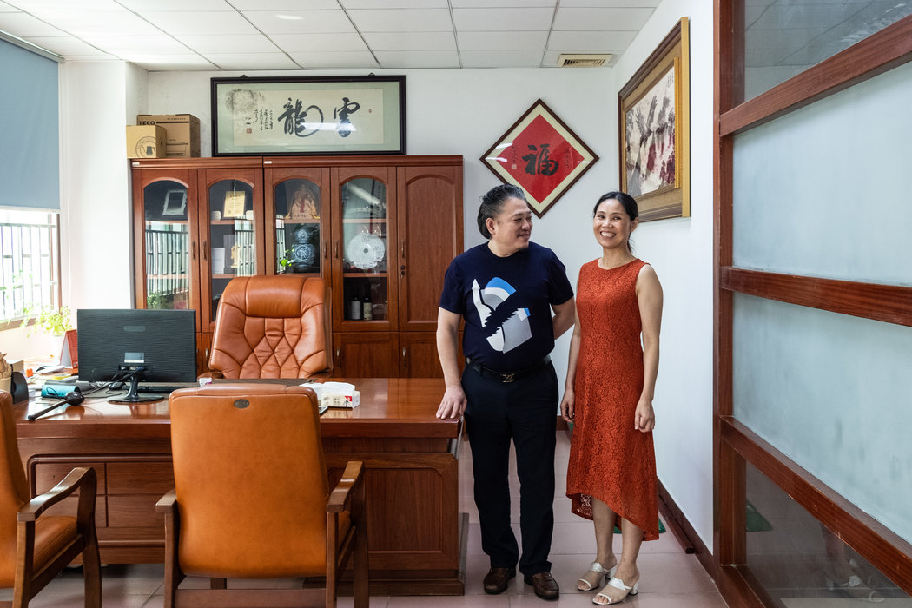
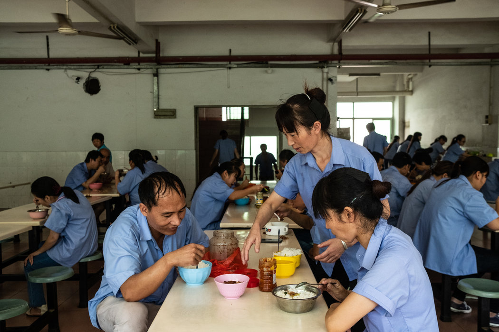
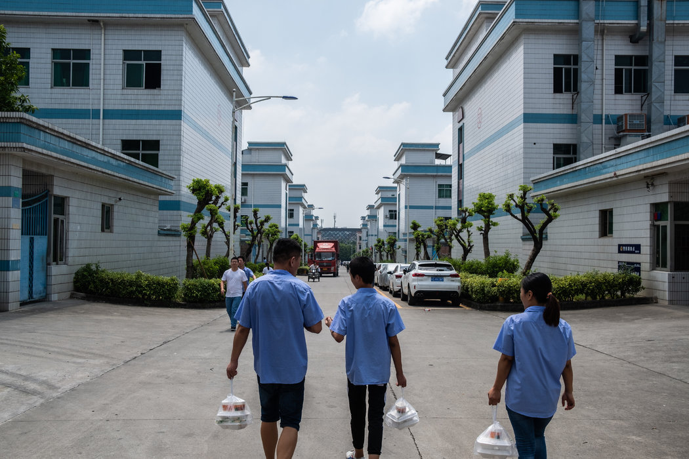

# 经济转型洪流下，奋力求生的中国企业家 - 纽约时报中文网

新新世界 袁莉

2019年1月23日

邵春友和妻子余友福在中国东莞的工厂里。30年前，邵春友来到中国南方时虽然贫穷，但雄心勃勃。如今，他已经是一名成功的工厂老板。 Lam Yik Fei for The New York Times

邵春友（音）是中国梦的体现。随着中国从一个经济落后的国家一跃成为世界第二大经济体，他的地位也在30年的时间里从一名装配线工人上升到一家电子器件企业的老板。他现在拥有两家工厂，雇佣了2000多名工人。

现在，随着中国的转变，邵春友也必须重新打造自己。

快速的增长正在放缓。竞争加剧了。在这个时而被称为世界工厂的国家，现在有时好像没人想在工厂工作了。

“那时候工人多，工厂少，”邵春友说起以前的日子。“现在我们还得求人工作。”

的确，中国的[经济正在放缓](https://www.nytimes.com/2019/01/20/business/china-economy-gdp-fourth-quarter.html)，而且，政府的政策也让[很多人的生意更难做](https://www.nytimes.com/2018/10/03/business/china-economy-private-enterprise.html)。但是，也有更大、更广泛的力量在邵先生这样的企业家面临的挑战中起作用，他们[曾经帮助中国摆脱贫困](https://www.nytimes.com/zh-hans/interactive/2018/11/25/world/asia/china-economy-strategy.html "Link: https://www.nytimes.com/zh-hans/interactive/2018/11/25/world/asia/china-economy-strategy.html")。

中国已走在价值链的上游，中国人民也同国家一起往高处走。他们想得到更高的工资和更好的生活。中国不再是[世界的廉价工厂](https://cn.nytimes.com/technology/20180705/made-in-china-2025-dongguan/)。

如果中国想保持稳步增长的话，就必须追求高附加值的制造业、自动化和创新。能否成功取决于邵春友这样的人转变自己的传统商业模式的能力。

邵春友的转型既不容易，也不会少花钱。他正在用机器人来取代劳动力。他正在制造的更复杂的电子产品，可能会让模仿者一头雾水，但如果失败的话，代价也可能极为昂贵。而对这位以独自创业为荣的商人来说，他也不得不改变做法，第一次接受了政府的直接帮助。

“做生意就像射箭，”邵春友的妻子余友福（音）说。“射出去就收不回来。”所有的人都叫邵春友“老板”，连他的妻子也不例外。邵春友身体发胖，有一头堪与美国总统相比的头发，他的电子器件公司名为全康（音）。余友福身材苗条，做事热心，她负责工厂的运营、财务和行政管理。他们27岁的儿子邵强（音）是全康新成立的研发部门负责人。公司传统上为智能手机和其他电子产品制造零部件，不过它现在已把眼光放得更高。

这个家庭与他们的工厂是分不开的。多年来，夫妻俩一直睡在工厂旁边的办公室里，如今余有福仍时不时地在办公室过夜，尽管他们宽敞的公寓距离工厂只有15分钟的车程。

“我在机器的噪音中睡得更好，”她说。“如果听得见声音，就说明它们还在运转。”

邵春友是在中国内陆的中型城市九江出生的。他16岁时当上了一名木工学徒，每天挣四块钱，勉强糊口。

1989年，也就是当局用武力镇压了天安门广场抗议者的那年，时年20岁的邵春友去了南方。当时的中国最高领导人邓小平已在深圳和珠海等南方城市设立了经济特区——也就是允许企业家创业和吸引外国投资者的地方。特区新建的工厂正在招工。

邵春友离开家时口袋里只有不到40块钱。中国那时候也不像现在，还没有纵横交错的高速公路和高铁。他需要先坐一个小时的长途汽车到省会，然后再坐15个小时的火车到深圳。

“火车里总是挤满了人，就像运猪一样，”他说。

找工作并不容易，如果找不到，邵春友就不能获得在深圳生活的许可。每当当局来宿舍搜查非法居住者时，他和其他人都会躲在附近的墓地里过夜。

他终于找到了一份当学徒的工作，每天的收入只有几块钱。加班能让他每小时多挣几毛钱。

三年内，他被提升为主管，每月大约挣2500元。余有福也是九江人，她带着当时只有两个月大的邵强来到深圳，和邵春友一起生活。

“我每天从早上8点一直工作到晚上11点，甚至直到半夜，”邵春友说。“我们都想挣加班费。没人有怨言。”2004年，邵春友在上班的同时，开办了一家小型金属模具公司。余友福负责联系客户，管理账务。他们给公司起名“全康”，意思是“一切健康”或“一切都好”。他们把儿子送回老家，交给爷爷奶奶抚养，中国的许多农民工都是这样做的。两年后，他们从深圳搬到了附近的东莞，那里有更便宜的厂房。

政府和国有银行通常不帮助邵春友和余友福这样的小企业主，开始的时候，他们遇到过很多困难。他们拒绝过一个大客户的订单，因为没有足够现金去购买所需的材料。为了赢得另一个客户，他们租了一台大型金属加工机床，连夜搬进他们的工厂，以便向上午来访的客户展示他们有能力做这项工作。他们得到了订单。

工人们在工厂食堂吃午饭。和大多数工厂老板一样，邵春友为全康的工人提供食宿。 Lam Yik Fei for The New York Times

他们先是制造MP3播放器的金属部件，然后是手机外壳。他们用攒出来的9万元买了一台抛光机，这在当时对大多数中国人来说是一大笔钱。

“我心里非常害怕，”邵春友说。“如果失败了，我们就什么都没了。”

他们没有失败。在中国经济快速增长的帮助下，他们成了一个庞大供应商网络的一部分，他们也帮助中国主导了电子制造行业。

但是，随着中国经济开始走向成熟，业务也变得更加艰难。竞争对手出现了。价格战变得残酷了。邵春友和余友福发现，他们需要改变做法，否则就活不下去。

2015年，随着智能手机销量的飙升，夫妻俩开始与小米和华为等中国制造商合作，为它们的耳机制造关键的金属部件。他们借了好几百万的贷款，投资了120台加工机床。他们下的赌注得到了回报，直到竞争再次变得异常激烈，这让他们开始考虑制造更难复制的产品，比如家用电器。

“在中国，一旦你的产品能卖出好价钱，很多公司就会一拥而上，生产同样的产品，”邵春友说。

这对夫妇和其他许多中国制造商面临的最大问题是劳动力成本不断上升，劳动力日益稀缺。

2004年，邵春友和余友福每月发给员工的工资大约是1000元人民币，按当前汇率约合150美元。现在的工资至少是那时的5倍，甚至可能高达8倍。

全康和大多数工厂一样为员工提供食宿。公司支付的社会福利过去有四种，而现在是六种。

夫妻俩知道，他们的工厂能存活到今天是幸运的。金融危机后，东莞的许多跨国制造商都把工厂迁到了越南等劳动力成本更低的国家。夫妻俩的许多朋友和竞争对手的工厂都关了门。

最近一次吃午饭时，余友福告诉丈夫，附近一家电子元件工厂刚刚申请了破产，这家工厂在全盛时期曾雇用了7000名工人，她边说边摇头。

2017年，他们想出了一个雄心勃勃的生存计划：迁址，向价值链的高端转移，实现自动化。全康目前正与小米合作，设计制造室内加热器、电风扇等智能家电。邵先生和余女士打算建造三条全自动的装配线。第一条预计将在3月份开始运行。

全康正在接受政府的直接支持，对公司来说这是首次。邵春友的现代化工程将远离东莞，发生在邻省湖南的30万平方米的土地上。延陵县政府几乎免费把土地提供给了全康。邵春友说，当地地方政府对税收和创造就业机会的兴趣，比得到卖地收入的兴趣更大。迄今，他已在湖南的工厂投资了近8000万元。

中国的经济增长是在共产党解放了中国企业家，基本上不去管他们后开始的。下一步的增长可能不会这么容易。为了帮助实现经济转型，中央政府正在为制造业升级投入巨额资金。欠发达省份的地方官员们正试图吸引企业来当地复制中国南方的经济奇迹。

在东莞的邵家工厂，工人们正走向宿舍。 Lam Yik Fei for The New York Times

这种做法已证明对邵春友和余友福这样的创业者很有吸引力，他们迫切希望找到生存和发展的新商机。

“我们工厂的生意不如以前那么好了，”余友福说。“但既然我们是干这行的，就得一直往前走，因为身后是悬崖。后退一步就会掉下去。”

翻译：Cindy Hao

[点击查看本文英文版。](https://www.nytimes.com/2019/01/21/technology/china-economy-manufacturing-labor-costs.html)

------

原网址: [访问](https://cn.nytimes.com/technology/20190123/china-economy-manufacturing-labor-costs/?utm_source=tw-nytimeschinese&utm_medium=social&utm_campaign=cur)

创建于: 2019-01-23 16:51:22