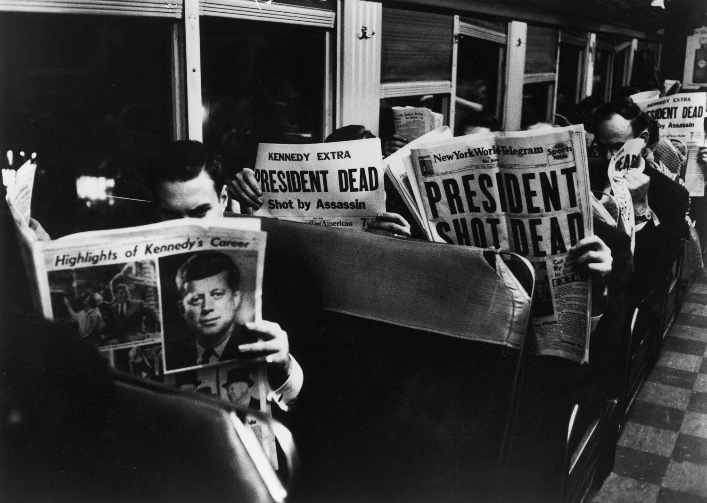
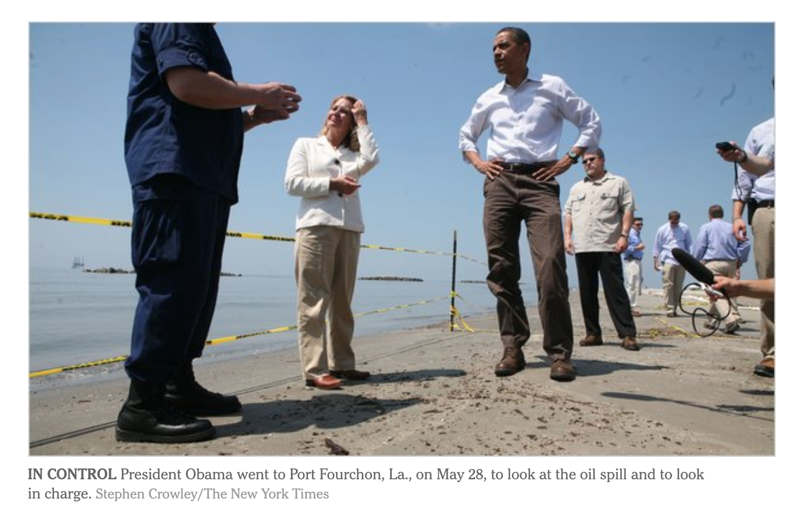

# 现代新闻之愚蠢 (2) — 四种最致命的倾向性 – iYouPort – Medium

## 中国人更可怜

[iYouPort](https://medium.com/@iyouport)

Jan 23 2019

> 我们对捍卫新闻自由、守护记者安全的大原则永远不会改变。本系列文章说的是另一码事，即 如何让新闻依旧是新闻、依旧是民主支柱的问题。因为现在它不是。尤其是当下的中国信息消费者，还从来没有品尝过真正新闻的强大力量，现代“新闻”的愚蠢将更加难以被甄别

如果您还没有读过 (1) [在这里看到](https://medium.com/@iyouport/media-1-10a6469a5463)。

民主对公共信息质量的期望一直很高，也应该很高。我们中很多人都在历史书上读到过有关媒体从业人员捍卫真相和言论自由的英雄故事，他们的名字被篆刻在新闻自由的丰碑上。

全世界都知道，正是地下出版物的政治言论和反对《印花税法案》的抗争最终引发了美国独立战争，而曾格案给人们带来的“事实并非诽谤”的警示历经岁月洗礼，至今仍然掷地有声 — — 1735年，纽约出版商 John Peter Zenger 因发表了抨击英国总督的文章而受审，代理律师进行了成功的辩护，此案被认为是美国新闻自由的奠基。

那些名垂青史的新闻从业者的目标崇高而坚定：为了人民能够享有准确、清晰、独立、具有批判性、启迪心智的政治新闻报道。但如果曾格生活在现在，他很可能会怅然若失。

很多人读过《1984》，也知道 George Orwell 曾经是记者；同样有很多人看过热门电视剧《黑镜》，也了解其编剧 Charlie Brooker 是记者出身。同样是反乌托邦作品，同样是新闻出身的创作者，但是你能清楚地体会到这两位作者有着截然不同的素材处理方式，**这两部作品的手法基本能代表真正的新闻和现代“新闻”最根本性的区别**。

不管你喜不喜欢，今天的“新闻”已经变成了批量生产的大众消费品，与历史书中的新闻的定义相去甚远了。从电报到卫星、再到数码相机、互联网，通信技术一直在不断发展，而技术进步与媒体公司利益驱动的互相作用创造出一种最普通的、迎合大众、平衡各方利益的信息模式。

**为什么公共信息已经越来越难以促进民主事业的发展？正是因为四种深度的倾向性**。

**I 个人化**

如果说如今的“新闻”有什么致命性的问题，那就是，整个传媒界都弥漫着一种势不可挡的趋势 — — 即 将所有重大的社会、经济、政治问题，简单化、表面化，**从个人体验、人生悲剧以及成败输赢的层面进行报道**。

出现这种现象的原因有很多，有些时候是因为记者担心调查性报道会让受众望而生畏，有时是因为记者觉得相对来说，从人情味角度入手比深入剖析来龙去脉更容易一些。不论关注对象是英雄还是受害者、或者无赖、罪犯，**媒体对个人化、人情味新闻的偏爱都造成了“只见树木不见森林”的信息倾向性，公众很难透过挤在媒体镜头前的众多“演员”看清新闻事件的全貌 — — 或者准确说是体制问题**。

如果人情味报道方式能把观众引到对问题的严肃分析上来，那么也就不会那么令人担忧了。自古希腊以来，几乎所有伟大的文学作品或戏剧都是通过塑造富有感染力的人物形象来唤起受众的认同和反应，并依此促成对重大道德和社会问题的思考。

但是，现代“新闻”停留在个人故事发展层面，即使事件本身蕴含什么深层次的经验教训和需要进行反思的社会意义，那也只是留给公众自己去想象。

因此，个人化新闻的主要问题在于，**没有**把对个人的关注与新闻事件更深层次的背景分析联系起来。英国戴安娜王妃去世的新闻炒作中，有的报道甚至使用了这样的句子“她就是我们每个人的映射”，完全不知所云的程式化语言就被算作是新闻分析了。

类似的例子比比皆是，整个新闻界充满着这种体制性的倾向。中国读者对这类报道和名人炒作再熟悉不过了，我们后面的文章还会有深度分析。

**II 戏剧化**

“新闻“最愿意突出表现的就是能被戏剧化处理成简单故事的那些元素，而相比之下，分析性的新闻、政治辩论、或科普类的报告却很少出现。记者最擅长的是讲故事。既然是在讲故事，那必然就需要戏剧化，尤其是故事的中心线，应展示个性鲜明的演员。

**戏剧化的新闻重危机而轻常态，重现在而轻过去和未来，关注中心人物之间的冲突或关系**。新闻戏剧将复杂的政令、政府机构运作以及新闻事件中心人物背后的权利问题等等公民必需知晓的东西都简单化处理了。对这个时代的痼疾 — — 不平等、饥馑、能源危机、人口压力、环境恶化、有毒废物、政治压迫等问题，**严重缺乏持续的关注和分析**。

下图中描述了两个被简化到失真的概念：

虽然我们面临的问题非常严重，但从日常角度上看，**如果其戏剧性冲突不够，那么就无法构成新闻**，除非有突发的危机出现，满足了“权威-失序”叙事结构的条件，新闻才会予以关注。这是个死穴。

应该有很多人有过这样的体验，自己认为非常重大的事件和经历无法引起媒体的兴趣，已经有人开始奇怪为什么主流媒体对马云、王健林的兴趣如此之大，却对民间受难者漠不关心，除了上篇文章中介绍的原因之外，戏剧性是另一个主要原因。

- 我们在短篇文章《如何才能引发媒体关注》中介绍了一些活动家如何与媒体合作的技巧。

对媒体来说，危机是最好的新闻素材，因为只有危机才符合新闻戏剧性的要求。“危机周期”是精彩纷呈的，人物形象鲜明，情节跌宕起伏，最后总能在人为努力或人道主义援助下戏剧般地结束。看起来一切都是那么美。

但是，要知道，新闻所展现的危机周期只不过强化了人们的一种普遍共识：人类所面临的巨大困难是无法避免的，因此也是可以接受的。当“困境”可以掌控的时候，危机就算解决了，虽然深层次的问题仍在持续不断加剧。

我们没有仔细研究中国媒体的报道方式以及对“周期”的处理，鉴于中国媒体和美国主流媒体合作的长期性及[接受后者培训](https://twitter.com/DonEvansWm/status/1077898579941961728)的事实，想必在模式上区别不大。在读者的角度上，这种报道会造成一种**错误印象**，即 国家/政府总是能化解问题，甚至“依赖国家/政府是最佳选择”。事实上国家/政府并非解决问题的方案，正相反，很多问题都是他们造成的。

- 更多见我们的中国年大礼包：国家是问题的一部分，而不是解决问题的方法《[墨西哥：抵抗运动的火山](https://iyouport.weebly.com/article-series/5)》

必须说，和个人化倾向一样，戏剧化本身也不是彻底的坏事，戏剧可以帮助我们感受历史、科技、政治和人际关系的伟大力量。如果戏剧被用来激发人们思考，那就是有意义的。但是，如果**戏剧只被当作一种廉价的情感规矩，只为表现人的冲突、艰辛、脆弱、或者干脆沦为闹剧，那么新闻原本具有的潜在启迪心智、释疑解惑的作用，就会沦为只能刺激兴奋、愤怒情绪的泡沫剧，更加难以动员反抗**。

多媒体时代的到来前所未有地加强了新闻戏剧化的声调，照片、图像和实景视频使新闻具备了更充分的戏剧效果，而民间流传着新的价值观“有图有真相”，但真的是这样吗？我们暂时不谈视觉效果造假的危害性以及它已经变得多么的便利，可参加这篇报告《[当恶意者掌握技术：信息战的未来究竟有多可怕？](https://medium.com/@iyouport/informationwar-115c07f0f8b0)》

的确在很多情况下特别是电视新闻领域，画面能够帮助记者、编辑决定哪些事件值得进行报道，以及如何报道，在新闻制作过程中强调视觉效果也无可厚非。

但是，确实存在这样的问题：一些重要的新闻只是由于画面难以拍摄而没能被报道；而**一些无关紧要的事件**只不过因为视觉效果完美，就变成了新闻。简单说就是，善于表演的人才能最终胜出 — 在各种方面。

反过来这便促成了一种新的政治形式：景观政治。

我们强调过，政治是媒体的政治，任何媒体时代的伟大政治家，特别是颠覆性的暴发户，都是媒体的娴熟采用者。其实一直以来都是如此，

当年不为人知的亚伯拉罕·林肯和斯蒂芬·道格拉斯之间的辩论在他们那个时代引起了媒体的轰动，被广泛报道，并为林肯两年后突然升入白宫铺平了道路；肯尼迪/尼克松在1960年的电视辩论中，一个年轻而喜气洋洋的肯尼迪很容易压倒一个阴沉的连胡子都没刮干净的尼克松，如今，这类关于电视的政治影响的案例研究几乎铺天盖地。特朗普是一个真正的电视明星，他能主宰有线电视新闻，同时可以通过 Twitter 让世界陷入停滞的焦虑状态。这就是为什么他能一直占据新闻头条。

在最近出版的一本书《The Revolt of the Public 》中，Martin Gurri 提出，社交媒体的最终腐蚀作用正在破坏政府或新闻界等公共机构的整体信誉。

我们曾经在《中国政府已攀上[景观政治的边缘](https://pao-pao.net/article/885)》和《[互联网时代：并非心理学意义上的自恋文化](https://pao-pao.net/article/919)》中介绍过这一问题；再推荐一本书，法国思想家 Guy-Ernest Debord 的《景观社会》 （法语：La Société du spectacle）这本书出版于1967年，准确地预测到了如今这个表演者的世界。

这就是为什么新闻越来越难以服务于民主。[**新闻媒体对我们日益恶化但却富有娱乐性的政治局势做出了贡献**](https://www.counterpunch.org/2018/12/27/selling-fear-and-amusement-news-as-entertainment/)。特朗普先生是总统，部分原因就是因为他很有娱乐性。对电视新闻的研究表明，**恐惧政治的推广是娱乐和耸人听闻的报道的副产品，它能很好地创建收视率。**

当代新闻实践越来越多地融入了提供视觉和图像的新信息技术，特别是便携式相机和智能手机的兴起。大多数美国电视新闻的娱乐形式促进了视频或其他视觉效果的使用，这些视觉效果具有戏剧性、冲突性和情感性。屏幕图像主导广播新闻以及社交媒体。对许多地方，国家和国际新闻报道的调查揭示了我们当前的“新闻代码”如何运作。基本上这是个视觉的时代。**尽管意图可能是使用视觉效果来讲述某些故事，但使用的逻辑相当于讲述有关手头视觉的故事 — — 能满足那种格式标准的事件更容易被广播**。

过去40年的研究表明，政治家、以及其他能提供视觉事件或**具有表演型人格**的人更有可能被新闻报道选中。我们已经记录了这种格式驱动的媒体报道对体育、新闻、政治、教育和宗教等社会机构产生的深远影响。

当代新闻实践延续了这一趋势。事实上，即使是著名的晚间网络新闻节目也采用了这种方法，特别是当社交媒体提供了看似无处不在的大量活动视频时，其中许多都发布在 Facebook，YouTube，Instagram 等上。随着新闻广播寻求更高的收视率，他们已经调整了他们对新闻项目的选择，包括在互联网和社交媒体上已经被观看过或已经病毒式传播的视觉内容，这应该不足为奇。

但这对于分配宝贵的新闻时间来说具有重要的影响，这些新闻时间会影响受众在国内和国际事务中能否获得重要的知情权。例如，在2018年12月11日，收视率领导者 NBC 晚间新闻（该新闻有46年的历史）选择将超过40％的重点新闻全部分配给了主要由可用视频驱动的内容。十五个新闻中有六个**仅仅是因视觉材料**而受到报道的。简要总结一下这些：

1.第二个报道持续了3分钟：这是特朗普与民主党领导人南希佩洛西和查克舒默在镜头前会面的视频，总统威胁要关闭政府，如果他没有得到50亿美元的资金修边界墙的话。完全是镜头效果，可以更简要地总结一下。 （ABC和CBS也有同样的内容）。

2.第7个报道持续了1:25：包括纽约警方强行将婴儿从母亲的怀抱中抢走的视频。这个视频也已在之前的新闻广播中展示过。针对该女子的指控目前已被撤销。一名官员说，这不是好警察办的事。

3.第12个报道持续了1:25：包括一个男人的视频，他在帮助一名在航空公司航班上癫痫发作的妇女。善良的撒玛利亚人也接受了采访。飞机上的两名医生说，没有理由中止飞行，在目的地可以获得更多帮助。**事实上很可能有数百个飞行中出现过类似的医疗紧急情况，而且更多的不会被报道，因为没视频**。 （CBS报告持续1:30）。

4\. 第13个消息持续时间：15秒：一个年轻人攀在公交车尾部的视频，被描述为冒险，并不是一个‘可以不买票的好主意’。没有任何新闻报道。

5.第14个报道持续了1:25：包括纽约警方的智能摄像机视频，敦促并协助人们从起火的建筑物中逃出来。粗糙的图像效果非常引人注目。

6.第15个报道持续1:15：作为“激励美国”版块的一部分（就像“感动中国”，一个意思），偏瘫的男子在钢铁支架的帮助下走上一个舞台，在佛罗里达国际大学获得文凭。如果没有视频的话，这应该是一个感觉不错的故事。

总计花了将近八分半钟的有问题的新闻报道，优先于其他所有国家和国际消息。更具有讽刺意味的是，**当狂热分子把新闻业视为‘fakenews’时，NBC 像其他网络一样，拼命地哄观众开心，而不是为公民提供有价值的信息**。

这方面的分析我们也做过：媒介即思维，娱乐至死的社交媒体时代已经将新闻改造成了大舞台，甚至包括老牌 NBC 这样的严肃时政新闻，也没能侥幸避免。这并不是近几年才有的现象 — — 它一直在不断增强的状态下。

讽刺现代新闻的无聊和娱乐至死，已经成为美国社会的一种亚文化，其中，IYP认为最精确、且最深入的讽刺是美国著名小说家 Don DeLillo 的名著《白噪音》，这本书有中文版，想必中国读者中很多人已经熟悉，您会理解我为什么要推荐它。

**III 碎片化**

这是第三种最为严重的倾向：即 新闻故事之间以及新闻故事与宏大的新闻背景之间彼此孤立，缺乏联系，于是新闻中的信息就变得非常琐碎，很难形成一幅整体画卷。

这样的新闻是无法促进社会动员以形成反抗的。我们观察到在中国，由于缺乏独立媒体和NGO权利组织，现代“新闻”的诸多弊端难以被弥补，甚至已经造成了人们误认为存在即合理 — 视主流媒体为“结论”的惊人景象。

这一景象直接造成的是，人们已经无法接触到新闻应有的真正的结论，即 集结斗志动员社会反抗。

比如，人们遭到了当局的迫害，他们最大的追求便是*被媒体报道*，或者准确说是*找媒体伸冤*，**只要媒体报道了这件事，人们就会放心，似乎被报道就是一个结论、似乎“问题已经解决了”，事实上完全没有 — — 你只不过是帮助媒体填补了一个版面。并且，鉴于如今的新闻周期已经变得非常短（只有几天甚至只有几小时）你这个版面很快就会被后面继续出现的“新闻”冲走，这种过眼云烟的“结论”是起不到任何作用的**。

其结果就是，问题看起来层出不穷，媒体总是有话题做，版面是丰富的，然而却没有任何问题被真正的重视，没有任何问题能引发社会变革。人们开始满足于吐槽，忙于吐槽 — 因为太多了几乎吐不过来，整体上很热闹，但任何事都无从解决。

IYP 的热心读者们评论到：

> _“假疫苗,小学校发生的暴力,实验室爆炸, 在中国这种事件甚至是几周都会出现,但是最后都die down..”；“没过几天人们又在说中国真安全了，真是奇怪”；“事件经常出现，又没有实际的解决，带来的还有习以为常的 麻木感”……_

非常正确！这就是关键所在。

对中国来说更糟糕的是，党管媒体的概念已经深入人心，人们不再信任中国本土媒体，但却由于不了解什么才是真正的新闻，从而错误地信任了所谓的外媒。**中国公民在谈起“外媒”时所指的从来都是美国主流媒体，而不是独立媒体** — 海外独立媒体由于经费紧张、资源极为有限，他们往往高度本土化，而难以关注其他国家的问题 — 于是中国公民唯一可能期待到的只是被主流媒体报道一下，就像隔着厚重的玻璃窗来一个亲吻，然后稍纵即逝。

**造成新闻碎片化的根源在于过分强调新闻中的人物个体，而忽略人物所处的政治背景。戏剧化的报道模式又使新闻事业变得更加孤立**。另外，由于担心信息量过大让人厌烦，所以媒体对刊播版面或播出时间均作出了严格的限制。这些现象都进一步加剧了信息的碎片化。

结果，新闻往往以一种一知半解的、戏剧化的压缩饼干形式呈现在所有人面前，使我们难以看清问题的根源、历史意义、或者与其他问题之间的重要的相关性。

加上媒体经常被他们的受众牵着鼻子走，为了挽留受众的眼球，而不是基于对事件的独立调查写出报道，受众要搞清楚某件事的来龙去脉是非常难的。没有人能知道自己不知道什么。

并且，新闻媒体不能提供历史背景，很少解释事情发生的原委，报道整体给人留下的印象就是：这个世界一片混乱，危机四伏，不知道什么时候危机就出现了，然后不知道什么时候又“消失”了。事实上一切都没有消失，只是媒体宣布了一个又一个表面化的伪装。

**IV “权威-失序”倾向性**

“权威-失序“是一个不断轮回的圆圈，更准确的描述是”权威-失序-权威“。中国读者应该在这方面有非常的体会。但是由于中国的新闻体制是执政党主持的，于是人们有可能误会这种状况是执政党“特征”。事实上**不是**，它是现代“新闻”本身的弊端之一。

不管这个世界是否恢复了安全和正常，甚至不管“一个正常的世界”这种想法本身就值得怀疑，都无法否认，新闻最关注的是秩序，以及与之相关的话题，比如当权者能否建立或恢复秩序？

为什么这些泛泛的新闻结构会成为“新闻”的中心？答案显而易见：因为它们能构成各种各样的、取之不尽用之不竭的主题，永无止境的融入个人化、戏剧化、碎片化的新闻情节中。

政治学家 Edelman 说，一个经典的政治场景就是，当权者站在讲坛中央，充满感情地承诺，“危机将得到有效处理” — — 很多时候危机就是他挑起来的。

现如今当权者依旧在认真扮演自己的角色，但媒体对官方的声明和秩序稳定的推论越来越不买账了（虽然在中国依旧买账），当然“恢复正常秩序”的报道依旧会时不时出现，但更多的新闻笔墨会集中在那些没有同情心、工于心计的政治人物身上。再次进入上述的“个人化”。

在中国由于苛刻且愚蠢的新闻管制，也许人们会认为批评领导人“是一种勇气”，事实上，即便“换届”也并不能保证解决问题，因为根本性问题一直没有被准确清晰地呈现出来。

不管新闻事件本身是否符合“权威-失序”的情节模式，媒体都能想办法让它符合，这很容易办到。最经典的剧情是墨西哥湾漏油事件（不仅是新闻专业课重点案例，而且被搬上了很多影视节目），虽然说漏油不是奥巴马的责任，但他很快被成为了新闻焦点，所有人都在关心他能不能掌控局势。主流媒体发布的图文[高度聚焦在他一个人身上](https://www.nytimes.com/2010/06/06/weekinreview/06bai.html)，纽约时报的照片就是奥巴马站在海滩上和工人聊天，该照片的题目就叫《掌控之中》👇

这也许就是高度信任美国主流媒体的中国读者为什么具有如此高的权威依赖心理？不好说，但现代“新闻”的确如此，一贯如此。这种思考方式是无法动员反抗的。

下篇文章将**更深层次剖析**这些问题。因为我们只有深入了解这些问题，才能明白该怎么做以挽回政治参与、社会反抗意识和捍卫民主的关键效用。⚫️

— — 未完待续 — —

**_感谢帮助 iYouPort！_**

**_PayPal 捐赠渠道已开通_** [**_https://paypal.me/iyouport_**](https://paypal.me/iyouport)

------

原网址: [访问](https://medium.com/@iyouport/media-2-bf607b4d487)

创建于: 2019-01-24 21:33:47