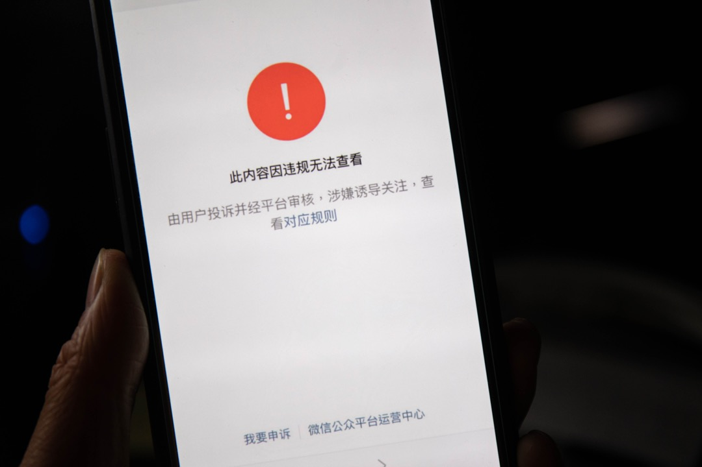
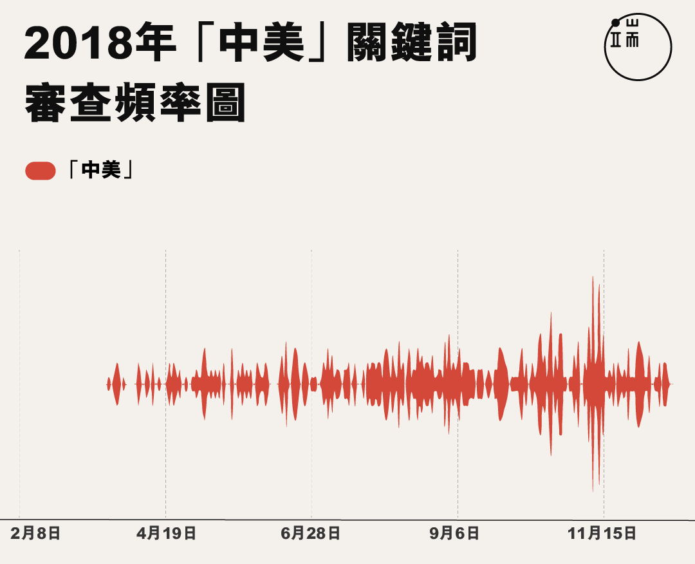
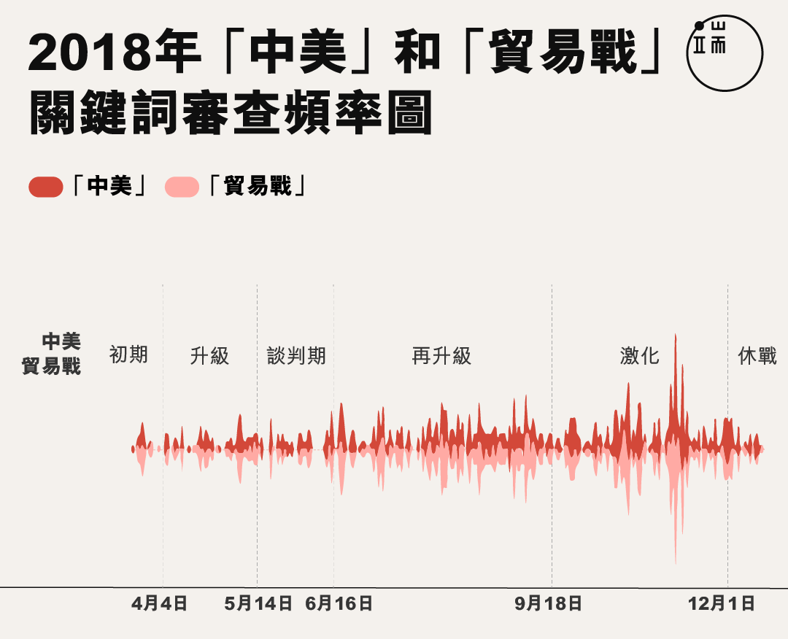
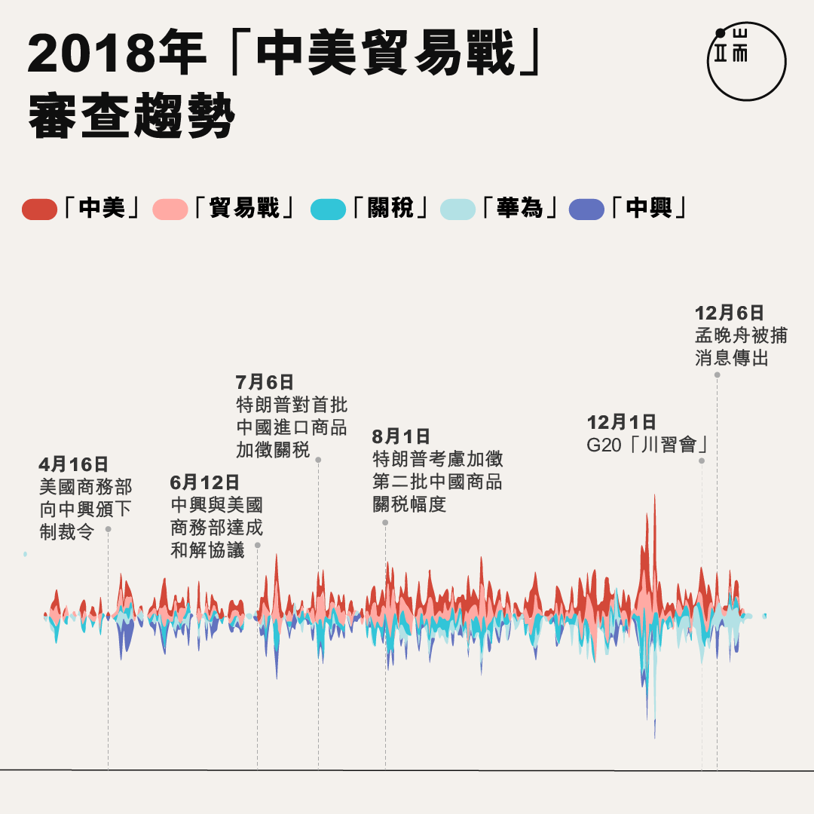
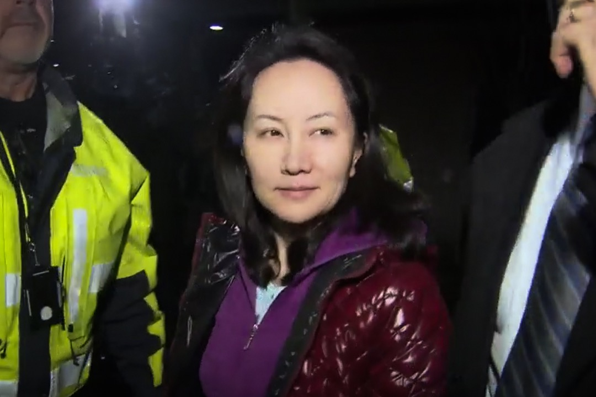
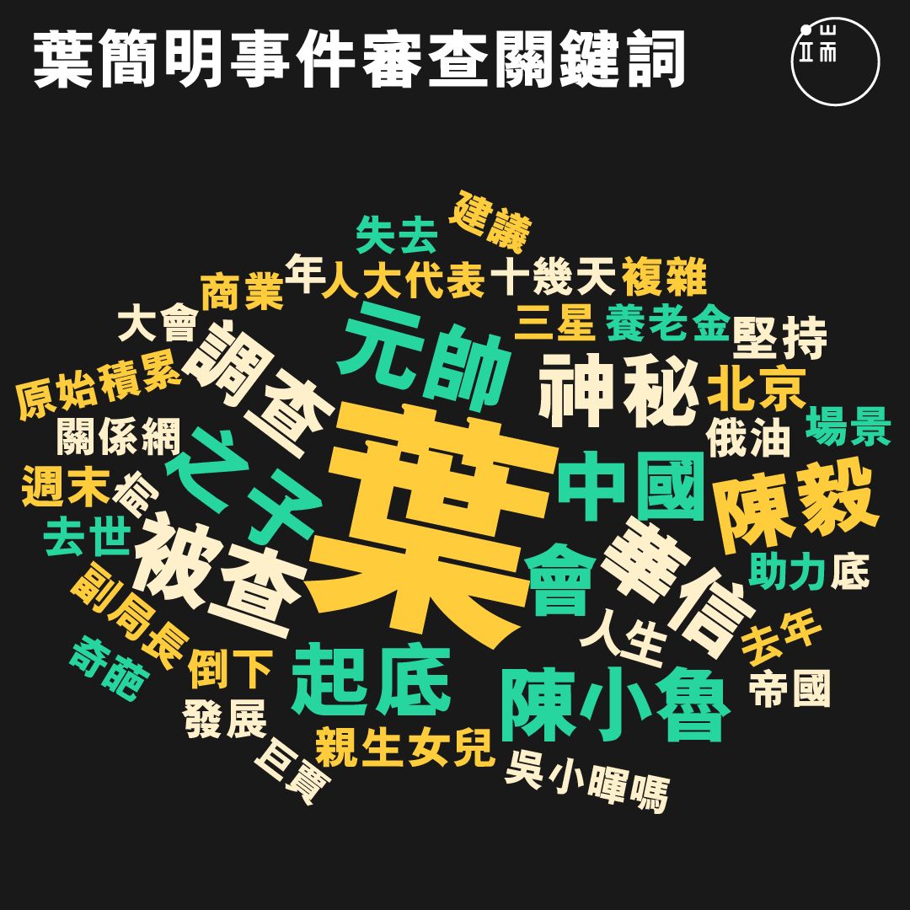
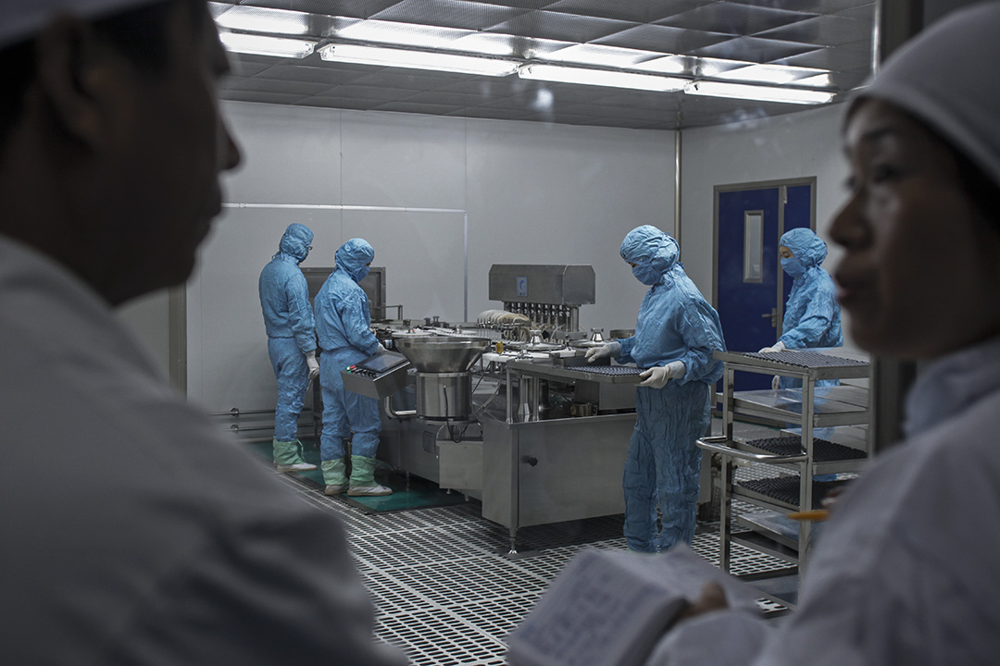
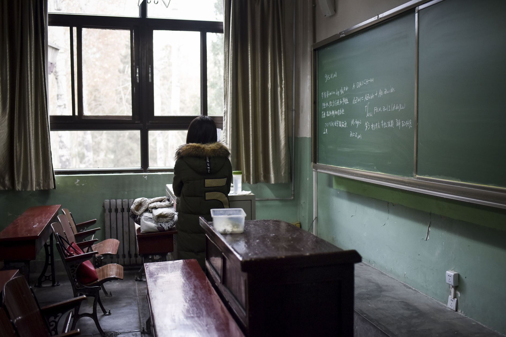
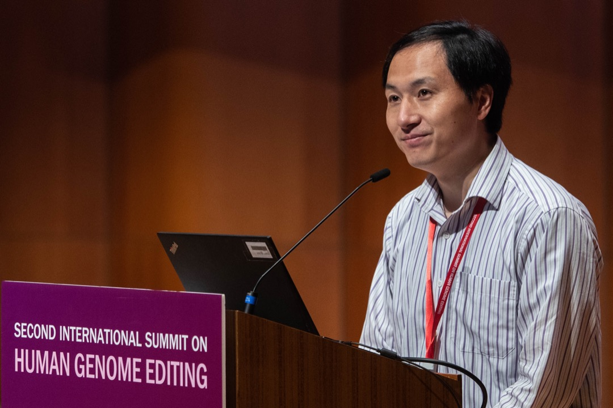
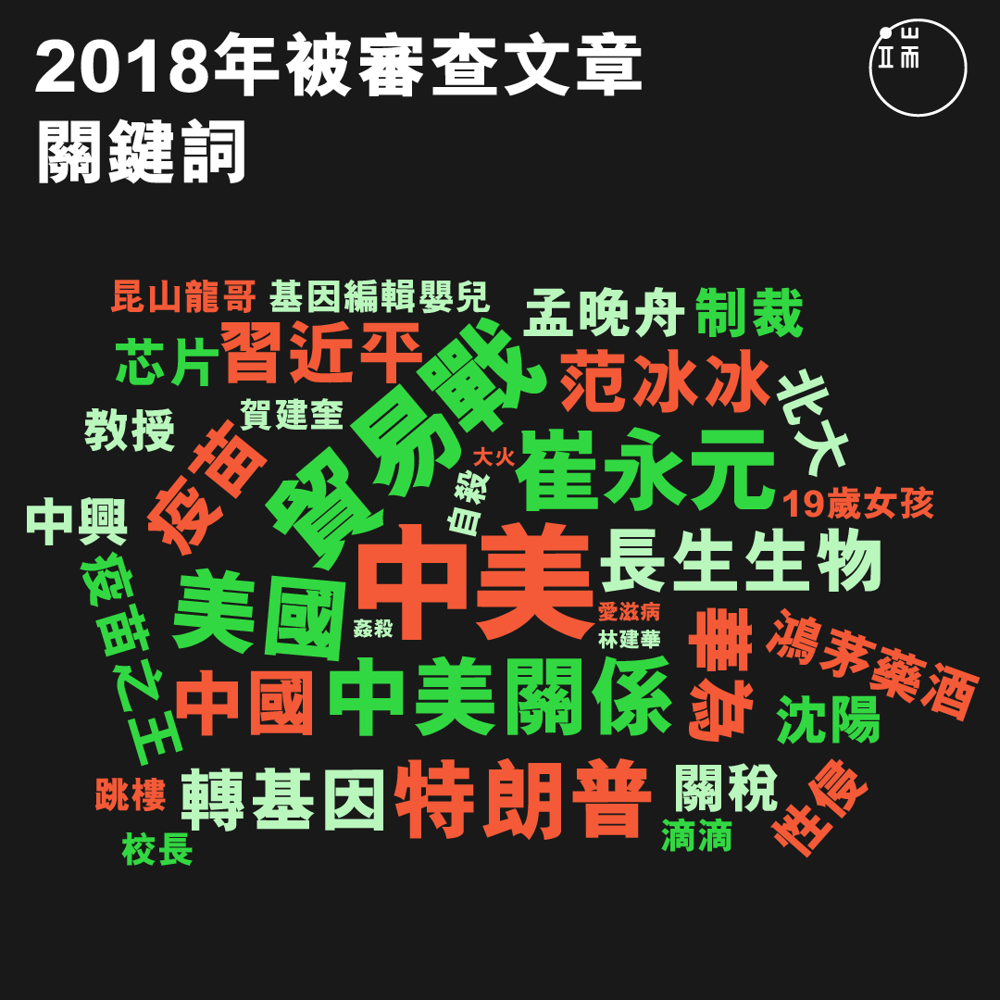

# 審查面紗下的大國形象：2018年被微信刪掉的十條新聞 - 端傳媒

[深度](https://theinitium.com/channel/feature/)媒體觀察

> 2018年，中國網絡審查最敏感最無法觸碰的，已經不僅僅在「政治敏感」上——中國網絡審查的目光開始轉向與「大國形象」相關的內容。

港大Wechatscope團隊 王邦正 樊豫颯2019-01-03

------

2018年，中國網絡審查最敏感最無法觸碰的，已經不僅僅在「政治敏感」上——中國網絡審查的目光開始轉向與「大國形象」相關的內容。去年，微信成為官方最嚴格審查的陣地之一。 攝：端傳媒攝影部

回看2018年，中美貿易戰持續燃燒，中國國內接二連三發生社會事件：鴻茅藥酒風波、黑心疫苗和范冰冰陰陽合同等商業醜聞，繼而此起彼落的中國 #Metoo 平權浪潮、DNA 編輯嬰兒倫理風暴，令中國成為國際舞台上鎂光燈追逐的焦點。

去年，微信成為官方最嚴格審查的陣地之一。微信擁有國內最龐大和廣泛的用戶，集合豐富多樣的功能 ，高度滲透用戶的生活。不單一般市民有個人微信，內地幾乎所有政府部門、公私營機構、地方團體和個人作者，都會開設微信公眾號發表公開文章，進入具公共性的自媒體環境。個人用戶與公眾號互動日趨緊密，形成了一個微信生態圈，能夠充分展示當今中國網民的「眾生相」——或許可稱為「圍觀2.0」——也使得微信平台成為官方審查的重點對象。

香港大學新聞及傳媒研究中心的[WeChatscope](http://wechatscope.jmsc.hku.hk/) 團隊，2018年透過電腦系統每天追蹤超過4000個、內容涉及社會及新聞議題的公眾號，共收錄了超過104萬篇文章，當中約11000篇被審查系統刪除。現在，我們與讀者重温中國2018年的圍觀2.0，一同從大數據中，回顧去年在微信公眾號審查面紗下的十件中國大事。

**（作者註：公眾可在[WeChatscope的網頁](http://wechatscope.jmsc.hku.hk/)，透過輸入詞彙和分類搜索，閱讀微信公眾號已被刪除的文章。）**

## 收聲——言論自由風雨飄搖

根據微信官方數據，微信現時每月活躍帳戶達到10.82億，公眾號的註冊總量超過2000萬個，由微信帶動的消費總額達2097億人民幣。然而，龐大的用戶群和影響力並未為公眾號帶來更大的自由和話語權，反而挑起中共言論監查機關更嚴格的整肅。2018年，微信公眾號，從冬天走向了寒冬。

2月10日，[微信官方公告](https://mp.weixin.qq.com/s/rRFehDRsISdimgjoiyrwpQ)，個人可註冊公眾號的數量由5個縮減為2個，企業可註冊數量由50個降至5個。

2月至3月，新註冊公眾號取消留言功能，[騰訊稱收緊權限是「響應主管部門要求」](https://www.thepaper.cn/newsDetail_forward_2025601)。

10月20日，[國家網信辦指](http://www.cac.gov.cn/2018-11/12/c_1123702179.htm)自媒體存在「謠言、營銷、洗稿等亂象」，陸續將超過9,800個自媒體賬號關閉。

11月，中國官媒猛烈批評自媒體亂象，提倡嚴處違法違規賬號。

11月12日，[微信公布](https://mp.weixin.qq.com/s/gE9ERPdp8WiVmb4nZwn0iA)，自年初以來，共封禁及處理38761個色情暴力類賬號，刪文60919篇；封禁及處理115540個低俗類賬號，刪文174825篇；封禁及處理24822個誇大誤導、標題黨類的賬號，刪文76265篇。

11月16日，[微信再次限制](https://kf.qq.com/faq/120911VrYVrA140428naUJVv.html)個人用戶只可註册1個公眾號，企業用戶只可註册2個公眾號。

12月25日，[網信辦再出招](https://mp.weixin.qq.com/s/qaCnQLmeUeT1hTWUT8rGQg)，針對網絡「八大亂象」，共關閉各平台11萬個自媒體賬號，包括大量微信公號。

## 審查內容：無遠弗屆的審查範疇

**大國形象不能輸**

**1\. 中美貿易戰**

全球矚目的中美貿易戰長達九個月，中美每回短兵相接，都在微信引發輿論譁然。Wechatscope 根據被刪文章的內容做了趨勢圖，發現從2月至12月，「中美」這個關鍵詞基本上每個月都保持相當熱度，可以說是貫穿全年的熱點審查大事。

2018年全年，內容出現「中美」的微信公眾號文章都有被審查。圖：端傳媒設計組

隨後，分析「貿易戰」這關鍵詞。「貿易戰」與「中美」出現規律吻合，引證今年中美關係的重點是以貿易戰為核心。文章被審查的時候，「中美」與「貿易戰」大多同時出現。

以「中美」和「貿易戰」為內容的文章全年均有被刪除。圖：端傳媒設計組

另外，「關稅」一詞亦常出現，反映中美貿易戰的核心是關稅問題。後期，伴隨著摩擦和衝突的演變，被審查的文章多集中在梳理和反思貿易戰始末的類型，此時WeChatscope數據顯示「中興」和 「華為」 等關鍵詞被反覆提及。

內容提及「中美」、「貿易戰」、「關稅」、「華為」和「中興」的文章，全年均有類似被審查的趨勢。圖：端傳媒設計組

幾次審查熱潮都集中在中美雙方交鋒之時。特朗普早於3月22日宣布向從中國進口的600億美元商品徵收關稅，中國商務部隨即反擊，提出向128種美國入口中國的商品徵稅。到 5月，中美雙方曾一度戲劇性暫時停火，並發表聯合聲明尋求和解。不過，事件隨後再度升溫，美方於6月16日公布對華加徵關稅清單，中方緊隨其後作出報復，中國商務部重啟反傾銷調查。

直到2018年7月6日，特朗普政府正式實施對華關稅政策，對價值340億美元的中國商品加徵25%關稅。中國商務部發表對美國違反世貿規則的控訴聲明。及至最近的2018年12月1日G20峰會上，兩國領導人終於同意90日的停戰談判期。每一個關鍵日子都帶來新一批刪文熱潮，在中美關係框架下，審查重點落在對中國叫陣的文章。

**2\. 美國制裁中興**

4月，正處於休戰狀態的貿易戰出現第二回合戰線。16日，美國商務部頒下制裁令，禁止美國企業7年內向中興銷售零件，包括英特爾、高通不能向中興出口芯片。原因是中興早於2012年被美國裁定違反美國出口禁令，卻一直未按照罰則懲處有關員工。

美國宣布禁令之後，微信審查出現高峰，大部份提及「芯片」和「危機」的文章均被刪。事件持續發酵，兩國關係迎上火熱關頭，中興演變成中美談判籌碼，不少輿論提及「中美」和「特朗普」的文章被滅聲。5月9日，美國制裁令中興的業務近乎「休克」，中興宣布所有生產線陷入停頓。不少負面論及中國弱勢的公眾號文章被審查。

5月14日，特朗普表示「會同習近平合作，致力於讓中興恢復營業」，標誌美方對中興的封殺開始鬆動，此時段的被審查文章中，不乏「鹹魚中興」、「美國放了中興一馬」的表述，大大打擊中國大國形象。到5月25日，美商務部擬有條件解除對中興的禁令。輿論轉為討論中美關係博弈，以及對中興等國企發展後勁不足的評論，不少觸及「罰款」、「制度」和「條件」等詞的文章被刪除。7月13日，中興繳納14億美元罰金，美商務部正式解除其出口禁令。中興恢復生產之後，審查的重點開始轉向對此事件的反思，其中言詞激烈、情緒化的文章，較大機會不能留存於微信空間。

2018年12月12日，華為首席財務官孟晚舟獲加拿大法院批准保釋，晚上離開法院時首度現身。身穿紫色外套的她在多人護送下，登上一輛停泊在法院門口的黑色車輛離去。圖：網上截圖

**3\. 華為「公主」在加國被捕**

中美貿易戰好不容易熬到一年將盡，12月1日習近平與特朗普在阿根廷G20峰會共進晚餐，二人交流兩個半小時後，終於敲定中美貿易戰暫時「停火」，開展90日談判期。沒料到在同日，華為副董事長兼首席財務官孟晚舟因涉嫌違反美國對伊朗制裁禁令，在加拿大溫哥華被捕。

12月6日孟被捕消息公開，中方向美加兩國提出嚴正交涉和強烈抗議。四日後，孟晚舟獲加拿大卑詩省法院批准保釋。

孟晚舟突然被捕牽動多方神經，消息在一星期後才公開，瞬間引爆輿論場。孟晚舟被捕之時，正是全球觀望中美戰局的後續動作、判斷貿易戰風向的關鍵時間。究竟孟晚舟被捕純屬商業案件，還是背後涉及政治操作？該案有否與同日發生的知名美國華裔物理學家張首晟自殺、以及三日後荷蘭光刻機巨頭ASML芯片廠大火有關？對此微信公眾號上出現諸多有關中國外交的猜測和謀陰論，引來新一輪審查熱潮。

**經濟犯罪 輿論攻防戰**

**4\. 神秘的葉簡明**

去年3月，葉簡明事件成為微信審查重災區。圖：端傳媒設計組

2018年3月1日，財新網率先披露，華信能源及中華能源基金會主席葉簡明涉嫌經濟犯罪，已遭調查。這位近年以迅雷之勢積極對外擴張商業帝國，對內宣揚家國情懷的商人，背景撲朔迷離，其受查消息一出，隨即令公眾感到非常錯愕。

當日，「財新網」公眾號發出《中國華信葉簡明被查，複雜政商關係網起底》特稿，其他媒體公眾號也爭相報道，惟大部份文章發布一天即被刪除。通過WeChatscope數據庫，我們翻查原文發現「低调」、「神秘」、「政商關係」、「華信」、「石油巨賈」、「起底」等詞語反覆出現。大部份有關葉簡明的被刪文章，都是「此內容因違規無法查看」。

2014年，葉簡明創辦的華信以437億美元營業收入，躋身《財富》雜誌全球500大企業第222位，成為中國最大的非國有能源公司。2017年，華信以91億美元收購俄羅斯石油(Rosneft) 14.16%的股份，成為其第三大股東。此舉旋即引起外界轟動，中國民眾也第一次因為葉簡明帶領中國公司登上國際舞台而自豪。

葉簡明個人非常低調，外界對其起家過程所知不多，甚至其個人簡介中只有僅僅六個字「企業家，慈善家」，並在為數不多的公開場合反覆強調稱「華信是為國家戰略服務的」。但在等候美國法庭宣判的何志平案中，華信能源被指涉嫌提供資金，媒體上也經常提及葉簡明的名字。

**5\. 鴻茅藥酒風波**

2018年1月10日，廣州醫生譚秦東因早前在網上發表題為《中國神酒「鴻茅藥酒」，來自天堂的毒藥》的網帖，質疑鴻茅藥酒含有多種毒性藥材並誇大功效，被內蒙古涼城警方以「損害商品聲譽罪」被捕。

數據顯示，不少微信審查的相關文章均劍指公權的濫用，批判警方淪為包庇地方企業的工具。一些所謂的知情人的爆料文章也遭刪除，例如揭露鴻茅藥酒與央視「國家品牌計劃」的關係。不過，事件即使陷入如此巨大的輿論風暴，民眾對具體銷售內情卻所知甚少。

另外，不少人也關注譚秦東醫生被羈押3個月期間的人身安全。提及「由於被困97天，譚秦東的精神狀態受到影響」、以及「心理治療」相關內容的文章，都被火速刪除。

這次事件被視為地方政府出手為地方支柱企業清理批評者的舉動。由於藥酒集團涉及人數廣泛、利益複雜、證據不明確、公私權限不清等，引起了巨大輿論浪潮。

圖為長生生物工廠。圖：Imagine China

**6\. 長春長生疫苗事件**

2018年7月15日，內地醫藥企業長春長生生物科技涉嫌疫苗造假曝光， 該廠先被揭發狂犬病疫苗數據造假，繼而接連爆出生產劣質百白破疫苗，黑心疫苗幾乎全數流出市場，可能造成嚴重後果。政府迅速立案調查和進行刑事處罰。

黑心疫苗醜聞在輿論場上呈現大起大落的趨勢。早於事件發生前，電影《我不是藥神》已觸發公眾對用藥難、藥品貴的討論。該輿論還在發酵之際，疫苗事件發生。7月21日，微信文章《疫苗之王》一石激起千重浪，詳細揭露長生生物的歷史、幕後人物、侵吞財產及腐敗問題等。

《疫苗之王》廣泛轉載後第二天，就遭到全面刪除。然而，全國對於疫苗安全問題和國家疫苗監管系統的不信任，已經成為公眾議程。就算大量有關醜聞揭露、恐慌情緒、安全問題的文章被刪除，也蓋不過全民憤怒和恐慌，尤其是黑心疫苗有可能禍及嬰兒的嚴重後果，直接驅使各地家長和受害者，從網絡輿論場走上街頭示威。

事件曝光一個月後， 中共下令一些相關問責的省部級高官和其他人員免職處分。

**7\. 天價下的天塹——范冰冰陰陽合同事件**

5月中旬開始，前央視主播崔永元開始爆料一系列陰陽合同案，質疑有人收取天價酬勞並逃稅，最終指向著名女演員范冰冰。6月初國家稅務總局宣布徹查明星「大小合同」，地方稅務局調查范冰冰。10月，官方公布調查結果，要求范冰冰及其公司在限期內繳交欠稅、滯納金和罰款合共約9億元人民幣，否則將追究刑事責任。

陰陽合同事件在幾個月內出現數次變化。在6月，微信上最早被刪除的文章，內容主要為崔永元受到明星威脅、逃往國外的謠言；事件發酵期的7月到9月，被刪除文章主要內容轉為范冰冰出逃、范冰冰被控制的謠言。（在中國網民捕風捉影的議論聲中，受到波及的明星人物，「總是」被所謂的幕後黑手勒緊脖子，不得不逃到國外。）到10月公布調查和處罰結果後，被刪除文章主要論及9億元罰款的法律依據。 事情發展至此，反映公眾長期對於明星的天價收入的不滿。在財富差距的天平，一邊是天價收入還在逃稅的明星，一邊是圍觀不滿的大眾。

北京航空航天大學畢業生羅茜茜實名舉報教授陳小武性騷擾。翌日，女權主義者張累累發起「萬人致信母校」行動，呼籲高校畢業生或在讀學生向母校發出公開信——要求大學建立反性騷擾機制。圖為2018年1月17日，北京航空航天大學一名女學生在一個教室裏。攝：Wang Zhao/AFP/Getty Images

**8\. 謝絕外國吹來的 #Metoo 風——北大教授沈陽性侵事件**

席捲全國的 #Metoo 女性平權運動在 2018年吹來中國，元旦日，北京航空航天大學女博士羅茜茜實名舉報教授陳小武性騷擾，拉開中國「米兔」序幕。直到4月4日，北京大學95級校友李悠悠撰文，在網上實名舉報長江學者、時任南京大學教授沈陽在北大任教期間，性侵北大中文系本科生高岩，並導致其自殺，令這場運動衝上高峰。

初期被審查文章的關注點較為接近，聚焦於學校維穩、受害人與導師權力地位不對等而導致啞忍，以及中國當前還未建立成熟的防性騷擾機制等問題。後來，公眾號持續出現跟進報道，當中反覆出現「北大」、「長江學者」、「行政處分」等詞語的文章都被審查，多數標題中更直接包含「北大教授」和「長江學者」的字眼。

雖然事件很快遭到審查，但引起網上大量關注並轉發高岩的故事。中國 #Metoo 運動也陸續在網上平台燃燒，影響擴大到各地高校、影視界、公益界、宗教界不同社會層面。

**9.「中國式巨嬰」滅聲——重慶公交車墜江事件**

10月28日，重慶一輛公車在萬州長江二橋車禍後墜入江中，13人遇難，2人失聯。 11月打撈出的黑匣子監控視頻顯示，墜江原因為一乘客與司機爭執鬥毆導致車輛失控墜江。

在公布黑匣子視頻後的一個星期內，兩篇被高量轉載的文章都因「此內容因違規無法查看」而受到大量刪除（註1）： 《重慶公交落水不為人知的另一面！ 一個時代最大的悲哀：好人被沉默逼死，無辜者給壞人陪葬》和《墜江公交黑匣子又曝光：那輛車上，不止一個殺人兇手！》。兩篇文章的內容極相似，都是在播放黑匣子視頻後，又播放一系列近年公共交通工具上發生毆打、佔座、騷擾、堵門等的視頻和圖片。

被刪文章一方面把事故歸結為國民素質低、自私、並稱之為「中國式巨嬰」是引起悲劇的原因之一；另一方面同情被殃及的無辜群眾，喊出打破圍觀者心態。

2018年11月28日，賀建奎出席香港大學舉行的「第二屆國際人類基因組編輯峰會」發表研究報告。攝：Stanley Leung/端傳媒

**10\. 道德倫理設限——賀建奎基因編輯嬰兒事件**

11月25日，中國南方科技大學副教授賀建奎及其團隊宣布，中國誕生全球首宗免疫艾滋病的基因編輯嬰兒。人民網首先發佈了《世界首例免疫艾滋病的基因編輯嬰兒在中國誕生》一文，稱其為「歷史性的突破」，多家媒體轉載，但當倫理和技術問題質疑聲音四起，輿論方向急轉直下。政府介入展開調查。人民網在輿論變調後也立即將該報道刪除。

縱觀被審查的文章，網民的反應相當激烈。被刪的一部分文章為賀建奎在第二屆國際基因峰會的發言與回答實錄，而更大部分則是針對賀建奎的研究作出的批評。從「潘朵拉的魔盒被打開」的言論，到122位科學家聯名聲明批評該研究對倫理的逾越、打擊中國科學界在全球的聲譽等，輿論呈現出一面倒的趨勢。

2018年微信公眾號熱門審查關鍵詞。圖：端傳媒設計組

## 持續收緊——被扼住咽喉的微信

以往中國網絡審查通常都是集中在國內政策和民生議題，2018年中國審查的觸手卻接連伸向中美貿易戰、多宗商業醜聞、女權運動和DNA 編輯嬰兒倫理風暴等事件，這與中國在國際上的影響力持續增強不無關係，但也讓國內民眾看清中國與國際社會的距離，國家言論監控機器因而整年忙著為大國形象工程打游擊戰。

微信作為中國最廣泛使用的社交媒體，反映民眾對社會事件的反應，但它的審查情況與微博有些不同。兩微平台在熱點事件上呈現相似的反應，但是微博互動性高，意見交流範圍更大、更頻繁，而微信公眾號在傳播上則較單向，傳播和互動方式近似博客，微信用戶集中在留言板上討論重大事件，但言論空間更容易被壓縮。我們能觀測到的，只是成功發出後被審查刪除的貼文，更多的文章在發布前就難產，只能夭折在內容創作者的硬盤裏。

官方不斷監管和整頓自媒體，騰訊內部的管控也不斷收緊，新賬戶註冊量下滑，獲取新流量難度提升，刪除賬戶日益頻繁⋯⋯都是眼下微信正在發生的事情。WeChatscope持續追蹤微信被審查文章，從消失的聲音裏，找出中國社交媒體輿論場中的晴雨表。

**（樊豫颯、王邦正，香港大學新聞及傳媒研究中心WeChatscope 實習生）**

註1：被審查頁面注明的刪除理由包括「此內容因違規無法查看」，「被投訴經審核涉嫌侵權」，「該內容已被發佈者刪除」，以及「此賬號已被屏蔽」。但大量公眾號集體刪除自己發布的同一話題文章的現象也有發生，背後有可能是與外力介入有關。

【微信數據來源】：  
去年，香港大學新聞及傳媒研究中心的傅景華副教授帶領 WeChatscope 團隊，率先開展微信公眾號網絡審查研究。團隊特意挑選從個人到團體，從政府到國內外NGO等12類公眾號作研究目標。電腦系統每日追蹤超過4000個公眾號，第一時間分析新文章，且定時檢測文章有否被刪。WeChatscope數據庫透過文本挖掘技術，截至2018年12月中，共收錄超過104萬篇文章，當中約11000篇已經被審查系統刪除，消失在公眾的視野中。

團隊發現，公眾號文章各有不同被刪除的原因，其中 2950篇為「此內容因違規無法查看」，8092篇為「此內容已被發布者刪除」，406篇「此帳號已被屏蔽」和206篇「此內容被投訴且經審核涉嫌侵權，無法查看」。團隊再與四位港大碩士班同學合作，分析被刪內容和審查詞彙，進而一窺2018年中國媒體言論審查與管控的真相。

[媒體觀察](https://theinitium.com/tags/_6824/)[微信審查](https://theinitium.com/tags/_222/)

------

原网址: [访问](https://theinitium.com/article/20190103-opinion-wechat-censorship-2018/)

创建于: 2019-01-24 21:59:29