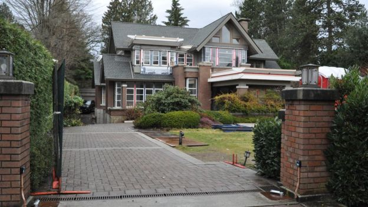

# [孟晚舟：困在镀金笼子里的华为高管 - BBC News 中文]

白麦克（Michael Bristow） BBC记者，发自温哥华

2019年1月24日

 

孟晚舟保释期间居住在这座房子里。

在温哥华一个绿树成荫的高级社区一角，坐落着一栋灰色房屋，从外部看上去，屋主应该比较殷实。在房子正前方，是一堵低矮的围墙，以及精心修剪的花园。

乍看上去这座房子与周围其他建筑没什么区别。但在正门外，这里有一名保安，街上的几辆高价黑色车辆里，还有一些保安坐在车里四处观察。

这是孟晚舟在温哥华拥有的两处房产之一。去年12月，这位中国企业高管在这座城市的机场被逮捕。

这次拘捕导致加拿大与中国的外交关系迅速交恶，北京也采取了一些被外界认为是报复行为的行动。

- [华为任正非现身：想女儿、无“后门”、特朗普“伟大”](https://www.bbc.com/zhongwen/simp/chinese-news-46889202)
- [华为CFO孟晚舟被捕与嫌违反伊朗制裁禁令有关](https://www.bbc.com/zhongwen/simp/world-46490559)
- [观点：从法律角度看孟晚舟案的可能结局](https://www.bbc.com/zhongwen/simp/world-46582956)

这起事件也让全世界有机会窥探到一些平时不被外人熟知的东西：一个中国精英阶层成员的个人生活。

## “一个安静且温和的人”

孟晚舟已获保释。2月6日，她将再度出庭，出席加拿大决定是否将其引渡至美国的聆讯。她被控违反美国对伊朗的制裁措施，向伊朗出售电讯设备。

作为其保释条件的一部分，孟晚舟要在每天晚上11点至第二天早上6点遵守宵禁，必须佩戴一套可追踪其行踪的脚环，必须居住在她的灰房子里。所有保释开销均由她本人支付。

图片版权 Reuters 

去年12月，孟晚舟在温哥华机场被逮捕。

而她家门外部署的保安们，则是为了确保她不会逃离加拿大。但与此同时，他们也为孟晚舟承担起了屏障的角色，挡住了外界的窥探视线。

“抱歉，我不能告诉你关于这座房子的事情，”执勤的保安告诉BBC。他甚至不愿透露孟晚舟是否在家。保释期间，孟晚舟可以在温哥华大部分地区活动。

孟晚舟好像十分保护自己的隐私。

在BBC记者访问期间，她家的百叶窗一直紧闭，外人无法看到房子内部的情况，但也有一些生活的迹象出现：一辆运送家具的货车开了过来，一些人把多个购物袋拿进房子，随后一名女佣出现把走廊打扫干净。

孟晚舟之所以在温哥华被拘留而不是其他地方，也是有充分原因的。负责庭审孟晚舟引渡案的加拿大不列颠哥伦比亚省高等法院（Supreme Court of British Columbia）公布的文件显示，这位华为首席财务官与这个地区有广泛联系。

孟晚舟主要居住在中国深圳，但46岁的她往返温哥华已经有15年了。

她最早是以游客身份来到这里的，但显然发现了一些她喜欢的东西。

 

图片版权 Court handout 

孟晚舟一度拥有加拿大永久居民身份。

温哥华塔旺公司（Tavan）在当地为富有的中国客户打造高价房产，该公司总裁特洛伊·范·弗利特（Troy Van Vliet）暗示了吸引孟晚舟的可能是什么。

“除了干净的空气、高大的山脉，除了这里有漂亮宜居的环境、稳定的政府，他们希望自己的子女可以在西方接受教育，”他说。

这与孟晚舟的经历十分契合。她有三个儿子与一个女儿，其中几位在温哥华上过学。她的丈夫刘晓棕在这里念过研究生。

子女在温哥华上学期间，这座灰房子就是孟晚舟主要的家。她一度还是加拿大永久居民，但后来放弃了这个身份。

而包括其丈夫家亲人在内的其他家属，也都经常到访温哥华。

 

图片版权 Court handout 

加拿大不仅成为了孟晚舟的一个家，也是她家人的家。

法庭公开的照片显示，孟晚舟和她的家人经常在温哥华著名旅游景点出现，比如斯坦利公园（Stanley Park）、狮门大桥（Lions' Gate Bridge）以及赛普里斯山（Cypress Mountain）。

他们一家人还给当地一些居民留下了很好的印象，他们所知道的孟晚舟是叫Cathy（凯茜）或是Sabrina（萨布丽娜）。她的丈夫自称是一名风险投资家，他的名字是Carlos（卡洛斯）。

为支持孟晚舟的保释申请，她的邻居南希·萨瑟（Nancy Sather）写道：“在与她的对话中你可以感到，她是个安静且温和的人，把家庭和孩子的事情看得最重。”

除了这位邻居，还有另外四名加拿大公民为其保释金出资，孟晚舟的保释金共计1000万加币（740万美元）。

其中一位瑜伽教练贡献了5万加币现金（3万7千元美元），另一位华为前员工的妻子以自己房子的一部分作担保，保证孟晚舟不会逃离加拿大。

 

图片版权 Court handout 

照片中孟晚舟的孩子都在加拿大接受过教育。

## “退出战略”

在被捕前，孟晚舟似乎一直在增强自己与温哥华的联系。

那座有保安守卫的房子购于2009年，价值560万加元（420万美元）。3年前她还买下了另外一座房子，面积更大，价值也多过三倍。

第二座房子目前正在装修，房主目前的困难没有阻挡工人施工的进度。

从入口处看去，这座中国式横梁屋顶设计的房屋暗示了主人的国籍和内部的格调。

 

第二座房子目前正在装修，孟晚舟目前的困难没有阻挡工人施工的进度。

为了解中国家庭喜欢什么样的内部装修，特洛伊·范·弗利特带我去他的一座房子看了看。

这座由他建造的房子内部看上去像是娱乐杂志里明星们的家那样，灯光反射在大理石和抛光木材制作的家具上，闪闪发亮。

之后特洛伊给我给我展示了只有负担得起这种奢侈的人才会享受的东西：两个厨房。

主厨房拥有尖端设施，看上去闪闪发光，主要用作展示；而真正的烹饪都是在后面一间单独的厨房完成。

第二个厨房可以被封闭，特洛伊说这是为了“确保整个屋子不会充满食物的味道”。

他还说，主厨房可能在泡茶时用来烧水。

 

图片版权 Tavan 

温哥华许多千万豪宅都有两个厨房。

特洛伊清楚地向我们展示了为什么有钱的中国家庭想要来温哥华。而活动人士辛智芬（Fenella Sung）则解释了为什么他们可能一开始就想离开中国。

“在中国，你的个人安全并不是一直都有保障。尽管今天你可能掌权，但明天就可能入狱，”我们走在孟晚舟家周围的社区时，她这样说。

“这就是为什么这些人要建另一个家。这是一种退出计划。他们可以让自己的孩子来这里上学，让他们的父母退休后来这儿，让他们有一只脚可以迈出中国。”

中国富人涌入温哥华也让很多人开始担心，会不会出现洗钱行为及房价飙涨，而当地目前的房价已经超出本地人的支付能力。

从香港来温哥华已近30年的辛智芬表示，这里大部分的房屋长年无人居住，在这座城市的富人区创造了一个个“荒凉地带”。

她说，这种影响冲击整个温哥华。“讽刺的是，他们现在破坏的，正是他们希望来这享受的生活方式。”

------

原网址: [访问](https://www.bbc.com/zhongwen/simp/chinese-news-46983530?ocid=socialflow_twitter)

创建于: 2019-01-24 22:11:07

