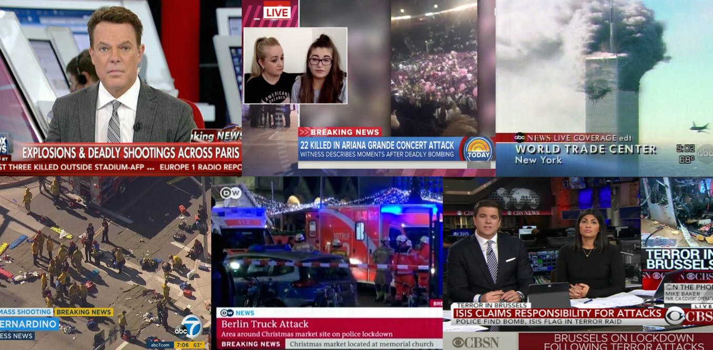

# 现代新闻之愚蠢 (3) — 深度剖析四种致命倾向性，及其政治代价 – iYouPort – Medium

## 这只是一场游戏，而它一直在耽误正事

[iYouPort](https://medium.com/@iyouport) Jan 24 2019

> 造成现代“新闻”已经无法服务于民主的问题根源并不是故事本身，而是讲故事的方式。认识到这一点非常重要。我们将来还会详细讨论什么样的方式才能够对公民的政治参与产生积极的引导作用。本文将继续深入解释为什么媒体变成了这样 — — 中国社会目前正迫切需要了解这些问题，我们将在后面解释为什么

如果您还没有读过前面两篇，可以在这里看到：([1](https://medium.com/@iyouport/media-1-10a6469a5463)) ([2](https://medium.com/@iyouport/media-2-bf607b4d487)) 本文中我们将深度解析这些倾向性，并且，指明其政治代价。

**重新审视个人化新闻**

在全面文章的概述中我们解释了，个人化的新闻是指报道中突出个人，而弱化制度、社会和政治大背景的一种倾向性。

随着新闻受众和新闻产品之间变成了**品牌认知的关系**，新闻已经在个人化的道路上越走越远。比方说，电视节目主播的播报风格，甚至在节目中的形象都要依据市场调查的结果而定，而报纸则被要求紧跟读者的生活时尚，这种个人化的包装趋势是由那些职业新闻顾问、或者说“新闻策划大师” 开创的，Philip MeHugh 就是其中最著名的策划大师之一。

MeHugh 曾经说过，“必须强调个人和人情味。电视节目必须要有一个能够让观众感到亲切的主持人 ……要做到这点，主持人必须具有非同寻常的人格魅力” (Edward W. Barrett, “Folksy TV News”)

以电视/视频为主的大众传媒已经**确立了一种新闻报道模式，其特点就是赚钱，廉价成本和易于生产**。但是，对于消费者来说 — 也就是广大公民 — 这种模式毫无益处。然而它早已在现代“新闻”界处于非常高的地位，大多数媒体把它当成了金科玉律。

流量之冠 NBC 的著名节目“Today”的制片人 Jonathan Wald 在“911”之后是这么说的：“早晨醒来，人们希望知道他们身处的世界是否安全，他们指望我们来帮助他们确认是否一切正常”。在今天这个充满阴险的新闻时代，对于“我所处的世界是否安全”这种问题，答案未必能让人感觉安慰，但是新闻个人化的倾向，也就是**对“我所处的世界” 的强调**，依然占据主导。(Howard Kurtz, “Since September 11 Attacks, TV Morning Shows Rediscover World News”, Seattle Times)

华尔街日报对政府停止大规模公共就业计划的报道是其中典型之一，虽然该报道可以从社会、政治和经济等诸多宏大背景的角度展开，但是，这篇报道的开头却是这样的：

“旧金山 — — 第一缕尚带寒意的阳光洒在 Haight-Ashbury 人行道上，一名清洁工停下脚步，把路边排水沟散落的落叶、垃圾和狗屎扫在一起。‘对我们穷人来说，这样一份工作已经很好了’。清洁工说，‘有了这份差事，我就能养家糊口。等我把这儿的活儿干完，还可以回家照料我的小女儿。帮她把硬纸壳塞进鞋子里保暖。我妈妈过去就是这样做的’。“(Wall Street Journal, June 17 )

虽然按照新闻写作习惯，最重要的事情应该最先交代，最无关的内容要放在最后，但是这篇文章**一直到第八段**才开始谈就业计划可能对社会、政治和经济造成的影响，而且这一重点**只花了三段内容**，紧接着继续讲述清洁工催人泪下的个人故事。

这种模式已经被至高很长时间了。从克林顿时代后期开始，福利制度改革席卷全国，记者们纷纷涌向各种政府部门和职业培训项目，试图寻找和以前不一样的个性化故事。由于两党意见统一，于是对新闻的干预相对较少。因此，至少有几百名穷人当上了15分钟的媒体明星。

事实上在他们的故事里，新闻的个人化倾向发展到了极致以至于新闻本身也成为了个人故事发展的一部分，而不仅仅是个人经历的隐形记录。其中一位妇女由于受到了ABC、NYT等多家媒体的采访，曝光率给她带来了大量的粉丝，在纽约时报后来的一次采访中，这位女性告诉记者，整个过程最令人骄傲的是，“我的11岁的儿子大声说：‘妈妈你又要上新闻了！’……”( [From the Welfare Rolls To the Starring Roles. By JASON DEPARLE](https://www.nytimes.com/1997/06/25/us/from-the-welfare-rolls-to-the-starring-roles.html?mtrref=www.google.com&gwh=2040164DFAA6D6307D4FD368583EF730&gwt=pay) )

政治领导人的个人化是尤其突出的，这在中国也一样（更多详见 《中国政府已攀上[景观政治的边缘](https://pao-pao.net/article/885)》和《[互联网时代：并非心理学意义上的自恋文化](https://pao-pao.net/article/919)》）其结果就是，我们从新闻中了解到的更多是那些有权有势的、光芒四射的**个人**，而不是政府如何运作。正如 Paletz 所说：“重要新闻都离不开这些权力人物的活动，按照媒体的设想，最好是这些人的冲突”。( Media Power Politics. Authors, David L. Paletz, Robert M. Entman ) 想想美国主流媒体对马云、王健林等富豪的痴迷。

小布什、里根、奥巴马等等的成功不仅仅得益于个人魅力和公关能力，就如小布什的“壮志凌云”亮相那样，**电视上的政治角色需要依靠专业的公关团队来策划新闻事件，拟定公关策略，才能在一贯具有倾向性的媒体报道中占到便宜**。

David Gergen 是最早了解媒体“政治事物个人化”倾向的传播策略大师之一，在为克林顿效力之前他也为里根做媒体宣传主管，里根能赢得新闻界“伟大交流家”雅号，David Gergen 功不可没。Gergen 认为，政治人物的政治生命取决于他们在新闻中的个人形象是强悍还是软弱。他奉行的原则是，**“最好的防卫就是进攻”** — — 然后特朗普把这点发挥到了极致。

在传媒至上的时代，这种权力观已经成为政界的标准思维。克林顿由于个人丑闻加之没有掌握 David Gergen 的教诲，在许多重大问题上都遇到了麻烦，支持率总是50%上下波动。当年一位克林顿内阁告诉记者：“一个总统如果总是48%支持率，那么每次大一点的投票都将意味着生死关头 — — 这种情况下你要对付的局面是，那些议员们不知道要拥抱你还是踩死你”。

奥巴马是另一个极致，他的前任很少能经历如此多的个人化报道。最著名的出生地阴谋论中，一些国会议员在媒体上煽风点火，据估计有17位议员直接或者含沙射影地对出生地提出过质疑 ( [The Birthers in Congress](https://www.salon.com/2009/07/28/birther_enablers/) ) 美国著名电视主持人“扣扣熊” Stephen Colbert 曾经讽刺说：“应该让这些人去证明自己不是一只短吻鳄的非法子孙”。

无疑这种东西非常具有现代“新闻”所珍惜的“价值”。

最后夏威夷州州长出面以平息阴谋论。可惜的是，一旦这种有争议的问题成为了新闻话题，人们就开始不由自主地被错误观点所吸引，多年后直到如今你仍然能听到出生地的质疑。然而人们现在应该知道了，奥巴马政府的问题根本不是什么出生地，他对真相的封杀抓捕了史上最多的举报人、扔下了更多的炸弹、以及众所周知的绥靖态度，却没有主流媒体关心。

**—— 个人化新闻的政治代价 ——**

如果新闻只关注政治斗争中的胜利者、失败者、他们的个性和个人冲突，那么，新闻受众获得的有关权力及其政治后果的看法就是严重扭曲的。Paletz 指出，新闻报道强调的往往是表象，政治斗争中愤怒的声音和激烈的场面，以及涉及到的各种名流 — — 反正只要充满戏剧性的东西就行，而问题的根本原因和实际影响却极少被触及，或者说，很容易被遗忘。

我们必须强调这点是因为，多年来所谓的“海外中文媒体”对政治八卦的崇拜已经成为了中文界一种现象级典型，暂且不议他们发表的内容究竟是不是真实的，这种个人八卦崇拜的结果就是，在公众眼里，政治世界变成了一个神秘王国，里面的角色要么强大到呼风唤雨，要么软弱得无所作为。这些都不是真实的。

不了解权力的架构就很难理解政治体系实际是如何运作的。

并且，**对遥远的新闻人物进行直接的感情投射可能会造成新闻受众形成自我中心化和种族中心化的思想。新闻给受众造成一种“老子天下第一”的观念，强调的是“我”的安康、“我”的群体、和“我”的国家的重要性，而与己不同的一切社会现实，都被视为无关紧要**。

虽然大多数新闻会平衡报道正反两方面意见，但是，很少能为受众提供解决双方分歧的有效方案。相反，在新闻中，媒体往往喜欢把不同派别的观点描述成截然相反的对立面。如此般，受众要想不费力气把事情看明白，就只能选择那些与自己的信仰和偏见相一致的事实了。**极化就这样被造成。**

重新审视戏剧化新闻**

以下是一家主流电视网的执行制片人撰写的政策备忘录，看看他对编辑和记者提出了什么样的忠告 — — 没错，让他们有意识地强调新闻的戏剧性：(Edward Jay Epstein, [News from Nowhere](https://books.google.com/books/about/News_from_Nowhere.html?id=vAhlAAAAMAAJ))

> _每条新闻都应该力图体现事件的小说元素或戏剧色彩。新闻要讲究结构和具备冲突，要提出问题，还要有结局，情节要起伏，要有始有终。这些不仅是戏剧所必备的要素，也是我们新闻叙事中必不可少的。_

一般来说，媒体在决定谁将在晚间新闻的戏剧舞台出场时，**更多的是考虑这些新闻人物作为戏剧演员的潜能，而不是他们在政治体制中的实际地位**。

比如美国，总统、国会和最高法院在宪法中是享有平等权力的，然而在新闻中，总统的戏份最多，而且几乎所有的政治场景都能把他拉上场；总统自己也非常重视和媒体的联合性宣传，白宫的新闻策划大师会安排最佳的剧情。但相比下，最高法院的法官“上镜率”就低得多了。而真正掌握政策走势的情报机构（即[隐形政府](https://medium.com/@iyouport/%E9%9A%90%E5%BD%A2%E6%94%BF%E5%BA%9C-%E8%B5%B0%E8%BF%9B%E9%97%B4%E8%B0%8D%E7%9A%84%E4%B8%96%E7%95%8C-8321a2e9f391)）几乎不会被主流媒体揭穿。

虽然宪法规定国会两院的地位是平等的，但是媒体给予的聚光灯可完全不一样，参议员颇有名望，而众议院就好像是一群乌合之众。就如媒体观察家 Stephen Hess 所说，众议院的规模就像《战争与和平》，而参议院则像《罪与罚》。

中国读者对美国政治有广泛的误解，很可能与此有关。对新闻倾向性的了解已经让议员们学会了如何利用媒体，他们知道如何掌握身上的聚光灯。

Robert Darnton 曾经回忆说他在做记者的时候是如何被迫对新闻事件戏剧化的。他当时是市政报道组的记者，被派去报道一场报童丢车案。他把稿子写出来后被编辑退回来了。他的同事告诉他，你应该写得再生动一点，要有戏剧性才行：把这个男孩对自行车的感情写进去，要更多描述车子丢了这个孩子有多伤心，**要写这个孩子打算靠自己的努力再买一辆新车……要写成励志小说**。Darnton 按照这个指点修改了稿子，结果成功被发表在报纸上。([Writing News and Telling Stories](https://www.jstor.org/stable/20024337?seq=1#page_scan_tab_contents))

Harper’s 的编辑 Lewis Lapham 也有同样的经历，他说他曾经对一些记者在报道灾难事故时的驾轻就熟深感钦佩，后来那些记者透露了自己的秘密：在他们的办工桌抽屉里有一堆卡片，上面记录的都是模版，按字母顺序排列 — — 火灾、撞船、凶杀等等，然后每个类别又分为许多子类 — — 火灾1、仓库2、住宅3 ……模版中相关的姓名、数字、伤亡情况、地址等等都空着，一旦出事，你只要抽出一张卡片，按照填写表格那样做就行了。(Lewis H. Lapham, “[Gilding the News](https://harpers.org/archive/1981/07/gilding-the-news/)”)

**戏剧化的新闻更追求情节上的轰动，只能说是情节剧，而不是严肃戏剧，只能说是肥皂剧，而不是莎士比亚戏剧**。看完《哈姆雷特》的人不会认为可怜的哈姆雷特是个真正的输家。如果记者追求的是更严肃的戏剧，其结果还可能不会像现在这样令人反感。

其实新闻选择和呈现事实的方式上有所变化并不需要莎士比亚的天赋，在正统戏剧中甚至畅销小说中人们都能意识到历史、制度、权力、冲突、隐藏的利益以及意外事件在故事中所起的作用，而在新闻情节剧中，这些因素**全部被忽略了。**

**— — 新闻戏剧化的政治代价 — —**

最直接的后果就是琐碎。一种越来越严重的戏剧制作倾向取代了对重大事件和问题的持续关注。即使新闻剧确实反应了新闻事件的某些特质，但过度的戏剧效应只会分散人们的注意力，不再能理解到新闻本身具有的深远意义。

动态新闻需要的就是快，就像抢救济面包那样一哄而上。而长期的社会问题和政治问题通常会被媒体忽略，就是因为这些问题的节奏太慢 — — 这是 Gaye Tuchman 的名言，简直一语中的。从这点看，个人化和戏剧化的倾向性所造成的结果很相似。

我们已经多次推荐过 Don DeLillo 的作品（爱死他了）他对新闻和政治的讽刺之深刻，超越同类几乎所有作品。我们引用一段分享给大家 （The Names）：

> _我认为美国人只有在危机中才能看到外国人。当然，这还必须是美国的危机。如果是两个并不向美国提供某种特殊商品的国家打起来了，那就没必要让美国公众了解有关这两个国家的知识。但是，如果这个独裁者倒台了，石油供应受到了威胁，这时你打开电视，节目就会告诉你那个国家在哪儿，讲什么语言，国家领导人的名字怎么读，那里的人们信仰什么宗教，你甚至能从报纸上剪几个波斯菜谱练练手。全世界都对美国人这种自我教育的奇怪方式感兴趣。全是电视。你看，这是伊朗，这是伊拉克。来让我们把这个单词的发音搞正确，伊-朗、伊-朗人，这是逊-尼派，这是什-叶派，非常好！明年我们再去折腾菲律宾群岛，怎么样？_

戏剧化的新闻还会造成另外一个信息困境：媒体在报道的过程中，**不是努力挖掘最具代表性的典型案例，而是乐此不疲地寻找极端个案**。你完全不知道他们是在报道还是在创作小说。

相对来说，戏剧化的新闻往往情节比较简单，容易把握，并且对行为背后的个人动机提供了表面化的解读，于是这种新闻比较大众，但是**极可能对理解和判断真实政治事件造成误**导。人们往往认为自己对某个问题有所了解，而实际上他们的了解不过是建立在幻想、虚构和神话的基础上。

情节式的新闻造成人们对世界的一种错误理解，而这种错误理解最终导致的结果就是，在严重的社会问题面前，人们毫无准备，不知该如何有效应对。

公众其实并不像传媒专家们认为的那样头脑简单，但这不在本文的讨论范围之内。**没有任何**新闻学教程将新闻定义为“受众需要的任何东西，不管这些东西是如何编造出来的和毫不相干的”。至少从理论上说，**新闻的作用应当是告知公众，而不仅仅是娱乐公众**。

新闻越来越戏剧化、娱乐化的方向发展，这种趋势也许表明，一种新的传播形式正在产生，它有可能还是被称之为“新闻”，但如何你认为它能起到传统新闻那种捍卫民主的作用，那就大错特错了。

在现代生活中，政治已经距离普通人的生活越来越远，戏剧化的新闻还要推波助澜，最终把公众的政治自觉意识直接葬送在小说般的虚幻中。而且是那种劣质的地摊读物，离 Don DeLillo 的级别还差几个太平洋呢。

以下就是戏剧化新闻造成的直接政治后果：

1. 干扰公众对于问题潜在重要根源的关注；
2. 从个案角度对问题进行解释、分析，误导公众；
3. 为那些从戏剧角度上看令人满意而实际操作角度上毫无作用的解决方案提供了广泛的政治空间。

**新闻已经变成了一种工具，把现实问题变成了政治奇观，阻碍了严肃讨论，却培养了受众苛求速效、戏剧化解决方案的胃口**。( [Constructing the Political Spectacle](https://www.press.uchicago.edu/ucp/books/book/chicago/C/bo5948882.html), Murray Edelman )

**重新审视碎片化新闻**

剧中人物完全脱离政治背景，然后又被放置在某种令人兴奋而虚幻的主题之中，这样的新闻很难反映整个世界的全貌。

碎片化新闻在戏剧效果中固步自封，在空间和时间上彼此孤立。这样的新闻给人的感觉就是一堆焦点模糊而且还缺失很多块的拼图。即便是焦点清晰了也只是每一块单独的拼图焦点清晰，而无法确定每一块的位置，当然也无法组成一幅完整的画面。

既然信息本身就是鸡零狗碎地传播给公众的，那么公众就更觉得自己应该按照自己的偏见去解读整个世界了。

新闻本该为受众提供有关局势的最新信息，但这些信息不是散落的漫无边际的，就是被同化成老一套的情节模式。无论是哪种情况，在新闻中，这个世界总是看起来就像由无数个胶囊事件拼凑而成的大杂烩，每个事件都有自己的情节线索，又彼此孤立，尽管它的每一部分并不松散，而且从戏剧角度看是完整的，但是主题则是支离破碎和杂乱无章的。

古语说，整体永远大于各个部分的和。但是从信息碎片化的角度上看，现代新闻不是这样 — — 今天的新闻呈现的整体肯定小于各个部分的和。专栏作家 Russell Baker 曾经讽刺这种“新闻”模拟了一个串烧：(‘[Meanwhile, in Zanzibar](https://www.nytimes.com/1977/02/06/archives/meanwhile-in-zanzibar.html)…’)

> _与此同时，在华盛顿……据称，政府今天……消防队员仍然在布鲁克林严重火灾留下的废墟中搜寻 ……据说有两个国会议员接受了韩国代理商的现金馈赠 ……虽然他们连续五次败在波士顿凯尔特人队的手中 …… 已经有17人死亡，几十人受伤……指控者说有两名参议员，但他拒绝透露他们的姓名 ……在开罗的街头发动了骚乱 ……此前她的儿子由于枪杀一名教师被校方开除，这个教师曾经谈到 ……白宫随和的处事风格时提及了他 ……关于B-1轰炸机问题的争论就是最好的例证。_

这就是如今每位受众脑子里的东西。

由于在分析和批判方面缺少真正的指导原则，媒体在报道中试图体现分析性和批判性的努力无异于痴人说梦。Edwin Diamond 曾经讲过一个这样的故事：一家电视新闻网的制片人去麻省理工学院参加一场关于电视新闻的研讨。一上来主播将镜头切换到华盛顿的记者报道最近通货膨胀的坏消息；接着是全国三个不同地方消费者的访谈；然后画面上出现一张全国地图，以及各地生活成本图表；之后立即切换回演播室，又切到华盛顿记者那里，然后是采访现场的画面和同期声 — — 从国会领袖到内阁官员；然后是华尔街反应 ……后面就是商业广告了。整个节目时间是3分钟。

完成的瞬间制片人打了一个响指：“真到位！”她很得意，她觉得这活儿干得很漂亮。可教室里的学生们纷纷举手：这都什么玩意啊？究竟什么意思？关于现在的经济状况，你究竟想告诉我们什么？……

观众看的不是拍摄技巧、什么图像、声音、平滑切换，他们不关心这些，他们要的是知识，以及“该怎么办”。

其实报纸新闻也这样，一篇报道在访谈、人物介绍、场景描述、事实信息、情节要素之间来回切换，读者的思路不得不到处乱窜，**读完后什么都没记住，什么都体会不到**。

现代“新闻”很少能报道问题的发展趋势和历史渊源，因为这些东西很难用简单的故事说明白，于是很多事情往往是莫名其妙地一下子变成了新闻。公众无法看到一个具体的连贯的世界，而是一个神秘力量控制下的混乱空间。

**— — 新闻碎片化的政治代价 — —**

行业内规定记者不能对新闻故事进行解读评论，所以不管报道内容是不是碎片的，报道本身只能是孤立的。而且，官方宣传部门提供的新闻稿很少会劳神指出新闻事件中的矛盾性、复杂性或者所处的大背景。新闻记者往往只关注当日的事，报道重点就是每天更新，这样反而帮了宣传部门的忙。后续报道往往只能出现在报纸后面的版面上，电视中分析性的报道根本搭不上黄金时间的快车，只是在没有什么新闻的日子里拿出来充数用的。

由于戏剧化模式的新闻故事有着独立的情节发展和解决方案，若是把这些新闻故事联系起来，就会影响其戏剧效果，打乱原有的故事节奏，还可能引起人们的不安，让人明白了**凡事不能只看表面，每个故事背后都隐藏着一个更大的故事**。把故事当成新闻报道的基本单位会带来一个令人遗憾的副作用，那就是，挖掘故事之间的联系容易让原来简单而孤立的事实复杂化。

公共舆论研究表明，大多数人不擅长对政治问题进行抽象的、具有完整逻辑性的思考，这没什么奇怪的，大量公众舆论调查的数据都与新闻碎片化所造成的结果不谋而合：一般人很难明确地说出自己在某些问题上的立场；对于重大问题，大多数人只能记住很少的事实；大多数人看不出问题之间的联系；许多人都很容易改变自己对某一问题的看法和立场。

John Zaller 曾经针对外交政策进行的研究表明，**人们对于某一问题越是“消息灵通”，其观点就越容易受到那些占据新闻市场主要位置的党派领袖和政治精英的影响** ([The Nature and Origins of Mass Opinion](https://www.amazon.com/Origins-Opinion-Cambridge-Political-Psychology/dp/0521407869) \[John R. Zaller\])

Mort Rosenblum 是一位德高望重的美联社记者，他写了一本很煽情的书《谁窃取了新闻？为什么我们不能如实反映世界上发生的事？我们怎么做才能改变这种局面？》，他说，“等到我们开始关心外界的时候往往为时已晚；在自身动力的推动下，事态的发展已经无法阻止，我们别无选择只能接受一切后果……”

**重新审视“权威-失序”的倾向性**

即使媒体对某些问题进行了一定数量的报道，也很难保证政策讨论的细节为公众所知晓，这很正常。如果关于某一问题的新闻报道过多，人们给予此事的关注和情感投入太多，反倒会影响人们对事物的理解。为什么会这样？**原因之一恐怕就是新闻的倾向性的存在，新闻过多强调了当权者的所作所为、以及局势看起来如何等等，结果，这样的报道反而干扰了公众的理解**。

如果事件发生的大背景完全被割裂，有关权威的故事情节和“有序-失序”的场景就成为了最方便易得的新闻素材。在新闻编辑部，编辑们最重要的使命莫过于为那些琐碎的故事撰写戏剧性的结尾，有时候是当权者扭转了大局，有时是当权者奋力抗争但邪恶势力过大，于是混乱依旧。

**并不是**说新闻报道的内容是虚构的，大多数新闻都能反应事件的**某些**方面，但媒体在报道内容上是有选择的，而且，在报道焦点上的选择往往没有对准事件最核心的本质。正因为新闻具有戏剧化、个人化和碎片化的倾向，就必然会在报道中首先关注权威人物和社会秩序的问题，所以在判断当权者是否“解决了问题”时，媒体还是有相当大的决定权的。

新闻里也会出现真正的权威和社会秩序受到挑战的情况，但**必须要分清这究竟是政治现实还是新闻策划** — — 这一点非常重要。像越南战争、水门事件等影响深远的重磅新闻已经不是戏剧性新闻表现手法所能随便创造或压制的。两者之间有明显区别：

- “权威-失序“的倾向性显然是把某一特定事件与其社会背景和历史潮流割裂开来，通过一种肤浅的情节模式（如政治游戏、领导地位受到挑战和社会崩溃的迹象）对事件进行戏剧化处理，**而不是**把事件放置在历史、政治和现实的背景下进行解释；
- 相比之下，重要历史事件的报道往往会打破一般新闻的情节模式，顺着文献信息的踪迹，挖掘社会和制度根源。在这些案例中，权威和社会秩序的问题没有把新闻事件与其所处的大背景阻隔开来，而是拓宽了公众思考的范围：事件本身有什么意义？有什么可以让整个社会汲取的经验和教训？

大多数情况下“权威-失序”模式的新闻故事往往是因为媒体采用了**特定的新闻公式**而得出的，**并不是**记者针对公共生活的基础是否动摇这一问题进行深入调查后揭露出来的。

**处理新闻的手段越是奇葩，对受众的干扰越大，就越有可能成为“热点话题”，或者它们称之为“噱头”**。

**— — “权威-失序“倾向性的政治代价 — —**

“今天的世界有点不太平，但是有关部门充满信心，认为情况很快就会恢复正常。现在我们是从现场为大家发回的报道……“ 这种话如今已经成为了记者的口头禅。

在现实新闻中，不论是报道偏向对权威的信任和对恢复秩序的信息，还是偏重对权威的质疑和对混乱的担忧，**都摆脱不了** “权威-失序“ 的俗套，忘了其实新闻事件还有其他的呈现方式。

好在依旧有许多新闻的确报道了事实，而另一些可就不一定了，有些新闻杂志为了出风头，甚至将扭曲报道变成了一种模式：“唬他们一下，他们就会关注你了”。偷拍设备的运用和戏剧化的编辑写作手法全部运用起来了。其中最惊人的是 ABC 的“黄金时间”节目，曾经播出了一个偷拍新闻，还获了两个新闻奖。这个新闻大概意思是一个医学实验室在对妇女早期宫颈癌变检查过程中马马虎虎，不负责任，致使许多癌症从眼皮底下溜走。节目制片人化妆进入亚利桑那州一个实验室，而另外一个制片人则假扮一位顾客，携带大量化验数据要求实验室分析 — — 这样做的目的是增加分析师的劳动量，增加分析数据时的错误概率。

这种采访形式的结果就不用问了：新闻称，这个实验室的报告漏掉了好几项警告数据。然而新闻评论机构的调查结果显示，**这则新闻从始至终从未提供这样一个事实：对于一个本身尚不完善、分析难度很高的测试来说，这家实验室的分析结果完全符合正常行业标准**。

相反，这则新闻却把实验室刻画的很邪恶，好像每天都在危害妇女健康一样。最终的结果是，这家实验室没了生意，而该新闻拿下了两项新闻奖，受众则受到了无端的惊吓，更不用说被误导了。或许节目本身的目的就是吓人，而不是传递信息。

这样的日常新闻，不论是强调善还是强调恶，都不能再履行自身的社会职责，无法反映社会和政治生活中具有代表性的问题，无法帮助公众得出有效的结论。

或许这样说更接近事情的本质：**因为戏剧化的失实报道更符合新闻业在选材以及写作上的潜规则，所以这种“新闻”只能让人们加深自己的政治成见**。

一位批评家指出，公众和记者都更愿意生产方便的通俗小说，而不愿意去挖掘有说服力的事实：“我们所干的事都差不多，人人都忙着各种类比和隐喻，人人都试图唤醒并呈现我们认为可以称之为人性的东西。**新闻故事从追求真相变成了罗列事实，而不是从事实中获取真相**”。(Lapham, gilding the mews, 33.)

## **总 — — 这只是一场游戏**

公共信息的循环就这样周而复始：媒体 — — 政治人物 — — 公众 之间的新闻三角彼此无法良性互动，直到有一天，所有人都失望了。可是没有多少公众能够对整个信息体系有全面的了解，并提出令人信服的解决方案。

**当下公共信息体系已经不再是一个理性的过程，客观性也不再是整个体系最崇高、最理想化的追求目标。相反，把整个体系作为一个游戏可能更适合 — — 不同的玩家有不同的目标，甚至是他们遵循的游戏规则也不一样，但是，在这个游戏中，每个玩家都在彼此利用以达到自己的目标**：

\- 政治人物为了获得公众支持和圈内的有利评价而参与到游戏中，利用新闻管理和公关技巧把自己的政治意图融入新闻内容当中；

\- 媒体挖空心思互相竞争，为的是收视率、销量和首发权，或者说，最重要的是不要被同行打败。商业利益驱动下的新闻模式要求媒体创作出最具戏剧性的、最吸引眼球的、而且成本最低的故事。一天下来所有人都感叹，不同媒体的报道几乎如出一辙，只是看着他们为了抢流量而打来闹去的样子，又给我们造成了一种各个媒体之间彼此独立的假象。

\- 公众偶尔以选举人或某个利益组织成员的身份进入游戏，在新闻中寻找那些可以帮助自己做出政治判断的信息。有些运气好能找到一点有用的东西，但大多数情况下都会垂头丧气地退出游戏。政治学家 Murray Edelman 把每日新闻比做**政治表演**，虽然不能提供给公众有用的信息，但由于其自身的娱乐价值，它依然能吸引人们的注意力。

准确说是盗取人们的注意力。

本系列一共三篇，**这些问题对中国读者来说非常重要，因为中国的宣传模式已经发生了悄然的变化** — — 去年我们在《[独家：北京的政治宣传模式发生改变，或正对冲中国异议的弱点](https://medium.com/@iyouport/%E7%8B%AC%E5%AE%B6-%E5%8C%97%E4%BA%AC%E7%9A%84%E6%94%BF%E6%B2%BB%E5%AE%A3%E4%BC%A0%E6%A8%A1%E5%BC%8F%E6%AD%A3%E5%9C%A8%E6%94%B9%E5%8F%98-%E6%88%96%E5%B7%B2%E8%B8%A9%E4%B8%AD%E4%B8%AD%E5%9B%BD%E5%BC%82%E8%AE%AE%E7%9A%84%E5%BC%B1%E7%82%B9-d1bf5ddfd412)》一文中有**详细讲述**。其中最为关键的信息之一就是：

中国官方媒体被要求*主动*报道社会所谓的“负面新闻”，而不是以往那样全面压制负面消息的报道。这一做法比全面封杀要可怕更多。全面封杀原本就是做不到的，而垄断对敏感社会事件的报道权，将能使当局更充分地控制大众知情权和操纵舆论。

鉴于以下几点：

- 中国官方媒体高度效仿美国主流媒体的报道方式 — 即本系列文章所分析的弊端 — 这是被宣传机构[要求的](https://medium.com/@iyouport/%E7%8B%AC%E5%AE%B6-%E5%8C%97%E4%BA%AC%E7%9A%84%E6%94%BF%E6%B2%BB%E5%AE%A3%E4%BC%A0%E6%A8%A1%E5%BC%8F%E6%AD%A3%E5%9C%A8%E6%94%B9%E5%8F%98-%E6%88%96%E5%B7%B2%E8%B8%A9%E4%B8%AD%E4%B8%AD%E5%9B%BD%E5%BC%82%E8%AE%AE%E7%9A%84%E5%BC%B1%E7%82%B9-d1bf5ddfd412)、并且也是[被培训的](https://twitter.com/DonEvansWm/status/1077898579941961728)；
- 中国社会严重依赖美国主流媒体而不是独立媒体作为信息源，加之中国社会没有自己的独立媒体，于是无人能与海外媒体配合传播真相，于是海外媒体只能搜集中国公开发布的消息，变成复读机；
- 中国当局强调官媒需要抢占“负面新闻”发布权，这便令所有吸引海外主流媒体的*素材*完全变成了出自中国官方；
- 中国官媒和美国主流媒体一样在各自本国占据 90%+ 公民认知市场的份额；
- 它们采用了相同的现代“新闻”报道模式，具备相同弊端，即本系列文章分析的四大倾向性，它们都**无法对社会变革和动员起到实际作用**。

中国社会尽早认识到现代“新闻”的问题，并调整对其的期望，非常重要。希望本系列文章能为您带来帮助。

我们将在后面详细介绍足以维护民主的新闻应该是什么样，以及公民和媒体应该如何做才能实现这样的价值。⚫️

❗️我们在《[为什么说记者的专业性和对安全知识的熟练掌握决定了民主的可持续性](https://iyouport.weebly.com/short-stories-enthusiast/8497573)》一文中提供了**一套专业知识和技巧的文章列表** —— 如果职业记者“不行”，那么公民记者就必需“很行”，希望这些知识能为中国社会带来帮助。看好你们！

#### 对本系列文章（三篇）IYP 面向中国所有致力于捍卫真相和民主的公民和新闻从业者征集评论，不超过800字，优秀的评论不仅将被出版，并且，回复者还将获得 IYP 的特别奖励！截止时间：中国时间2019年2月15日零点。联系邮箱：iyouport_2@protonmail.com 请在标题中注明：“现代新闻-评论”。期待您闪亮的智慧！✨

**_感谢帮助 iYouPort！_**

**_PayPal 捐赠渠道已开通_** [**_https://paypal.me/iyouport_**](https://paypal.me/iyouport)

------

原网址: [访问](https://medium.com/@iyouport/media-3-ae3404d90746)

创建于: 2019-01-25 21:31:20