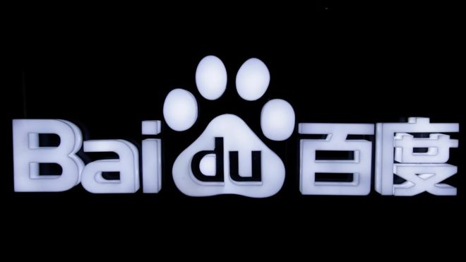
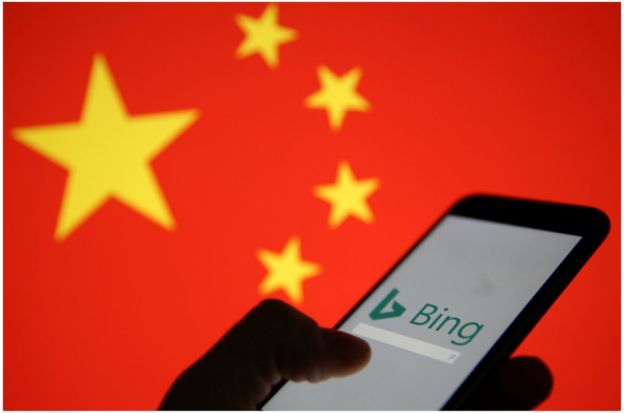
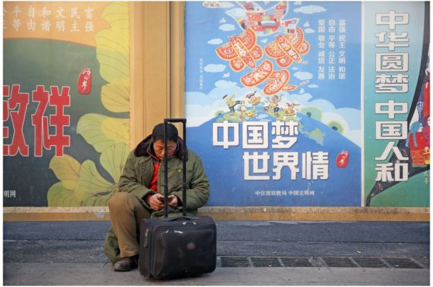

# 百度现象折射中国互联网：牢笼又是丛林 - BBC News 中文

方可成 BBC中文特约撰稿人 宾夕法尼亚大学传播学博士候选人

2019年1月25日

图片版权 Reuters 

中国互联网以严格的内容审查和管控著称，但与此同时，在与内容生产无关的领域，它又是一个极少监管和公众监督的资本乐园，处于欧美国家无法想像的放任状态。

一个最典型的例子就是搜索引擎。1月22日，我在自己的公号“新闻实验室”上发表了《搜索引擎百度已死》一文，指出百度最近半年的荒谬做法：将自家的自媒体平台“百家号”赋予极高的权重，几乎占满了绝大部分搜索结果的前两页。也就是说，百度几乎变成了百家号的站内搜索，搜索全都被围困在了百度站内，而不是通向互联网上的其他网站。

假设这样的事情发生在美国——如果谷歌做了个“谷家号”，然后把搜索结果都导向“谷家号”，那么一定会是巨大的丑闻，首席执行官（CEO）一定会被请到国会的听证会上，整个社会也一定会掀起抵制谷歌的运动。

如果谷歌是在欧洲市场做这样的事情，那更是会引发欧盟的铁腕监管。2017年，谷歌因为在搜索结果中优先呈现了自家的比价服务，就被欧盟罚款24亿欧元之巨。如果在欧洲市场做“谷家号”，恐怕会被罚到破产。

然而神奇的是，在一个以监管闻名的国度，做这样的事情却无需付出任何代价。

- [百度搜索已死？中国互联网企业商业与公共利益之间的抉择](https://www.bbc.com/zhongwen/simp/chinese-news-46973200)
- [谷歌尚未返百度已叫阵 李彦宏谈PK秀底气](https://www.bbc.com/zhongwen/simp/chinese-news-45110872)
- [魏则西之死：百度广告竞价和莆田系引争议](https://www.bbc.com/zhongwen/simp/china/2016/05/160502_china_hospital_search_engine_baidu)
- [中国搜索巨头百度因“推广”赌博再遭调查](https://www.bbc.com/zhongwen/simp/china/2016/07/160719_baidu_promotion_gambling_scandal)

图片版权 Reuters 

Image caption 从24日开始，微软的搜索引擎必应在中国大陆无法访问。但微软25日称，必应在中国的搜索页面重新上线。目前尚不清楚导致关停的原因。

百度现象折射了中国互联网产业的现状：在不应干涉的领域强力管控，在最应监管的地方却非常放任。

这种放任也造成了中国互联网的各种恶劣生态。最突出的就是各大互联网巨头为了将流量留在自己的产品里，采取分封割据的做法，建起自己的“围墙花园”（walled garden），封杀竞争对手的产品，将“互联网”变成“不联网”。

在微信里，你无法分享抖音的短视频，无法打开淘宝链接；在微博里，你提及“微信”两个字就会被降权，也就是说这条信息会被更少人看到；在百度里，你搜索不到淘宝、微信、今日头条的内容；在今日头条里，也基本上不可能有链接让你跳到头条之外的网站。

虽然“围墙花园”是一个世界性的现象，但是没有哪个国家的围墙花园有中国的程度这么高。你很难想象在Google上搜索不到亚马逊的产品，在Facebook上不能分享YouTube的视频。当信息的流动被斩断，信息也就如同死水一般，会很容易腐臭，滋生出更多的假新闻、标题党等劣质信息——当然，也更有利于信息管制，只要盯住了几家互联网巨头，就控制住了大部分的信息。

- [谷歌“暂停”中国版搜索引擎“蜻蜓项目”开发计划](https://www.bbc.com/zhongwen/simp/46621442)
- [谷歌很了解你 而你或许不知道谷歌这10件事](https://www.bbc.com/zhongwen/simp/science-45657189)
- [中国互联网为何能超过西方国家？](https://www.bbc.com/ukchina/simp/vert-fut-39417753)
- [为何西方科技巨头都跑到乌镇去？](https://www.bbc.com/zhongwen/simp/chinese-news-42218143)

中国互联网的另一种典型的恶劣生态，就是近年来所谓的“用户下沉”过程中低质内容、产品和服务的泛滥。

 
图片版权 EPA 

移动互联网在中国的持续普及，使得更多中老年、农村地区、中低收入群体的用户加入网民群体。

移动互联网在中国的持续普及，使得更多中老年、农村地区、中低收入群体的用户加入网民群体。他们的数量巨大，网络素养不高，本应有更多企业为他们融入网络生活提供帮助，但实际上的情况却是，他们成为各家互联网公司眼中的“收割”对象。各大公司朝他们投喂低劣的内容，并辩称“是他们喜欢这些低端内容”。其实，他们并不是喜欢被假新闻欺骗，并不是喜欢迷失在广告中，他们只是没有办法抵抗。

从一定程度上说，这已经成了弱肉强食的丛林。中国社会盛行的社会达尔文主义，在互联网公司“收割”用户的过程中体现得淋漓尽致：老人、穷人、农村人、受教育水平低的人，成为互联网公司一拥而上收割的对象。百家号上形形色色的营销号所针对的受众，也有相当大的比例是这些“低端”人群。

中国的互联网公司所关注的“企业社会责任”，似乎只包括履行政治审查的义务，不包括其它。因此，建围墙花园、封杀竞争对手、利用垄断地位进行不正当竞争、批量生产低质内容、收割低端用户，这些有违商业道德的做法，在中国似乎都被默许。而这些行为带来的后果，则是整个社会信息环境的持续恶化，是越来越多年轻人难于接触到外面世界，和总是被虚假信息误导的中老年人。

**此文系_****_BBC_****_中文特邀_****_美国_****_宾夕法尼亚大学传播学博士候选人方可成撰写的独立分析文章，不代表_****_BBC_****_立场。_**

------

原网址: [访问](https://www.bbc.com/zhongwen/simp/chinese-news-46997294)

创建于: 2019-01-25 21:39:43