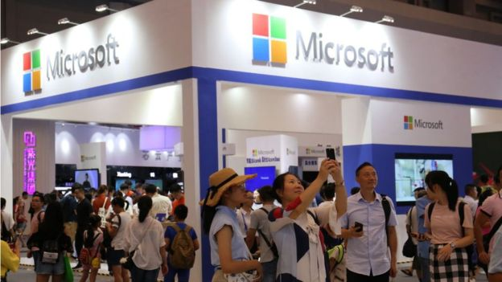

# 微软 Bing 搜索断线又复活背后玄机引发臆测 - BBC News 中文

2019 年 1 月 25 日

 
图片版权  Getty Images 

美国微软公司证实，旗下的搜索引擎 Bing 在中国出现无法使用的情况，但现在服务已经恢复。

但微软没有就搜索引擎 Bing 为什么会在中国发生无法使用的情况提供任何解释。

在中国的网络用户出于不明原因而无法正常访问微软 Bing 搜索引擎，许多人纷纷怀疑和猜测微软 Bing 是否已经被中国当局封锁。

包括谷歌、脸书、推特在内的许多美国科技公司推出的网络平台和外国媒体网站在中国都被封锁，中国用户不能使用。

- [“百度搜索已死” 引起的讨论](https://www.bbc.com/zhongwen/simp/chinese-news-46973200)
- [“翻墙” 网民受罚 中国进一步强化网络管控](https://www.bbc.com/zhongwen/simp/chinese-news-46823319)
- [谷歌 “暂停” 中国版搜索引擎 “蜻蜓项目” 开发计划](https://www.bbc.com/zhongwen/simp/46621442)

 
图片版权  Getty Images 

## “谈判筹码”

英国《金融时报》引述消息表示，中国主要国有电信公司之一的中国联通收到政府命令，因为有 “非法内容” 而封锁 Bing。

报道引述北京博达克咨询公司主席克拉克表示，在美中紧张升温之际，中国依靠国有电信公司执行屏蔽，显示中国对外开放市场的诸多限制。

而美国《华尔街日报》则报道说，美中贸易争端让在华美商处于不利地位，再加上华为孟晚舟被捕引发的紧张摩擦，微软可能被用来当作谈判筹码。

报道援引北京迈博瑞咨询公司总经理纳特金表示，Bing 服务异常可能是因为技术故障，也可能是审查方面出问题，但是在华为和中兴通讯等中国企业遭美国市场封杀后，这也可能意味着微软正被中国政府当成谈判筹码。

纳特金说，“中国可能会想要释放出信息让外国知道，中国是一个宝贵的市场，但你不一定能进去。”

- [索罗斯：华为和中兴对全球构成 “不能接受的安全风险”](https://www.bbc.com/zhongwen/simp/world-46998728)
- [中国 \- 西方的 “脐带” 断开仍无法消除北京后发优势](https://www.bbc.com/zhongwen/simp/chinese-news-46991230)
- [华为争议：加拿大前情报头目警告 5G 网络风险](https://www.bbc.com/zhongwen/simp/chinese-news-46961362)

 
图片版权  Getty Images 

**审查、封锁、翻墙**

微软的搜索引擎 Bing 是唯一能够在中国境内使用的主要外国搜索引擎。

Bing 搜索引擎的服务器设在中国境内，搜索结果会受到内容审查，因此微软 Bing 可以在中国继续存在。

网络搜索巨头谷歌此前已经停止开发中国版搜索引擎的计划，据信停止的原因也是担心内容审查侵犯隐私。

但中国网民使用 VPN 方式 “翻墙” 浏览境外网站的行为最近也被当局惩罚，显示中国当局正加强网络管控力度。

根据网络流量统计公司 “StatCounter”，截至 2018 年 12 月为止，Bing 在中国网络搜索只占 2%，远远落后于市场占比超过 70% 的百度。

------

原网址: [访问](https://www.bbc.com/zhongwen/simp/chinese-news-46990140?ocid=socialflow_twitter)

创建于: 2019-01-26 23:41:30