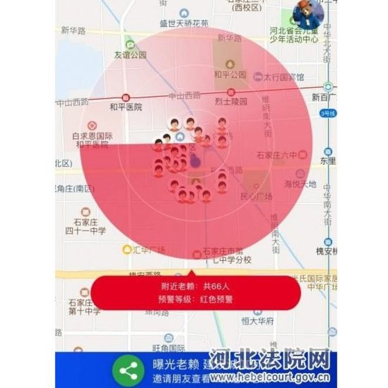
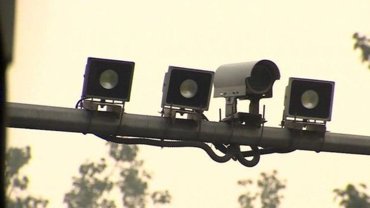
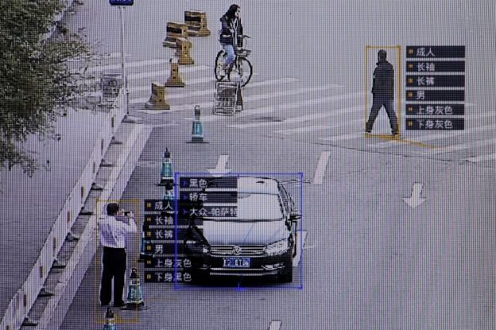

# 微信 “老赖地图”：中国用新技术追债与隐私争议 - BBC News 中文

2019 年 1 月 25 日

 
图片版权  Heibei Provincial Court website 

"老赖地图" 测试版应用软件上周在河北省测试，河北省高等人民法院表示，分享欠债者和丧失信用者的信息旨在营造 "一处失信、处处受限" 的社会诚信格局。

中国当局正在测试一种新应用软件，让手机用户能够核查身边人的社会信用。这是中国运用科技手段对 14 亿公民实施社会信用体系的最新努力。

中国最受欢迎的移动上交平台微信上发布的这种被称为 “老赖地图” 测试版应用软件上周在河北省测试。用户通过该程序能侦得 500 公尺内那些欠账不还，信誉不好的人。

只要点击地图上一个人的标记，应用程序就会显示那个人的个人信息，包括姓名，部分地址，以及违规内容。河北省高等人民法院对记者说，分享欠债者和丧失信用者的信息旨在营造 "一处失信、处处受限" 的社会诚信格局。

- [英伦热议：中国增长可停滞 无法遏制其雄心](https://www.bbc.com/zhongwen/simp/chinese-news-46991230)
- [索罗斯：华为和中兴对全球构成 “不能接受的安全风险”](https://www.bbc.com/zhongwen/simp/world-46998728)
- [华为的国家安全风险：西方和盟国联合布防](https://www.bbc.com/zhongwen/simp/46595173)
- [华为被视作中国崛起缩影 任正非之女被捕激怒北京](https://www.bbc.com/zhongwen/simp/chinese-news-46470878)

这种利用社交平台监督失信者的做法受到《北京青年报》文章的赞誉，作者说利用互联网技术对老赖进行精准曝光的创新举措，值得点赞和推广。文章说，中国失信者虽然受到法院裁定，但他们有许多躲避办法，让让法院找不到人和财产。社交平台监督可以让他们受到来自熟人社会的道德压力。

## 监督和隐私争议

不过这种在社交平台上分享 “老赖” 信息的做法也受到一些批评，批评者担心公民隐私权利受到侵犯。澳洲墨尔本大学亚洲研究所的讲师 Delia Lin 对《每日电讯报》说，那些因为贫穷不能还债这回受到这种监控和公共羞辱。

但是拥有微信社交平台的腾讯公司的创始人说，用户的隐私和数据安全是他们最重视的事情。

按照中国法律的定义，所谓失信被执行人是 “被执行人具有履行能力而不履行生效法律文书确定的义务”，通俗地讲就是经过中国法院认证欠钱不还的人。这些人，按中国法律规定，不能购买不动产，在乘飞机和火车时不能坐二等以上舱位，他们还被禁止入住星级宾馆，甚至不能旅游度假。

 

中国互联网技术对收集公众信息的做法也受到外部指责，例如中国广泛使用脸部识别技术以及在学生制服内安装跟踪芯片等做法。

河北高等法院表示，开通 “老赖地图” 小程序旨在惩戒失信被执行人。让社会公众能够查询身边失信被执行人的信息，有利于监督，举报，进一步压缩 “老赖” 生存空间，让他们主动履行法律义务。

微信用户通过这个小程序在线举报有关失信人，如他们发现 “老赖” 财产线索后可以向信息编辑举报，举报信息被提交到小程序后台管理员，再通知法院执行部门。

河北高等法院说这是互联网技术在司法领域的应用，让公众了解周围的信用状况，让他们参与威慑 "老赖" 履责，形成人人知法、懂法、守法的社会氛围。

- [从档案袋到信用评分 中国是否正走向 “奥威尔式” 监控社会](https://www.bbc.com/zhongwen/simp/chinese-news-45886126)
- [“学习班” 扩张 高压下的新疆日常](https://www.bbc.com/zhongwen/simp/chinese-news-45194182)
- [中国警察戴上人脸识别墨镜　已抓七名逃犯](https://www.bbc.com/zhongwen/simp/chinese-news-42985218)
- [穿什么衣服才能够躲避智能监控？](https://www.bbc.com/ukchina/simp/vert-cul-39948652)

 
图片版权  Reuters 
北京的监控软件识别民众和车辆的详细资料。

## 社会信用体系

中国从 2011 年开始发展社会信用体系，给个人，公司和有关当局机构打分，区分可信者和失信者。打分评级被用来决定失信者是否能够使用诸如贷款和交通等具体的服务。

中国省市地方政府正在推行数十项试点社会信用系统。据河北高级法院网站公布的信息，因为失去信用，到目前为止超过 1800 万人被禁止乘坐飞机，550 万人被禁止使用高铁。

但设在在纽约的人权观察组织认为这是中国政府大规模监控计划的一部分。中国互联网技术对收集公众信息的做法也受到外部指责，例如中国广泛使用脸部识别技术以及在学生制服内安装跟踪芯片等做法。

中国网络公司搜集用户的消费数据对他们评分。受到监控惩罚的违规行为还包括：公交地铁逃票，餐厅预约不到，行人过马路闯红灯。

《每日电讯报》的经济评论员华纳（Jeremy Warner）说，中国对隐私和监控采取更加放任的态度，从某种意义上说可能有助于人工智能的发展。他说机器学习依赖大量采集数据，而这在中国的文化氛围内，并不构成大问题。

------

原网址: [访问](https://www.bbc.com/zhongwen/simp/chinese-news-47004328?ocid=socialflow_twitter)

创建于: 2019-01-26 23:49:26