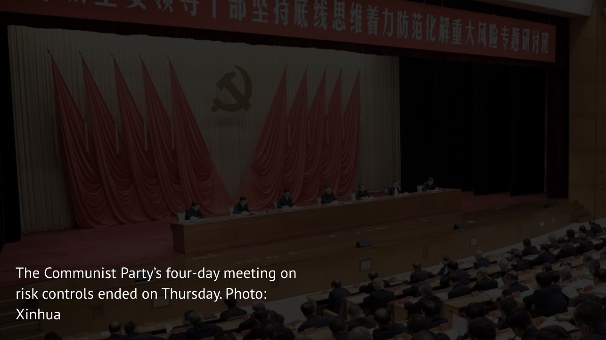
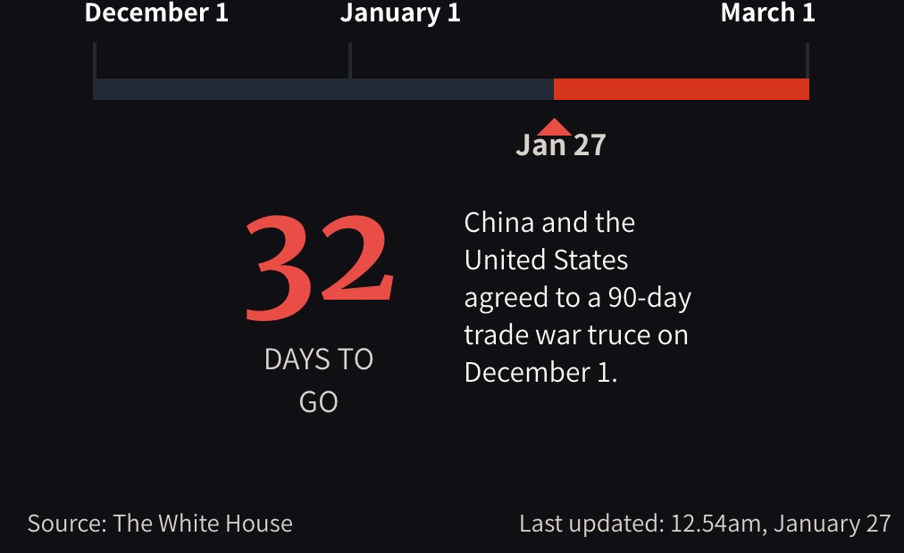

# Beijing tells cadres to prepare for the worst amid uncertainties of its high-stakes trade war with the US | South China Morning Post

- Top official tells cadres to arm the country for a tough fight against external uncertainty

PUBLISHED : Friday, 25 January, 2019, 1:02am

UPDATED : Friday, 25 January, 2019, 12:40pm

[Jun Mai](https://www.scmp.com/author/jun-mai)

[https://twitter.com/junmai1103](https://twitter.com/junmai1103)

The Communist Party wrapped up a four-day study session on risk controls on Thursday, an event analysts said underlined the leadership’s deep concern about growing external volatility and uncertainty amid its high-stakes trade war with the United States.

At the session’s closing ceremony, which was attended by hundreds of top officials from across the country, Wang Huning, the party’s ideology guru and its fifth most powerful member, called on the cadres to fight “a tough battle” in controlling risks, according to state news agency Xinhua.

Chinese President Xi Jinping and Wang both told cadres that they must develop “bottom-line thinking” or be prepared for the “worst-case situation”.

Wang identified a long list of risks faced by Beijing, urging the cadres to safeguard Xi’s leadership and toe the party line. Wang also told the officials that they must follow up by showing what they had learned through “actions and results”.

His call echoed Xi’s address to Monday’s opening session when he told the cadres to be vigilant for any risks that could jeopardise China’s stability and reforms.

Xi specified “unpredictable international developments and a complicated and sensitive external environment”, a phrase invoked by Chinese leaders to refer to rising threats from China’s trade war with Washington.

The four-day meeting gave the officials a better understanding of the “new risks and new problems” faced by China, according to Xinhua.

Zhu Lijia, from the Chinese Academy of Governance, said Xi’s remarks and the study session highlighted Beijing’s concern about the fallout from the trade war.

### Trade war truce countdown

“The speech \[by Xi\] is sternly worded and very solemn,” Zhu said. “The impact of the trade war on China’s economy is likely to weigh in 2019.”

He said Xi’s references to external uncertainties were in response to a growing atmosphere of confrontation between China and the US as well as its allies.

### [What does winning the US-China trade war look like for Donald Trump and Xi Jinping?](https://www.scmp.com/news/china/money-wealth/article/2183400/what-does-winning-us-china-trade-war-look-donald-trump-and)

“It’s not just the United States, but also the European Union, Australia and other \[Western\] countries, that \[are together\] in this ideological confrontation,” Zhu said.

> Basically there’s nothing that does not constitute a risk \[to China\]
>
> Zhang Lifan, political commentator

Beijing-based political commentator Zhang Lifan agreed that the trade war was at the forefront of the leadership’s thinking.

“The trade war might not end this year, and even if it does, the structural changes to China’s economy \[demanded by the US\] would pose a challenge to the Communist Party,” Zhang said. “And \[even those changes\] won’t be enough to end the long-term confrontation and the fact that US considers China a rival.”

The trade war got under way in July with the US’ announcement of punitive tariffs on Chinese goods, a move that prompted immediate retaliation by Beijing.

The conflict has already affected global stock markets and the world economy, and the two sides have until March 1 to reach agreement before another threatened round of tariff increases kicks in.

Zhang also said Xi’s long list of specific risks in his speech suggested that he wanted to further consolidate his power.

“He identified seven areas of risk – basically there’s nothing that does not constitute a risk,” he said. “It’s the most serious statement from Xi, and usually it comes with the need for the party to further unite around him.”

### [Xi Jinping has issued a rallying cry, but what is China on alert for?](https://www.scmp.com/news/china/politics/article/2183224/xi-jinping-has-issued-rallying-cry-what-china-alert)

Chris Johnson, a China specialist at the Centre for Strategic and International Studies, a US think tank, said there was a link between the long list of risks Xi spelled out and his order for the party to prepare for struggle.

“In terms of power dynamics, it shows his ability to call an out-of-cycle meeting and drop it on all of the cadres and tell them: ‘I understand all the noise, but I’m swimming in one direction. If you are not on board, then you are out of step in the party line, so get on board’,” Johnson said.

------

原网址: [访问](https://www.scmp.com/news/china/politics/article/2183541/communist-party-ideology-chief-wang-huning-raises-risk-alarm)

创建于: 2019-01-26 23:54:23

