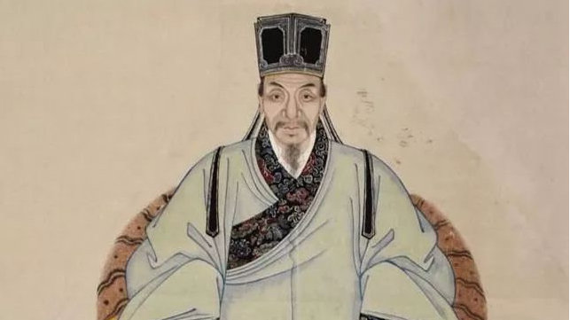
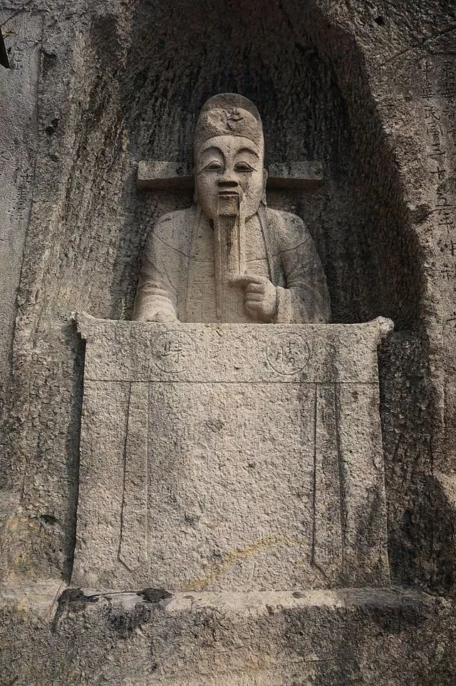

# 胡宗宪悲剧与明代官场的“集体腐败” - 东方历史评论

[_东方历史评论_](https://weibo.com/u/1980953575)    作者： 宗城     发布于 2019-01-25 20:48:19

​​**撰文：宗城**

**《东方历史评论》微信公号：ohistory**

和影视剧的形象不同，史书里的胡宗宪轻生死，重然诺，有豪侠之气，但也放浪形骸，恣情妓乐，是一个官场里的非常人物。胡宗宪生前最大的业绩是东南抗倭，他历任浙直总督多年，主持抗倭事业，诱降倭寇领袖徐海、王直，遏制住了东南倭乱。然而，由于和严嵩、严世蕃、赵文华、罗龙文等严党成员关系紧密，胡宗宪被朝野视作严党，不被清流所欣赏。嘉靖三十五年二月, 胡宗宪正式被严党核心人员赵文华推荐，升任抗倭总督，从此“东南努藏，悉从调取，天下兵勇，便宜征用”。明人张鼎评价胡宗宪的行为说：“不贿则身危而功不成，贿则幸成功而受恶名以死。疆场之臣难言哉，盖千古蹈斯弊也。”这是比较客观的看法。而《万历野获编》有一段话很能代表当时清流对胡宗宪的看法：“自是督臣胡宗宪献芝与白龟同进，上以之谢玄坛告宗庙，赐宗宪鹤袍”；“宗宪在江南亦恣情妓乐，自负嫪毐之器，至拥诸倡女，与幕客宣淫于制府”。

胡宗宪贪污的问题历来存在争议，他贪污的数额、用途成为评判其人得失的一个焦点。在关于胡宗宪的种种争论中，“总督银山”问题值得探讨，从这一问题中，我们能看到清流与胡宗宪的冲突，以及胡宗宪贪污问题的复杂原因。

嘉靖三十八年（1559年）七月，时任浙直总督胡宗宪遭到科道官罗嘉宾、庞尚鹏弹劾，他们指责胡宗宪“扣侵边饷为常规，有‘总督银山’之号”，“而所侵官帑、敛富人财物亦不赀”。第二年，罗嘉宾、庞尚鹏再度弹劾胡宗宪侵占国帑计三万三千两。到嘉靖四十一年十一月，南京户部给事中陆凤仪又弹劾胡宗宪“欺横贪淫”十大罪状，再次抨击胡宗宪“督府积银如山”，导致胡宗宪被捕，并最终自杀。此后，徐阶主修《世宗实录》，将“总督银山”作为胡宗宪确凿无疑的罪状。

后世批评胡宗宪“总督银山”，多是援引《明实录》或《明史》里的记载，其中最原始的一条记录出自《明世宗肃皇帝实录卷五百十五》，见原文：

“南京户科给事中陆凤仪劾奏总督胡宗宪欺横贪淫十大罪，大略言宗宪本与贼首王直同乡，其所任蔡时宜、蒋洲、陈可愿等皆贼中奸细，方直挟倭众突岑港，贼众无几而宗宪按兵玩寇资以牲廪荡废防检，交质往来乃许直，海防之任与为约誓若非。皇上断以必诛神人之愤，安可雪也。而宗宪乃自立报功庙于吴山，意欲既满，纵饮长夜，坐视江西、福建之寇不发一矢，徒日取驿递官民军前粮饷，而斩艾之朘削之，督府积银如山，聚奸如猬......”

然而，胡宗宪是否如罗嘉宾、庞尚鹏、陆凤仪所说的那样“总督银山”，在明史研究中存在争议。首先，所谓的“胡宗宪侵占国帑计三万三千两”经嘉靖朝御史崔栋查证，事实是：这三万三千两白银分两次从嘉兴府库中提出，一次花银一万余两，用于遣散狼兵，一次花银两万余两，用于抗倭各项事务和抚恤伤亡士卒的家属。胡宗宪没有从中贪污，各项数字在当时有帐可查。后来，嘉兴府库要销帐，胡宗宪好友白恭出钱两万两白银，胡宗宪自己拿出一万多两白银，把帐结清。崔栋在报告中说：“宗宪无他，军中所恃有鼓舞人心者财尔。其中用间行饵，贾勇赏谋，苦以尺寸之间，尽以绳墨约之，宁有今日哉?以臣愚见，宗宪可原。”所以世宗才裁定胡宗宪无罪，“照旧督抚地方”。

当然，明朝官员俸禄低微，胡宗宪能拿出一万多两白银销帐，显然是因为他在个人俸禄之外有其他收入。实际上，明代官员在俸禄之外收取其他钱财是普遍现象，在明中后期，它甚至成为中央及地方官员默认的常态，宦官刘瑾专权时，进京述职的官员都要拿出一笔银子孝敬他，而在权臣及其门生的互动中，赠送钱财、字画、古玩家具等也是常见之事。嘉靖中后期，严嵩、严世蕃掌权更是助长了这一风气，凡是不贿赂严嵩父子以示亲近的官员，政治前途都会遭受巨大打击，而只有定期孝敬严嵩父子，官员们才能保住自己的职位。赵连稳在《胡宗宪与明代抗倭战争》一文中考证：

“严篙当政，官吏‘凡迁转，必赂世蕃始得，不尔，必不迁，且中以祸。’王忬出督抗倭，颇有作为，因‘阔外有遥制之优，中枢失内赞之力’，竟以抗倭不力罢去。张经、周琉不买赵文华的账，先后遭其陷害。”

在这种情况下，不但胡宗宪积极向严嵩父子、赵文华赠送钱财古玩，好让当权者支持他在浙江的工作，地方官员也积极贿赂胡宗宪，借宴请之名行贿赂之实。王世贞的《弇州史料》就记录了当时胡宗宪与地方宦官的交往，浙江的宦官们在宴会上公然赠送金银器物给胡宗宪，毫无忌惮之心，可见在当时，这已经成为官员交往的风气。

胡宗宪接受贿赂确是事实，不但他自己接受贿赂，地方官员也积极贿赂他的家人。在当时，身份显赫的官员及其亲属经过地方，地方官员都会拿出豪华的规格接待，甚至赠送钱财，以示忠顺。胡宗宪是嘉靖中后期的政治明星，孝敬他的亲属的官员不在少数，其中，胡家公子更是仰仗父亲的权势，欣然接受地方官的贿赂。由此还延伸出一件趣事：《明史》记载，胡宗宪之子经过淳安，由于不满于接待规格，他把驿吏倒挂起来。海瑞知道后说：“曩胡公按部，令所过毋供张。今其行装盛，必非胡公子。”于是他命人打开胡公子的袋子，袋中数千两金子没收到县库中，并派人告知胡宗宪。好在胡宗宪大度，并没有责怪海瑞。

时人及后世史家争议的关键点在于：胡宗宪接受贿赂后，对这些金银财宝的处置。像罗嘉宾、庞尚鹏、陆凤仪显然认为：胡宗宪中饱私囊，把大量钱财据为己有，于是才有“总督银山”的现象。但据《明实录》《弇州史料》及时人王畿、徐渭等人的回忆，胡宗宪其实将大量钱财用于抗倭事业上。

史料记载，倭寇毛海峰和他的党羽归顺后，胡宗宪“乞加重赏”；嘉靖三十五年，倭寇徐海围攻桐乡，胡宗宪馈送徐海黄金千两、增绮数十箱，以解桐乡之围；后来，胡宗宪为了为诱降徐海、王直，又花了大量金银财宝，“费百余金”。此外，胡宗宪对部下毫不吝啬。他对戚家军“ 给响甚厚” , 有军功的士兵、幕僚都会得到嘉奖。胡宗宪通过钱粮安抚部下，建立威信，使得部下“愿出死力战守焉”。

这些人感恩于胡宗宪，后来，胡宗宪被捕入狱，他们奔走鸣冤。曾在胡宗宪帐下担任幕僚的徐渭作《十白赋》，为胡宗宪辩护，知道胡宗宪自杀后，徐渭闻之悲恸，作《自为墓志铭》，“引巨锥刺耳，深数寸；又以椎碎肾囊，皆不死。精神几近失常，几近癫狂”。

其实，如果胡宗宪真的为了一己私欲“总督银山”，在追赃的过程中，他的巨额财产理应被公开出来。但事实是，史书记载了严嵩、严世蕃父子、赵文华、鄢懋卿的财产或贪墨情况，但却没有披露胡宗宪“总督银山”的证据。在“倒严”是政治正确的嘉靖末年、隆庆初年，被打倒的胡宗宪没有任何权势可言，披露他的贪污腐败情况，不但不会得罪当权者，还能迎合当时的政治风向。因此，如果胡宗宪真是巨贪，佐证他“总督银山”的证据自然会公布，可《明实录》《天水冰山录》《弇州史料》等与此有关的重要史料对此要么含糊其辞，要么避而不谈。可见，无论是徐阶还是朝中清流，都没有在调查胡宗宪时得到他们想要的结果。

所以时人王畿认为：胡宗宪“权位重而责愈备，经费浩而迹愈疑，以一人之情擅六、 七省之刑罚而德怨易至于横生”。王世贞也表达了对胡宗宪的同情，他说：“我知道绩溪（胡宗宪）的功劳，可他被华亭（徐阶）所压制，不能表白他的冤屈。”

嘉靖四十三年（1565），胡宗宪因为疑似“伪造上谕”以及陆凤仪弹劾他的“欺横贪淫十大罪”被捕后，在狱中悲愤写下万言辩诬疏，条理明晰地驳斥陆凤仪对他的弹劾，只可惜在倒严的大背景下，卷入党争的胡宗宪注定无法全身而退，而他也因为疑似“伪造上谕”一事，彻底失去了嘉靖皇帝的支持。嘉靖皇帝不想杀功臣，又希望给清流们一个交代，胡宗宪沉浮宦海多年，很快领会上意，在绝望之中，他含恨写下“宝剑埋冤狱，忠魂绕白云”的诗句，在狱中自杀。

明嘉靖胡宗宪冕官坐像，余姚胜归山胡公岩摩崖石刻

胡宗宪的悲剧是党争激化的结果，也与嘉靖中后期尾大不掉的贪腐风气有关。设若庙堂之人持官中正，内阁重臣守节清正，朝廷拔擢官员，不因贿赂与否定其前途，像胡宗宪这样的能臣干将，也就不必冒着清流的唾骂来贿赂严党，越中四谏、戊午三子也就不会因为弹劾严党而死。明中后期，政坛腐败已经积重难返，纳贿索取，成为官场惯例，一个官员如果不依附权臣、不参与贿赂，就根本无法进入要职，更谈不上主掌一方军政大权，即便是自诩清白的官员，他自己、他的亲属或同门，也往往暗行贿赂之事，例如武宗朝的内阁大学士杨廷和，他的入阁就与弟弟杨廷仪贿赂权宦有关。据陈建《皇明通纪法传全录》记载：

“内阁例用三人李东阳、焦芳、王鏊，而杨廷仪复谋于刘宇，托朱瀛求瑾取其兄廷和入阁，许重谢，瑾许之。至是下手敕取廷和入阁办事，南京尚书入阁自此始。廷仪以白金三千两并金银器皿托朱瀛陈于玄真观，瑾大悦，纳之。”

杨廷和的能力得到李东阳、焦芳和王鏊的一致认可，但由于刘瑾专权，杨氏家族不得不贿赂刘瑾，取得刘瑾同意，杨廷和才得以入阁。到了严氏父子掌权期间，贪腐风气更加严重，官员们不献好于严氏父子，甚至有杀身之祸，因此，胡宗宪总督浙江后积极献瑞、贿赂严党要员，既是为了自己的仕途考虑，也是为了能让他的抗倭计划不至于中断，试想，如果胡宗宪真的为求清白，拒不与严党合作，他根本不可能总督浙江十余年，也无法平衡上上下下的关系，为抗倭筹得足够物资。所以，胡宗宪贪污虽不光彩，却可以理解。如今，真正值得后人反思的并不是胡宗宪贪污本身，而是是什么造成了能臣不得不贪污。与其苛责一人之品行，不如深思大明朝的集体腐败，追究为什么清正的官员难以在这个官场生存。

隆庆六年（1572），胡宗宪沉冤昭雪，并录平倭功勋入国史。至此，关于他的故事告一段落。但大明朝的沉疴弊政，却仍在继续反复，即便有浩浩荡荡的隆万大改革，有高拱、张居正、戚继光等能臣武将的费力维持，沉重的大明朝在短暂中兴后，依然步入黄昏，并最终在十七世纪中叶，结束了它千疮百孔的一生。

------

原网址: [访问](https://weibo.com/ttarticle/p/show?id=2309404332451945142634#_0)

创建于: 2019-01-27 19:32:06