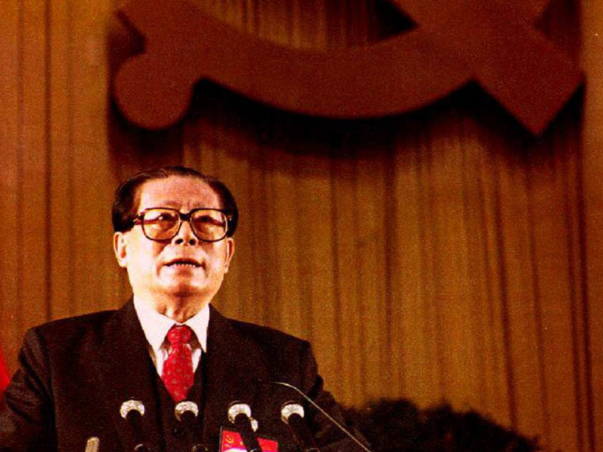

# 喧闹的北京：中国1980年代的民主与启蒙（一）- 多维新闻网

[多维新闻](http://www.dwnews.com/)/[人文](http://culture.dwnews.com/)/[历史栏目](http://culture.dwnews.com/history/)

2019-01-25 07:46:06

## 导语

毛泽东去世后的中国，经过短短几年的调适，就走出了文革的阴影，告别革命走上改革开放之路，在上世纪八十年代，呈现出一幅令人惊奇的思想启蒙与自由民主的“阳春”景象。

1992年时任中共总书记江泽民在中共十四大上（图源：AFP）

**浪潮之巅的学生运动**  

充满理想主义色彩而又“不知油盐贵”的青年学生，是知识分子中最为激进的群体，近代以来都是各种社会运动的先锋。早在四五运动、西单民主墙时期青年学生就参与其中，但青年学生真正登上舞台的中心是在西单民主墙运动被取缔后。  

1979年，中共在抛出“四项基本原则”并取缔西单民主墙的同时，也不得不在政治上做出一些民主化改革。当年举行的五届全国人大二次会议通过了人大代表选举法，决定区县人大代表直选、选民3人以上可以提名代表候选人，并引入差额选举。受此鼓舞，在1980年中国文革后首次人大换届选举中，青年学生争相参选人大代表，形成一股席卷中国的大学生竞选风潮。  

1980年5月，大学生竞选风潮首先在上海萌发，进而席卷全国，在年底的北京换届选举中达到高潮。在北京的选举中，共计有17所高校近百位学生参加竞选，既有平民子弟、学生党员也有如刘少奇之子刘源、林枫之子林炎志这样的红色家庭后代，与学校教职工同台竞争。  

竞选中，大量政治、社会、经济、生活等问题破天荒地在公开场合中被提了出来。在北大，技术物理系王军涛提出“毛泽东不是马克思主义者”，校学生会主席、经济系张炜认为“在现阶段提坚持党的领导是正确的”，女性候选人张曼菱更是提出了“男性雌化”、“女性雄化”、“东方美”、“传统美”等耸人听闻的说法。北师大的6位主要竞选人主张改革“势在必行，但要一步步来”，人大6名竞选者始终宣称参选的目的是为了“中国的政治民主化，而不是任何个人私利”，被称为“贵族代表”的刘源也认为，为了避免文革灾难重演“必须铲除产生封建法西斯的土壤，实现民主”。  

最终，北京有16名学生成功当选，如北京第一个参选的学生北大一分校历史系李胜平，就以1292张选票超过70%的得票率当选西城区人大代表，在北大本部进入候选人名单的王军涛、哲学系研究生胡平、国际政治系杨百揆全部当选海淀区人大，清华大学的罗彬还进入了海淀区人大主席团，刘源则败给了一位学校教师。  

1980年的竞选高潮过后，因为物价上涨影响学生伙食、贪污腐化现象以及1985年日本首相参拜靖国神社，也曾引发学潮。但在胡耀邦的“对话、沟通、协商”政策，以及官方针对学生的不满改善学生生活条件下，学潮都很快平息下去。1984年国庆日的天安门广场，北大学生打出了那幅有名的横幅“小平您好”。  

然而，随着1980年代下半期中国经济形势的恶化，以及贪污腐化、官倒等现象，学生的不满在积聚。1986年12月，以安徽合肥中国科技大学学生不满人大代表等额选举为导火索，一场有150所大专院校的数十万学生参加的全国性学潮爆发。学生们在17个大城市举行游行示威，要求民主，要求新闻自由，要求进一步的改革经济和政治制度。  

在上海，时任上海市长的江泽民听闻学生即将举行游行的消息，曾专程前往母校上海交大与几千名学生会面以阻止游行，从下午13时一直持续到晚上19时，但未能奏效。谈及民主问题，江泽民用英文背诵其了美国总统林肯（Abraham Lincoln）有名的“葛底斯堡演讲”，“你们必须领会亚伯拉罕·林肯的深层含义”，“你们只了解林肯演讲的字面意思，而不了解它的历史背景”。随后江泽民谈起中美的差异来，告诫学生们，尽管他们的出发点是好的，但需要更多的耐心。  

当然，大多数学生并没有被安抚下来，场面激烈时交大85级工业管理系学生贺东东还曾跳上讲台与江泽民辩论。“贺东东在台上接连提了几个问题，每提一个问题，台下就爆发出猛烈的欢呼和鼓掌。”在这场会面的最后，《他改变了中国：江泽民传》这样写道：“尽管这个下午时在令人沮丧的僵局中结束的，但曾经是示威学生和交大校友的江泽民，表现出了面对年轻一代的意愿。”跳上讲台的贺东东后曾长期担任三一重工高管，似乎也并未受到影响。  

在整个游行中，无论是政府还是学生都较为克制，并未采取过激行为。当学生们到上海市政府门前游行时，还打出了一幅颇为有趣的口号——“江泽民，你错了，我们不原谅你了！”“江泽民，你错了，你改过来还是好孩子！”

#### 相关阅读

- [中国文物日本展览意外频发 195件国宝严禁出境](http://culture.dwnews.com/history/news/2019-01-15/60112400.html)
- [春秋笔：毛泽东时代非洲留学生退学风波背后](http://culture.dwnews.com/history/news/2019-01-18/60113383.html)
- [西沙的得与南沙的失：邓小平文革中复出第一战](http://culture.dwnews.com/history/news/2019-01-22/60113952.html)

1986年学潮被视为六四学潮的先声，但也像此前的众多学潮一样，很快就平息下去。但在中共党内，一直以来主张对学生宽容的胡耀邦被迫辞职，保守派占据了优势。当1989年将1980年代学生运动推向高潮的六四学潮发生，并由学生运动扩为各阶层广泛参加的民主运动，党内改革派已经很难掌控局势，在保守派的力主下，以武力镇压为1980年代的中国学生运动划上了句号。  

六四事件后，中国政府当年就通过了《游行示威法》，任何游行示威都需要事先获得政府批准，否则视为非法。但出于社会稳定考虑，除了官方默许的几次，如1999年美军轰炸中国驻南联盟大使馆事件、2005年日本历史教科书事件，中国大陆的学生游行示威已经绝迹。

「版权声明：本文版权归多维新闻网所有，未经授权，不得转载」

撰写：荏苒

------

原网址: [访问](http://culture.dwnews.com/history/news/2019-01-25/60114854.html)

创建于: 2019-01-27 19:41:32

