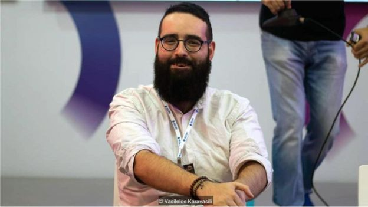

# 希腊年轻人如何在困难时期养活自己 - BBC 英伦网

杰茜卡•贝特曼 Jessica Bateman

2019年1月27日

 
Image copyright Agapi Katroschi 

现年28岁的卡索奇2011年大学毕业，在希腊一直找不到稳定高薪的工作，于是去学了美甲。

斯塔贝洛（Areti Stabelou）来自雅典，从7月开始就失业了，她和24位同事都被电话服务中心裁员。她并不喜欢那份工作，辛苦又耗神 。“除了钱，其它什么也得不到。”她说。

斯塔贝洛今年28岁，2011年获得政治学学位，此后一直在做各种短期且没什么技术含量的工作，电话服务中心的工作也是之一，她找不到更好的。

“我想干点有创意的。刚毕业时想做政治分析或者去非盈利组织工作。”斯塔贝洛说。

父母搬离雅典之后，她需要赚钱来维持生活。“我得养活自己，找到什么工作都行。”

- [古希腊神庙之谜](https://www.bbc.com/ukchina/simp/vert-tra-40954046)
- [古希腊斯巴达勇士的后裔](https://www.bbc.com/ukchina/simp/vert-tra-41834249)

希腊的年轻一代现正处于发达国家最严峻的就业环境当中。这个地中海国家的经济危机已经持续了近10年，各种报道中不乏对青年人高达40%的失业率的讨论，但对不充分就业的问题却远远不够。就算能找到一份工作，很多人也和斯塔贝洛一样，困于一份又一份没有乐趣和技术含量的工作。最低月薪，也是大部分毕业生的工资，已经从经济危机之初的800欧元（920美元）降到了600欧元（690美元），有25%的年轻人生活贫困。这也使得在过去8年里，有大约25万毕业生离开希腊，去其它国家寻找工作。

Image copyright Areti Stabelou 

Image caption 28岁的斯塔贝洛最近刚刚丢了电话服务中心的工作，但还是觉得很快能找到一份更好的。

斯塔贝洛的经历普遍反映了经济危机爆发后大学毕业生们的情况。最困扰他们的并不是找不到工作，而是找不到一份稳定、高薪或是跟自己技能相匹配的工作。很多优秀毕业生都进了服务行业，当了吧台酒保或是餐厅侍应，或者做些促销工作比如站在街上发传单。这类工作很多都没有记录，因此都不算在官方的就业数据里。

卡迪夫商学院研究希腊经济的专家阿格由博士（Michael Arghyrou）表示，希腊的地下经济（指国家无法实行税收管理与监控的经济市场）可能占到了全国经济活动的三分之一。“我相信当中很多都涉及年轻人，这会影响他们的幸福，因为他们没有安全感，也会影响国家的财政。”

斯塔贝洛承认，拼命去找一份稳定满意的工作，这让她心理负担很重。“过去我对自己的未来很紧张也很悲观，有一段时间我相当抑郁，觉得自己什么都不成。” 不过这次失业还轻松一些，因为她现在跟男朋友一起住，在经济和心理上都有了依靠。“我现在有时间去思考自己想要的是什么…我不想再找类似上一份的工作了。”她说。

## 上手学艺

另外一些本来抱有传统抱负的毕业生们也决定再去学一门实用的技能，譬如理发或者纹身。

28岁的卡索奇（Agapi Katsorchi）2011年毕业，取得了政治学的文凭，但一直找不到收入不错的工作，于是去学了美甲。她说：“我想要有创意、有启发性的事业。我本来想要继续深造，但钱不够。（经济危机刚爆发时）我还很乐观，但念完了大学我才意识到危机对我们前途的影响有多大。”2011年夏天她刚毕业时，希腊的平均工资下降了13%。当时政府决定拿出1090亿欧元（1254亿美元）紧急救市，但罢工和示威游行让整个国家陷入瘫痪。

卡索奇说：“我和朋友们都觉得很难找到一份跟自己专业相关的工作，无论这份工作能不能长久。我很幸运能跟父母一起住，自己住的话就会很难。”

卡索奇毕业5个月时看到了一则美甲培训的广告，而在此之前她有两个月的时间都在办公室里做些没有技术含量的工作。女性美容是希腊为数不多的还在增长的产业，这个现象被称为“口红指数”，在很多衰退经济体中都会出现，也被广泛研究。

卡索奇说：“我一直很喜欢给自己和别人画指甲，上了课之后我发现我真的很喜欢这份工作，很有创造性而且薪水不错。”

其他大学毕业生也是如此：卡索奇有个从事美甲的同事拥有考古学的学位。有些人干脆高中毕业就不上大学了，直接去工作。

## 打造未来

有些人在十几岁时目睹了经济危机的爆发，刚上大学时就知道并不一定能找到工作。他们开始想办法，给自己创造其它机会。

25岁的卡拉威利斯（Vasileios Karavasilis）是游戏开发公司eNVy Softworks的联合创始人，他和另外5名同学在读电脑工程本科的同时还自学了游戏软件开发。他说： “我爸爸好几年都没工作，这让我意识到，不能等到毕业后再找工作，得为自己打算，早点就开始。”另外一个问题是，“雇主想要的实践技能大学都没有教，而经济危机之下公司没有钱来培训你。”

卡拉威利斯和朋友们在网上学习，找人指导，参加业内活动，公司4年后才有了的第一位客户。他承认：“有时候很难保持乐观，但有了第一个客户之后就走上了正轨。”

Image copyright Vasileios Karavasili 

25岁的卡拉威利斯经营一家游戏开发公司，自己创造了机会。

他发现学生和毕业生自己创业或者寻找新途径来创造机会是一个趋势。“5年前没人这么干，但现在有很多学生组织鼓励大家走出大学的思维模式，告诉他们要掌握一技之长，自己想办法解决问题。”

“这种鼓励是好的，但也要告诉大家这并不容易。不过以现在的情况来看，也别无选择了。”

## 年轻一代来挽救

斯塔贝洛虽然目前没有工作，但比起一两年前，她现在对希腊年轻人的未来更为乐观。她说：“现在好工作的招聘广告变多了，不再只有电话服务中心或是促销工作。过去10年对我们这代人而言并不容易，但年轻人应该留在希腊，改善现状，改善我们的生活。”

希腊于8月正式取消了紧急救助计划，预计2019年GDP增幅达到2.32%。总理阿莱克斯•齐普拉斯（Alexis Tsipris）已经承诺会提高工资并降低税收。但经济学家阿格由依旧存疑：他认为希腊还是官僚主义太重，商业氛围不够好，还不能实现重大且持续性的增长。

但斯塔贝洛相信，他们这代人能让希腊向前发展。“问题都是上一代人造成的，而我们可以改变。”

**_请访问_**[BBC Captical](http://www.bbc.com/capital) **_阅读_**[英文原文](http://www.bbc.com/capital/story/20181107-what-it-takes-to-be-young-greek-and-able-to-pay-your-bills)**_。_**

------

原网址: [访问](https://www.bbc.com/ukchina/simp/vert-cap-47019397?ocid=socialflow_twitter)

创建于: 2019-01-27 19:48:21