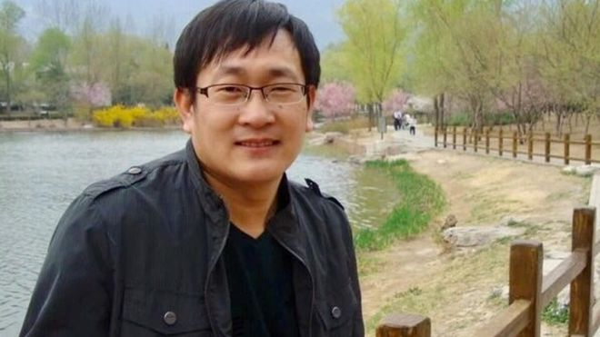
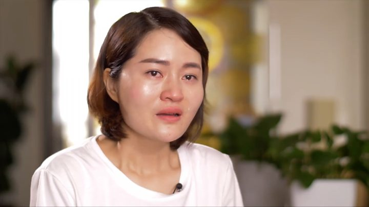
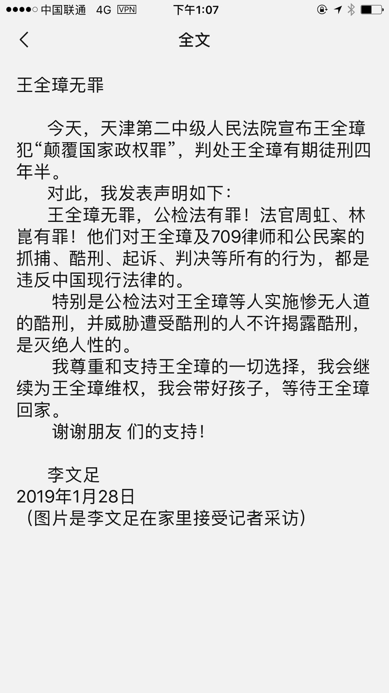
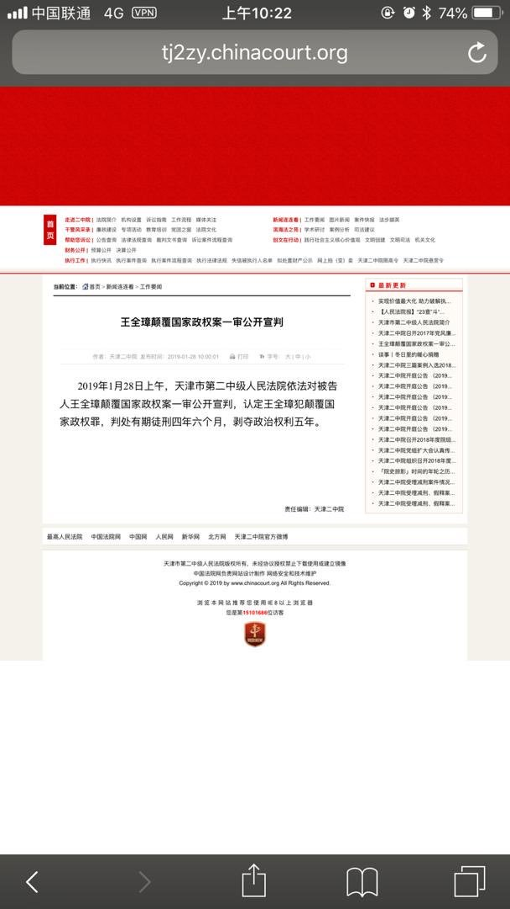
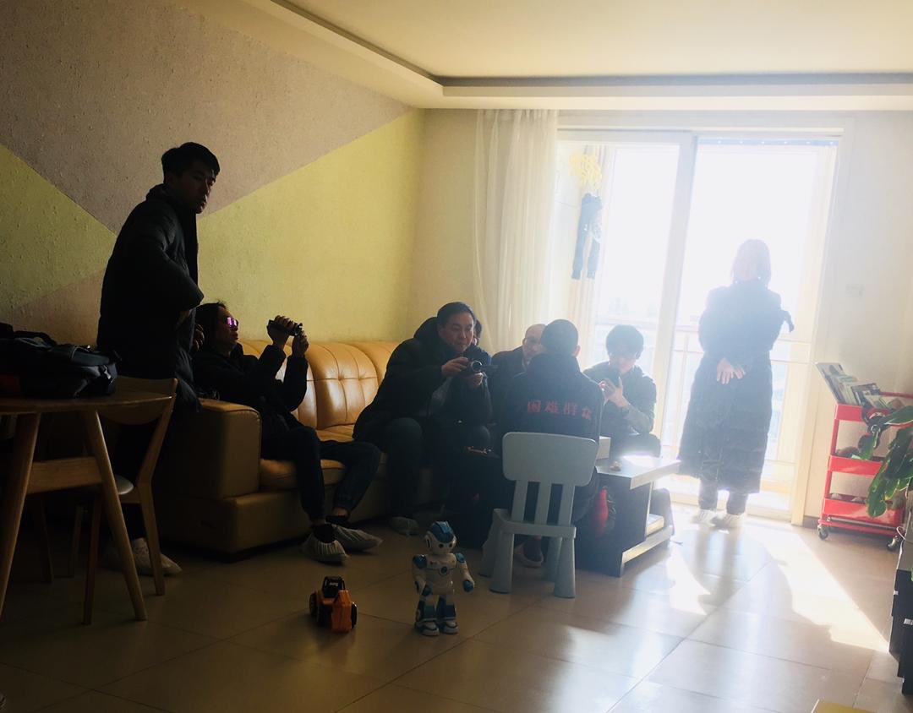
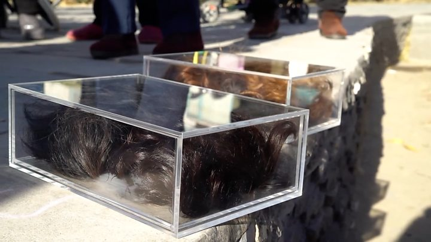

# 709律师王全璋案宣判：中国人权律师“颠覆国家政权”被判囚四年半-BBC-News-中文

2019年1月28日

王全璋在 2016 年 1 月被指控涉嫌颠覆国家政权，被羁押于天津。之后两年多，他一直处于被关押但未知何时受审的状态，直至去年 12 月 26 日的不公开审理。

中国人权律师王全璋被控 “颠覆国家政权罪” 一案在天津市第二中级人民法院公开一审宣判，王全璋罪名成立，被判处有期徒刑四年六个月，剥夺政治权利五年。

此前因大量代理法轮功案等中国当局视作敏感案件的王全璋，在 2018 年底被进行不公开审理之前已经被秘密关押三年。目前尚不知道这三年是否会被算在四年半刑期之内。

他在 2015 年 8 月失踪，当时中国当局对维权律师以及活动人士进行了大规模的抓捕行动。

- [709 事件持续：中国人权律师王全璋案开庭](https://www.bbc.com/zhongwen/simp/chinese-news-46683138)
- [“消失的” 律师王全璋](https://www.bbc.com/zhongwen/simp/chinese-news-39996819)

42 岁的王全璋是 “709 大抓捕” 中最晚受到审判的律师。目前尚未知他是否会作出上诉。

王全璋的妻子李文足则在宣判后坚持表示王全璋 “无罪”，声称会继续为他维权。

李文足此前已经被公安限制在北京家中，未获准出席一审旁听。天津第二中级人民法院称 “因涉及国家秘密，法院依法决定不公开开庭审理”。

英、美、德国与瑞士驻华外交官员到场希望旁听，被拒绝；审理期间有维权活动人士和维权律师的亲人到现场声援，也被公安带走。

## 李文足声明

判决之后，李文足在互联网上声称：“王全璋无罪，公检法有罪！”

在一份网上声明中，她还直指法官周虹和林崑 “有罪”。

“他们对王全璋及 709 律师和公民案的抓捕、酷刑、起诉、判决等所有的行为，都是违反中国现行法律的，” 李文足在声明中这样说，中国执法当局 “对王全璋等人实施惨无人道的酷刑，并威胁遭受酷刑的人不许揭露酷刑，是灭绝人性的”。

她表示，会继续为王全璋维权，并照顾好他们的孩子。

国际特赦组织（Amnesty International）指，王全璋被秘密关押期间很可能受到身体上的虐待，而他的家人也持续受到骚扰。

宣判后，该组织形容中国当局的判决结果 “可耻”。

“今年的判决是极大的不公正。王全璋和平地为中国人权发声却受到了惩罚，” 国际特赦组织东亚区办公室研究员多利安 · 刘（Doriane Lau）在该组织的一份声明中说，“他必须被立即无条件释放。”

王全璋妻子李文足

> 案：以下三图截取自李文足 [Twitter](https://twitter.com/709liwenzu/status/1089752511773270016)

> 
>
> 
>
> 

王全璋在2016年1月被指控涉嫌颠覆国家政权，被羁押于天津。之后两年多，他一直处于被关押但未知何时受审的状态，直至去年12月26日的不公开审理。

一审日期公布后，他的妻子李文足以及另外三名支持者剃头抗议。

庭审之后，联合国曾呼吁中国当局“确保他在审讯过程当中的权利得到尊重”。

"709 抓捕" 家属削发抗议：我可以无发，你不能无法

------

原网址: [访问](https://www.bbc.com/zhongwen/simp/chinese-news-47024773)

创建于: 2019-01-28 23:10:07

