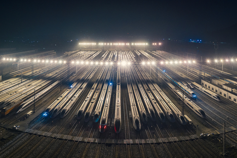

# 谨防高铁灰犀牛 - 财新网

2019 年 01 月 28 日 11:23 来源于 [财新网](http://www.caixin.com/)

> 世界最大规模的中国高铁网络和过低的高铁运输密度（运输收入）预示着重大金融风险。继续进行的大规模高铁建设将给中铁总和地方政府造成更加巨大的债务负担，进而成为撞击中国经济的灰犀牛

2019 年 1 月 26 日，广州，高铁停在检修站内。图 / 视觉中国

[赵坚](http://opinion.caixin.com/zhaojian_mjxx/index.html)

北京交通大学经济管理学院教授、博士生导师，北京交通大学中国城镇化研究中心主任。主要研究领域为 交通运输与国民经济关系研究，集聚经济与城市化，产业组织与企业理论。

> 赵坚最新文章
>
> [深汕特别合作区：特大城市行政区划需要调整的典型例证](http://opinion.caixin.com/2018-08-28/101319522.html)
>
> [对高铁 “外部经济” 问题的思考](http://opinion.caixin.com/2018-04-16/101234979.html)
>
> [京津冀治霾，到底需要什么样的铁路](http://opinion.caixin.com/2017-10-25/101160871.html)
>
> [深化铁路改革：为何改？如何改？](http://opinion.caixin.com/2017-10-09/101153828.html)
>
> [新版北京城市规划如何适应城市发展](http://opinion.caixin.com/2017-04-07/101075396.html)
>
> [铁路供给侧改革改什么](http://opinion.caixin.com/2016-12-21/101029343.html)

**【财新网】（专栏作家 赵坚）**在坚持底线思维、着力防范化解重大风险专题研讨班上，[习近平](http://www.caixin.com/hot/xijinping.html)总书记提出，既要高度警惕 “黑天鹅” 事件，也要防范 “灰犀牛” 事件。截至 2018 年底，中国高速铁路营业里程已达 2.9 万公里。人们通常只看到中国高铁运营里程的世界第一和高铁的快捷，却对事件的另一面 —— 高铁债务和运营亏损的世界第一，及中国交通运输结构的严重恶化视而不见。

　　高速铁路不过是比较快的铁路，正因为要快，所以对高铁线路的稳定性、平顺性要求非常高，由此导致高速铁路的造价是普通铁路的 2-3 倍。因为要快，就要尽可能减轻高铁列车的重量，中国高铁的轴重为 17 吨，而普通铁路的轴重为 23 吨，高铁只能运人而不能运货，更不能运送坦克导弹。因此，只有在人口规模大、密度高的通道，才可能有足够大的高铁客运需求，客运收入才可能覆盖高铁的建设和运营成本。

　　目前，除京沪、京广通道上的高铁运输能力得到较高利用外，其他高铁项目的运能大量闲置，存在严重亏损。例如，兰新高铁每天只开行 4 对高铁列车，其运输收入甚至不足以支付电费，而兰新高铁有每天开行 160 对以上高铁列车的能力。最能反映铁路运输能力利用效率的指标是运输密度，即平均每公里铁路一年完成的运输周转量（每公里铁路创造年运输收入的能力）。

　　2015 年中国高铁中运输密度最高的京沪高铁的运输密度为 4800 万人公里 / 公里左右，最低的兰新高铁仅为 230 万人公里 / 公里左右，全国高铁的平均运输密度在 1700 万人公里 / 公里左右。即使运输密度最高的京沪高铁，与日本东海道新干线 9000 万人公里 / 公里的世界最高密度仍有很大差距，这是因为在该 500 公里的通道上集聚了日本全国约 55% 的人口，还有 4000 多公里的城市轨道交通为东海道新干线集散客流。日本高铁的平均运输密度为 3400 万人公里 / 公里，是中国高铁平均运输密度的 2 倍。中国 10 多年间建设的高速铁路已经是世界其他国家和地区半个世纪建设的高速铁路总和的 2 倍以上。世界各国的高铁几乎没有一条能够依靠客运收入支付建设和运营成本，大多处于亏损状态或靠政府补贴运营。世界最大规模的中国高铁网络和过低的高铁运输密度（运输收入）预示着重大金融风险。

　　继续进行的大规模高铁建设将给[中铁总](http://www.caixin.com/hot/zhongtiezong.html)和地方政府造成更加巨大的债务负担，进而成为撞击中国经济的灰犀牛。

## **巨额负债或引发金融风险**

　　中国高铁主要靠债务融资，大规模高铁建设导致中铁总（原铁道部）的负债也从 2005 年的 4768 亿元，猛增到 2016 年的 4.72 万亿元。中铁总对高铁的收支状况严格保密，但从其公布的负债和客运收入数据，可得出如下判断：即使不考虑高铁的运营成本，高铁的全部运输收入尚不够支付建设高铁的贷款利息，该判断的依据如下：

　　2016 年底中铁总的负债为 4.72 万亿元，其中至少 3.3 万亿元是建设 2.2 万公里高铁和购置动车组的投入，按 4.75% 的利息计算，每年应支付的贷款利息为 1568 亿元。而中铁总 2016 年的客运收入为 2817 亿元，铁路客车保有量 7.1 万辆，高速动车保有量 20688 辆，普通铁路客车的数量是动车数量的 3 倍以上。假设普通铁路客车的客座利用率与高速动车相同，由于高铁票价是普通铁路票价的 3 倍左右，可以认为铁路客运收入的 50% 是既有线列车的客运收入，高铁的客运收入仅为 1409 亿元，还不够支付贷款利息。中铁总已经要靠财政补贴和不断借新债还旧债来维持。

　　虽然中铁总的客运收入在 2018 年上半年达到 1693 亿元，全年或达 3400 亿，但截至 2018 年 9 月，中铁总的负债已高达 5.28 万亿，再考虑地方政府投资建设高铁的债务（目前缺乏这方面的统计数据），已经形成巨额高铁债务或引发国家的金融风险。

## **中国交通运输结构严重恶化**

　　大规模高铁建设导致中国铁路货运周转量的市场份额（不包括远洋运输）从 2005 年的 50%，以每年 3 个百分点的速度快速下降，到 2016 年只占有 17.1%。而其他交通运输方式的货运量都在增加，公路货运周转量的市场份额快速上升到 2016 年 49% 的市场份额。资源总是有限的，大量投资用于高铁建设势必减少普通铁路的建设，这已经导致中国交通运输结构的严重恶化。“铁老大” 在 2016 年变成 “铁小三”，其市场份额已经排在公路和水运之后。大规模高铁建设严重扭曲了中国的交通运输结构。由于铁路货运能力不能满足需求，中国大量用汽车运输煤炭等基础原材料，用稀缺的石油资源运输廉价的煤炭资源，大幅度提高了物流成本，严重降低了国民经济整体的资源配置效率。

### **中国铁路货运市场份额的急速下降是两方面原因造成的：**

　　一是铁路投资大部分用于建设只能运人不能运货的高速铁路，铁路货运能力不能满足经济发展的要求。东部地区的高铁建成后，客运量在增长，但既有线上的铁路客流也在增长，既有线上货运能力根本没有释放出来。大部分高铁的运输能力没有得到充分利用。例如，兰新高铁每天只开行 4 对动车组，而新疆大量 2000 公里以上的跨省运输货物要靠公路。

　　二是中铁总靠铁路货运不断涨价来弥补高铁严重亏损，从而把货主赶向公路运输。由于高铁的运输收入不够支付贷款利息，只能靠铁路货运业务来补偿高铁的运营费用。为了增加铁路货运收入弥补高铁的运营亏损，最直接的办法就是提高货运价格。因为货运需求比客运需求缺乏弹性，且高铁票价已接近飞机票价，涨价空间不大。从 2004 年以来经 11 次调整，中国铁路货运价格水平已由 2004 年的每吨公里 0.08 元逐步调整到 2012 年的 0.1151 元 / 吨公里，2013 年的 0.1301 元 / 吨公里，2014 年的 0.1451 元 / 吨公里，和 2015 年的 0.1551 元 / 吨公里。2004—2012 年的 8 年间，每吨公里运价上涨了 0.0351 元，而 2012—2015 年的 3 年内每吨公里运价就上涨了 0.04 元。

　　某些货物的铁路运输实际价格还高于 0.1551 元 / 吨公里的水平。有媒体披露的一份环保部调研报告显示，“以从黄骅港到邯钢运输矿石为例，铁路运输全部费用约 108 元 / 吨（约 0.25 元 / 吨公里），公路运输与铁路运输距离大体相当，而其全包费用仅为 50 元 / 吨（约 0.11 元 / 吨公里）。国际上铁路运价一般为 0.1 元 / 吨公里，公路运价为 0.3-0.5 元 / 吨公里，中国与国际货运价格体系正好相反”。

　　世界银行按照购买力平价基于 2009 年 —2013 年数据，测算出中国铁路货运价格水平是美国的 1.3 倍。2016 年美国铁路的货物平均运价为人民币 0.1816 元 / 吨公里。大宗货物运输存在规模经济，大宗煤炭货物运输的运价一般低于平均货物运价。2014 年美国铁路煤炭运输的名义价格换算成人民币仅为 0.1248 元 / 吨公里，低于同年中国铁路货运价格的 0.1451 元 / 吨公里。而美国自 1980 年实施 Staggers 铁路法案改革后，美国铁路公司通过组织变革和技术进步，运营效率获得大幅度提高，铁路货运价格不断降低，扣除通货膨胀的影响后，2016 的美国铁路运价水平比 1981 年低 45%。美国铁路的货物运输价格不断下降，降低了全社会的物流成本，产生了巨大的社会效益。

　　铁路货运市场份额的快速下降导致大量的基础原材料要依靠公路运输，加重了空气污染。这一问题在京津冀、长三角等人口密集地区更为突出。柴油货车是 PM2.5 的排放大户，天然气卡车氮氧化物排放甚至高于柴油卡车。虽然政府采用行政手段实行 “公转铁”，2017 年铁路货运周转量的市场份额仍为 17.5%，比 2016 年仅提高了 0.4 个百分点。

　　铁路货运线路和设施建设投资的严重不足制约着铁路货运市场份额的提高。当然还有另一个重要的原因，是铁路运输管理体制没有深化改革，仍然固守高度垄断的僵化体制，不能适应现代物流发展的要求，不能满足高附加值货物的运输需求。这使得货主不得不转向能提供运到时限保证且价格更低的公路运输。

## **为什么对灰犀牛视而不见**

　　灰犀牛不同于黑天鹅，灰犀牛是大概率高风险事件，而黑天鹅是小概率高风险事件，后者难以预测，而前者往往被视而不见。

　　长期以来，中国大量用柴油重型卡车运输煤炭钢铁等基础原材料，超载现象屡禁不止，几千公里的汽车运输中时常造成严重交通事故。对这些现象人们已经司空见惯，而对这些警示中国交通运输结构已经严重恶化、铁路货物运输能力严重不足的明确信号视而不见。

　　对于中铁总高速增长的巨额债务，人们认为中央政府有钱买单，而不予关注。地方政府建设高铁的债务则是黑箱，与地方政府的各类负债混在一起，据统计已高达 18.29 万亿元。2018 年中国高铁的收入或能覆盖按基准利率计算的建设高铁的贷款利息，但仍要由货运收入和财政补贴来分担高铁运营的亏损。即使目前经济效益最好的京沪高铁，是用 2200 亿的资产创造 100 亿元左右的年利润，资产利润率也不到 5%，与银行的基准利率相差无几。债务对应的资产如果不能创造收益，政府就只能靠发行货币来冲销债务。而这将引发严重的通货膨胀，带来巨大的金融风险。一些人乐于夸耀中国高铁运营里程世界第一，而对高铁债务世界第一的金融风险视而不见。

　　更为严重的是，各行为主体的短期利益驱动和现行制度安排使他们对大规模高铁建设的金融风险视而不顾。

　　从建设主体来说，中铁总在高铁运营上的严重亏损和巨额债务使其继续扩大高铁建设的意愿大打折扣，而地方政府则表现出空前高的积极性。各地方政府都试图通过建设高铁来拉动地方经济，多个省市政府提出要在 “四纵四横” 高铁网络的基础上，建设 “米” 字形高铁。因为建设高铁的投资主要或部分来自中铁总，地方可配套建设高铁新城来拉动房地产投资，由此增加地方 GDP 和自身的政绩，而债务的偿还则由下届政府承担。高铁建设是列入政府规划的项目，不能还本付息各地方政府也不用担责，他们有理由对建设高铁产生的债务视而不顾。

　　一些研究人员和咨询机构热衷发表文章论证高铁如何带动地方经济发展来获得研究和规划项目。政府主管部门则希望通过高铁投资来拉动经济，抵消经济下行风险。中国是需要通过投资特别是通过投资铁路来拉动经济，但问题是建设什么铁路、在哪里建铁路能够更好推动经济社会发展。应当按照中央供给侧结构性改革的要求来把握投资方向和投资规模，这就需要按照习近平总书记的要求，提高 “底线思维能力”。

## **交通运输（高铁）发展的底线思维**

　　交通运输业发展的底线思维就是要按照市场经济规律，提高交通运输结构对需求结构的适应性；就要按照两年前中央工作会议的要求，进行交通运输的供给侧结构性改革，“要减少无效供给、扩大有效供给，着力提升整个供给体系质量，提高供给结构对需求结构的适应性”。

　　第一，要有交通运输结构调整的底线思维。2017 年中国铁路货运周转量的市场份额（不含远洋运输）仅为 17.5%，美国是世界上公路运输最发达的国家，但其铁路货运周转量的市场份额一直在 40% 左右。中国交通运输结构的供给侧结构性改革应使铁路货运周转量的市场份额接近或达到美国的水平。

　　2018 年中国铁路的营业里程只有 13 万公里，其中的 2.9 万公里是只能运人不能运货的高速铁路，中国高铁运营里程已相当世界其他地区半个多世纪建设的高速铁路的 2 倍，美国铁路营业里程则为 22.5 万公里。中国高标准普通铁路还有巨大发展空间，但不是高铁。中国铁路的供给侧结构性改革，应着力解决大量高铁运能闲置和铁路货运能力短缺并存的问题，使铁路的空间结构、功能结构与需求结构相适应。

　　铁路要实现高质量发展，不仅需要增加货运能力，把大量由公路运输的煤炭钢铁等基础原材料拉回铁路，而且特别要大幅度增加集装箱、汽车等高附加值货物的运输。但高附加值货物运输有很强的运到时限要求，这就要求铁路路网有一定的富余通过能力，需要建设更多的货运专线或客货混跑铁路，中国铁路的营业里程应达到 26 万公里左右。

　　中国港口集装箱吞吐量居世界第一，占全球港口集装箱吞吐总量的 40% 以上，但 84% 的港口集装箱集疏运由公路运输承担。2017 年全国规模以上港口的集装箱吞吐量为 23800 万标准箱，而海铁联运量为 348 万标准箱，占规模以上港口集装箱吞吐量的比重仅为 1.47%，铁路在长途运输方面的优势不能发挥，严重降低了货物运输效率。而美国集装箱海铁联运比率高达 40%，日本为 38%。中国海铁联运比率低的主要原因，是公路水运和铁路长期由不同专业部门分别管理的政府行政管理体制造成的，各种交通运输方式各自规划、建设和运营，铁路大多不能通到港口，难以形成各种交通运输方式间的协调配合。这种状况至今也很少改变。因此要大量建设连接铁路路网与港口、物流园区、公路货运枢纽的铁路和相应设施，需要进行大量的投资。

　　第二，要建立发展高速铁路的底线思维。高铁只能运人不能运货，只有在人口规模大、密度高的通道，客运收入才可能覆盖高铁的建设和运营成本。即使在人口密度高的京沪通道，京沪高铁的本线到发高铁动车组和客流只占 1/3，跨线高铁动车组和客流占 2/3。发展高铁的底线思维就要设立新建高速铁路的运输密度底线，新建高铁项目的运输密度应高于 3600 万人公里 / 公里，而不是以高铁要连接多少城市、建设 “米” 字形高铁形成所谓几小时经济圈为依据。

　　高铁主要满足消费需求，不能用于运输货物的生产性需求。中西部地区人口规模小密度低，在中西部地区建设只能运送旅客的高速铁路，会造成货运能力不足和高铁运输能力大量闲置，不利于中西部地区的经济社会发展。目前兰新高铁的运输能力大量闲置，兰新通道上铁路货运能力却严重不足，大量货物要靠公路进行数千公里的长途运输。实际上，在人烟稀少的兰新通道上建设高标准普通客货混跑铁路，比建设兰新高铁更有利于新疆的地方经济发展，而且高标准普通铁路同样可以运行时速 200 公里的高铁动车组。

　　实际上，中西部地区的快速出行需求完全可以用低成本航空来解决。目前中国低成本航空的市场份额只有 6.4%，而 2015 年美国低成本航空占航空客运的市场份额为 31.5%，欧盟为 41.2%，东南亚地区则高达 56.4%。中国低成本航空市场有巨大的发展空间，但由于体制上的原因，低成本航空发展缓慢。首先，地方政府对建设高铁比低成本航空有更大的积极性。低成本航空的投资规模小，带来的 GDP 增长远小于高铁，而且高铁主要由中铁总投资建设和运营，不要白不要。其次，民营资本进入低成本航空存在多方面障碍。这些问题需要通过深化改革来解决。

　　第三，要建立铁路服务新型城镇化的底线思维，中国的城镇化已经进入大都市区化的发展阶段，而大都市区是经济增长的发动机。当前中国铁路建设的另一个重点领域应当是大都市区的轨道交通。中国的特大城市和一些大城市出现了严重的交通拥堵，这是轨道交通不适应大都市区发展的市场信号。按未来可能出现 20 个左右人口在 2000 万以上的大都市区、每个大都市区需要建设 2000 公里左右轨道交通推算，中国大都市区的通勤铁路和城市轨道交通的建设规模可达 4 万公里，存在巨大的投资空间。大都市区中一条通勤铁路的长度在 30—50 公里左右，一般不超过 70 公里。大都市区的通勤铁路不仅能够缓解特大城市中心城区在人口、交通、环境、就业、住房等方面的压力，还能够在通勤铁路沿线形成多个中小城市，容纳更多的外来人口，能够在更大空间范围实现更高水平的集聚经济。在通勤铁路车站周边和轨道交通枢纽进行高强度房地产开发，可以使建设通勤铁路带来的土地升值收益回归建设运营主体，可以吸引社会资本采用 PPP 方式进行建设和运营，降低金融风险。

　　基于底线思维进行上述三方面交通运输供给侧结构性改革，需要破解多方面的体制障碍，其中打破铁路高度垄断的运输管理体制、实施改革重组尤为迫切。深化改革，重塑市场主体，才能激发市场活力，才能让市场在资源配置中发挥决定性作用。

**作者为北京交通大学中国城镇化研究中心主任**

责任编辑：张帆 (ZN005) | 版面编辑：吴秋晗

------

原网址: [访问](http://opinion.caixin.com/2019-01-28/101375115.html)

创建于: 2019-01-28 23:21:07

