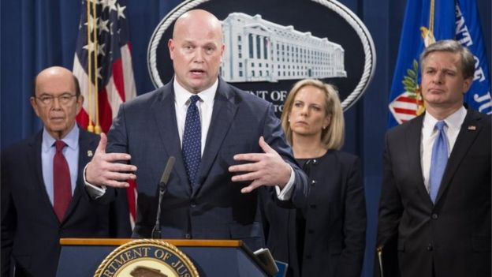

# 华为被控哪些“罪” 细看美国司法部23项指控 - BBC News 中文

2019年 1月 29日

图片版权 EPA 

美国司法部指控华为的罪名在两家法院审理。

美国司法部周一公开指控中国华为技术有限公司、公司首席财务管理孟晚舟以及两家分支机构涉嫌银行和电信欺诈，妨碍司法，窃取商业机密，并违反制裁伊朗的规定，多达23项刑事控罪。

美国代理司法部长马修•惠特克（Matthew G. Whitaker），联邦调查局局长克里斯托弗•雷（Christopher A. Wray）等官员在华盛顿特区主持新闻发布会。

发布会上透露，涉及华为的10项罪名在华盛顿州西雅图起诉，另外13项则在纽约布鲁克林起诉。美国当局正式向加拿大提出引渡孟晚舟的申请。

华为稍后发表声明否认全部指控，声称未发现孟晚舟有任何违法行为。华为声明称，华盛顿西区法院起诉书里关于商业机密的指控已改为民事诉讼，并已得到解决。但美方公布的起诉罪名均为刑事控罪。

惠特克在新闻发布会上说：“起诉书中提及的犯罪行为可以追溯到10年以前，涉及人员直通公司高层。”

- [中美谈判前夕 华为孟晚舟被美国正式起诉](https://www.bbc.com/zhongwen/simp/world-47037396)
- [BBC中国博客: “公关危机”下的华为5G发布会](https://www.bbc.com/zhongwen/simp/chinese-news-47003838)
- [孟晚舟事件的双重冲击](https://www.bbc.com/zhongwen/simp/comments-on-china-46516642)
- [华为“危机”：美议员提议效仿中兴技术禁令](https://www.bbc.com/zhongwen/simp/chinese-news-46903685)
- [华为引发的安全担忧：贸易战和地缘政治对抗](https://www.bbc.com/zhongwen/simp/chinese-news-46527875)
- [华为高管被捕与中美贸易谈判的幕后较量](https://www.bbc.com/zhongwen/simp/world-46472658)

图片版权 Reuters 

根据美国司法部的指控，华为涉嫌银行欺诈等罪名。

**美国纽约东区联邦地区法院提出13件指控**

**被告**：

- 华为技术有限公司（简称华为）
- 华为设备美国公司（Huawei Device USA Inc）
- Skycom Tech
- 孟晚舟

**涉及罪名**：

- 串谋银行欺诈
- 串谋电信欺诈
- 银行欺诈
- 电信欺诈
- 串谋诈骗美国
- 串谋违反《国际紧急经济权利法》
- 违反《国际紧急经济权利法》
- 串谋洗钱
- 串谋妨碍司法

   

## 美国华盛顿西区联邦地区法院提出10件指控

**被告**：

- 华为技术有限公司（简称华为）
- 华为设备美国公司（Huawei Device USA Inc）

**涉及****罪名**：

- 串谋窃取商业机密
- 企图窃取商业机密
- 电信欺诈
- 妨碍司法 

位于西雅图的美国华盛顿西区联邦地区法院起诉的10项罪名针对华为和华为在美国的子公司。罪名包括串谋窃取商业机密、电信欺诈和妨碍司法。

根据该法院的起诉书，华为自2012年起开始密谋窃取美国通讯运营商T-Mobile的“Tappy”技术。该技术通过使用机器人模仿人的手指测试智能手机。

图片版权 Reuters 

华为首席财务官孟晚舟在加拿大温哥华的住宅。孟已于去年12月1日被加拿大扣留，美国已正式向加拿大提出引渡申请。

“为了造出他们自己的机器人，华为的工程师据信违反了与T-Mobile签订的保密协议，”惠特克说，“（他们）偷拍机器人的照片，测量它，甚至偷取其中一个部件。”

根据美国相关法律，串谋窃取商业机密及企图窃取商业机密的公司面临最高500万美元的罚款，或者被盗商业机密价值的三倍罚款。电信欺诈和妨碍司法罪将面临最高50万美元罚款。

在美国纽约东区联邦地区法院起诉的13项罪名则针对华为、华为在美国的子公司华为设备美国公司（Huawei Device USA Inc）、华为在香港的分支机构Skycom Tech，以及公司CFO孟晚舟。罪名主要为银行欺诈及电信欺诈，串谋诈骗美国，违反《国际紧急经济权利法》(IEEPA, International Emergency Economic Powers Act，即美国对伊朗的制裁令)，串谋洗钱，以及串谋妨碍司法。  

**华为1月29日官方声明全文**

_华为已获悉针对公司的指控并感到失望。孟女士被捕后，公司寻求机会与司法部就纽约东区法院的调查进行沟通，但该请求被驳回且没有任何解释。华盛顿西区法院起诉书里关于商业机密的指控已改为民事诉讼。西雅图的陪审团并未发现指控提到的损害或蓄意的恶意行为，双方已经解决了该民事诉讼。公司否认其或其子公司或分支机构曾犯下起诉书中所述的任何违反美国法律的行为，公司并未发现孟女士有任何不当行为，公司还相信美国法院最终会得出同样的结论。_ 

根据纽约东区法院的起诉书，华为员工自2007年起多次对美国政府歪曲华为与其分支机构Skycom Tech之间的联系。Skycom据称是华为在香港注册，用于处理伊朗事物的分支机构。起诉书称，华为员工向合作的银行机构谎称，华为已出售所持有的Skycom股份。事实上，华为将股份卖给了自己。

惠特克说，通过谎称Skycom是独立于华为之外的一家公司，华为对外断言它与伊朗的商业往来均遵从美国对伊朗的制裁规定。这些虚假陈述使得与华为有业务往来的银行在不知情的情况下违反了美国法律。其中一家银行在短短四年之内帮助Skycom完成价值100万美元的交易。

根据该起诉书，2017年，有一家银行出于对风险的考量，单方面决定终止与华为的全球金融业务。但华为告诉其它银行的版本是，华为选择终止与该银行的合作，因为其服务不到位，而非该银行单方面终止与华为的合作。据信华为这么做是为了维持和银行的关系。

起诉书还提到一个“妨碍司法”的细节：2017年，当华为及其分支机构意识到美国当局对他们的刑事调查，华为有意将了解其伊朗业务的证人转移到中国，超出美国当局的管辖范围，并隐藏或毁坏留在美国的相关证据。

------

原网址: [访问](https://www.bbc.com/zhongwen/simp/world-47037405)

创建于: 2019-01-29 19:21:01

