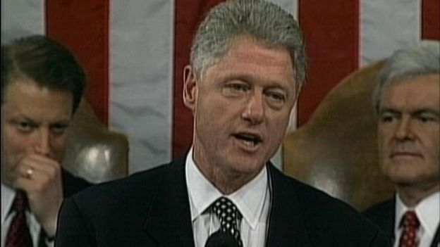

# [中国微信平台引起澳洲网络安全专家的担忧 - BBC News 中文]

2019年 1月 28日

图片版权 Reuters 

Image caption 澳大利亚的安全专家警告说，北京可能通过社交平台微信散布宣传影响澳大利亚联邦选举，因为微信没有像美国的社交平台脸书Facebook和推特Twitter一样受到政府监督。

世事沧桑，十多年的时间内，西方从认为互联网会把中国推向民主的乐观发展到对中国互联网技术和影响力的警惕。最近王毅抱怨中国科技公司华为被西方多国打压。现在澳洲安全专家又对中国社交平台微信（WeChat）发出安全警告。

在2000年当时的美国总统克林顿曾批评中国试图控制互联网的努力，他取笑说，（控制互联网）的难度好比往墙上钉果冻。他还预言互联网终将把中国推向民主。

但是《纽约时报》去年报道说，事实证明克林顿的预言错了。因为现在中国的互联网公司已经已经和美国比肩，和美国一样雄心勃勃，影响力也不输于美国。

- [华为争议：加拿大前情报头目警告5G网络风险](https://www.bbc.com/zhongwen/simp/chinese-news-46961362)
- [华为的国家安全风险：西方和盟国联合布防](https://www.bbc.com/zhongwen/simp/46595173)
- [被华为被视作中国崛起缩影 任正非之女被捕激怒北京](https://www.bbc.com/zhongwen/simp/chinese-news-46470878)
- [中国政府如何审查你的思想？](https://www.bbc.com/zhongwen/simp/chinese-news-41634026)

现在中国网络巨头腾讯的微信平台已经发展成包罗万象的社交，游戏，支付，旅游网络平台。现在中国科技公司已经摆脱了模仿美国硅谷的形象，诸如脸书，苹果等西方公司开始借鉴中国网络平台的创新，吸引客户。

中国网络技术发展另一方面也招致西方警觉。去年晚些时候，西方国家开始以国家安全为由对中国的技术巨头华为公司参加西方5G移动网络建设施行抵制。

澳大利亚政府以国家安全理由，禁止中国通讯制造商华为参加澳洲的5G移动网络建设。去年12月1日加拿大逮捕了中国华为首席财务官孟晚舟，她被指参与欺骗金融机构的行为，违反了美国对伊朗的制裁。

 

美国总统克林顿曾取笑中国控制互联网的努力，说它的难度好比往墙上钉果冻。但是纽约时报报道中国互联网技术十多年来的迅猛发展时说克林顿预言错了。

## 微信的审查和官方宣传

最近又有澳大利亚的安全专家警告说，北京可能通过社交平台微信散布宣传影响澳大利亚联邦选举，因为微信没有像美国的社交平台脸书Facebook和推特Twitter一样受到政府监督。

澳大利亚战略政策研究所的国际网络政策研究室警告说，澳大利亚有150万微信用户，他们可能会受到错误信息，审查，宣传的影响，因为微信是个受北京控制的社交平台。

不过澳大利亚《世纪报》报道说，对于中共通过微信对澳大利亚选举构成多严重的威胁，专家存在分歧。

欧洲和北美国家的政府都表示，必须解决社交平台散布虚假消息干扰选举的问题，诸如克里姆林宫被认为努力破坏2016年的美国总统选举。

澳大利亚战略政策研究所的高级网络安全专家汤姆·乌仁（Tom Uren）说，微信的令人担心之处在于它受到中国的审查和控制，另外还不仅仅是审查的问题，有时候微信会推动某些问题，这涉及控制公众舆论的问题。

这位网络安全专家说，“值得和微信讨论的问题包括如何运营在澳洲的微信平台的问题，在一个理想的世界，政府应该让在澳洲运营的社交平台透明化。”

澳洲媒体报道说，联邦政府通过澳大利亚选举委员会正在同脸书，谷歌和推特沟通，制定对付恶意散布不实信息的办法。但是澳大利亚选举委员会表示，他们没有同微信的母公司腾讯勾通过。

《世纪报》报道说，微信通过复杂的算法系统审查关键词和图像，滤掉那些被认为是恶意诽谤和政治敏感的内容。去年公布的研究发现针对澳大利亚的微信新闻帐号完全没有关于中国政治和外交消息，他们似乎也在服从中国官方设立的限制。

- [“嫦娥四号”登月：崛起大国雄心与地缘政治含义](https://www.bbc.com/zhongwen/simp/chinese-news-46749522)
- [军情六处头目：新技术和政治变化催生第四代间谍](https://www.bbc.com/zhongwen/simp/chinese-news-46441229)
- [未来战争（下）：保持军事优势 美国如何抵消中俄](https://www.bbc.com/zhongwen/simp/world-46348727)

微信上，到底什么能说，什么不能说呢？

## 微信威胁？专家看法不一

网络安全专家担心微信会被用来鼓励海外华人支持某一政党，反对另外一个政党，就像在2017年本纳隆中期选举中发生过的那样。

《世纪报》报道认为，同中共统战部有联系的澳大利亚公民在那次中期选举中大肆批判工党和前总理特恩布尔，因为他们对中国的影响力持强硬立场。

悉尼洛伊研究所的高级研究员麦克格里戈尔（Richard McGregor）说，北京如果有明确喜好（澳洲的候选人），理论上可能干预选举，努力让他们喜欢的候选人获胜，但“我不清楚他们是否有明确喜好，在此意义上说，干涉无从谈起。”

澳洲新南威尔士大学的网络安全专家奥斯汀（Greg Austin）教授接受《星期天悉尼先驱晨报》采访时说，虽然他认为中国推动在澳洲的宣传，但是中国并没有多少干预澳洲联邦选举的动机。

澳大利亚国立大学国家安全学院的负责人麦迪卡尔夫（Rory Medcalf）说，虽然中国有理由影响澳大利亚的政策，但是他们可能会发现很难这样做，因为最近澳大利亚改变了立法，要限制外国对选举的干预，包括网络形式试图影响选民意见的宣传。

据《星期天悉尼先驱晨报》报道，澳洲的特别国务部长霍克说，新法律制造保护选举自由进行，禁止外国政治捐款，禁止外国代理人注册。他说，不让外国捐款人影响澳洲选举，澳洲的机构要遵守法律，这点很重要。

------

原网址: [访问](https://www.bbc.com/zhongwen/simp/chinese-news-47032659)

创建于: 2019-01-29 19:31:11
