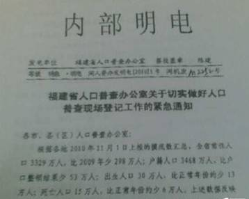
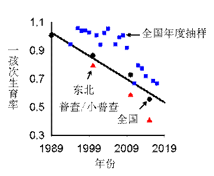
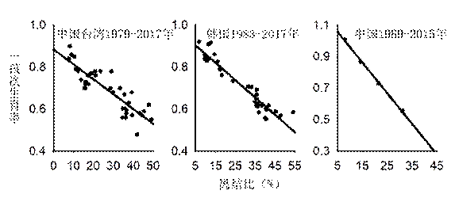

# 再论2018年中国人口开始负增长-胡耀邦史料信息网

作者：易富贤《大国空巢》作者      时间：2019-01-25

## 一、《2018年：中国人口开始负增长》引发的争议

2019年元旦前夕我们完成了《2018年：历史性的拐点—中国人口开始负增长》（简称《2018年人口负增长》，http://www.sohu.com/a/286877692_313480），被法新社、《纽约时报》、《华尔街日报》等数十家国际媒体报道，在国内网站上也数千万人次点击。

我们的观点遭到一些人士的反驳。率先站出来的是何亚福先生（2017年我质疑国家统计局人口总数存在水分时，也是何亚福先生和王丰、陆杰华等主流人口学家站出来反对），他显然并没有用死亡模式（生命表、预期寿命、年龄别死亡率）来推算死亡数，而是用国家统计局公布的出生、死亡数据来捍卫国家统计局的数据。

黄文政先生认为2024年、2025年中国人口才会负增长。我问他的预测参数，得知他根本没有用年龄结构、死亡模式、生育模式、生育率进行预测，只是“想当然”，担心我们的观点太突兀，让决策层难以相信。可见他“只有结论，没有依据”。

2019年1月3日，中国社科院人口与劳动所举办了《人口与劳动绿皮书：中国人口与劳动问题报告No.19》发布会。总报告是南开大学李建民完成的，预测中国人口将在2029年达到峰值14.42亿，从2030年开始负增长，到2050年、2065年分别还有13.64亿、12.48亿。他们的观点得到央视等国内官方媒体的广泛报道。其实他们这次压根就没有预测（2012年蔡昉、李建民等主流人口学家在《中国人口发展报告2011/2012-人口形势的变化和人口政策的调整》中，预测单独二孩、全面二孩后生育率将反弹到2.4、4.4，已经被证明错的离谱，这次可能就不敢预测了）。打着“中国社科院”旗号的所谓“最新预测”不过是复制联合国《世界人口展望-2017年版》（《2017展望》）的预测，而我在2017年在《中国大陆当下人口实证研究——2016年中国只有12.8亿人》（《社会科学论坛》2017年第12期）（http://www.sohu.com/a/218425068_498737）已经分析，联合国人口基金的预测（包括2017年版）每次都错的离谱，无一例外。

《2017展望》的基础数据就是错误的，虚夸中国人口总数和生育率，比如将1990年总人口调高到117245万人，比1990年普查的113368万人多出3877万人；认为2018年中国总人口为141505万，而国家统计局刚刚宣布只有139538万（还有上亿水分），相差1967万；公布中国2006-2010年、2011-2015年的生育率为1.58、1.60，而人口普查和抽样调查显示只有1.36、1.17。尤其是对未来生育率的预测更是夸张的离谱，比如预测2015-2020年、2020-2025、2025-2030年、2045-2050年、2095-2100年的生育率分别为1.63、1.66、1.69、1.75、1.80。

我在《联合国人口基金与中国的计划生育》（《社会科学论坛》2018年第4期）详细介绍了联合国人口基金误导中国人口政策的历史。【摘要】该文作者叙述了联合国人口基金的由来，分析了联合国人口基金如何诱导中国实行计划生育、资助建立人口学。早在1994年的开罗会议上，联合国改变政策，放弃"人口控制"主张，反对"物理强制"，鼓励"精神软制"。开罗会议却对中国公众秘而不宣，联合国人口基金和人口学家掩盖中国计划生育真相，联合国用恐吓性的人口预测误导中国决策。如果不是联合国人口基金的诱导，中国不会贸然实行独生子女政策；如果不是联合国人口基金及其培养的人口学家的"科学诠释"，中国不会如此心安理得地实行几十年的计划生育。如果不是联合国人口基金及其培养的人口学家虚夸生育率、恐吓性预测人口，中国早就停止计划生育了。作者建议，中国应该终止与联合国人口基金的合作，联合国人口基金驻华代表处撤出中国。

1月15日，中央电视台播放了《人口负增长？就业形势不好？部长们组团来“打假”》，其中国家发改委副主任兼国家统计局局长宁吉喆认为，“社会上炒作什么人口的负增长，这个都没有事实的依据的。过去一年中国的人口，仍然在持续增长，增长的数量还是比较大的”。

2019年1月21日国家统计局公布了2018年的人口数据：出生1523万人，死亡993万人，增加530万人，总人口139538万人。2018年是全面二孩的出生高峰年。2015年单独二孩遇冷后，国家卫计委副主任王培安、中国人口学会会长翟振武在《实施全面两孩政策人口变动测算研究》中预测，2016年实行全面二孩政策后，2018年的生育率将达到2.09，将出生2189万（比2016年多422万人）。国家统计局公布2018年不但没有比2016年多出生422万人，反而少生了263万人，说明全面二孩政策遇冷。

但是国家统计仍然公布2018年人口没有负增长。既然这么多学者、官员众口一词质疑我的观点（2018年中国人口开始负增长），他们又得到了国家统计局权威数据的支持，那么我的判断真的错了吗？

其实众口一词并不意味着就正确。我从2000年就开始质疑中国官方公布的人口数据，呼吁停止计划生育；但是一直遭到强烈的反对和质疑，被认为是极端和偏激。现在看来，我当年的判断一次次“不幸言中”。而国家统计局权威数据却一次次被“打脸”。

我非常尊重宁吉喆副主任，并无冒犯他的意思。宁副主任是2016年才开始兼任国家统计局局长，对人口统计并不非常了解，他听取的是人口统计部门的汇报。而国家统计局人口统计部门是刀枪不入，二十多年来，不要说国家统计局局长了，即便是国家领导人也未能撼动这个利益集团。我希望借此机会向宁吉喆局长汇报，恳请他重视中国人口统计所积累的问题，尤其是希望2020年人口普查能够吸取2000年、2010年人口普查的教训。

## 二、国家统计局长期高估出生人数

马克思在《资本论》中引述《评论家季刊》的观点：“有50％的利润，它就铤而走险；为了100%的利润，它就敢践踏一切人间法律；有300%的利润，它就敢犯任何罪行，甚至冒被绞首的危险”。

1990年代中期之前，中小学人数是准确的，因为当时的教育经费是乡、村承担，就在乡、村干部的眼皮底下，学校想虚报是不可能的，政府则没有虚报的必要。1995年通过了《中华人民共和国教育法》，将降低辍学率作为政绩考核。义务教育经费经过“县财乡发”的过渡后，改由中央和地方按比例分担，现在西部地区为8:2，中部地区为6：4，学校、教育机构和地方政府通过虚报学生数既可以获得更多经费，又能“降低”辍学率。

2000年人口普查的生育率只有1.22，0岁人口只有1379万，国家统计局感到难以置信，负责人口统计的副局长张为民、普查处长崔红艳、中国人口学会会长翟振武等人认为教育数据是纯净、真实、可靠的（《人口研究》2003年第4期、2007年第1期），于是根据小学一年级招生数校正出生数据（比如公布2000年出生了1771万人）。他们没有意识到义务教育经费来源的改变导致了在校生的巨量水分。

我在2007年版《大国空巢》中认为小学的毛入学率超过20%，用小学招生数据校正出生人数将有20%以上的水分。但是当时各级教育部门信誓旦旦地认为没有水分，小学一年级招生数从2004年到2013年一直稳定在1700万左右（波动几十万）；而国家计生委、统计局、主流人口学家（包括由300多学者和官员组成的国家人口发展战略组）、联合国人口基金众口一词认为中国的生育率有1.8。“三人成虎，众口铄金”，于是决策层也真相信中国的生育率还有1.8。

十多来，国家统计局心安理得地用教育数据校正出生人数，出生人数稳定在1650万左右。但是教育水分陆续被曝光，比如：

根据中央电视台2012年1月7日的报道（http://news.cntv.cn/china/20120107/118033.shtml），安徽省界首市上报国家报表的小学生51586人，而实际只36234人，虚报42%，套取经费1063万元。

2012年6月4日的《中国青年报》报道（http://zqb.cyol.com/html/2012-06/04/nw.D110000zgqnb\_20120604\_4-03.htm）：2010年湖北阳新县白沙中学上报学生数5266人，是实际2147人的1.45倍！另一所中学，上报3000人，是实际700人的4倍！一个叫“罗于坵小学”已被裁撤了4年多，但仍在获得教育拨款。

2013年6月6日中国广播网转人民网（http://native.cnr.cn/news/201306/t20130606_512757487.shtml）：江西修水县东港中小学，初中实际在校生180人，却上报380人；新湾乡中小学，实际在校中、小学生889人，上报1090人；布甲乡中小学，实际在校中、小学生510人，上报966人。

2013年教育部针对教育统计乱象，决定实行电子学籍。这一举措让学校和地方政府措手不及，导致学生数暂时大为缩水。以湖南省邵阳县为例，2008-2012年统计公报显示这5年小学一年级合计招生71522人，但是2013年电子学籍2-6年级合计只有51253人，说明过去上报学生数虚报了40%。全国的学生数也是大幅缩水，比如2007年的小学1-3年级合计5152万人，到2010年小学4-6年级还有4968万人，但是2013年的初中1-3年级合计只有4398万人，要知道中国的义务教育净入学率高达99.8%。

我在《中国到底有多少人口》（《中国经济报告》2017年10期）、《中国大陆当下人口实证研究——2016年中国只有12.8亿人》中，论证中国人口有上亿水分。有全国人大代表说：“不要说人口数据存在上亿水分了，即便有1000万水分，也是人命关天的大事，对这种集团性、长达几十年的职务犯罪，必须追责！”这里姑且不说上亿水分，只看看是否有上千万水分。

国家统计局公布1999-2001年出生了5307万，这些孩子6岁上小学，2005-2007年小学合计招收一年级新生5137万，与出生人数差别还不大。这些孩子到2010年是9-11岁，不存在漏报了，2010年人口普查显示9-11岁共4264万人；2010年户籍显示9-11岁共4233万人。这些孩子到2015年是14-16岁，小普查（1.55%抽样调查）显示共4249万人，2015年户籍显示共4366万人。这些孩子到2013年读初中1-3年级，在校生合计4398万；由于初中阶段的毛入学率（在校生数占相应学龄人口总数比例）为104%，那么2013年12-14岁只有4228万人。需要说明的是，这个年龄段的死亡率极低。可见国家统计局公布的1999-2001年的出生有25%的水分，光是这三年的出生人数就存在1078万水分了！

同样，国家统计局公布2002-2004年出生了4838万人，2008-2010年小学合计招收一年级新生5026万。这些孩子到2016年读初中1-3年级，在校生只有4288万人；以毛入学率104%计算，12-14岁人口只有4123万人，比统计局公布的2002-2014年出生数少了715万人。

其实初中阶段的人口水分仍然很多，比如2013年、2014年、2015年初一学生分别有1497万、1448万、1412万人，但是2015年、2016年、2017年的初三学生分别只有1430万、1403万、1376万人了，还在不断缩水。

国家统计局公布2018年总人口为139538万，是建立在“1990人口（114333万）+出生（49727万）-死亡（24507万）”的基础上。但是上面已经分析，光是1999-2004年这6年的出生人数就存在1800万左右的水分，那么1991-2018年合计的出生有多少水分？1991-2018年还有800万左右对外净移民。那么2018年的实际人口就远少于139538万。光是这些数据就足以追责了。

## 三、人口数据的“三人成虎，众口铄金”

那么2013年之后的小学招生人数准确了吗？没有！由于小学招生人数攸关教育经费的分配，“道高一尺，魔高一丈”，地方教育机构很快就“发明”了新的对策，更为隐蔽，很难查处，于是教育机构再次信誓旦旦认为没有水分。小学招生人数稳中有升，2013年-2017年分别为1695万、1658万、1729万、1752万、1767万人。

近年国家统计局校正出生人数除了参考教育数据外，也参考户籍低龄组人数、卫生部门的活产数。比如2015年户籍2-8岁人口平均每岁1690万人，比国家统计公布的2007-2013年年均出生1609万还要多；国家卫计委公布2016年、2017年活产了1846万人、1758万人，比国家统计局公布的出生1786万人、1723万人还要多。教育、户籍、活产数据与国家统计局公布的出生互相吻合，联合国的《世界人口展望-2017年版》也公布中国2010-2015年的生育率为1.60、2015-2020年为1.63，“三人成虎，众口铄金”，国家统计局对自己公布的出生数也更加自信。

那么户籍、活产数据可靠吗？1990年户籍还没有水分，户籍人口113274万，与人口普查的113368万相当；但是2000年之后户籍水分剧增，这是因为与户籍挂钩的个人权利有20多项，人们有获取多户口的强大动力，多户口的“房姐”、“房妹”现象很普遍，比如河南中牟县公安局刁家派出所在2010年3月到2011年3月这一年办出了1980个空户口。

国家统计局的《统计年鉴》公布2000-2010年间总人口增加了7348万（出生16127万-死亡8779万=增加7348万；由于“出生”是用教育数据校正，存在两千多万水分，因此实际只增加了4000多万人），而户籍人口却是迅猛增加了10859万，可见户籍增加人口中有六千多万并非“生”出来的，而是“伪造”出来的。2010-2016年户籍人口增加4682万，仍然比《统计年鉴》公布的增加4180万要多。

2010年的时候，户籍低龄组有人如他们的父母一样获得了多个户口，也有一些超生者没有上户，二者大致相当，比如2010年户籍3-9岁人口每岁只有1327万，比国家统计局公布的2001-2007年年均出生1619万要少22%，那么生育率只有1.2左右，与人口普查的生育率吻合。但是2015年户籍3-9岁人口每岁却暴增到1676万，比统计局公布的2006-2012年年均出生1605万（有20%以上的水分）还要多。

2015年户籍低龄组暴增，是因为2010年后对低龄组实行了户籍仁政，不管无户口人员是哪个年代、什么原因（包括超生），都能落户，绝不允许再设障碍，这就导致低龄组水分增加：以前少量还没有上户的超生者上了户口；过去千方百计在异地上了户口的超生者又以“无户口”为由在父母户籍所在地上了户口；尤其是大量非超生者也趁机上了多个户口。2010-2013年，平均每年只活产了1482万人（还有大量水分），但是2015年户籍2-5岁平均每岁却有1712万人，国家统计局也公布2010-2013年均出生了1617万人，可见，后二者有大量人口并非从娘肚子“生”出来的，而是水分。

2008年之前，农民生孩子是自费的，活产还没有什么水分，比如2005-2008年年均只活产了1225万人，与人口普查、抽样调查的生育率相吻合。但是2008年新型农村医疗合作制度（新农合）开始覆盖全国，农民生孩子可以报销医疗费了，各级财政的人均补贴由2008年的每人每年80元提高到2011年的200元（住院费报销70%）、2018年的490元，个人、医院、医疗管理机构有强大动力虚报活产数以冒领经费。加上农民工进城生孩子（又在原籍重复“出生”以报销医药费）的比例增加、低龄组上户限制的放松，导致活产数水分暴增，活产数从2007年的1251万增加到2010年的1422万、2015年的1454万（仍然比国家统计局公布的出生1655万要少）。

尤其是2013年国家计生委和卫生部合并为国家卫计委之后，活产数受到计生系统的干扰，比如2016年实行了全面二孩政策后，为了让出生“符合预期”，国家卫计委公布2016年活产了1846万人（比2015年暴增391万人），比国家统计公布的出生1786万人还多；卫计委公布2017年活产1758万人，也比国家统计局公布的出生1723万人要多。2018年撤销了卫计委，活产数也大幅下降（仍然还有巨量水分）。

在人口总数上，也是“三人成虎，众口铄金”。比如2010年中国的总人口，国家统计公布为134091万，2010年普查公布为133972万，户籍公布为134531万，联合国《世界人口展望-2010年版》公布为134134万，公众和决策层看到这四套数据，会以为2010年中国总人口真有13.4亿。

其实这四套数据虽然总人数是“完美吻合”，但是人口结构却是“霄壤之别”。统计公报认为1991-2010年出生36474万人，扣除死亡人数，那么2010年0-19岁人口应为36149万，20+岁人口为97942万（大致准确）。联合国的0-19岁是36631万，20+岁人口为97503万，可见，联合国的与国家统计局的大致一致。户籍0-19岁是28063万（其中0-2岁还有部分没有上户），20+岁是106468万。人口普查的0-19岁是32274万，20+岁是101698万（多“塞”了3000多万人口）。

如果用户籍的0-19岁人口加上统计公报或联合国的20+岁人口，那么2010年中国实际人口只有12.6亿。2010年年龄结构差异如此之大，本应引起国家层面的高度重视了，但是国家统计局、卫计委却是“抹平”不同数据的总人口的差异。

**四、人口数据应遵从“无菌操作”原则**

医学上遵从“无菌操作”原则：防止清洁创口被污染，并将污染创口变为清洁创口。由于利益的驱动，中国的教育、医疗、户籍人口数据都是“污染数据”。教育部绞尽脑汁缩水教育水分，但是十多年无果；公安部在严厉打击重复户籍，但是户籍水分逐年增加；现在国家卫健委也想获得真实的活产数，但是他们有能力获得真实数据？

正是由于上述这些数据“无一实数”，才需要进行人口普查和抽样调查。人口数据中最可靠的是每10年一次的人口普查（1990年、2000年、2010年），然后是10年一次的小普查（1%人口抽样调查，2005年、2015年）。这两套数据算得上是“清洁数据”。

但是国家统计局、计生委、主流人口学家、联合国人口基金却是用“污染数据”互相校正，看起来是“众口一词”，其实是互相污染，导致人口数据水分增多。尤其是他们竟然用“污染数据”去校正“清洁数据”。

国家统计局公布1991-2000年出生20347万人，死亡7923万人；公布1998年、1999年年末人口为12.48亿、12.59亿人，依照这种惯性增长，那么2000年的总人口应为12.7亿人。但是2000年人口普查汇总人数远低于预期，就临时穿插一项在全国复查、补漏的活动，经过半个多月的重复工作又找回来4000多万人，才变成12.4亿。即使这样，它仍少于1998、1999年的人口数。于是，又‘评估’出一个1.81%的漏报率，追加了2227万（没有“塞”进普查表的各年龄组，因此人口结构还没有太多失真），公布为12.658亿——才与国家统计局过去公布的年度数据勉强衔接。

2000年普查表（总人口12.4亿）0-9岁人口只有15913万人，用存活率推算，1991-2000年只出生16676万人，那么2000年总人口=1990年人口+出生-死亡-净移出=114333万+16676万-7923万-115万=122971万人，但是国家统计局却公布2000年年末人口为126743万人，增加了3772万人才补齐人口缺口。

2010年普查实行“见人就登”、“见户口信息就登”两头登的方式，并通过地理信息系统，精确地绘制出了“小区”地图，达到“区不漏房”、“房不漏户”、“户不漏人”，尤其还给各地规定了应该达到的参考值（达不到就要反复“补查”、“修正”）。这种普查设计，避免了漏报，无疑会提高重报率，导致人口虚多。但是汇总的人口数仍然低于预期。又进行复查、补查、修正数据，最终公布全国人口为13.397亿。多“修正”出来的数千万人口被“塞”进各年龄组中了，导致各年龄数据失真。比如福建省人口普查办的“内部明电”说：“根据各地2010年11月1日上报的摸底数汇总，全省常住人口3329万人，比2009年少298万人。”但“六普”公报（第2号）：福建常住人口3689万。就是说福建省最后公报人口比普查汇总人口多了10.8%。

国家统计局公布1991-2010年出生36474万人，死亡16701万人，增加了19773万人。但是即便依照2010年公布的年龄数据（0-19岁已经被“塞”了一些数据），0-19岁人口也只有32274万人（用存活率推算，1991-2010年只出生了33577万），那么2010年总人口=1990年人口+出生-死亡-净移出=114333万+33577万-16701万-557万=130651万人。但是国家统计局为了与年度公布的人口数据相衔接，却公布2010年总人口为134091万人，意味着多出的3440万人并非“生”出来的，而是被“塞”进20+岁各年龄组。

人口普查对人力、财力的调动不亚于一场战争，比如2010年人口普查直接投入80亿元；600万人参与，间接成本600亿元。本来应该用人口普查数据来校正过去的公布的人口数，但是国家统计局却用年度数据来校正人口普查数据，那么耗费巨大的人口普查岂不是变成了废纸？

尽管2010年普查已经有7000万左右水分了，但统计局官员却仍然认为还存在“超生漏报”，实际人口不止13.4亿。游允中先生是中国人口统计的导师。他来自台湾，曾任联合国统计司主管人口和社会统计的副司长。受联合国人口基金的委托，他指导了中国1982年人口普查，为中国培养了一大批人口统计官员和学者。他也参与指导了1990年、2000年、2010年人口普查。我与他通过邮件进行了长期讨论，但不能说服彼此。我认为由于生育率和出生人数被夸大，国家统计局公布的总人数存在巨量水分。他认为1982年人口普查是准确的，1990年也大致准确；但此后的普查存在漏报，他认可国家统计局公布的出生数。2013年电子学籍的初中在校生人数等数据表明他的观点是错误的，但可惜他已于2011年去世，一直不知道中国人口真相。他老人家是那种思维，国家统计局负责人口统计的官员们就更不用说了，至今还真以为公布的出生是可信的。

二十多年来，国家统计局一直用自己估算的出生数据。如果人口普查证明他们的估算是错误的，意味着二十多年的集团性“职务犯罪”被曝光，应该被追责。他们有“鸵鸟心态”，不敢正视现实，总是用“大数法则”来解决数据间的矛盾，于是人口总数的水分越来越多（现在有上亿水分了），年龄结构面目全非。我在2007年《大国空巢》中就感叹：“中国人口统计已经进入了用后一个假象掩盖前一个假象，再用后后假象掩盖次前一个假象的怪圈，当越来越多的人牵扯进这个怪圈后，承认真相的阻力就越来越大。”

## 五、生育率的变化规律

2000年、2010年人口普查的人口总数和年龄结构由于被“修正”而失真。那么最为可信的就只有生育率了。到2015年为止，“这些数据是调查数据直接汇总的结果，没有经过任何修正和调整”（但2017年的生育率似乎开始被修正和调整了，那么今后连生育率都不准确了），是“最清洁的数据”。总和生育率（简称生育率）是指假设妇女按照某一年的年龄别生育率度过育龄期（15-49岁），平均每个妇女在育龄期生育的孩子数。以2000年人口普查为例，生育率来自长表，共抽样30岁妇女891045人，生了53276个孩子，人均0.05979个孩子；同理，15岁妇女人均生了0.00011个孩子，......49岁妇女人均生0.00372个孩子。总和生育率是假设1个妇女在15岁生0.00011个孩子，......30岁生0.05979个孩子，......49岁生0.00372个孩子，那么将15-49岁所生孩子累计，就是1.18个孩子。可见生育率是15-49岁这35组育龄妇女及其孩子的配套榫卯关系，即便某几个年龄组存在误差，但不至于影响总结果。

2000年人口普查显示生育率只有1.22，2010年人口普查显示只有1.18，2015年小普查显示只有1.05。但是国家统计局、计生委、主流人口学家以“超生漏报”为由将这三年的生育率“修正”为1.8、1.63、1.60。我在《2018年人口负增长》已经分析指出，2000年人口普查的生育率误差不大。

2000年、2010年人口普查显示湖北省宜昌市的生育率分别只有0.97、0.94，很多人也以为是出生漏报导致如此低的生育率。宜昌市委托中南财经政法大学进行了30%人口大样本的深度回顾性调查。他们用常规方法测算，宜昌2000年、2010年、2014年的生育率只有0.84、0.80、0.79，比普查数据还低；他们用年龄递进生育模型（反映进度效应）测算，2000年、2010年、2014年的生育率只有0.99、0.93、0.91，与普查基本一致。

中国所有人都可以合法生一个孩子，一孩次生育率不存在“漏报”，与生育政策无关，而是与生育环境、养育成本、生育意愿相关。比如中国台湾的1980-2017年一孩次生育率与总和生育率平行变化，直线强相关。2011年日本各县的一孩次生育率也与总和生育率直线强相关。可以根据一孩次生育率推算总和生育率。

图1 中国台湾1980-2017年、日本各县2011年一孩次生育率与总和生育率

中国1990年、2000年、2010年人口普查和2015年小普查显示，1989年、2000年、2010年、2015年的一孩次生育率分别为1.01、0.87、0.73、0.56，直线下降，拟合优度高达-0.978，也符合人口变化规律。根据一孩次生育率判断，即便没有计划生育，2010年、2015年的总和生育率也只能达到1.6、1.1，那么在独生子女政策、单独二孩政策下，国家统计局公布的2010年出生1592万、2015年出生1655万是不符合人口变化规律的，是不可信的。

图2 中国全国和东北历年的一孩次生育率

中国的年度0.1%抽样调查的质量非常差。由于有单身、不孕、丁克等人群的存在，正常情况下，一孩次生育率是低于1.0的，随着生育意愿的下降、养育成本的提高、生育环境的恶化，一孩次生育率不断下降。但是中国的一孩次生育率在1996-1999年、2001年、2003年、2004年、2008年竟然高于1.0，其他一些年份（包括2016年、2017年）也是大幅虚高。因此只能采纳人口普查和小普查的一孩次生育率。

中国大陆几十年的计划生育改变了人们的生育观，社会经济模式都是围绕着主流家庭只有一个孩子，多项调查显示理想子女数只有1.7个－1.8个。即便依照国家卫计委的《2017年全国生育状况抽样调查》，理想子女数也只有1.96个，也是全球最低；其中25-29岁、20-24岁、15-19岁妇女分别只打算生1.80个、1.68个、1.65个孩子。而实际生育率远低于理想子女数，比如日本1992年－2010年平均理想子女数是2.53个，实际生育率只有1.37个；中国台湾的理想子女数还在2.0个以上，但是近年实际生育率只有1.1；韩国的20-49岁女性上班族的平均理想子女数还为2名，但是2018年的实际生育率只有0.95。

从城镇化率、婚育年龄、独生女比例、离婚率、结婚率等都可以判断现在中国的一孩次生育率在快速下降。中国的城镇化率从2010年的50%提高到2015年的56%、2018年的59%（育龄人口的城镇化率远高于总人群）。根据《2017年全国生育状况抽样调查》，中国育龄妇女平均初婚、初育年龄分别从2006年的23.6岁、24.3岁增加到2010年的24.0岁、24.6岁，增幅不算大；但是此后快速增加到2016年的26.3岁、26.9岁。

中国超过2/3的孩子是20-30岁妇女生的，即便全面二孩出生高峰的2017年也仍然有65.7%的孩子是20-30岁妇女生的。中国的生育率从1990年的2.3快速下降到1995年的1.46、2000年的1.22，也就是说2010年之后的20-30岁妇女中独生子女的比例在快速增加，她们在独生子女的家庭环境下长大，生育意愿很低。

随着结婚率的降低、离婚率的提高，生育率会不断下降。日本、中国台湾、韩国都是随着离结比（离婚数与结婚数的比率）的提高，一孩次生育率直线下降。

图3 离结比与一孩次生育率

中国三次人口普查和2015年的小普查也显示，1989年、2000年、2010年、2015年的一孩次生育率与离结比直线相关。尤其是2013年之后，中国的结婚率开始下降（历史性的转折），从2013年的9.9‰下降到2017年的7.7‰，而同期离婚率则从2.6‰增加到3.2‰，离结比从2010年的21.5%提高到2015年的31.1%、2017年的41.8%。

## 六、2018年中国人口确实开始负增长

2015年“小普查”的抽样比为1.55%，共抽样了15-49岁育龄妇女5667870人，该年生了175309个孩子，总和生育率1.05。与2010年普查的10-44岁妇女比较，2015年15-49岁妇女每个年龄的抽样比都在1.55%附近，偏差不大；出生人口175309人也理应除以同样的抽样比1.55%，那么2015年总出生1131万人。但是国家统计局却公布2015年出生了1655万人，多出了46%。

国家统计局公布2018年出生了1523万人，只是2015年的92%。将2015年的育龄妇女平移（用年龄别存活率扣除死亡），那么推算2018年的总和生育率只有1.02。

还可以用一孩次生育率的变化规律推测2018年的总和生育率。东北、沪江浙、京津冀合计占全国人口的28%，一孩次生育率下降超前全国。东北的生育率环境最为恶劣，婚育年龄最晚，结婚率最低，离婚率最高，生育意愿最低，一孩次生育率下降超前全国五年左右，比如东北2000年、2010年的一孩次生育率分别为0.794、0.586，相当于全国2005年、2014年的水平。京津冀、沪江浙2010年一孩次生育率下降超前全国2年，2010年都相当于全国2012年的水平。2015年全国、东北、京津冀、沪江浙的一孩次生育率分别只有0.56、0.41、0.50、0.50，那么可以大致估算2016-2020年全国的一孩次生育率分别为0.53、0.50、0.47、0.44、0.41。

从2010年到2015年，全国、东北、沪江浙、京津冀的一孩次生育率年均分别下降0.034、0.036、0.035、0.038。而2015年之后生育环境在加速恶化，离结比和婚育年龄在快速提高，城市化率也在提高，并且经济增长率在持续下降（经济下滑导致养育能力下降和生育率的下降，在发达国家是普遍规律），那么一孩次生育率会继续下降。如果2015-2020年全国的一孩次生育率如2010-2015年那样年均下降0.034，那么2016-2020年的一孩次生育率分别为0.52、0.49、0.45、0.42、0.39。

也就是说，2018年的实际一孩次生育率只有0.45、0.47，再夸张假设为0.50（不太可能）。

一孩、二孩、三+孩占总出生的比例，2016年分别为54.9%、40.0%、5.1%，2017年分别占41.4%、51.8%、6.8%。2017年是全面二孩出生高峰年，二孩占比高。而2018年的二孩占比下降，那么一孩占比应该介入2016年和2017年之间，假设为44%、47%。

如果2018年的一孩占比为44%，一孩次生育率分别为0.45、0.47、0.50的话，那么总和生育率分别为1.02、1.07、1.14。如果2018年的一孩占比为47%，一孩次生育率分别为0.45、0.47、0.50的话，那么总和生育率分别为0.96、1.00、1.06。

可见，2018年的总和生育率确实只有1.05左右（低于1.1是大概率），与我在《2018年人口负增长》中的判断一致。

如果2018年如国家统计局所公布的那样出生1523万人，意味着总和生育率为1.50，如果一孩占比为44%、47%，那么一孩次生育率应为0.66、0.71，相当于2012、2011年的水平。而中国在2011年以来，城镇化率、养育成本、育龄妇女中独生子女比例都在提高，生育意愿在下降，婚育年龄在大幅延迟，离结比在迅猛增加，2018年的一孩次生育率怎么可能回升到2011年、2012年的水平？

2015年中国台湾、韩国的一孩次生育率分别为0.60、0.63，总和生育率分别为1.18、1.24。2018年韩国的总和生育率只有0.95，那么一孩次生育率应该低于0.49。中国大陆的理想子女数比这两个地区更低，2018年的一孩生育率怎么可能如此大幅高于这两个地区？可见，国家统计局公布2018年出生1523万是不可信的。

国家统计局在虚报出生的同时，却少报死亡人数，公布2008年、2018年分别死亡935万人、993万人。中国官方公布的预期寿命与联合国《展望2017》一致，死亡模式应该类似。死亡人口中，75%以上是65+岁老人，依照官方的年龄结构，2018年65+老人比2008年增加了5600多万，死亡人数却只增加了58万，这是非常滑稽的。《展望2017》认为中国2018年65+老人比2008年增加了4965万，每年死亡人数从2008年的889万人增加到2018年的1067万人，增加了177万。而中国官方的年龄结构比《展望2017》要老，公布2018年65+岁人口为16658万人，占总人口的11.9%；而《展望2017》认为2018年中国65+岁人口只有 15839万人，只占总人口的11.2%。中国官方数据的老人比《展望2017》多，死亡人数也应该更多，怎么反而少74万？如果采纳官方公布的人口总数、年龄结构和预期寿命，只有统计白痴才会得出2018年只死亡993万人的结论。

国家统计局的人口数据陷入了一个悖论，如果认可官方公布的人口总数和年龄结构，那么2018年应该死亡1100多万；如果认可2018年只死亡了993万，那么所对应的人口总数就只有12.9亿左右。

本文与《2018年人口负增长》对中国人口的判断一致：2018年中国的总和生育率只有1.05左右，用官方的年龄结构（2018年总人口为139538万）和联合国《展望2015》的中国死亡模式，那么2018年出生1031万人，死亡1158万人，负增长127万人。如果今后的生育率稳定在1.05，那么2050年、2100年总人口分别降至11.36亿、4.63亿，占世界人口比例降至12.5%、5.2%，65+岁老人比例增至31.8%、48.6%。1个65+岁老人对应的20-64岁劳动力的数，将从2018年的5.7个降至2030年的3.6个、2050年的1.8个，将爆发严重的社保、医保危机。20-30岁育龄妇女从2012年的1.25亿的峰值减少到了2018年的1.09亿，还将继续减少到2030年0.73亿、2050年的0.42亿。

如果采纳我在《中国大陆当下人口实证研究——2016年中国只有12.8亿人》中缩水的年龄结构、滞后台湾17年的死亡模式，2018年生育率为1.05，那么出生941万人，死亡971万，负增长30万人。如果今后的生育率稳定在1.05，如果今后的生育率稳定在1.05，那么2050年、2100年总人口分别降至10.55亿、3.94亿，占世界人口比例分别降至11.7%、4.5%，65+岁老人比例分别增至35.4%、48.0%。1个65+岁老人对应的20-64岁劳动力的数，将从2018年的5.9个下降到2030年的3.3个、2050年的1.5个。20-30岁育龄妇女从2011年的1.16亿的峰值减少到了2018年的0.99亿，还将继续减少到2030年0.66亿、2050年的0.39亿。

可见，2018年确实是历史性拐点，中国人口从此开始负增长，人口结构也快速老化（2019年的年龄结构类似于日本1992年），经济活力也将不断减弱，地缘政治、经济格局将发生历史性改变。几十年的计划生育奠定了2012年以来经济下行和今后长期衰退的人口学基础。

日本的生育环境比中国好，生育意愿远高于中国，绞尽脑汁鼓励生育才将总和生育率从2005年的1.26提升到2015年的1.45，但是2018年又降至1.42，今后提升生育率的难度很大。中国台湾、韩国鼓励生育十多年，近年台湾的总和生育率一直在1.1左右徘徊；韩国的总和生育率在2017年只有1.05，2018年更是降至0.95。

而中国大陆的一孩次生育率和理想子女数都低于中国台湾和韩国，意味着等全面二孩的补偿性出生结束后，总和生育率将继续沿着东北的老路下滑。而2015年东北的总和生育率只有0.56，意味着下一代人只是上一代人的1/4。即便中国出台鼓励生育的政策，也很难将总和生育率稳定在1.05，而育龄妇女却在快速减少。

一个在历史上长期占全球1/3左右人口的大民族，因为错误的人口政策，由于主流人口学家的短视和无能（学术腐败比经济腐败的危害更大），一步步沦落为极度老弱的小民族！必须在经济、社会、教育、文化等各领域进行“范式革命”才可能提升生育率，任务艰巨，难度极大。

## 七、人口统计腐败的危害远超经济腐败

人口是国家的根本，人口数据是社会、经济、政治、教育、科技、文化、国防、外交等各项决策的基础。商鞅认为如果不知道准确的人口数据，“地虽利、民虽众，国愈弱至削”，因此规定对人口数据造假者处以“腰斩”，与“降敌同罚”。

元朝从某种角度是亡于统计腐败，中央政府拿不到准确的人口和耕地数据，本应成为国家税源、兵源、役源的人口和耕地，成了权贵的私产。中央财政困难，连赈灾和修黄河的钱都拿不出来，河工们纷纷加入红巾军，元朝“英年而逝”。

明朝的建立者朱元璋为了避免“蹈胡元之弊”，派出军队赴各地统计人口和耕地；对统计造假者，罪在官者处斩，罪在民者充军。但到明朝中期，人口和耕地“无一实数”（到明中后期还是照抄洪武年间的数据），“天下额田已减强半”，不少地方“民间口之籍者，十漏六七”。财政入不敷出，政权“将圮而未圮”。张居正重新丈量耕地，发现过去的隐田率高达40%，将国祚又延续了几十年。

清朝雍正年间取消人头税，才获得了准确的人口数，人口从1734年的9000多万（16-60岁男丁2735万）增至1741年的14341万人，说明1734年人口隐报率极高。

现在没有人头税，隐瞒人口无利可图（超生例外，但占总人口比例很低），而虚报人口不但个人获利，各级政府也获利甚丰。

苏联解体表面上是因为戈尔巴乔夫的改革，但之所以改革是因为社会经济出了问题，后者又是因为低生育率导致劳动力负增长，无法支撑已铺得很大的内政、外交。俄罗斯科学院阿纳托利•维什涅夫斯基教授说，早在20世纪60年代，俄的总和生育率就已低于更替水平，但有关人士用复杂的“游戏”遮盖住了该问题。如果学者根据真实的人口数据进行预警，政府进行战略收缩，是可以避免解体的。普京总统上台上，将人口视为“国家危机”，2002年进行全面儿童普查和全国人口普查，摸清了人口家底，为制定新人口政策提供了翔实的依据，俄的总和生育率从1999年的1.16回升到2015年的1.78，避免了人口崩溃。但是2017年的总和生育率又降至1.62，2018年可能只有1.53，可见俄罗斯的人口政策又遇到了瓶颈。

中国的情况也是如此。1990年后生育率就低于更替水平，当时就应停止计划生育，但是利益集团（国家计生委、统计局、主流人口学家）一次次篡改生育率、出生人数、总人口数，延误了人口政策调整，损失了上亿人口，导致人口结构持续恶化。

由于中国的人口数据被高估了1亿，导致整个社会、经济、政治、教育、科技、文化、国防、外交等各项决策全部是建立在错误的人口数据基础上。我根据真实的人口数据，多年前就对中国经济下行提出了预警（比如2008年就预测了2012年将是中国人口和经济的拐点），预测中国今后经济不可能超过美国。一些企业用官方公布的人口数据无法解释市场的变化，后面问我要人口数据才发现与市场吻合。一些经济学者由于相信了官方人口数据，对目前的经济困境感到茫然无解，不知所措；另外一些学者依据统计局公布的人口数据，预测中国经济总量将很快超过美国，今后将是美国的3倍。

中国官方和联合国虚夸中国人口数据，对国际社会的一些利益集团来说，是“瞌睡来了送枕头”，他们利用虚高的人口数据，预测中国将崛起为“雄狮”，于是将中国树立为“假想敌”，这样他们可以从政府获得更多的经费以防范中国崛起。他们显然影响了政府决策（对他们国家来说也是代价巨大），使得中国近年在外交和外贸上处于被动。

中国的自大和国际社会的猜忌都是建立在虚假的人口数据上的，对彼此都有害无益。还原中国人口数据，有助于增强国际互信和世界和平。

------

原网址: [访问](http://www.hybsl.cn/zonghe/zuixinshiliao/2019-01-25/69140.html?from=groupmessage&isappinstalled=0)

创建于: 2019-01-30 20:33:32

