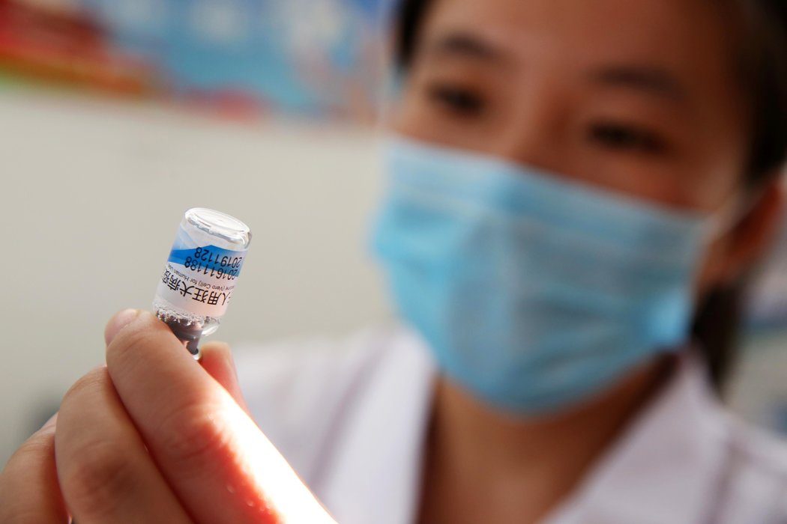

# 从疫苗丑闻看中共执政的合法性 - 纽约时报中文网

黄延中

2019年1月31日

去年，在中国东部安徽省淮北市疾病预防控制中心，一名护士正在准备给患者接种狂犬病疫苗。 Agence France-Presse — Getty Images

本月早些时候，数百名愤愤不平的父母聚集在东部省份江苏金湖县政府大门外，要求就为何[给145名婴儿接种过期的脊灰疫苗](https://cn.nytimes.com/business/20190115/china-vaccine-scandal-protests/)给个说法。这是中国不到七年的时间里出现的第五起疫苗丑闻，也是给这个国家的药品行业、[全国免疫接种项目](http://www.wpro.who.int/china/mediacentre/releases/2015/20150429/en/)、监管机构，乃至中共合法性的又一次打击。

去年夏天，中国最大的疫苗制造商之一被发现流出了至少[25万剂不合标准的白喉、破伤风和百日咳疫苗](https://cn.nytimes.com/china/20180724/china-vaccines-scandal-investigation/)（[后又查出更多](https://cn.nytimes.com/china/20180820/china-vaccines-scandal/)）。不久后，预约打疫苗的应用“小豆苗”对30万父母的调查发现，79%的受试者称在丑闻之前，他们可能已给孩子接种了国产疫苗，但只有36%称他们现在还会这么做。60%的受试者称，他们考虑在中国大陆以外给孩子接种。

[当时](https://cn.nytimes.com/china/20180731/china-protest-faulty-vaccines/)和本月都有一些针对当地官员的[抗议](https://www.scmp.com/video/china/2181730/chinese-official-appears-be-beaten-protest-over-vaccine-scandal)，有时是暴力抗议。去年夏天，一位高级监管官员出现在官方电视台，就公众担心的问题发表讲话后，中国网民[猛烈抨击](https://edition.cnn.com/2018/07/25/asia/china-vaccine-censorship-intl/index.html)他生硬的态度和巴宝莉(Burberry)衬衫，称其在这种场合不合时宜。而政府所采取的惩罚措施——[罢免官员](https://cn.nytimes.com/china/20180820/china-vaccines-scandal/)、[给一家制药企业处以巨额罚金](https://cn.nytimes.com/china/20181018/china-vaccine-fine/)——似乎未能平息民愤。

这些丑闻，特别是丑闻的一再发生，破坏了人们对国家的信任。某种程度上，几乎任何地方都是如此，哪怕只是监管失职，但中国遭受的打击尤重。

如社会学家[赵鼎新](https://sociology.uchicago.edu/directory/dingxin-zhao)所主张的，一个国家的权力基本上有三种合法性来源：诉诸共同的价值观，选举程序的神圣性和法制，或自身的绩效。在中国，共产党掌权至今并非基于普选或法制，该党也无法再诉诸共产主义作为一种整体性政治理论的优越性。因此，它的合法性必须来自持续交付公共产品，如经济增长或生活条件的改善。

民主政府在某种程度上也会对自己的表现感到担忧，因为他们担心失去下一次选举。但民主作为一种政治体制，其合法性源自对基本权利和程序公正的尊重，而非取得具体成果；表现不佳并不会危及这一体制本身。中国则不然，在中国，党即是国家。习近平主席含蓄地承认了这一点——2013年[他曾警告](http://znzg.xynu.edu.cn/a/2017/07/20024.html)：“我们党在中国执政，要是连个食品安全都做不好，还长期做不好的话，有人就会提出够不够格的问题。”

如赵鼎新所论，绩效合法性的部分形式可追溯到中国帝制时期的“[天命观](https://www.britannica.com/topic/tianming)”，这一思想认为皇帝的权威是由上天授予，但持续的前提是他保持着英明的统治。当帝王统治变得无效或成为暴政时，他们就会被政变或革命正当地取缔。

在共产党1949年掌权后，国家更深入地渗透到社会之中，不断作出改善人民福祉的承诺。长期被视为个体责任的卫生保健成为公共福利。但即便是在它不称职的时候，共产主义意识形态和对毛的个人崇拜也使该党的合法性得以维继：例如，大跃进期间的饥荒并没有从根本上动摇毛的权威。

只有在后毛泽东时代，在国家治理的合法性无法再求助于共产主义之后，绩效才成为中国共产党合法性的主要基石。这个方针似乎一度也曾奏效：“如果没有改革开放的成果，‘六四’这个关我们闯不过，” 1992年[邓小平说](https://dengxiaopingworks.wordpress.com/2013/03/18/excerpts-from-talks-given-in-wuchang-shenzhen-zhuhai-and-shanghai/)，他指的是1989年镇压天安门事件那一天。

但邓小平的说法也承认了基于绩效的合法性的内在缺陷：在自上而下、国家主导的政治体系中，绩效与合法性之间的紧密联系非常危险。去年夏天在中国，当我研究污染对健康的影响时，我惊讶地听到包括学者和普通人在内的许多人，将政策失败（如食品安全危机）或经济问题（如不断增加的收入不平等）归咎于“体制”本身的失败。

自2012年末至2013年初习近平开始出任[共产党总书记](https://www.nytimes.com/2012/11/15/world/asia/communists-conclude-party-congress-in-china.html?module=inline)与中国国家主席时开始出现的权力集中，只是强调了这一体系的脆弱性。在一定程度上，由于取消了对国家主席的任期限制，并开展了[大规模的、令人生畏的反腐运动](https://cn.nytimes.com/china/20171130/china-xi-jinping-anticorruption/)，习近平已成为中国的最高领导人。但他的极大权威令各级官员深感不安，产生了意想不到的影响。

低层官员有强烈的动机同习近平站在一边，尤其是当他明确而一贯地发出政策优先级的信号时。例如，在污染控制方面，[他们有时变得过分热心，甚至过火](https://cn.nytimes.com/opinion/20180116/china-environmental-policies-wrong/)。但对于疫苗安全之类时断时续的政府议程，因为担心犯错，地方官员更有可能采取观望态度——口头上遵守指令，但实际上逃避责任。正如独立学者[邓聿文](https://cn.nytimes.com/opinion/20181204/bits-of-advice-chairman-xi/?utm_source=top10-in-article&utm_medium=email&utm_campaign=web)指出的，极度集中的领导导致了一种自相矛盾的局面：以严厉惩罚为后盾的严格监管，实际上可能会变成没有监管，而且几乎没有问责。

[金湖政府的一项初步调查](https://finance.sina.cn/2019-01-10/detail-ihqhqcis4826758.d.html?cre=wappage&mod=r&loc=2&r=9&doct=0&rfunc=34&tj=none&cref=cj)发现，该县卫生院的疫苗管理人员没有遵守使用和储存疫苗的规程。当地疾控中心没有及时报告问题或采取后续监管措施。报告将这些疏忽归因于“管理混乱、工作失职、监管失灵”。

地方层面的政策瘫痪有可能导致重大政策失败和丑闻，而丑闻引发的社会不满往往会让政府神经紧张，有时会反应过度。在去年夏天公众愤怒爆发的一周左右时间里，“疫苗”一词成为[中国社交媒体上最受限制的词汇之一](https://www.scmp.com/news/china/society/article/2156691/china-censors-social-media-posts-about-vaccine-scandal-monitor)。金湖事件发生后的这个月，[一段视频](https://twitter.com/HuaYong798/status/1084432497331429378)在微博和微信上流传，显示了金湖附近洪泽区官员和居民的会面。可以听到一名妇女愤怒地询问她的电话受到了“不明干扰”，她指着当地的公安负责人说，“政府就是用这样的方式关怀、关爱我们的吗？”

那么，中国政府如何才能摆脱其合法性的束缚呢？为了不让人们认为政府提供的公共服务不够，政府应该停止过度承诺，而把精力集中在那些人们认为对他们的福祉最重要的事情上，比如食品和疫苗安全。为了改善在这些方面的表现，政府应该让经济和社会力量发挥更大的作用。例如，它应该向外国产品开放疫苗市场，同时鼓励公民参与监督，并正式确定他们可以报告任何违反安全标准的方式。政府要制定更明确的指令，但惩罚应当不那么严厉、看起来不那么武断，这样也会减轻下级官员的恐惧，让他们有理由承担应做的工作，并减轻政策瘫痪的问题。

中国人民无法诉诸制度，去替换国家最高领导人，无论对政府的表现满意与否，他们都被它困住。尽管如此，共产党的中国通常不愿推行普遍不受欢迎的政策，不愿冒风险引发民众不满。在这个意义上，甚至是中国共产党的统治也是对帝国时代“天命”的延续——在这种传承下，人们有一些理由对中国疫苗安全的未来感到乐观，有理由认为中国的总体政策制定可以更加理性和有效，甚至可能有理由认为党内会对权力下放采取某种措施。

黄延中(Yanzhong Huang)是美国外交关系协会全球健康研究中心兼职高级研究员、西东大学(Seton Hall University)外交与国际关系学院教授。

翻译：纽约时报中文网

[点击查看本文英文版。](https://www.nytimes.com/2019/01/30/opinion/china-vaccine-scandal-legitimacy.html)

------

原网址: [访问](https://cn.nytimes.com/opinion/20190131/china-vaccine-scandal-legitimacy/?utm_source=tw-nytimeschinese&utm_medium=social&utm_campaign=cur)

创建于: 2019-01-31 20:57:25