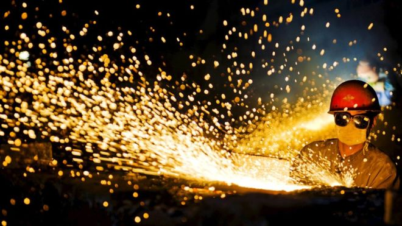
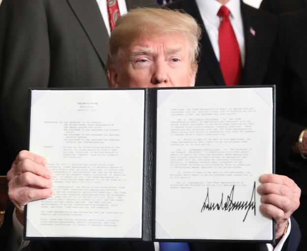
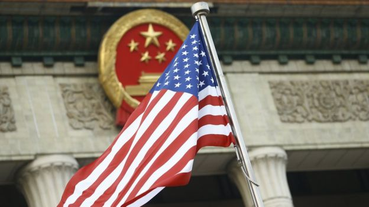

# 中美贸易战会否将中国推向“失落的二十年”？ - BBC News 中文

陈岩 BBC中文记者
2018年 3月 30日

图片版权 Reuters 

特朗普宣布，将对价值500亿美元中国商品加征，仅7个小时后，中国针锋相对公布反制措施，一场贸易战拉开序幕。WTO总干事警告，全球经济增长可能因此迅速下滑。

对于中国而言，“贸易战”还比较新鲜，对美国而言，则驾轻就熟。过去百年间，美国曾对多国发动过贸易战，频度最高的对象就是日本。上世纪80年，这个中国的近邻与美国的贸易争端达到高潮。

当前中国与当年的日本，境遇惊人地相似，然而日本在贸易战后进入“失落的二十年”，经济增长停滞不前，崛起的势头彻底瓦解。这使今日的中国不禁担忧，是否会重蹈日本的覆辙？

- [中美战略性贸易摩擦：断定贸易战到来为时尚早](https://www.bbc.com/zhongwen/simp/business-43553945)
- [中美贸易战：中国的余地和特朗普的目的](https://www.bbc.com/zhongwen/simp/chinese-news-43531738)
- [中美对垒：十问贸易战 输赢且慢论](https://www.bbc.com/zhongwen/simp/world-43536220)

## 中国与日本：不同时代的相似境遇

“1980年代日本工业产能开始逐步超过美国，使美国人感到害怕。相似的是，目前中国强劲的制造业竞争力，被看作是导致美国工作机会减少的主因。”香港科技大学商学院经济发展研究中心主任黎麟祥教授认为，美国在面临被超越之时，无法接受超大贸易逆差。

上世纪80年代初，美国与日本间贸易逆差达370亿美元，占据美国对外贸易逆差的主要部分。这造成美国中西部和东北部等传统工业中心失业率走高，甚至翻倍，最终形成“铁锈地带”。

“当前美中之间逆差则达3750亿美元。即使算上通胀因素，占比也高于当年的美日。”

黎麟祥指出另一个相似点——很多中国企业属于国有，获得了政府的各种帮助；当年的很多日本企业也在各自财团内部的银行获得便宜的信贷。美国认为这些对企业的补贴造成不公平竞争。

 
图片版权 Getty Images 

特朗普称将对价值600亿美元的中国商品加征关税。但目前具体清单还未公布。

“所以美国认为必须要对此采取行动。”受这些因素影响，从1975年开始，美国共针对日本发起了15次“301调查”，甚至一度被称为“80年代的珍珠港事件”。

时隔40年后，相似的原因，促使美国再次举起贸易战的“大棒”，用的武器依然是“301调查”。

香港中文大学商学院会计学院高级讲师李兆波称，除了巨额逆差，80年代日本和当前中国的经济规模都排在世界第二，两次贸易战则都可以看作贸易逆差一方的报复。

站在美国的角度，中国与日本的贸易角色何其相似。反观内部，中国和当年的日本也面临相似的挑战——人口增长趋缓，处于老龄化社会前夕；多年房地产价格高居不下，泡沫开始出现等等。

## 当年是打击盟友，当前则是打击对手

不同时代的两场贸易战，虽然背景相似，但在一些关键领域也有较大区别。在经济学家看来，这些区别使美国对中国发动贸易战的意愿更强。

首先是经济体量的不同。黎麟祥称，中国占美国GDP的百分比，要大于80年代的日本，中国增速也更快，使其很可能在2030年经济上超过美国。

相比当年的日本，美国对中国不满之处也更多，除了贸易不平衡外，还有知识产权盗窃等问题。

更重要的是，黎麟祥看来，日本当时对美国在政治和军事上更依赖，中国则在政治上独立于美国。因此，日本被看作美国的盟友，中国则被看做战略竞争对手。所以在美国眼中，中国的今日带来的威胁要远大于当年的日本。“美国对待当前的问题会更严肃。”

其次，产业结构也不尽相同。李兆波则提到，80年代日本在家电等行业已经因产品质量赢得良好声誉，很多日本的全球化品牌产生在这个时期，就全球化品牌数量而言，今日的中国不及当时的日本，而且日本产品主要在本土生产，中国则主要进行代工。

图片版权 Getty Images 

## 同样的“失落”，不同的后果

日本经济持续衰退，进入“失落的二十年”，并非贸易战直接导致的。“本质上是日本未能成功处理与美贸易摩擦的结果。”中国复旦大学国际关系与公共事务学院学者马萧萧表示。

80年代对日的贸易战并未帮助美国显著减少贸易逆差，美国又将原因归结为美元对日元汇率的高估。1985年，在美国的主导下，包括日本在内的五国在纽约签署广场协议（The Plaza Accord），五国政府联合干预外汇市场，诱导美元对主要货币贬值，以解决美国巨额贸易赤字问题。

广场协议后，为了应对日元升值带来的出口压力，日本积极提振内需，采取宽松的货币政策和积极的财政政策，最终造成疯狂的地产泡沫。马萧萧分析，“日元急剧升值，导致了日本实体经济资金外流、资本涌入等问题，造成资产泡沫，最后导致崩溃。”

黎麟祥对此也表示同意。他同时称，“我不认为中国会同意签署任何与广场协议类似的协议，中国更独立于美国，日本则更依赖于美国。中国会对美国这类需求进行抗争，而日本却没能力这么做。”

- [观点：奋发有为Vs保守孤立——中美关系会进入对抗期吗](https://www.bbc.com/zhongwen/simp/chinese-news-41840897)
- [观察：特朗普对华贸易调查中的几大难题](https://www.bbc.com/zhongwen/simp/world-41827714)
- [再谈修昔底德陷阱：中美较量 必有一战？](https://www.bbc.com/zhongwen/simp/chinese-news-41013152)
- [时隔七年重启 特朗普版中美贸易战指向何处](https://www.bbc.com/zhongwen/simp/business-40971778)

日美、中美贸易战本质上的不同在于中国比日本更具自主性。马萧萧表示，中国应对摩擦的步伐是自主的，调整范围可控。黎麟祥认为，中国应从日本身上学到，在金融领域的改革和汇率改革上，应该坚持自己的路径，而不要屈服于外国的要求。李兆波认为，日本政府当时犯了很多错误，首相更换得过于频繁再加上人口老龄化，使问题加剧，中国也有老龄化问题，但领导人比较稳定。

对于最终的结果，黎麟祥表示，中美贸易战即使真正爆发，也不会持久，涉及范围也不会很广。中国和美国还有很多领域需要合作，比如朝核问题。

至于是否会进入“失落的二十年”，李兆波认为不太可能，人民币和股票市场还未完全开放，政府可以有效控制，而且中国和众多发展中国家关系良好。

马萧萧称，整体来看，中国经济正在逐步向消费导向转变，贸易战的结果中国能够承受。本次贸易摩擦的背后是中美核心竞争力之争，以目前中国的体量以及应对措施来看，贸易战将中国推入一个失去的多少年，应该不会出现。

哈佛大学学者欧纬伦则认为中国目前进行的经济改革如果失败，很有可能重蹈日本在1975年的覆辙，利益集团回来重掌大局，当时，日本五个较大的利益集团基本掌控政府，竞争削弱，创新受阻，经济增长停滞。

如果这发生在中国，则更糟。欧纬伦表示，日本经济停滞时，人均GDP为40000美元；中国此时停滞，人均GDP则只有15000美元，中国人不会满足于这一收入水平，这种不满会变为政治上的巨大压力；如果成功，中国的人均收入增长，会产生更多政治诉求。所以无论如何，经济改革后的政治变化都是不可避免的。

------

原网址: [访问](https://www.bbc.com/zhongwen/simp/business-43595219)

创建于: 2019-02-01 15:53:57

