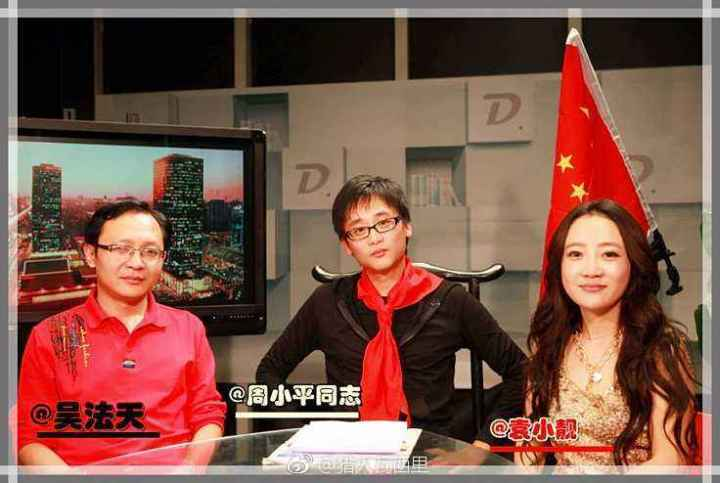
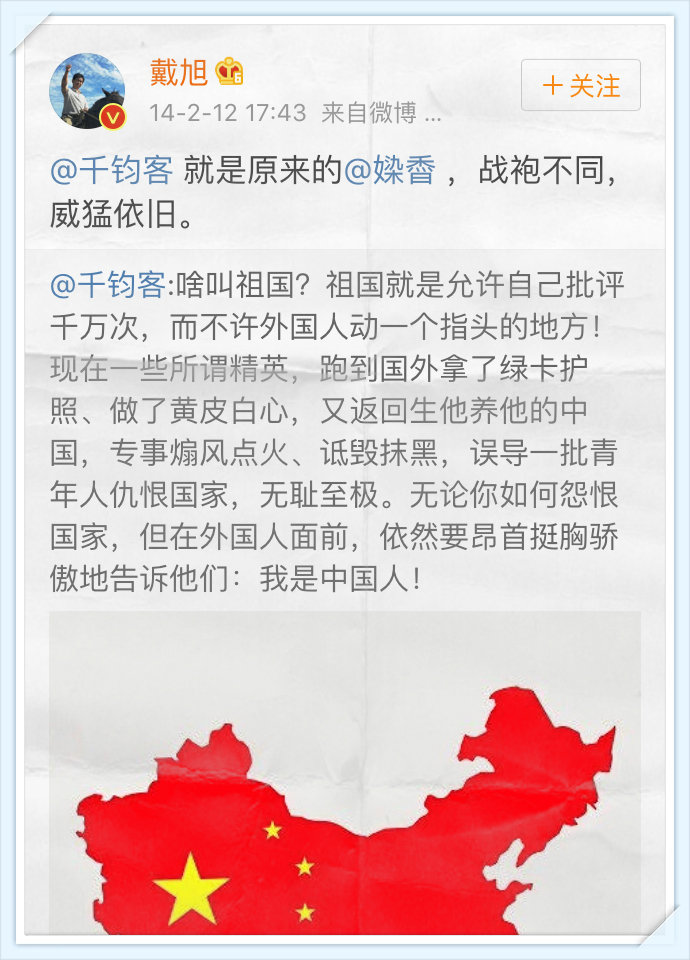

# [染香故事 – 文三娃]

# 染香故事

Posted on [2018年5月24日](https://wentommy.wordpress.com/2018/05/24/%e6%9f%93%e9%a6%99%e6%95%85%e4%ba%8b/) by [wentommy](https://wentommy.wordpress.com/author/wentommy/)

2018年5月22日，久违了广大正能量网友的袁小靓小姐的这条微博，引发了热议。

​想当年靓姨也是军中正能量偶像、青年团指定爱国学习标兵、环球时报牌民族主义火炬手兼著名毛派教育家庆东教授密友……

以前喊人家小甜甜，现在是loser们

​如今……情何以堪，何以堪啊。

粉笔张小龙吐槽教育现状

网友 [@labele](https://weibo.com/n/labele?from=feed&loc=at) 感慨：染香孩子填个表就上学，扭头骂loser，（粉笔）张小龙缴税千万担心孩子上不了学，现在被抓汉奸批斗，太魔幻现实了。

@染香 这个微博营销账号，一度把民间盛赞的正能量女神袁小靓推在前台，与庆东、马南、法天、点爷等有一搭没一搭地合作，花样传播正能量。

正所谓：花红柳绿，千杯不醉；男女搭配，干活不累。

中间的女子就是染香ID之出镜者袁小靓

庆东教授与染香女士举杯庆祝某起钓鱼事件的圆满成功

庆东教授蜜汁自豪

**延伸阅读**

[庆东教授二三事](https://wentommy.wordpress.com/2017/07/30/%e5%ba%86%e4%b8%9c%e6%95%99%e6%8e%88%e4%ba%8c%e4%b8%89%e4%ba%8b/)

[南学笔记](https://wentommy.wordpress.com/%e5%8d%97%e5%ad%a6%e7%ac%94%e8%ae%b0/)

拿染香打艳镲，是庆东教授乐此不疲的小把戏。

弘扬乳家文化

在男人堆里活色生香，小靓、小靓，还故意放纵了同侪男士们的成人话题、带色儿玩笑，染香也因此成为正能量团建活动的最佳搭档，天南地北各种政商埋单的红色“名人行”，游山玩水打秋风的雅事，仿若“无川不成军”， 一度非靓不成行。

三微名人行

红色龙岩行

环球时报组织的新疆行

**​延伸阅读**

[点子正与他的战友们](https://wentommy.wordpress.com/2017/04/12/%e7%82%b9%e5%ad%90%e6%ad%a3%e4%b8%8e%e4%bb%96%e7%9a%84%e6%88%98%e5%8f%8b%e4%bb%ac/)

​

与南子同框

**延伸阅读**

[司马南合影哲学考](https://wentommy.wordpress.com/2017/11/22/%e5%8f%b8%e9%a9%ac%e5%8d%97%e5%90%88%e5%bd%b1%e5%93%b2%e5%ad%a6%e8%80%83/)

崇左名人行

打公知——正能量名博烟台行

体育总局大V行

正能量秋风团

一眼望去，多次与染香携游的点子正、袁国宝、侯宁、石述思、传媒老王……还真是这国正能量商业公关文化的基本盘。

比如大约8点20分发的伊利国乳站台事件。

[在潘刚董事长带领下的大V们](https://wentommy.wordpress.com/2018/05/10/%e5%9c%a8%e6%bd%98%e5%88%9a%e8%91%a3%e4%ba%8b%e9%95%bf%e5%b8%a6%e9%a2%86%e4%b8%8b%e7%9a%84%e5%a4%a7v%e4%bb%ac/)

正能量秋风团里出勤率最高的，大概是自干五大统领点子正先生，小靓与国宝，并列亚军，也算得袁门双杰了。

​这个网络名人走进张家口，其中的重要活动就包括这个“新媒体舆论引导战略研讨会”。

​

中间的白领是小靓女士，傍边的眼镜就是新媒体舆情巨师国宝先生​
​

正能量三叉戟

**延伸阅读**

[周小平专题](https://wentommy.wordpress.com/%e5%91%a8%e5%b0%8f%e5%b9%b3%e4%b8%93%e9%a2%98/)

​当袁小靓定居美国，秀她在当地电影院看完战狼II后的热泪盈眶时，那些延请她担任红色旅游贵宾的革命老区红区领导们，怕是看着手里积攒的餐饮游乐发票，欲哭无泪了。

 女孩的心思，您别猜？​

鄙人倒觉得，像染香这类网络时代的情绪引导师，看似多变随机，其实深谋远虑，有路径可循。

​这冷不丁蹦出来的一句：中华人民共和国日本省，显然是要收割U型锁爱好者们的喝彩与崇拜。

日本省

走进八一

解放军小伙子，你们的靓姨来了！

红军小伙子对袁小靓的青睐，怕是媲美了蓝军少男对邓丽君的期待。何日君再来？佳人已不在。

靓姨来了，又坐飞机漂洋过海。

很可能会后悔：再坐飞机归来。

 ▼▼▼

袁小靓之“五转公”，湖北随州杨氏恒均先生堪称领路人。

2014年12月11日，在加拿大联邦政府注册的国际新媒体合作组织(International New Media Cooperation Organization )在北京宣布成立。

[国际新媒体合作组织成立 杨恒均担任主席](http://chuansong.me/n/987234)

​

杨先生与时任生活秘书袁小姐合影

老杨头护花

杨先生何许人也？

自称老杨头，江湖人称“民主小贩”，右派气质昭然若揭。

杨的线上线下言论与行动，更契合现代意义的公共知识分子之定义，也就是所谓“公知”。

而袁小靓曾以“打公知”知名并自豪。

所谓“不打不相识”，普通境界的是成朋友，中等境界是成同事，最高境界，是结合为夫妻。

 袁这枪法可不大准，甚至backfire，造成夫君躺枪。

笔者曾当过三年的射击运动员，知道玩儿枪最大的忌讳之一：别用枪口冲人，哪怕开玩笑都不行。

小靓小姐这瞄准姿势…….

瞄准公知——名博渤海老区行

袁小靓女士职场道路之右倾转弯，似乎对标了宋氏三姐妹之庆龄，也担负起了重任，达成了担当一位海外著名华领生活秘书之人生愿景。

杨常年生活于海外，但与内地有千丝万缕的联系，也一度成为“大外宣”栋梁，参与为伟大时代鼓与呼的各种活动，娓娓道来厉害了我的国（注：中国）。

正能量名人行，各种溢美背书，或正是这样的奔忙的旅途中，与“打公知”的袁小靓找到共鸣，也就是不分东南西北前后左右的最大公约数。

▼▼▼

月有阴晴圆缺，人有旦夕祸福。

2019年1月18日杨先生在内地失联，疑被当局扣押。

澳大利亚广播公司援引澳外交部消息称：中方已知会澳大利亚领事官员，杨恒均在中国被扣查，澳方正了解被扣查原因，并寻求领事探视。

2011年杨有过类似经历，也是友人放风被扣，事后杨解释道歉，失联因身体有恙并手机关机。

杨的推特最后更新日期为2019年1月17日，朋友圈为18日，鄙人23日上午的私信，未获回复。

 据BBC等媒体报道，与杨同行回国的，还有妻子袁瑞娟女士。

在杨先生被扣三天之后的1月20日，袁女士发了一条抵达北京首都国际机场的微博。

袁小靓是袁瑞娟的笔名，她还曾代言过网红级ID：染香。

坊间感慨：

**自纽约携眷归故国，疑谍影羊城被头套。**

2019年1月24日，大陆外交部正式发布消息，杨被拘捕一事，实锤了。

也借此以一名普通网友身份向袁女士表达关切，亦希望杨先生不被当做筹码或棋子，包括他出生国中国以及在籍国澳大利亚。

更奢望各国政府为所谓国家利益外交颜面角力博弈时，不要太过无视牵涉其中的个体公民权益，保留一点起码的情理和法理。

 ▼▼▼

话已至此，需要对“染香”这个著名ID做一个梳理澄清。

染香一般指袁小靓，正能量公关女明星，后成为海外右翼华领杨恒均生活秘书（后结为夫妻）；染香姐姐则是民间维权人士，公民行动街头参与者，南方周末事件主角之一，辗转流亡，现居美国；媣稥则是前江苏公安厅干警李某江网名，后被销号，现用网名千钧客，最知名的大陆正能量斗士之一。

染香姐姐

染香姐姐吐槽袁小靓

媣稥，已被销号

鹰帝验明媣稥转世正身

**延伸阅读**

[鹰帝考](https://weibo.com/ttarticle/p/show?id=2309404251935334089817)

▼▼▼

君得小靓妇靠骄杨，这杰出华领与生活秘书的日常， 一度开始变得不那么恢弘壮大，风停雨歇，晾衣晒被，婆婆妈妈事，油盐酱醋茶。

**推友赞这一时佳话：老杨头巧施壮男计，粉红军痛失靓先锋。**

**横批：左右逢源。**

又及：

说鄙人此文为怼恒均先生，冤枉。

有过一面之缘，彼时四十大几的老杨头，机敏跃动，倒像三十出头。

娃言无忌，也时不时调侃他党员身份，揶揄其大一统情怀。

尤其爱看他与南子等比党龄比贡献时的声情并茂。

一个自带charisma气质的趣人， 可算不伪不妄。

算不得朋友。

没友情包袱也好，可以表达喜欢，也可随性吐槽。

是为记。

------

原网址: [访问](https://wentommy.wordpress.com/2018/05/24/%e6%9f%93%e9%a6%99%e6%95%85%e4%ba%8b/)

创建于: 2019-02-02 19:09:10

