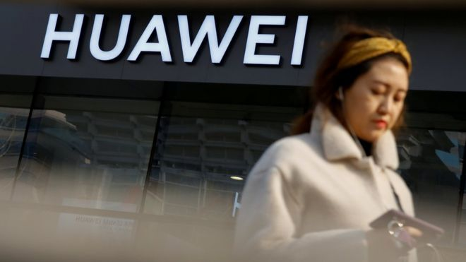

# 观点：华为案是中国领导人处理外部危机的试金石 - BBC News 中文

虞平 旅美学者、原美国律师协会法治项目中国主任

2019年 2月 2日

 
图片版权 Reuters 

**（注：本文不代表BBC立场和观点）**

过去一周美中关系发生了两大事件：第一，一月二十八日，美国联邦司法部高调起诉华为公司违反美国对伊朗出口管制法以及侵犯美国公司知识产权行为，并正式向加拿大政府提出引渡华为高管孟晚舟女士；第二，从一月三十至三十一日为期两天，中国副总理刘鹤率领高级代表团访问美国，与美国政府密集磋商贸易纠纷解决方案。

毫无疑问，这两大事件非但相关，而且均列入两国首脑的重要议程中，可以说两者相互关联、密不可分。但是令人诧异的是，在刘鹤与美国贸易谈判团结束会谈后，直到与特朗普总统公开见面，双方对于华为案件讳莫如深，仿佛此事不在美中商谈内容之列。更为诡异的是，中国官方在对美国公开高调起诉华为，特别选择在美中贸易高层会谈之前的敏感时间点发布起诉消息一事并没有过度强烈反应。

除了外交部例行公事地指责美国利用法律起诉华为不道德、应当释放孟晚舟女士外，并无舆论谴责升级的迹象。甚至有证据表明，受到政府控制的民间舆论这次也相当低调，对华为遭到全面起诉并无大规模爱国主义情绪的宣泄。政府是否已经意识到：在目前情况下，爱国主义情绪对解决问题于事无补，而美中贸易摩擦如不解决将对美中两国的经济造成不可估量的后果，因此通过网络控制手段压制了民间对美国的情绪反弹？

虽然，在一个透明度非常差的封闭社会中，人们无法知道决策的过程及其理性支撑，但是这次美中两大事件实际上隐隐透露出一个重要的信息：中国领导人已经决定将华为案件与美中贸易摩擦脱钩。如果这是事实的话，说明中国领导人对于处理美中摩擦问题逐渐回到了理性的轨道。

- [华为在捷克投标受阻 “封杀行动”再添战线](https://www.bbc.com/zhongwen/simp/world-47066125)
- [华为孟晚舟案：金钱与原则的博弈，中国与加拿大关系的危局](https://www.bbc.com/zhongwen/simp/world-47052526)
- [中国华为和其“公关危机”下的5G发布会](https://www.bbc.com/zhongwen/simp/chinese-news-47003838)

 
图片版权 Reuters 

孟晚舟是华为创始人任正非之女。

## 争相表现忠诚

华为涉美案件是否法律问题，从来就是仁者见仁智者见智。而从目前的国际外部大环境出发，中国最好的做法是将其作为一个纯粹的法律问题来处理。首先，华为涉及的两大问题：违反美国对伊朗制裁法律和侵犯T-Mobile的知识产权问题均是法律问题，至少表面上与政治无涉。

设想如果没有各类的评论──即美国政府过去数十年的国会听证会和大量国家安全报告，以及特朗普说他可以为美中贸易达成协议干涉孟晚舟案这种不恰当评论──估计不会有很多人去质疑此案的法律性质。毕竟，美国司法部起诉书里列举的指控确实是违反法律的行为，况且过去司法部为类似事件也处理过很多国际大机构，包括世界著名银行和美国顶尖大公司，在这些案件中，鲜有外界指控美国政府政治操控或者迫害。

其次，美加均为法治国家，同时也是高度政治分权的国家。在引渡孟晚舟案件过程中涉及到一系列的法律程序，这些程序均属于高度技术型的法律环节，二国行政当局即使想有所作为也很难干涉司法，更何况有双方大量的律师参与引渡程序的法律环节，任何人欲作弊或者影响引渡结果均是极其困难的。

 
图片版权 Reuters 

Image caption 在华为首席财务官，华为创始人的女儿孟晚舟在加拿大被捕后，中国要求加拿大立即放人，之后中国逮捕了两名加拿大人斯帕弗颇（左）和康明凯（右）。

第三，当孟晚舟被引渡至美国后，等待她的还是相当复杂的法律程序以及受到美国宪法保护的被告人基本权利，加上华为已经为她聘请了由美国顶尖律师组成的强大律师团队，如果坚持做最大限度的辩护，相信她的案件在美国联邦法庭将会旷日持久，鹿死谁手尚未可知。

就中国国内对华为案件的反应来看，基本分三类。首先是民众的爱国主义反美情绪。多数民众在国内有限资讯范围内获取信息，并因为华为案件产生的爱国主义情绪是可以理解的，特别是在中国国力上升过程中，民族自豪感也会成为爱国主义升温的催化剂。其次，政府的公开反应，这部分涉及到国内政治的正确性问题，因此各部门彼此竞争性地表现出对国家及领导人的高度忠诚度，发表了相当激烈的言辞。特别是外交部门的表现荒腔走板，驻外大使竟然对加拿大政府进行直接的攻击，置事实与法律于不顾，贬低他国领导人，实在有失外交使节的基本礼貌。

值得指出的是，在这次中加交锋中，中国采取了关押加拿大人的做法已经超越了国际社会的底线，对加拿大毒品被告的匆忙死刑判决也进一步暴露出中国司法颟顸野蛮的一面，可以说是败笔层出，给中国多年来处心积虑建立的法治形象造成了不可估量的损失。

 

## 国际大公司应有的格局

然而，华为公司本身的反应却是这次事件的惊艳一笔。华为在是次公司生死存亡的大事面前，展现出了一个国际大公司的基本素质。它既没有出面利用民众的爱国主义情绪，也不随着政府的基调起舞，就事论事，强调华为遵守国际准则和所在国法律，并公开宣称相信美加法律制度；为此，它还聘请了国际顶尖律师积极应对案件，这就是一个国际大公司应有的基本格局。

很多信息表明，华为至少在发展早期得到过中国政府的全面资助，并有军方背景。虽然在事实层面上，我们并不知道华为在其商业运用过程中是否犯下了美国司法部指控的那些行为，也无从了解它的具体背景。但是从其最近的言行来看，它正在朝着一个综合性、高素质、科技前沿的国际大公司方向迈进，其应对重大事件从容不迫，进退有据，实在是可圈可点。其创始人任正非先生的表现也令人钦佩，他在对外发言中既有严肃认真的一面，又有柔情感性的一面，在谈到爱女孟晚舟的处境时，他仅仅强调父女的亲情，并无煽情挑动民众情绪之嫌，尺寸拿捏非常细腻到位，令人动容。

 
图片版权 Getty Images 

1987年任正非创立华为，时至今日华为发展成中国最大的公司之一

笔者在去年十二月正当孟晚舟女士羁绊在加拿大司法体系时曾经论及，华为应该考虑辩诉交易，这可能是美中贸易摩擦解套以及华为走出困境的最佳方法，也是成本最低的一种选择。这次美国全面起诉华为再次证明这一途径的必要性和正确性。从美国司法部起诉的文件来看，检察官目前披露的信息已经表明孟晚舟很可能会被定罪。

需要指出的是，大陪审团起诉书中提到的信息只是为了批准起诉的必要信息，检察官手中还掌握了大量尚未披露的信息，全面应诉并穷尽法律手段通过法庭获得全胜对华为而言是个小概率事件。更不用说，在案件诉讼过程中，华为管理层及其员工需要在法庭上做证，结果可控性对于双方而言都非常低。如果仔细阅读起诉书，我们还可以发现，华为创始人任正非先生也有极大可能性在诉讼被告之列，只是出于保密司法部将其姓名隐去，冠以“个人-1”（Individual 1）。

- [华为事件：中国指美国“不道德” 亚股受挫](https://www.bbc.com/zhongwen/simp/chinese-news-47042811)
- [中国华为争议：加拿大前情报头目警告5G网络风险](https://www.bbc.com/zhongwen/simp/chinese-news-46961362)
- [华为：中美科技战升级和步中兴后尘的可能性](https://www.bbc.com/zhongwen/simp/chinese-news-46903685)

## 凤凰涅盘的第一步

如果诉讼继续下去，任先生本人也会长期处于被美国法律制度追究的境地，至少他会被以证人身份传唤至法庭，后果堪忧。而华为与美国司法部一个全面和解协议将解决所有问题，既省去了痛苦且旷日持久的法庭审理，也可以保证双方均得到可以接受的后果。这是华为作为一个国际化大企业、中国期待已久的民族品牌走出困境并凤凰涅盘的第一步。相信经过艰苦的谈判，在充分发挥各自智慧的前提下，双方将会达成一个全面和解协议，该协议中将包括孟晚舟的认罪协议和没有实际监禁刑的处罚，华为缴纳一笔可观的罚款以及华为建立一套合规机制。

然而，华为与美国司法部和解只是实现公司脱胎换骨的第一步，要想真正解除西方对其背景的疑虑，并实现与苹果、三星公司同列为国际化大型科技公司，它需要真正走出其神秘的国家背景，积极准备在境外上市，公开其一切商业运作信息，包括其资金来源及使用情况，利润来源以及公司治理的完整结构。唯其如此，它才能最终实现其宏伟愿望：成为一个受世人尊重的高科技国际龙头企业。

也许华为公司自身不能主宰其未来的命运，它需要来自更高的权威支持才能实现这一理想。正是在这个意义上，笔者认为，华为案件乃至整个公司的未来出路是美中关系能否走出困境、中国领导人能否正确处理好外部环境和国际危机的一个重要试金石。

------

原网址: [访问](https://www.bbc.com/zhongwen/simp/chinese-news-47103589)

创建于: 2019-02-02 19:46:53

