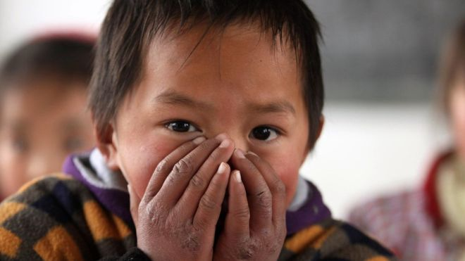
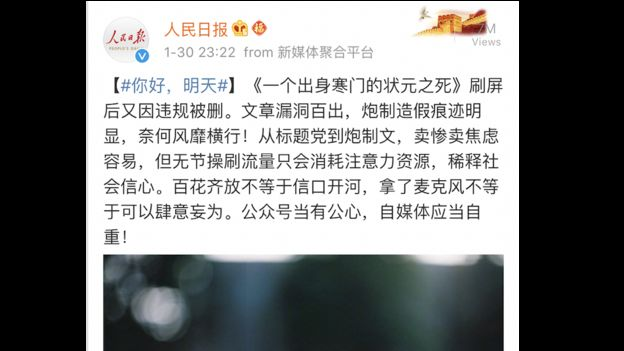

# 寒门状元之死背后：中国言论寒冬中的自媒体窘境 - BBC News 中文

2019年 2月 1日

 
图片版权 CNS 

1月29日，中国大陆社交媒体微信公众号"才华有限青年"刊出文章《一个出身寒门的状元之死》，引起广泛讨论

在中国大陆，一篇文章在社交媒体上发布当天便引发热议，阅读量超过十万。第二天，文章内容被指造假。当局随后对其封锁，并呼吁自媒体自重。为何一篇疑似造假的文章引起公众极大共鸣，而当舆论反转，当局又在害怕什么？

## 造假风波

1月29日，中国大陆社交媒体微信公众号“才华有限青年”刊出文章《一个出身寒门的状元之死》，引起广泛讨论，点击量在一天内达到10万以上。

《一个出身寒门的状元之死》讲述了一位出身贫苦的学生的故事。这名学生是当地的高考状元，在大学期间打工为妹妹攒钱读书，不与市侩同流合污，后来因病英年早逝。

*   [名校直播班中国走红：屏幕能否改写寒门学子命运](https://www.bbc.com/zhongwen/simp/chinese-news-46566084)
*   [国际纵横：东亚教育模式助寒门子弟成功](https://www.bbc.com/zhongwen/simp/business-38274946)

文章发布后，有网友指出大量细节与事实不符，质疑这是一个杜撰出来的故事。1月30日一早，微信平台将文章删除，称其“内容违规”，账号也被封锁60天。

当天，《人民日报》官方微博称该文“漏洞百出，炮製造假痕迹明显”。“从标题党到炮製文，卖惨卖焦虑容易，但无节操刷流量只会消耗注意力资源，稀释社会信心”。

 
图片版权 WEIBO 

《人民日报》官方微博称该文“漏洞百出，炮制造假痕迹明显”

发布该文章的公众号发表声明，说该文是一篇非虚构写作，故事背景和核心事件绝对真实，为保护当事人利益而对细节作了模煳处理。

上百位网友在内地知名论坛知乎上留言，说此文贩卖焦虑，贩卖同情，赚取流量，是典型的商业化写作。一位网名为“青青青青描淡写”的网友说，“自媒体界意识到了这种假装真实故事的假故事的巨大价值，开始了新一轮更高级别的焦虑贩卖”。

值得思考的是，为什么这类文章能够轻易带动大众情绪。亦有网民及分析认为，虽然文章内容可能虚假，但公众仍有所共鸣，某种程度上反映了中国目前向上流困难的处境。

## “咪蒙式”营销

《一个出身寒门的状元之死》一文以匿名方式刊登，之后被爆出由95后青年杨乐多执笔，她曾是内地自媒体红人咪蒙创作团队的成员。

发布该文章的微信公众号为霍尔果斯爆炸糖影视传媒有限公司所有，而咪蒙正是该公司法定代表人兼执行董事。

此事实一经曝光，矛头指向了中国内地以咪蒙为代表的营销型文字写手。

咪蒙本名马凌，曾担任南方都市报深圳杂志部首席编辑，目前在微信公众号有千万粉丝，几乎每篇文章的阅读量都超过十万。她曾分享自己的写作秘诀，技巧包括“选题紧跟热点”、“标题简单粗暴”、“观点颠复常识”、“表达情感共鸣”等。

*   [社交媒体为何让我们感到更加孤独？](https://www.bbc.com/zhongwen/simp/world-39181015)
*   [爆红社交媒体：西班牙帅小伙凭什么收获点赞无数](https://www.bbc.com/zhongwen/simp/world-45127943)

在北京的独立政治观察家、政治学博士吴强对BBC中文说，过去六年的互联网禁网运动不断打压公民社会，消减了自由派媒体，却在新兴媒体中产生了一种以咪蒙为代表的混合型写作方式。这种文章多使用煽情手法， “为了点击量而把非虚构写作与电影编剧的艺术和讲好故事的方式结合起来”。

浸会大学新闻系助理教授闾丘露薇对于这样的文章突然爆红感到吃惊，她对BBC中文说，“如果大家觉得写得不好，或者传递的信息有误，忽略就好了”。

她认为，该文之所以成为热点，与中国目前没有可以严肃讨论社会话题的环境有关。“对真正值得关注的事情没兴趣，不敢谈，或者意识不到要谈…只能透过一些情绪化的写作来表达想法”。

## 触及情绪痛点

中共当局近年来提倡融媒体路线，把广播、电视等传统媒体与互联网结合，全面加强党性宣传，贯彻新的文艺路线。吴强说，在某种意义上来讲，以咪蒙为代表的自媒体也是按照“讲好中国故事”的路线，为中国主流意识形态服务。

他说，类似《一个出身寒门的状元之死》的社交媒体文章在叙述方式和讲故事的技巧上符合当下民粹主义政治的潮流，强化宿命论，符合集权主义的需要。

 

图片版权 Getty Images 

在北京的独立政治观察家、政治学博士吴强认为，过去六年的互联网禁网运动不断打压公民社会，消减了自由派媒体，却在新兴媒体中产生了一种以咪蒙为代表的混合型写作方式

这类文章着重讨论阶级固化、互联网创业、成功、奋斗等话题，切中了中国当下的焦虑情绪。故事中的主人公通常经历曲折而悲情，触及到读者的痛点，引发共鸣。

这类文章既非文学作品，又非新闻和深度报道，充其量算是新媒体时代的报道文学，但在商业价值和互联网传播上却是成功的。

## 互联网舆论反转

但是，吴强说，在互联网发展过程中还存在一些清醒的知识分子，他们意识到当局对互联网的控制实际是对大众民粹心理的操纵。一旦这些网友站出来辟谣，就可能令虚假故事“穿帮”。

这些网民在不敢批判主流意识形态时，把怒火发泄到某些文章上，表达“对当下主流意识形态的不满，对互联网控制和审查的不满”。

吴强认为，《人民日报》等官方媒体对《一个出身寒门的状元之死》一文的封杀并非主动行为，而是虚假故事穿帮之后的一种掩饰，“避免公众发现整个意识形态路线的虚伪”。

闾丘露薇说，从根本上说，当局封锁该文章还是意味着政府对媒体的管控。从传统媒体，到搜狐、新浪一类的商业网站，再到现在的新兴媒体公司和内容提供商，政府的管控一直存在。

“任何产生了巨大影响力的，由市场形成的东西，官方都会很警惕。不管是什么内容。”

而对于《一个出身寒门的状元之死》这篇文章，闾丘露薇分析，因为机缘巧合，此时成为社会热点。于是令当局抓住了典型，试图警示非虚构写作、价值观传播、生活方式等非时政类媒体平台，“不是想写什么就写什么”。

---------------------------------------------------

原网址: [访问](https://www.bbc.com/zhongwen/simp/chinese-news-47096581?ocid=socialflow_twitter)

创建于: 2019-02-03 20:19:36

