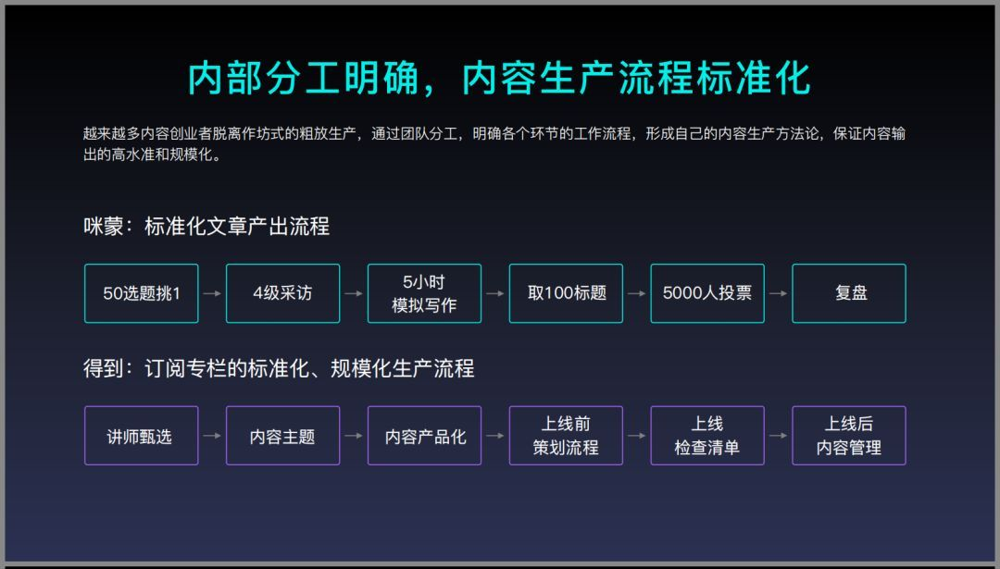

# 《一个出身寒门的状元之死》刷屏背后，起底咪蒙的商业版图_36氪

[36氪的朋友们](https://www.36kr.com/user/375349) _·_ 2019年1月31日

昨天到今天，《一个出身寒门的状元之死》不断刷屏。目前该文章已因内容违规无法查看，但背后的咪蒙团队又火了。

编者按：本文来自[“全天候科技”](https://awtmt.com/articles/3477266)，作者|杨泳洁，编辑|罗丽娟，36氪经授权转载。

昨天到今天，无数人的朋友圈都被一篇《一个出身寒门的状元之死》刷屏，阅读数很快达到10万+，点赞数也接近4万。

目前，这篇文章已因内容违规而无法查看。

文章刷屏的同时，也有不少人指出，文章明显多处破绽和逻辑漏洞。

比如在“为什么说《一个寒门状元之死》是瞎编的”的公众号文章中提及，这位2013年参加高考的作者在文中提到她高中期间特别爱看一部网剧，叫《灵魂摆渡》。

但经查证，该剧的第一部的首播时间却是2014年。

此外，作者提及死者为2013年市理科状元，高考分数为693分。

查证发现，2013年考693分的理科状元，全国只有一个，是重庆南开中学的一位复读生，如此推算文中死者2012年就已应届参加高考，显然不太可能与作者同班三年。

对于《一个出身寒门的状元之死》一文，京东商城CEO今日发朋友圈直怼其为“三流文学作品”：朋友圈转发《一个出身寒门的状元之死》的朋友们，人生足够乏味啊，乏味到连三流文学作品都点赞转发，近期在看《曾国藩传》，多看书吧。

江南愤青也在朋友圈指出，状元之死的故事之所以流行，有个很重要的原因是满足了很多读书不好的人内心阴暗的一个点。

### 爆文背后的95后操盘手

《一个寒门状元之死》发自公众号“才华有限青年”，该号由霍尔果斯爆炸糖影视传媒有限公司所有，据企查查信息，上述公司法定代表人为马凌，即公众号“咪蒙”创始人。

据公司简介称，“才华有限青年”自媒体号的主要针对95后年轻群体，用搞笑幽默的方式讲述生活中的小故事，发布原创娱乐文化文章。

《一个寒门状元之死》的作者杨乐多曾为咪蒙的实习生，正是咪蒙文章中提到过的“月薪5万实习生”。杨乐多曾在公开场合介绍，“才华有限青年”为2017年4月1号开号，6个月后粉丝突破了50万，而当时还在大三的她被推到了CEO的位置。

如今作为新媒体风云人物，杨乐多四处出席论坛，拥有“公众号‘才华有限青年’的创始人”，“年薪百万的95后”、“高颜值CEO”、“CCTV6大学生辩论赛嘉宾”等标签。

杨乐多曾在接受媒体采访时表示，“才华有限青年”是随缘做的。恰好想做个号试试，恰好在咪蒙工作期间有机会，就做了。同时她认为，自媒体会在未来10年，完全取代传统媒体。（详见《[“才华有限青年”杨乐多：我不觉得世俗的成功让我更快乐》）](https://www.sohu.com/a/271135060_141927)

针对《一个寒门状元之死》一文被各方质疑，一张疑似杨乐多回应此事的聊天截图曝光，截图显示，杨乐多称刷屏文中所描述“事情是真的，感情也是真的，很多细节我们做了修改，是为了保护当事人”。

### 咪蒙的商业版图

据称，杨乐多是咪蒙的大弟子，这也意味着，这只是咪蒙众多弟子中的一位。以自媒体成功创业的咪蒙早已建起了一个新媒体矩阵，并拥有了一家影视公司。

根据企查查信息显示，咪蒙关联企业共7家，其中担任法人7家，在外任职企业5家（其中一家已注销），控股企业5家，对外投资三家。

其中，马凌控股的北京十月初五影视传媒有限公司去年还因租房问题出现过民事纠纷。此前的2018年7月18日也曾因为著作权权属、侵权纠纷被武汉光亚文化艺术发展有限公司等在湖北省高级人民法院起诉。

2017年，咪蒙接受创业邦采访时表示，公众号已经为她带来了8位数的年收入、890万的微信用户、日活300万的读者，而到了2018年1月，微信用户已增至1400万。这些数字带给她盛名的同时，也附赠了她高负荷增长的体重，以及年前的一场手术。

咪蒙表示，2017年公号平均阅读率实际上同比下滑了2%-5%。她称这是一个非常可怕的数字，并反思很久，一度怀疑是否因为太过“自媒体”了，不够专业和多元。

随后她也曾做过转型尝试。先是扩招了助理团队，分成了脑洞组、深度组和干货组，针对不同板块写文章，企图让内容更加多元化。甚至称，把文中的事例改为真实采访形式，让自媒体变得更像专业媒体。

但她认为，这是一次失败的转型，因为粉丝纷纷反映以前的咪蒙不见了，他们更喜欢以前那个像朋友一样的她，而不是像现在，无形中增添了距离感。

据2017年新榜所做的自媒体人收入调查，月收入万元以下的自媒体从业者占比达91%，而这个数字在2016年末的调查中还是80%,此外，收入在1-2万元的占比仅为5%,2万-10万的占比为2.7%,10万以上的占比0.7%,而100万以上的从业者仅占0.6%。

年入8位数的咪蒙可谓其中的凤毛麟角，但咪蒙一路走红的同时，也屡屡因为价值观屡屡被炮轰，其刷屏的很多文章都被质疑价值观有问题，甚至有人戏言，找女朋友如果她关注了咪蒙，就可以拉黑了。

但不管外界如何质疑，咪蒙已成为微信头部账号，除了不断生产爆文，咪蒙的《教你如何月薪5万》课程刷屏，据咪蒙在活动中的分享，每隔很短的时间周期，咪蒙就会花几十万投入到用户调研中，以保证在不断变化的用户需求中准确把握。而其发稿流程也极为严苛。

图片来源：投资界

对于咪蒙，有媒体人士给出评价：咪蒙，自媒体界的蔡文姬（奶妈），开创组团编故事的模式，养活了半个自媒体圈，留下一堆漏洞让其他自媒体骂，又养活了剩下半个自媒体圈，了不起。

无论真假，《状元之死》和“才华有限青年”公众号都火了。

本文经授权发布，不代表36氪立场。如若转载请联系原作者。

------

原网址: [访问](https://www.36kr.com/p/5175146)

创建于: 2019-02-04 23:21:12

