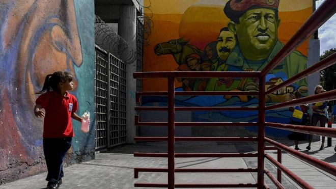
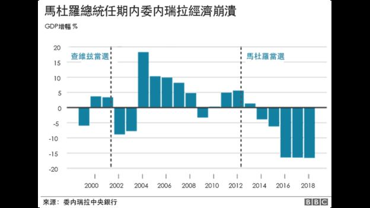
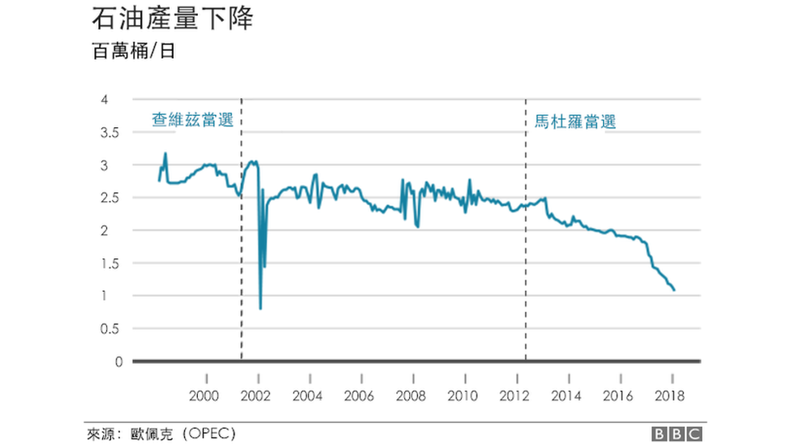
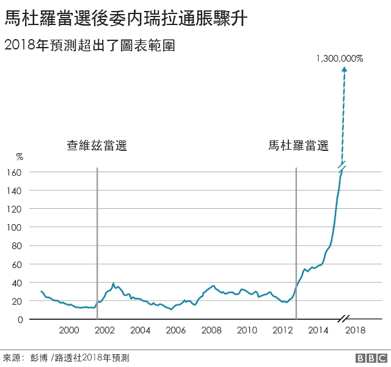
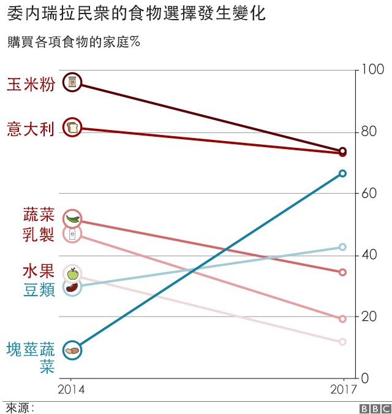
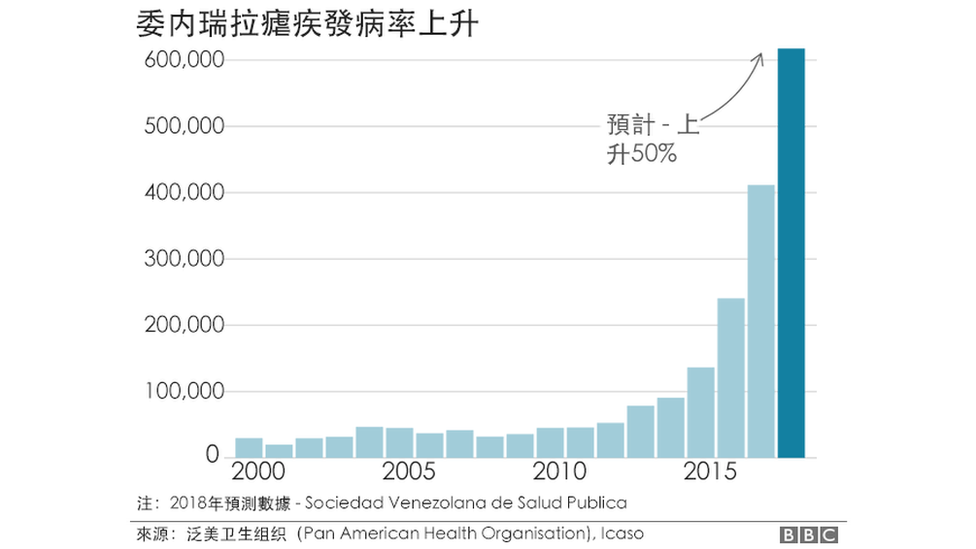
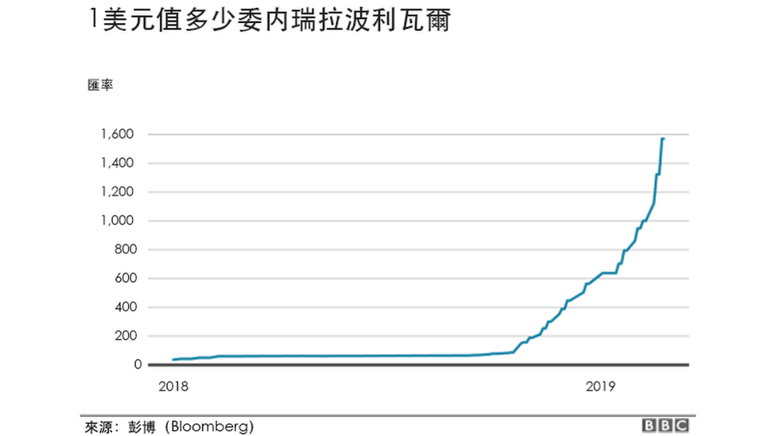
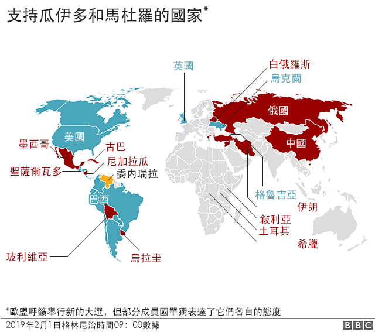

# 委内瑞拉危机：七张图告诉你危急程度 - BBC News 中文

2019-02-04

图片版权 YURI CORTEZ/AFP/Getty 

委内瑞拉前总统查维兹的政治遗产？

委内瑞拉马杜罗政权面临严峻挑战，政局日渐恶化，国际社会也相应出现对立阵营。

英国、法国、德国、西班牙和其他许多欧洲国家2月4日正式宣布站到美国的阵营，支持委内瑞拉反对派领袖瓜伊多，以及他不久前宣布成立的临时政府。

此前，马杜罗总统干脆地拒绝了欧盟提出的提前大选的建议。

瓜伊多1月份宣布成立过渡政府，自己任临时总统。此举得到美国支持。

俄国支持马杜罗政府，并谴责美欧干预委内瑞拉内政。

- [委内瑞拉政局动荡或演变成全球危机](https://www.bbc.com/zhongwen/simp/world-47024772)
- [委内瑞拉危机：现代购物中心变成政治犯的噩梦](https://www.bbc.com/zhongwen/simp/indepth-47001508)
- [委内瑞拉危机：美国新制裁能否达到预期效果](https://www.bbc.com/zhongwen/simp/world-47115739)
- [恶性通货膨胀正影响委内瑞拉人的性生活](https://www.bbc.com/ukchina/simp/vert-cap-45546767)

以下八张图表从多个侧面一定程度上展示了委内瑞拉目前危机的深度和广度。

## 1\. 经济崩溃

## 2\. 石油减产

 

## 3\. 通胀失控

## 4\. 民生疾苦

 

## 5\. 缺医少药

 

## 6\. 货币贬值

 

## 7\. 国际社会分野

截至2月4日， 法国、德国和西班牙步英国后尘，宣布支持瓜伊多。

------

原网址: [访问](https://www.bbc.com/zhongwen/simp/world-47115743)

创建于: 2019-02-04 23:30:52

目录: default

标签: 无

