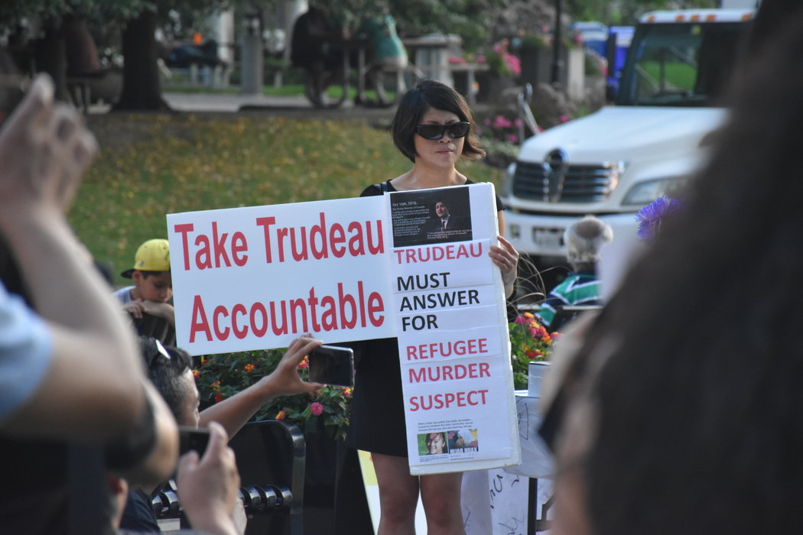
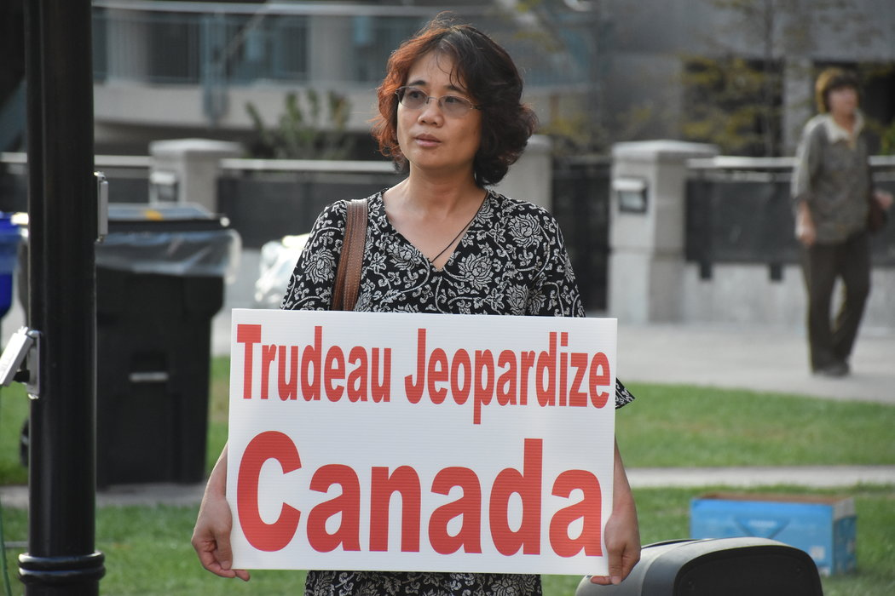

# 我所见的华裔移民为何仇视穆斯林？ - 纽约时报中文网

CHAUNCEY JUNG

2018年10月10日

华裔少女申小雨遇害一事助燃了华裔移民心中对穆斯林群体与难民的仇恨与恐慌。多伦多北约克一座公园的一角，一名女性拿着的抗议标语写道：“特鲁多需要对被难民杀害的遇害者负责”。 Chauncey Jung

在2017年7月，一名华裔少女在温哥华被人谋杀。13岁的申小雨在傍晚6点离开住所后失踪，次日凌晨警方在临近温哥华的本那比市的中央公园发现了她的尸体。这起案件震惊了加拿大的华人圈，他们曾以为自己移居而来的国家不会出这种事。

时隔一年多后的9月10日，名为易卜拉欣·阿里(Ibrahim Ali)的28岁嫌犯[被警方逮捕](https://www.scmp.com/news/world/united-states-canada/article/2163629/syrian-refugee-ibrahim-ali-charged-murder-vancouver)，并以一级谋杀罪起诉。但这起惊悚的谋杀案，却因为嫌犯的身份开始变得复杂：阿里在成为加拿大永久居民前，是来自叙利亚的难民。虽然警方没有公布凶手的作案动机，但是这起事件为一部分华人移民提供了一个“开战”的借口，助燃了他们心中对穆斯林群体与难民的仇恨与恐慌。  

在案件取得新进展后的一周内，在温哥华与多伦多，两个中国移民数量巨大的城市里，有华人团体分别组织了对这名女孩的追悼会。但从现场来看，这两场活动的确不仅仅是一场对逝者的悼念。在多伦多北约克一座公园的一角，集会的组织者摆上了申小雨的遗像，还有蜡烛与鲜花，出席追悼会的50多人佩戴白花或者白色的贴纸。但在这名13岁遇害女孩遗像的两侧，有两条华裔组织者打出的醒目标语，攻击加拿大总理特鲁多(Justin Trudeau)的难民政策。一张标语写着，“特鲁多正在危害加拿大”。另外一张写着，“特鲁多需要对被难民杀害的遇害者负责”。  

在加拿大的华人移民当中，一股右翼势力正在迅速抬头。尤其是在过去一年，该群体先后爆发了“头巾门”与“反对难民”集会两起群体性事件。这使得加拿大的这股右翼势力进入更多华人的视线。或许在这一部分右翼势力的眼中，自己辛苦劳作与税收所创造的社会福利被难民或其他少数族裔瓜分了不少。如同在美国的部分华人移民一样，他们将矛盾的源头指向了这些少数群体，其中包括穆斯林与难民群体。

在中国，我们可能对移民发达国家的人怀有一定的误解。有的人会认为，这些依靠自己的财富或者本领移居海外的人素质会高一些。但从人们在社交媒体上的表现来看，这并非事实。虽然这些右翼华人移民并不能代表大部分来自中国的移民，但他们的存在却在制造十分负面的刻板印象。在微信、微博等社交媒体上，他们疯狂地转发、制造对穆斯林及难民群体的仇恨。比如，在加拿大本地中文网站上，有人这样评价受到缅甸当局迫害的罗辛亚人：“罗辛亚人，其实就是木死林（穆斯林）邪教徒，是土豆（特鲁多的绰号）的继父们。”

这些中国移民的仇穆情绪或许在诸多国内外的恐怖袭击动乱中得到了证实，但这股仇恨的源头更有可能来自他们的原生国家。在上世纪80年代，统战少数民族的政策使得人口占多数的汉族主体感到不公。近些年来的袭击事件又一次将中国汉民的仇穆情绪推上了巅峰。  

在2015年特鲁多赢得大选后，便接收了来自叙利亚的2.5万名难民，据加拿大政府公布的[数据](https://open.canada.ca/data/en/dataset?portal_type=dataset&q=refugee)，截止2018年7月底，加拿大政府接纳了近5.7万名叙利亚难民。但是，自2015年以来，各省选民对联邦政府的难民政策越来越反对，他们称省内的财政资源无力安置这些难民。在2018年，他们的反对态度在近期的各省大选中有所体现。在[安大略](https://news.vice.com/en_ca/article/43pgnn/doug-ford-is-scaling-back-ontarios-support-for-asylum-seekers)与[魁北克](https://www.cbc.ca/news/canada/montreal/quebec-caq-asylum-seekers-hardline-approach-1.4242163)这两个加拿大最重要的省份，都选出了在移民与难民政策上更加保守的右翼政党执政。  

同时，加拿大政府2015年至2018年每年都接收超过30万的移民。这些移民多数来自菲律宾、印度、中国等亚洲发展中国家；中国新移民数量在过去三年内排在第三，[在2016年一年，便有近13万中国人](https://www150.statcan.gc.ca/n1/daily-quotidien/171025/t002b-eng.htm)来到了加拿大。在温哥华，共有约48万华人，占人口总数约21%；在大多伦多地区约有70万华人，占人口总数约12%。其中部分移民加入了反移民的浪潮，于是有了如下的诸多闹剧。  

这股势力的存在已有一段时间，但促使事情爆发的导火索要回溯到2018年1月发生的“头巾门”事件：在多伦多，一名11岁的穆斯林女孩宣称，自己的头巾被一名亚裔男子拉扯掉，这起潜在的仇恨犯罪引起了总理、省长以及市长的重视。然而在警方调查后，却发现这件事情根本没有发生。  

虽然涉事的女孩与家人已经道歉，但一个名为“[加拿大华人联盟](http://voteforright.com/)”的组织认为加拿大总理特鲁多也应该向华人道歉，并要求对所有种族一视同仁，并重启对“头巾门”事件的调查。2月18日，该机构组织了上千名华裔移民，[前往渥太华向加拿大总理特鲁多抗议](https://ottawacitizen.com/news/local-news/anti-immigration-groups-at-parliament-hill-protest-demand-apology-from-trudeau)。但奇怪的是，与他们站在一起的，却是La Meute、Storm Alliance、Northern Guard这些在加拿大臭名昭著的极右翼组织。这些组织的核心诉求是反对移民与难民，加强边境控制。根据加拿大华人联盟的声明，他们并不认为自己支持任何的极右翼政策，也不认为自己是一种极右翼组织。但他们与极右翼组织在一起抗议，场面令人尴尬。  

2018年7月，又有一群华裔市民来到万锦市(Markham)市政厅，抗议该市协助位于南边的多伦多市安置难民。在这些华人移民的眼里，难民意味着暴乱和不安全。但在抗议的现场，他们与反示威的群众爆发了冲突。根据现场[视频](https://www.youtube.com/watch?v=oHtjq__ekzg)，一名华裔男子将反示威者带来的手提扩声器扔进水中；另一名华裔女子与他人发生冲突时满嘴污言秽语：“X你妈了个X的”、“我X你姥姥的”；一名戴着眼镜的男子用不成熟的格斗技巧与他人打斗，却没占到任何便宜。  

这些事件与丑态不得不令人深思：为什么不论这个社会怎样看待他们的行为，这些右翼华人都会坚持认为自己是正确的，并坚持自己的想法?  

9月中，我围观了他们在多伦多的追悼会。我十分好奇，出席这场会议的都是些怎样的人。我加入了他们的微信群，观察他们在群里都说些什么。在这个人数将近200人的微信群中，每天都有人反对特鲁多总理的多元文化政策，还有人发表仇视穆斯林的言论。他们称基督教衰弱之时，就是伊斯兰得逞之日。他们称要将总理杀了，炒他的鱿鱼。还有人说，加拿大再过几年就彻底绿了，意指将彻底伊斯兰化。  

组织多伦多悼念活动的人与申小雨并无血亲关系。因此，也有人认为，他们的活动是一场纯粹的政治投机。在追悼会上，各色人等分别登台演讲。他们都认为外来的难民使得加拿大变得不再安全。在上台演讲的人当中，有一些华人期望在10月份大多伦多地区各个城市的市级选举中竞选公职，包括万锦市市长、多伦多市议员和学区的教育委员。他们出席活动，更像是试图提高自己的知名度。  

一名女性手持的标语写着：“特鲁多正在危害加拿大”。 Chauncey Jung

在人群中，我发现了加拿大右翼媒体Rebel Media与正在竞选多伦多市长的极右翼候选人费斯·戈尔迪(Faith Goldy)。讽刺的是，戈尔迪曾在自己的[推特](https://twitter.com/faithgoldy/status/1023624268893114369)中称，来自中国的移民抬高了多伦多的房价，因此不应该欢迎他们的到来，“多伦多市不应该成为北京的郊区”。（在多伦多35位市长候选人中，除了戈尔迪，还没有人说过这样对华人族裔不友善的话。）  

我在一旁拍照时，一名路过的长者叫住了我，并问我这里发生了什么。当我告诉了她事情的前因后果后，她不解地问道，“事情发生在温哥华，为什么要在多伦多举行追悼会呢？这些组织者认识遇害者的家人吗？”  

这位长者心中的问题也是我想要询问的问题，在追悼会结束后，我试图采访这次活动的组织者与部分参与者。但采访并不顺利，在试图与几个人联系后，我发现自己已经被组织者从他们的微信群当中移除。以至于在采访进行到一半时，有两名受访者突然变卦，不再继续与我交谈。而三位受访者的观点与特朗普的支持者们高度类似：他们反对接收难民，反对承担国际义务，甚至还有人认为，加拿大应该学习美国，拒绝让一些伊斯兰国家的人入境。  

一名名为Alex Yu男子的言论引起了我的注意：他认为，申小雨的死都是总理特鲁多一手造成的。“他敞开边境狂收难民，导致了这些惨剧。”Alex（他不愿意透露自己的中文名字）认为，自由党政府原来的难民部长胡森(Ahmed D. Hussen)是穆斯林，总理的偏好很明显。他还提出，特鲁多可以任命一个中国人做难民部长，来显示他没有对穆斯林特殊的偏好。  

当我问到为什么在时隔一年后才为遇难者组织追悼会，他回答：“因为大家没认为会是穆斯林难民干的，以为是普通独立的刑事案件。”他接着说：“不是所有的刑事案件都是可以上升到政治的程度的。但是这件案件是一定要上升到政治程度的。”  

Alex Yu并不认为费斯·戈尔迪与Rebel Media这些组织是极右，他同时对我说：“在极左的眼里，别人都是极右，不要随便给别人贴标签。”他并不知道戈尔迪曾在推特上发表过“反华”言论。当我发给他时，他认为，这并不是对中国人的歧视，这个帽子扣得太大了。

Alex言论证实了我的想法，事实上，有批评者认为申小雨案成为了一部分华人政客的[政治提款机](https://info.51.ca/news/canada/2018-09/685350.html)。在本地的中文网站上，这样的观点遭到了部分网友的攻击，甚至有人攻击写文章的作者有维吾尔血统。

另一名来自中国的移民Linda Li来加拿大后成为了兼职地产经纪人，同时经营一个做物理治疗的小生意。她认为难民的安置与非法入境者浪费了许多纳税人的税款，用她的话说：“我们勤勤恳恳地工作，每年都交很多税。国家这么挥霍浪费，我们这些纳税人当然愤怒了！”

Linda表示，她出席追悼会仅仅是因为想要悼念这位遇害的华裔少女。她同样认为特鲁多的难民政策太混乱，尽管警方没有发现嫌犯在此前有过任何的犯罪记录，但Linda并不相信警方的说法。她认为加拿大政府根本没有对入境的难民进行审查。[事实上](https://globalnews.ca/news/2349421/heres-how-refugees-are-screened-before-arriving-in-canada/)，入境加拿大的难民需要经过签证官的面试，并通过情报部门的背景调查与体检。

但很明显，Linda并不能被称之为种族主义者：她不喜欢费斯·戈尔迪，在看过那条具有歧视性的推文后，她表示不会再支持戈尔迪。她认为大多数华人都是勤劳善良的，也不应该仇视外来族裔。

解民正在为10月的多伦多市选举做准备，她将竞选多伦多第12选区的教育委员一职。作为这次追悼会的组织者之一，她表示在看到申小雨案有进展后，觉得应该做点什么。她认为加拿大政府今年接纳的叙利亚等穆斯林难民不会融入西方文化，“移民一定要考虑到文化价值观可能融合的问题！否则欧洲的今天就是加拿大的明天。”

我并不确定解民是否知道，她对这些难民的看法与100多年前，加拿大第一任总理约翰·麦克唐纳(John A. MacDonald)对中国移民的看法高度一致。麦克唐纳认为，这些来为加拿大修铁路的中国移民永远无法融入加拿大的体系之内，当时的中国人，被称之为“黄祸”。在美国，华裔移民也曾受到类似的歧视，立法者也曾设立过针对华裔的排华法案。

到底是什么，让这些右翼华人产生了这些想法?

不可否认，在这些移民的原生国家，仇视穆斯林的话语在社交媒体当中十分普遍，网民也疯狂地嘲讽着政治正确，而宣传部门有时似乎并不太介意网友对伊斯兰教与穆斯林的攻击。比如，在近期[中国与瑞典的外交风波](https://cn.nytimes.com/world/20180927/sweden-skit-chinese-tourists-defecate/)中，有大量的微博账号卷入了对瑞典的言语攻击，期望他们被穆斯林难民攻占。木木、绿绿等名字成为了这些网民对穆斯林群体的蔑称。如果身处中国网络防火墙外的这些移民依然需要依赖微信、微博等防火墙内的中国社交媒体工具了解当地信息，将极大地阻碍他们获得真实准确的信息。  

在近些年，中国也成为了恐怖组织威胁的目标。伊斯兰国曾经绑架并杀害了几名中国公民。此外，曾经发生在中国的维汉矛盾也加深了人们对少数群体的敌视。2009年7月5日，新疆乌鲁木齐街头暴乱成为了维汉矛盾爆发的重要节点。2014年3月1日，恐怖分子在昆明火车站砍死31名平民。再加上维族“小偷”、“切糕”等流传于中国互联网上的负面印象，生活在中国内地及沿海地区的汉族人对维吾尔人的印象开始显著恶化。

同时，曾经被中国共产党用来统战少数民族的“两少一宽”政策也使得汉人对维吾尔人感到不满。这些对少数族裔，尤其是穆斯林少数族裔的负面偏见，跟随着他们来到了移民国家。这个在西方标准下看来具有特权性的政策在1984年由胡耀邦推出、中共中央红头文件下发，其核心宗旨是对于少数民族的罪行采取宽恕的态度，“对少数民族的犯罪分子要坚持‘少捕少杀’，在处理上要尽量从宽”。更多反对难民政策的华人移民更像是Linda自述的那样，认为自己辛辛苦苦的劳作缴纳的税款没有用在合理的地方，却供养了这样一批无需工作的“特权”阶级。

中国封闭式的宣传为移民们种下了一颗恶果：这导致他们当中的一部分人不会对看到的消息做出基本判断，不会产生怀疑，也鲜有调查消息来源的兴趣。我所供职的本地中文网51.ca的同事曾经做过一个恶搞的钓鱼实验，他们选取了一段多伦多防治艾滋病游行的视频，在视频里有大量的穆斯林民众。他随后将视频发布到一个100多人的微信群中，改称这是穆斯林要求在加拿大实行沙里亚法。该微信群中立刻出现了对穆斯林的辱骂，却没有人在意这条视频到底从何处而来。

这是一个存在于全世界社交媒体的问题，但对于身处加拿大的华人移民来说，他们在微信里收到的信息是经过当地中文媒体编译后的二手信息。这意味着，他们看到的信息，与原始事件之间的差别，可能要比在社交媒体当中看到的无需翻译的内容偏差更大。

社交媒体的错误信息等因素之外，这部分华人移民的恐惧，或许能够解释他们对穆斯林及难民群体形成偏见的根本原因。

对于他们来说，加拿大更吸引人的地方，在于其拥有的医疗资源、教育资源，及能够提供给纳税人的经济保障。但在加拿大，拥有新闻自由的媒体报道了许多发生在城市内的犯罪案件。与依靠时常封锁消息的中国公安相比，加拿大显得治安混乱，这无疑让这些为了更好生活环境的华人移民感到恐慌：他们认为，这里发生的一切，对他们的人身安全造成了威胁。

而将这些威胁怪罪于恐怖主义与难民是一种成本十分低廉的做法：这样的逻辑看似十分合理，但实际上却缺乏事实基础。不过，处在焦虑与恐慌的人不会在意这些，他们只想为自己心中的焦虑找到一个发泄的出口，而这个出口，便是他们眼中的社会负担：难民。  

------

原网址: [访问](https://cn.nytimes.com/opinion/20181010/canada-immigrant-chinese-conservatives-islamophobia/?utm_source=top-2018-orignials)

创建于: 2019-02-05 20:23:16

