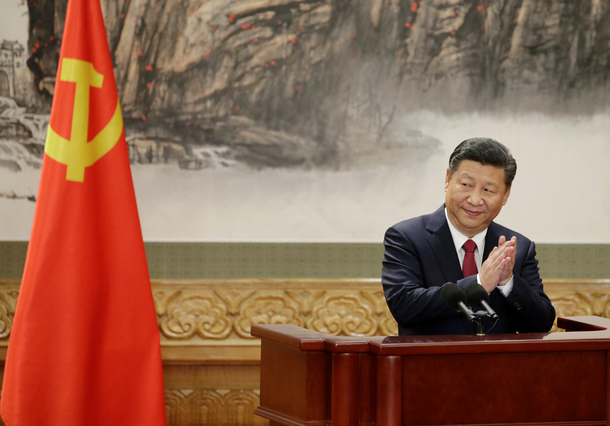

# 中共速朽论和习近平无能论为何是错的 - 纽约时报中文网

邓聿文

2018年9月19日

去年10月，习近平在北京。 Jason Lee/Reuters

冷静、客观、中立和严肃地讨论中国事务，对每一个关心中国未来走向和民主事业的人来说，都非常必要。

但很遗憾，许多人过于从自己的立场、价值观、情感和个人遭遇出发，不能客观看待、分析、判断自己的观察或研究对象，这是近年来中国自由派包括海外民运力量在涉及中共和习近平时经常出现的一种现象。此种情况在中美贸易战的前戏阶段及贸易战启动后表现得尤其明显，看衰和嘲讽中国和中共之声四起，仿佛只要贸易战打响，中国经济立马完蛋，中共乃不堪一击，习近平地位将不保。特别是前一阶段的北戴河会议，由于习近平缺席官报头版，各种关于政变的谣言不胫而走，让人大跌眼镜。

不是说在讨论问题时不能带有自己的立场和情感，但要努力避免先入为主的偏见，因为它容易扭曲看法。特别是要避免为引来关注度和曝光率，而走向极端。民主化是一项严肃的事业，要使中国尽早走向民主，前提是了解你的研究对象或对手，甚至比它更清楚其优缺点。

但海内外的自由民主力量在对中共和习近平的观察和研究中，存在着两种错误看法，一是“中共速朽论”，一是“习近平无能论”。观察海外中文的政论节目，或者在一些时评家发表于Twitter之类社交媒体的文字中，你会发现，在有关中共和习近平的话题上，除了谩骂、诅咒、发泄私愤和引述道听途说的八卦艳闻、阴谋及有违常识的看法外，很难再看到有分量的东西。不客气地说，这是海外民运衰落的原因之一。

此现象也存在中国国内，在私人聚会或饭局等场合，对中共和习近平的评价争论得很厉害。某些自由派知识分子对时局的认知难让人恭维。举例来说，在十九大前，一些学者言之凿凿地表示，十九大一定开不成，或者中共一定在十九大后垮台，或者习近平在十九大会被推翻。曾有几人就这样跟我打赌。

为什么“中共速朽论”是错误的？因为它只攻其一点，不及其余，对自己不喜欢或者不能印证自己观点的事实视而不见。在“速朽论”看来，中共好像是一座纸糊的房子，只要轻轻一推就倒。但事实并非如此简单。

表面看来，中国的诸多现实能够支撑起“速朽”：中共现在是内有群众的不满和抗争，外有美国为首的西方国家强力围堵，特别是中美贸易战导致经济萧条和衰退，影响百姓生活，引发人民对中共和习近平专权的强烈不满，过去支持中共的中产阶级对习近平也表现出离心离德，再加上反腐造成高层权力斗争加剧，可以说，人民“起义”的形态已经具备，就差出一个“陈胜吴广”振臂一呼了。

这种看法似乎还得到一党专制“70年大限论”的印证。“大限论”说的是，世界上绝大多数一党独裁或执政的国家，在连续执政达70年时，都会垮台或下台，苏共和墨西哥的革命制度党就是其中两种类型代表。中共也很难逃出这一历史规律。

然而，将民众怨声载道，各阶级和阶层对习近平的强烈不满视为中共垮台前奏，是很成问题的，除非经济形势恶化到不可收拾地步，出现大面积失业和恶性通胀，可能导致全局性社会动荡，但即使如此，也难断言中共明天或者不久就要垮台。

原因在于中国本身的复杂性及国际社会的变局并非完全对中共不利。中国是内部差异极大的国家，这使它极易出问题，并且放大问题的严重性，然而也因此决定中国对问题的承受力很强，回旋余地大。  

还应看到，虽然随着习近平极权统治的强化，中共的应变和调适能力在减弱，但这种弱化速度并未造成中共对外界的变化完全无动于衷，总体看，中共的应变力还是很强的，已经发展出了一套相对有效的管治机制。而为减轻群众不满，习近平也在强化对官员的问责。此外，尽管习近平的“中国梦”遭到普遍嘲笑，但它所蕴含的中国强大起来的民族主义情感和价值在中国社会还是有吸引力的；他的“精准扶贫”，对改善底层民众福利，拉近他们对党的向心力也是有作用的。同时，中共对社会管制的强化和民众面对政治高压时的机会主义态度和行为策略，也在延长其统治。

从经济来说，尽管中国今年遭受很大压力和困难，但也要看到，对外开放力度是近几年来最大的。可举的例子很多，如中央层面的海南自由港，扩大金融服务业的开放，允许银行和证券公司等外资持股比例过半或独资，以及的上海和广州等地扩大对外开放举措。中美贸易战从6～8月的统计数据看，对中国的外贸不但未构成严重打击，反而中美贸易顺差进一步扩大。

这当然不能说明贸易战对中国经济的冲击不存在，但很可能，[在接下来对2000亿美元](https://cn.nytimes.com/business/20180918/trump-china-tariffs-trade/)甚至全部5000多亿美元的中国商品征收关税后，此种冲击不像贸易战开打时认为的那么严重，外资也在持续流入中国，马斯克(Elon Musk)的[特拉斯前不久就在上海注册独资公司](https://cn.nytimes.com/business/20180711/tesla-china-shanghai/)，最近又将注册资本从原来的1亿元提高到46.7亿元。正如国内一些经济学家所说，中美贸易战主要影响的是市场情绪，对实际经济未必产生很大影响。虽然市场情绪也会加剧经济萧条，但也要看到，[中国政府正在努力化解](https://cn.nytimes.com/business/20180824/china-economy-trade/)，尽管效果尚未明显显现。

再从国际政治和地缘战略看，鉴于全球民粹主义的升温，强人政治的出现和西方内部自身的矛盾、危机及对中国市场的重视，中共在非西方国家得到认可的程度有所提高。中国周边的整体环境比去年有明显改善，特别是同印度、朝鲜和缅甸的关系。西方（不包括美国）对中国的围堵很难长久维持。

事实上，“速朽论”不过是早已存在的“中国崩溃论”翻版，后者流行了二三十年。不同之处在于，“速朽论”以海内外华人的仇共反共人士为主，而“崩溃论”以海外研究中国的专家学者为主，包括一些华裔学者，但两者对中国和中共崩溃或速朽的看法则几乎惊人一致，都认为中共的政争、腐败和经济衰退将会导致中共垮台、中国崩溃。

如果对中共“速朽”的判断有误，对习近平“无能”的判断也就谈不上准确，因为两者密切相关。自习近平近6年前上台，在对他个人及其思想和政策路线的评判中，一个似乎得到自由派普遍认可的看法是，习乃是个好大喜功、刚愎自用、志大才疏、自以为是的领导人，不堪大任，中共把他推向最高位置，是选错了人。

自由派中很多嘲讽习近平无能的人，常举的例证是，习虽是清华的法学博士，但真实水平不过一初中生，他上台后，把胡锦涛留给他的一手好牌（不是指中国改革进程，而是国力在提高，国际环境相对处于一个上升空间）全打烂了，内政外交搞得一塌糊涂，国内民怨沸腾，国际陷入空前孤立。特别是与美国为敌，终导致中美贸易战和美国的全面打压。

习上台后在内政外交上的确一手制造了混乱，放出了很多矛盾的信号。尤其是没有继承邓小平的改革路线，反而师法毛泽东，在基本方向上全面左转，回归正统社会主义，迷信精神力量，推行高压统治，经济上强化国有制，导致党内改革派和社会温和力量对其极其失望，这似乎足以证明他乃成事不足，败事有余。

但这种看法无法解释习在上台后不久即掌控大权，变胡锦涛时期“九龙治水”的领导体制。对于一个在上台前没有军功和政绩的人来说，取得如此权力和权威，简直是一个奇迹。要知道，毛泽东和邓小平的强人地位是经过枪林弹雨的考验和长期在领导岗位上才实现的，习近平何以独让全党服从他一人？是这届党的领导干部不行，还是中共高层有意选择的结果？许多人会提到反腐，可问题是，胡江也反腐，为什么反不动？

从习近平上台六年来的治理情况看，把习近平当傻子，认为只有初中生水平，治国毫无章法，东一榔西一锤的观点绝对是错误的，是小看了他。习近平对中国的未来有一整套设计，这集中体现在十九大报告中，虽然它不符合自由派的胃口，但特朗普的前首席顾问班农读出了其中“潜在词”，所以2017年12月在东京的一次演讲中，他警告自由世界要警惕中国的强大。前《中国改革》杂志社社长李伟东在十八大前将习后来展示的这套强国策略称之为“红色帝国”战略，并概括了它的主要特征，这说明，还是有人能预见或看懂习近平的。简言之，习不但在权力斗争中有一套办法，能够战胜政敌，而且在治国治党上，也有一整套思路和想法。不仅如此，相对胡江，习还有很强大的执行力。他要把他头脑中的这套自以为“正确”的东西，变成现实。

从能力上贬低习近平、将他视为二楞子式人物，是迄今为止自由民主力量犯下的最大错误之一。应该看到，习是一个有手腕、有想法、有使命和有意志的独裁者。他可能是真信共产主义的最后一个领导人。毛式共产主义教育及其知识结构和梁家河七年知青人生，决定了他的思维模式，使他迷信精神力量、憎恶腐败、同情百姓，认为在全球化的开放环境下，可以将中共和中国改造成一个思想上纯粹的政党和国家，但残酷的政治斗争，也使他冷酷无情，他采取的治党治民主动出击的两手策略，目的是要在中国实践他的想法，回归正统社会主义。就此而言，习也是一个理想主义者。当然，在一人领导体制下，他的理想主义和使命感，如果没有足够反对力量，注定会将中国带入一条不归路。

我在此不是要为习近平和中共“唱赞歌”，长独裁政权威风，灭自由民主志气，而是提醒，如果海内外的自由民主力量自以为站在道德高地，对习近平和中共不屑一顾，只盯着人家的缺点和弱项，将会犯下不可弥补的历史错误。对自由民主力量来说，应时刻记住：要战胜对手，就得像中共自己说的，在战略上藐视，在战术上重视、多了解对手，学习对手的长处。只有如此，才能制定切合实际的行动策略，否则，历史机会到来时，也会白白浪费。

邓聿文是中国独立学者、自由写作者和时政评论家。

---------------------------------------------------

原网址: [访问](https://cn.nytimes.com/opinion/20180919/why-the-liberals-get-it-wrong/?utm_source=top-2018-orignials)

创建于: 2019-02-06 22:02:18

