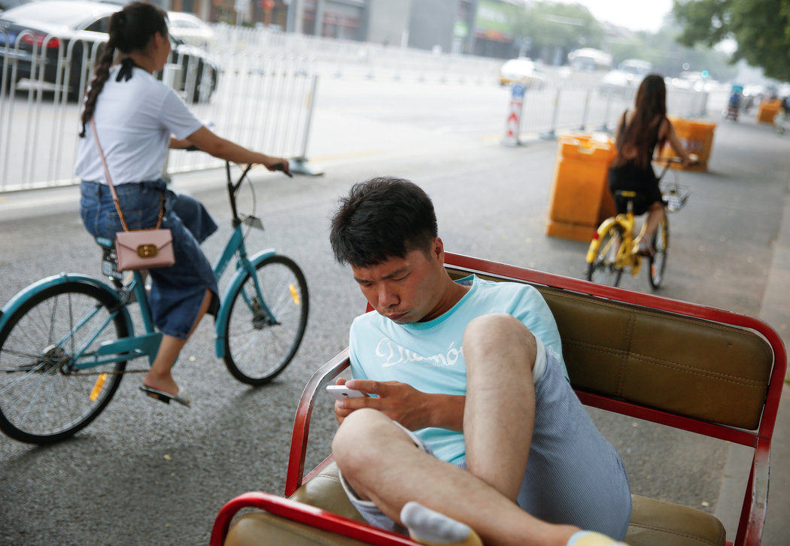
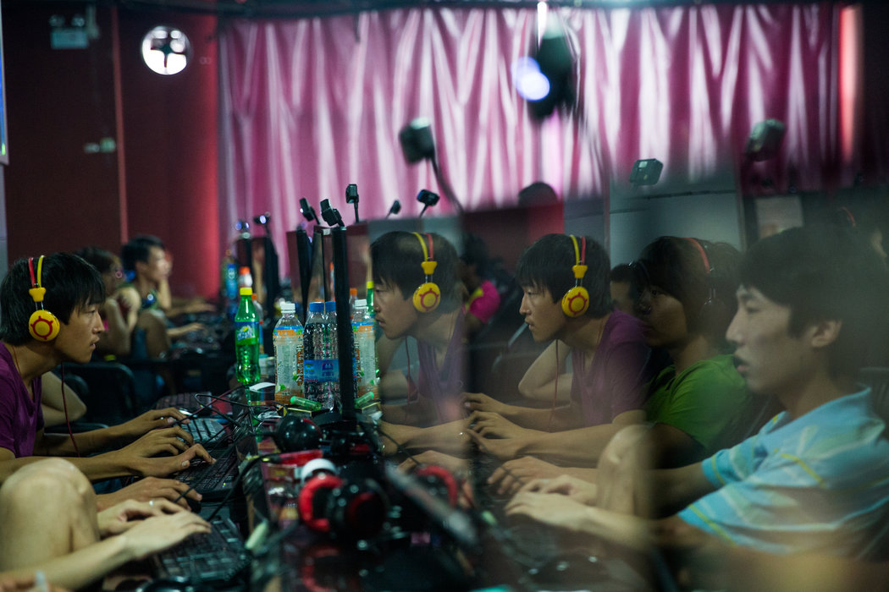

# 如何量化中国互联网管制的冲击？ - 纽约时报中文网

张林

2018年8月1日

审查促使很多中国民众转向运行顺畅、快捷，但容易受中国当局监视的交流方式，如中国互联网公司腾讯的应用微信。 Thomas Peter/Reuters

微信公众号是中国最大的自媒体平台，它的言论尺度可以说是中国言论开放的边界。最近几个月，微信却先后关闭了新开通的公众号平台的[评论](http://www.sohu.com/a/225346758_375209)功能以及[留言分享](http://www.sohu.com/a/234802246_100072778)功能。腾讯公司作为供给者不会主动阉割自己热销的产品，这显然又是主管部门的新要求。

对新增微信平台来说，由于只能发表不能评论的微信推文，也就使其几乎丧失了社交媒体的社交功能。最近微信自媒体对国内疫苗与#MeToo等丑闻的揭露显示出了互联网的力量，而新增的微信公号则很难重现这样的自媒体时刻。先控制住增量，再进一步整顿现有微信平台，或许是当下主管部门的管制策略。虽然这个限制举措进行得波澜不惊，却意味着中国本已经逼仄的网络言论空间又后退了一步。

可是，互联网管制的最大受害者可能正是管制者本身。互联网搜索的技术算法决定了一个热点事件的自我强化：百度上屏蔽掉的言论，会在谷歌上以几何级数的速度发酵。久而久之，国内媒体上的中国和国外媒体上的中国将会呈现出完全不同，甚至是分裂对立的国家形象。一种观点认为国际社会总在刻意丑化中国，殊不知本国的互联网管制却是问题源头之一，国内对所谓负面新闻的封锁屏蔽，使得境外媒体成为唯一的消息出口。仅这一点就足够值得反思，防火墙内的中国，真的因为互联网管制变得更安全了吗？

所谓“围观就是力量”，说的是网络技术不仅赋予了更多的人以更多信息，更提供了交流信息碰撞思想的平台。对于管理者来说，可以通过这些公开的信息了解人们的想法，获知人们的真实诉求，并通过回应这些诉求达成合意的公共治理。古往今来的治理失败往往出自信息的不通达，以至于管制者本身遭受蒙蔽。

同时，政府对于言论和信息的严格管控，会使得许多人只能接受片面信息而变得极端，尤其是当发现官方宣传与现实情况不符时，会产生强烈的抵触和反抗。以上道理在互联网时代依然适用，甚至更加适用，过度管制也许只能带来相反的结果——人们会以更多的敌意和恶意来评价管制者本身。

2018年以来，中国国内关于朝美、朝韩关系改善的评论便显示出了官方“洗脑”管制的恶果。微信公众平台上的自媒体纷纷表达了对朝鲜和平弃核、发展经济的盼望。对于那些未能接触更多自由信息，因而浸染在官方中朝友谊宣传中的人群来说，这却是一件不可接受的坏事，他们集结在“铁血论坛”和“乌有之乡”等网络论坛上猛烈批评中国政府的无所作为，而政府对相关消息的删除和屏蔽使之更加怒不可遏。

比如今年以来，乌有之乡微信公众号“乌有之乡网”发表了一系列关于鼓吹朝美对抗、揭露中国资本家丑陋、暗示官方走向修正主义的文章，因而在6月份遭到官方的永久性封号。在其封号后的声明中，认为官方本应和自己一起“站在人民立场替本阶级说话”，并“在国家民族立场”上支持中兴、声援中国的贸易战，结果官方的表现令人失望，他们宣称自己会继续利用其他手段“为本阶级鼓与呼”。

因此，以乌有之乡为代表的左派群体——他们是最相信官方言论、对社会主义最深信不疑的人，却在改革开放之后失去了执政的基础地位，甚至成为官方最警惕的群体。邓小平先生南巡时曾说，“既要防右，又要防左，但主要防止左”，而所谓的“左向”思潮，正是官方长期言论管制和信息过滤的结果。十八大以来，官方认为不能用改革开放的成就否定计划经济的历史，整个社会在强力管制下向左而行，社会上的仇富、民粹和民族情绪弥漫，这样做是危险的。根据我任职的[天则经济研究所](https://cn.nytimes.com/china/20180712/china-unirule-institute/)对民营企业家的调查样本，超过40%的中小民营企业家明确表示出移民意愿。

而最近，面对中美贸易战所引发的社会争论，则更加证明了中国社会的撕裂程度之深。那些长期以来被“厉害了，我的国”占据了头脑的人，认为中方的妥协意愿就是丧权辱国，而金融等领域的扩大开放不过是以市场换和平——堪比清政府的以土地换和平。而微信上广为流传的声音虽然对官方近年来的自大之举充满非议和嘲弄，却多半对开放市场予以支持。也很可能正因为微信空间里的“妄议中央”，主管部门收紧了对于微信平台的管控，而进一步的网络言论管控，或许又将更多的人推向了对立面。

早在2013年，天则经济研究所组织了一项社会调查，其中涵盖了信息渠道不同对人们看法的影响，由于问题的敏感性而未能发表。虽然调查的时间已经相去较远，但是数据分析所揭示的结果却和当下发生的事情不谋而合——接受更多自由信息的人更加温和，对政府的评价更积极；而那些获取管制后的信息的人群，以及信息量获得较少的人群，则对政府的评价更有敌意。

这项社会调查涵盖了全国30个省会城市的6259份有效样本，为了保证回答的有效性，允许样本匿名回答。在当年，微博还是最流行的自媒体渠道，正是针对微博的管制性阉割，使得后来的微信快速崛起。总之，样本中有些人主要通过主流新闻网站和报纸获取信息——他们中有许多是体制内职工和老年人，标记为“管制信息人群”；有些人主要通过微博、博客获取信息——他们多数较为年轻并在私营部门任职，标记为“自由信息人群”；有些人从聊天过程中获取信息——他们大多生活在郊区或者农村，标记为“信息缺乏人群”。

中国正在利用互联网用户规模全球最大的地位帮助其在境外实现自己的目标。 Sim Chi Yin for The New York Times

以此为基准，可以对比三类人群对政府评价的不同。举例而言，在上述调查问卷中有一个问题描述如下：“假设中央拨专款给本地政府，要求本地方政府给每人发放100元补贴，您认为最后能有多少元送到本地老百姓手中？”结果是，自由信息获取人群的回答均值为43.69元，管制信息获取人群的回答均值为40.94元，而信息缺乏、道听途说人群的回答均值为39.69元。如果考虑到显著性问题，自由信息获取人群的估计均值是显著高于其余两类人群的（95%置信区间）。

这个例子表明，获得更多自由信息的人群，对政府廉洁程度的感知更乐观一点；那些依靠官方新闻或者道听途说来交流信息的人群，反而对政府廉洁程度的判断更消极一点。再考虑到样本人群的平均收入分布，可以发现自由信息人群收入水平较高，一方面显示了信息获取和收入机会之间的正向关系，另一方面说明作为经济上的相对受益者，他们更容易对体制善意宽容；而信息缺乏人群的收入水平是最低的，这表明社会底层人群获得信息的渠道和内容最为有限，可他们对政府行为的猜测上却是最有“敌意”的。可以说，最严厉的互联网信息封锁，可能带来的是底层公众对政府的最大敌意猜测。

从绝对值上来说，猜测地方政府是贪污掉了60%还是55%，看上去区别并不是太大，但是，政府部门会贪污掉一半以上财政支出却成为人们心中的共识。而且，相比其他群体，接受管制信息的人群并没有认为政府更廉洁，这说明无孔不入的互联网管制从产出上看是无效的。这里还尚未计算每年分配给网络舆情部门数以亿计的资金成本投入，以及由此带来的人人自危的警察社会氛围。

问卷里还包含另外10个类似的问题。比如，当问到调查对象是否同意“碰到不合理的政策结果，我会采取抗议行动（比如示威、上访）”时，分别有13%的信息缺失人群、12%的管制信息人群选择了同意，而只有9%的自由信息人群选择了同意。以上至少说明，自由信息人群并没有更强烈的对抗倾向，虽然他们在网络上对政府的批评言辞激烈，但在实际中可能更愿意用打官司等和平的手段处理与政府之间的纠纷。

又比如，当问到调查对象是否同意“中央政府、地方政府制定的政策是可信的”时，自由信息人群选择同意或者非常同意的比例最高（64%），其次是信息缺失人群（62%），最后是管制信息人群（59%）。再比如，当问到调查对象是否同意“现在的政府体制最适合中国国情”时，自由信息人群选择同意或非常同意的比例为67%，管制信息人群选择同意或非常同意的比例为66%，而信息缺失人群的该比例则降为60%。

这11个问题的回答显示出了同一性，即，政府对信息的严厉管控并没有改善人们对政府的看法。当然，上述论证并不完全具有学术上的稳定性，6000多份有效样本也并不能保证样本的无偏性。而且，文中所称的对政府的“善意”和“敌意”也并非完全能被信息渠道的不同所解释。比如，能够自由获得信息的人群可能是社会的相对受益者（主要在收入方面），所以相对敌意较少。

但上述不足，并不妨碍这里的主要结论：获得更多自由信息的人显得相对更温和、对社会公正性和稳定性更有信心；而另外一方面，获取管制信息较多，甚至管制者本身，反而显得对政府政策并不信任；获取管制信息人员、信息获取较少人员对社会公正和社会稳定的评价更消极。

给互联网筑上高墙，也并不能减少异见人士、维权律师和人权斗士的前赴后继，他们正是为了打破这高墙而产生。即便他们反对体制，但他们至少坚守了和平的底线。反之，对于自由言论的过度限制、对于政权一味地美化宣传反而会激起暴力的反弹，除非政府的所作所为能与他们所宣传的那样严丝合缝，否则，信息高压管制只能制造更多持刀报复的杨佳们，以及与政府对峙的维权老兵们。

这些分析所透露的信息让人不由地反问，互联网高压管制的意义何在？信息过滤和信息屏蔽让人更加恶意地忖度管制者，大大增加了管制者搬起石头砸自己的脚的可能。于是，互联网高压监管或许就带来了这种扭曲，一些能够善意理解体制的人却面临着最多的管制成本。在中国的语境下，那些能够善意理解体制的人就是在市场中形成的中产阶级，他们应当是当下中国社会里最无可奈何的一批人，他们希望社会稳定，却又屡被管制所伤害打压。

如今官方特别注重中国的扶贫事业，争取在建党100周年（2021年）时完成全面建设小康社会的宏愿，证明中央政府在乎自身的声名，这并不是一件坏事。可是从近年来民间活动空间和言论空间逐步退却的事实来看，恐怕官方正在积攒越来越多的批评和嘲弄，互联网管制的逐渐加码起源与此。但是，即使互联网管制强大到能够屏蔽掉所有负面消息——那是不可能的，也只会增加人们内心的质疑，本文的例子只不过在重复这样一个简单的道理。而且，对于互联网空间的强力管制正在伤害中国的移动互联经济，它是中国经济自2012年以来的唯一亮点。

可惜，微信自审的敏感词名单正在不断变长，维权律师正在不断地被取消执业资格，媒体从业人员正在纷纷跳槽，官方支持的监控技术正在突飞猛进，看上去互联网领域的言论高压并没有任何放松的可能，互联网管制还将继续伤害中国的公众，继续伤害中国的管制者本身。

张林，天则经济研究所研究员，现居北京。

------

原网址: [访问](https://cn.nytimes.com/opinion/20180801/how-censorship-breeds-instability/?utm_source=top-2018-orignials)

创建于: 2019-02-07 22:06:41