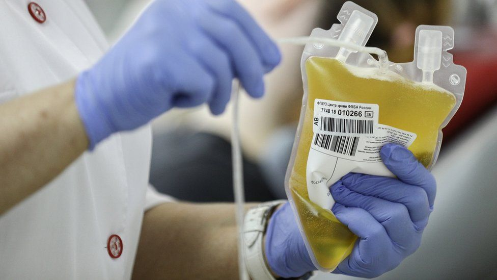

# 中国医药子企业血制品事件：艾滋病污染惊魂的来龙去脉 - BBC News 中文

2019年 2月 07日

------

Image copyright EPA 

 

血液是艾滋病病毒主要传播途径之一。

春节假期之际，具备中央级国有企业背景的中国医药被传出旗下企业有注射用血制品受艾滋病（又称爱滋病）病毒污染，但有关消息被官方自我否定。

上海《每日经济新闻》星期二（2月5日）报道，中国国家卫生健康委员会下达指示，要求各地停用中国医药旗下上海新兴医药所生产的一批静注人免疫球蛋白，理由是其艾滋病抗体（HIV抗体）检测呈阳性。

但中国国家药品监督管理局星期四（7日）称，涉事批次药物艾滋病检测呈阴性；来自江西曾接受该批次药物注射患者的艾滋病检测结果亦呈阴性。包括《每日经济新闻》在内的多家媒体已屏蔽相关报道。

静注人免疫球蛋白属免疫类用药，但与疫苗不同。然而在长春长生生物科技狂犬病疫苗事件发生不到半年、江苏金湖过期疫苗事件发生不到一个月之际再次传出此类事故消息，再次敲响中国免疫医药安全警钟。

- [数百家长与警方冲突 江苏疫苗事件被指瞒报](https://www.bbc.com/zhongwen/simp/chinese-news-46848703)
- [权健帝国与疫苗之王：被“新闻游侠”重塑的舆论江湖](https://www.bbc.com/zhongwen/simp/chinese-news-46699915)
- [艾滋病是什么？解开HIV/AIDS八大迷思](https://www.bbc.com/zhongwen/simp/science-46367647)
- [“第一次性行为后，我感染了艾滋病毒”](https://www.bbc.com/zhongwen/simp/uk-46382387)

## “艾滋病污染血制品疑似事故”是怎样曝光的？

《每日经济新闻》星期二报道，据“河南某医疗机构人士”向该报透露，“已经接到来自国家卫健委通知”，由上海新兴医药公司生产，批号“20180610z”的静脉注射用人免疫球蛋白药剂须予以封存，“对采购问题批号产品的医疗机构，应立即上报并对已经使用问题批号产品的患者进行监测，密切观察病情变化。”

与此同时，网络上流传一份题为《国家卫生健康委办公厅关于暂停使用上海新兴医药股份有限公司相关批号静注人免疫球蛋白的通知》的电报，称根据江西省卫生健康委员会疾病预防控制中心检测，该批药剂“艾滋病抗体阳性”。新兴医药母公司中国医药 [其后发表声明](http://www.meheco.com/news/20190207738301.shtml) ，证实了这份电报的真实性。

《中国经营报》联营微信公众号《商学院》指出，这批药剂共有1.2万余瓶，每瓶50毫升，“由上海市食品药品检验所批签发”。

Image copyright Getty Images / TASS 

 

血液内的血小板是人免疫球蛋白的主要来源。

曾任上海市疾病预防控制中心主管医生，被中国媒体称为“疫苗科普达人”的陶黎纳向《北京青年报》指出，人免疫球蛋白以合并血浆制成，血浆至少来源于1000名供血者。这次事件意味着血浆中至少有一份来自艾滋病毒携带者。

《北京青年报》引述陶黎纳说，最初发现的不是免球药剂艾滋病阳性，而是用过免球的婴儿出现艾滋弱阳性。“不知道发现婴儿弱阳性后，对该批号免球是否做了检测，如果检测了是阳性，那么才能说这个免球阳性”

陶黎纳说：“就看到底是基于婴儿阳性的间接证据，还是基于问题免球检测阳性的直接证据了，如果是前者，如今检测又都是阴性，那很有可能是个乌龙事件；如果是后者，那么就看试剂或方法上是否出了纰漏导致假阳性了。”

## 官方对事故有何说法？

中国官方新华社星期三引述国家卫健委消息，证实国家卫健委接获涉事药剂的艾滋病阳性检测结果报告，要求全国医疗机构暂停使用问题批次药品，并派出督导检查组到上海和江西调查处置。

报道同时宣称：“根据国际相关文献报道，结合该药品灭活病毒的生产工艺特点和产品PH值（酸碱度）等因素，专家认为使用该药品的患者感染艾滋病的风险很低。”

- [一代人中能消除艾滋病吗？](https://www.bbc.com/zhongwen/simp/fooc/2016/08/160801_fooc_south_african_aids)
- [基因编辑防艾必要性受质疑、我们如何更好防治艾滋病](https://www.bbc.com/zhongwen/simp/science-46410309)
- [疫苗问题：盘点中国食品药品安全热门词](https://www.bbc.com/zhongwen/simp/chinese-news-44943192)

Image copyright EPA 

 

江西与上海给出截然不同的检测结果。

上海市药品监督管理局星期三晚表示，该局派遣执法人员与专家进驻生产现场调查，控制企业所有相关生产和检验记录，对产品抽样送检，并已要求企业停产和紧急召回产品。

中国医药的声明说：“上海新兴为我公司控股子公司，我公司对此事件高度重视，立即成立专项工作小组，并迅速派员进驻上海新兴进行现场督导工作。”

“上海新兴已经全面停产，全面排查问题批次产品的原料来源、生产及质量控制全流程等各重要环节中可能存在的问题。一旦发现违规问题，我们将严肃追究相关人员的责任。”

至星期四早上，新华社引述国家药监局称，上海方面对上海新兴医药生产的涉事批次静注人免疫球蛋白进行的艾滋病、乙肝、丙肝三种病毒核酸检测，结果均为阴性；江西方面对患者的艾滋病病毒核酸检测结果为阴性。

江西省与上海市对同一批次药剂的检测结果相左。对此官方媒体暂无进一步解释。

## “静注人免疫球蛋白”有什么用途？

免疫球蛋白（immunoglobulin）是具有抗体活性的动物蛋白，一般提炼自血小板，可用于协助免疫能力不足病人抵抗感染。《巴西血液学和血疗法杂志》（Revista Brasileira de Hematologia e Hemoterapia） [2011年一篇文章形容](https://www.ncbi.nlm.nih.gov/pmc/articles/PMC3415732/) ，免疫球蛋白是“临床使用最广泛的血液制品”。

在上海新兴医药的官方网站上，其静注人免疫球蛋白产品被置于首页显眼位置。据该网站介绍，有关产品适用于治疗急性炎症、血小板减少、川崎病和控制化疗感染。

Image copyright Xinhua 

 

生产免疫球蛋白涉及上千人的血浆。

- [“疫苗门”下中国百姓的无奈与无助](https://www.bbc.com/zhongwen/simp/world-44925055)
- [观点：从疫苗之殇看中国的系统性腐烂](https://www.bbc.com/zhongwen/simp/chinese-news-44920324)
- [中国“庞氏疫苗案”与香港“限苗令”](https://www.bbc.com/zhongwen/simp/china/2016/04/160414_ana_hk_vaccine_service)
- [中国问题疫苗与西方反疫苗运动](https://www.bbc.com/zhongwen/simp/china/2016/03/160323_ana_vaccines_fear_anti-vax_movement)

[英国卫生部2011年发表的临床指引指出](https://www.gov.uk/government/uploads/system/uploads/attachment_data/file/216671/dh_131107.pdf) ，患有溶血性疾病的新生儿，以及接受器官移植手术的病人等，也适合采用免疫球蛋白疗法。

2008年5月，江西南昌大学第二附属医院先后有六名患者在接受免疫球蛋白注射之后死亡，引发中国政府注意到坊间对免疫球蛋白疗效的吹捧，诸如“注射人免疫球蛋白可以预防非典型性肺炎（沙士，SARS）”、“可以预防手足口病”的传言一度甚嚣尘上。

官方新华社 [当时曾发文](http://www.gov.cn/fwxx/jk/2008-06/12/content_1014220.htm) 警告不要“迷信”免疫球蛋白：“滥用人免疫球蛋白制品有可能发生过敏反应，导致心率加快或减缓，甚至引发休克。”

“同时，由于人免疫球蛋白是血液制品的一类，如果在提取过程不严格，就有可能感染乙肝、艾滋病等。”

这种“迷信”至今依然存在。《北京青年报》指出：“很多老人到小诊所注射‘人免疫球蛋白’，期望‘提高身体抵抗力，不感冒’。甚至还有家长为孩子‘高考前打点免疫球蛋白’。”

国家药监局上月发文要求增加在人免疫球蛋白上的警示字眼：“虽然对原料血浆进行了相关病原体的筛查，并在生产工艺中加入了去除和灭活病毒的措施，但理论上仍存在传播某些已知和未知病原体的潜在风险，临床使用时应权衡利弊。”

## 上海新兴医药这家公司是什么背景？

Image copyright BBC News Chinese 

 

上海新兴医药在官网显著位置展示其静注人免疫球蛋白产品（左）。

上海新兴医药官方网站介绍，该公司原属中国军方所有，名为中国人民解放军总后勤部卫生部上海新兴血液制品研究所，2000年8月改制成企业，目前为“国家血液制品定点生产企业”，主要产品包括人血白蛋白、人凝血酶原复合物、人纤维蛋白原等。

去年5月底，中国医药健康产业公司增持上海新兴医药股份，成为其控股股东，涉及金额2.52亿元人民币。中国医药为上海证券交易所上市公司，其控股母公司为中国通用技术集团。

中国通用技术集团属“国有重要骨干企业”，即其产权上属中国国务院国有资产监督管理委员会管理，人事任命上受中共中央组织部管辖。

## 中国舆论对此次上海新兴医药事件有何评论？

在国家药监局发表阴性检测结果后，《每经》的原报道悉数被屏蔽下架，页面上只剩“404找不到”字样。但北京《新京报》等媒体的跟进报道则完好无缺。

在新浪微博上，与上海新兴制药此次事件有关的关键词于话题榜上十大不入。在官方新华社新华视点微博与中国中央电视台央视新闻微博的帖文下能看到留言跟帖数目超过100，但只有“博主精选评论”得到展示。

新华视点微博上其中一条获展示的留言称：“确定没问题吗？那就抓造谣的！要铁证如山！”

专门搜集被审查过滤微博帖文的民营网站自由微博（Free Weibo）与香港大学微博视野（HKU WeiboSCOPE）只搜集到有限的内容，但据自由微博榜单，“上海新兴”与“免疫球蛋白”均在热搜榜之上。

## 世界上曾发生过哪些血制品污染丑闻？

2008年5月发生的江西博雅生物制药人免疫球蛋白致死事件共导致六人丧生；2007年1月，广东佰易药业人免疫球蛋白产品导致患者出现丙肝抗体阳性。不过这两起事故均非涉及艾滋病病毒。

[去年9月](https://www.bbc.co.uk/news/health-45591584) ，英国公开听证调查一起被称为国民保健服务（NHS）体系成立以来最严重的治疗灾难事故。在1970年代与80年代之间，超过2.5万名于NHS就诊的病人被注射受污染的血制品，其中至少5000人因此感染各种肝炎与艾滋病病毒。这些患者当中有3000人死亡。

这次由退休法官领导的调查预计将持续两年。

Image copyright Getty Images / Sygma 

 

法国血制品传染艾滋病事件促成专门审理前任和现任内阁官员的共和国司法法院成立，由三名翻案法院（最高法院）大法官与12名国会议员组成合议庭聆案。

时间回到1985年，法国约4000名病人被注射受艾滋病病毒污染的血制品，或被输送受污染血液。当时艾滋病刚被发现不久，世界各国对其与HIV病毒和血液之间的关系了解不足，但政府涉嫌明知有关血浆已受病毒污染，依然提供予医疗机构作临床使用。

[法国前总理法比尤斯（Laurent Fabius）与两名内阁部长被起诉过失杀人罪](http://news.bbc.co.uk/1/hi/world/europe/1482021.stm) 。最终，法比尤斯与原社会事务和民族团结部长杜弗瓦（Georgina Dufoix） [获判无罪](http://news.bbc.co.uk/1/hi/world/europe/293367.stm) ；原卫生部长赫维（Edmond Hervé）被判有罪，但并未获刑。

同期，日本至少1000名血友病患者因接受输送受污染血制品而感染艾滋病。至1989年，东京与大阪两地受害病患陆续对厚生省和供应受污染血制品的绿十字公司提起民事索赔诉讼；1996年，原厚生省药务局官员、绿十字公司原社长松下廉蔵等人先后被捕，并控以业务过失致死罪。

松下廉蔵最终被判有罪，处以一年监禁，但缓期两年执行。他不服上诉， [被日本最高裁判所终审驳回](http://www.courts.go.jp/app/files/hanrei_jp/923/035923_hanrei.pdf) 。

Copyright © 2019 BBC. BBC不为非BBC网站内容负责。

------

原网址: [访问](https://www.bbc.com/zhongwen/simp/amp/chinese-news-47153737)

创建于: 2019-02-08 22:10:23