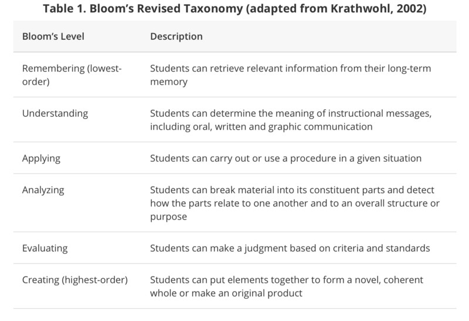

# 每天都在学习的你，到底想要知识还是虚假的成就感？_36氪

[boxi](https://36kr.com/user/1694) • 2019-02-08 • 读书

当知识成为成功的障碍。

编者按：知识就是力量。不断地阅读、研究和学习会给有抱负的创业者一种虚假的成就感。但在信息泛滥的时代，注意力和时间成为了最稀缺的资源。了解学习遗忘曲线的人知道，泛泛而读的东西遗忘得很快。而知道了不去做无异于浪费生命。唯有知行合一，把学习放在自己最感兴趣的地方并且付诸行动，知识才能产生力量。这是创业者Aytekin Tank的[感悟](https://medium.com/swlh/why-learning-more-isnt-always-better-2154f75a71d6)，也希望大家共勉。

知识就是力量。

这是很流行的一句话——反复被大家传颂，却几乎没有考虑过它的真正含义。

尽管这句话往往被认为是英国哲学家培根说的，但这种说法的最早出处可追溯到10世纪的穆斯林文学当中。

在《辞章之道（Nahj Al-Balagha）》中，穆罕默德的女婿阿里·本·阿比·塔利卜将力量定义为权力性影响力：

> 知识就是力量，它可以命令你遵守。有知识的人一生之中都可以让人服从他、追随他，并在死后受人尊敬和颂扬。

——演说146

参观任何一所大学园区你都会发现成百上千的教授在上课，内容从计算机科学到理论物理乃至于为嬉皮士正名——是的，这是真正的上课。

大多数学者记住的信息要比一般人多得多。但是，社会多半并不认同他们特别“强大”。

显然，这句话已经演变成为把“增加的个人和职业机会”包括在内。

比方说，一个人对金融的了解越多，在为退休做储蓄时的选项就越多。

但是知识是不是真的越多越好？知识是不是会令我们更有力量？以我之见，答案是否定的。

由于技术进步，现在在大多数领域达到精通的程度都要比过去更容易实现了。因为可以24/7随时访问成千上万的免费网络课程、博客和播客，我们可以穿着睡衣推进自己的教育。

然而，跟家人朋友同事的沟通让我相信消费信息已经成为了一种过分的时髦。

> 学习是“有效拖延（productive procrastination）”的最新形式

当然，我知道，我正在写生产力方面的文章本身就是一种讽刺。然而，我希望分享一种不一样的观点来鼓励采取战略行动。

不断地阅读、研究和学习会给有抱负的创业者一种虚假的成就感。

就拿Abhishek V.R来说吧。他花了2年的时间去消费有关制作网站的信息，并且在将想法付诸行动前还经营这一家在线企业：

> Abhishek说：“从社交媒体到写作，我样样都在行。猜猜看我变成专家的这2年时间里赚了多少钱？一分钱都没有。我一分钱都没赚因为我什么都没做。”

不幸的是，Abhishek的故事远非个案。甚至有经验的创业者有时候也会陷入到信息过载之中，这显示了为什么纯粹知识往往无力的原因。

那么，也许仅有知识并不是我们要追求的——可能获取足以唤起智力行动的知识才是我所欲。

**1、知道不等同于学习**

远大的目标需要的往往不仅仅是死记硬背；这要求对核心原则有更深入的理解。但我们很多人仍然将学习跟记忆事实、公式和概念联系在一起。

无论他们是学习西班牙语还是反复吟唱“1492年，哥伦布在蓝色海洋上乘风破浪”，信息填鸭是很多年轻人的标准流程。

所以我对教育专家说信息回忆只是完全理解的垫脚石而已的说法感到吃惊。全球K-12的教师和大学讲师往往围绕着某个叫做“布鲁姆分类学”的东西进行课程规划。

布鲁姆分类学是一种基于数十年正式研究而指定的学习框架。该框架认为，知识的通话可以分为6种类别：

从低到高依次是记忆、理解、应用、分析、评估、创造

尽管充分理解包括的不仅仅是看课本听讲课，但这些似乎仍然是我们毕业后的教育流程。  

也许一些讲师更侧重记忆而不是创造性和逻辑性的实验，但这种倾向也会令我们许多人受困。

太多没有行动的知识会导致我们不堪重负、受挫以及被误导。最终，我们将意识到我们上当了：没有行动的知识是没有力量的。

如果我们真诚面对自己的话，我们甚至都不记得自己消费过的大部分内容了。

1960年代时，美国国家训练实验室衡量了学生经过24小时的各种学习后的留存率情况。该组织发现，他们通过阅读学习的信息能保留下来的就只有10%了。

学习金字塔：教是最有效的学

相反，如果信息付诸行动的话留存率就达到了令人瞠目结舌的75%，而如果他们把信息交给别人的话留存率就达到了90%。  

作者Rena Palloff and Keith Pratt在《Assessing the Online Learner: Resources and Strategies for Faculty（在线学习者评估）》一书中对此模式进行了再确认：

> 鼓励学习者实际去做来示范知识获取，而不是接受考试或者测验的评估不仅是知识获取更好的指标，而且更有可能跟结果和能力一致。

不管是什么样的知识，如果我们不马上使用的话，我们就输了。这正是为什么全世界最成功的创业者似乎都是用创造性的实验来点缀知识获取的原因所在。

**这个流程大概是这样的：**

读/听/看→做→评估→重复

创业者也许然后会决定通过分享给他人来巩固新得到的知识。

显然，我们大多数人在度过每一本书之后都没有时间去上一堂正式的课。但我们可以将快速上手指南上传到YouTube上；将我们的发现与感兴趣的家人朋友和同事进行讨论，或者甚至成为经验欠缺的业主的导师。

**2、强制学习会打击创造力**

你见过不以自我为中心的孩子吗？想想看他们在没有强制建议的情况下学到了多少东西。

比方说，幼童观看父母走路之后自然就会想自己跟着做。他们会跌到好几次，但无妨，站起来后还会接着尝试。

小孩不会因为一点儿挫折而气馁，因为他们没有失败的概念；他们不断尝试因为这很有趣。

我们都曾经是个孩子：我们的天生兴趣让我们学会了说话，了解了社会线索，并且学习一切我们认为重要的东西。只是到了学校之后学习才成为一种负担。换句话说，学习是自然的——直到我们强迫去学习。

> 波士顿大学心理学教授Peter Gray说：“我们把他们送去学校，然后我们搞不懂为什么他们不再自我激励了，因为我们已经把学习的基本诱因：好奇心、玩乐性、社交性给干掉了。”

Gray的观察很难算得上新发现；这甚至引发了1970年代的自主学习（unschooling）运动。这个由教育家John Holt发明的词其实是指一种主张以学习者自我选择的活动为主要教育手段的哲学。

自主学习跟在家学习（homeschooling）不一样，自主学习的学生是通过自然的生活体验来学习的。在本质上属于好奇心驱动的课程。学习工具包括了玩、做家务、工作经历、实习、旅游以及教育性资源。

> 自主学习者Idzie Desmarais说：“任何人不喜欢学习的唯一原因是学习变成了一种负担：一种被迫的、不愉快的体验。作为自主学习者，我们意识到学习就像呼吸一样自然。如果学习永远都没有被搞成无趣的东西的话，那就会一直都是你一生当中非常愉快的一件事情。”

尽管我并不建议自主学习作为父母的选择，但我认为大家都应该意识到强迫学习热情究竟有多糟糕。

作为创业者，我们必须对自己的动机无比坦诚：我们是否在寻找自己真正感兴趣的东西的知识？还是只是因为我们说服了自己我们必须如此才去获取关于某学科的丰富信息？

我认得的最成功的创业者会围绕着自己最享受的领域展开最大程度的学习。

尽管他们的确花时间去学习一些不那么感兴趣的东西的基础知识，但他们只会获取到足以展开行动即可。

**3、有时候我们需要忘记（unlearn）**

我们大多数人都把学习看成是增加知识和技能，这一点可以理解。然而，有时候我们需要去除旧的思维方式才能拥抱新的。

比方说，一对夫妻找到Marcia Conner想学皮艇。

男的那位划艇方面的东西了解很多，他已经花了很长时间去学这种技能。然而，他的妻子却是个水上运动的菜鸟。但是情况很快就变得很清楚了：丈夫之前的经验反而变成了累赘而不是资本。

> Conner说：“前面上课的时候他试图比较这两种艇然后重复自己确信能行的划桨动作。结果却是不断地在我们作为上课地点的游泳池翻了个底朝天。这说明有时候他已经知道的东西在学习新东西的时候并没有那么的有用。”

而他的妻子却取得了显著进展，从第一天开始就如此。

尽有很多的创业知识都是可互换的，但也有一些是项目相关的。每一项经营都需要挑战我们之前的经验，无论我们是在应对不熟悉的行业，新兴技术，还是新的团队成员，我们都必须用崭新的好奇心去处理每一个项目。

就拿爱因斯坦来说吧。如果不打破牛顿的机械运动定律的话他永远都发现不了狭义相对论。几乎每一次重大的科学发现都需要挑战旧的范式。

不幸的是，用崭新角度展开新的冒险未必总是一帆风顺。减少这种倾向的办法之一是马上聚焦到令新项目跟之前有所不同的地方。

我们要积极地向自己发问，为什么某个东西不一样，我们要打破自主巡航的倾向。这是产生新想法、解决方案以及观点的好办法。

**4、有时候授权别人会更好**

就像我之前提到过一样，最成功的创业者会把自己的时间尽量花在自己最感兴趣的地方。当他们变得更加成功之后，他们就会将自己不那么感兴趣的任务委派个别人。

这是每一位有经验的创始人都明白的经验：他们每天根本没有那么多的时间每件事情都亲力亲为。

所以，为什么我们要把每本书都读一遍，每个播客都听一遍，每场TED演讲都看一遍？如果知道我们没法做完的话，我们就不应该去学。

的确，现在用来节省时间、精力和金钱的技术解决方案实在是太多了。我们生活在知识和服务型资源似乎无限的时代。

成功的关键似乎是校正我们的知识摄入量，同时将获取的信息付诸行动。

我们沉迷于跟进新书、播客和信息趋势的时间越少，我们可以去创造的时间就越多。

难道这不也是我们那已经有5年历史的书架所希望的吗？

原文链接：[https://medium.com/swlh/why-learning-more-isnt-always-better-2154f75a71d6](https://medium.com/swlh/why-learning-more-isnt-always-better-2154f75a71d6)

编译组出品。编辑：郝鹏程。  

本文翻译自 medium.com，[原文链接](https://medium.com/swlh/why-learning-more-isnt-always-better-2154f75a71d6)。如若转载请注明出处。

------

原网址: [访问](https://36kr.com/p/5172585.html)

创建于: 2019-02-09 22:16:06