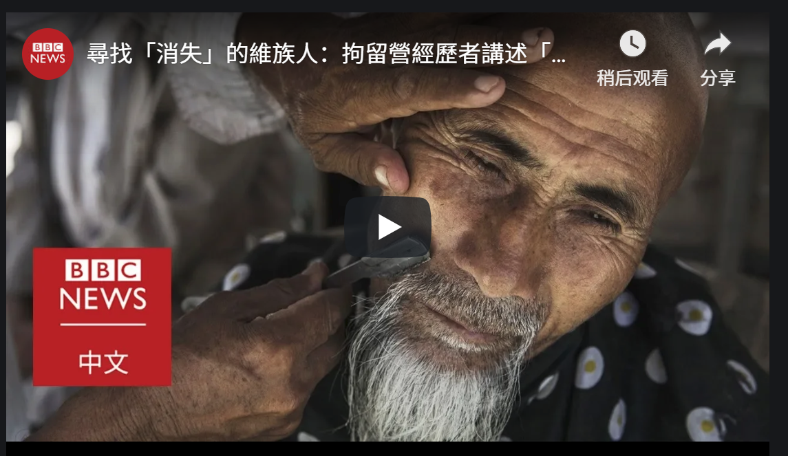

# 新疆“再教育营”：维族音乐家的生死罗生门 - BBC News 中文

2019年2月11日

图片版权 CRI 

该视频时间显示为2月10日。一名男子声称自己是维吾尔音乐家黑伊特，并称“身体状况良好”。

维吾尔音乐家阿不都日衣木·艾衣提（Abdurehim Heyit）（前译黑伊特）在中国新疆拘留营的生死受到外界关注。土耳其外交部根据早前对其已死的报道，要求中国关闭拘留营。但中国发布一段视频证明其还“活着”。

周日（2月10日）夜晚，中国官方媒体在“推特”上公布一段视频证明此前外界报道在中国新疆拘留营被指“已死”的维吾尔音乐家艾衣提还在世。

同日，[中国驻土耳其大使馆发表声明](http://tr.china-embassy.org/chn/xwdt/t1636648.htm)称，“经查证，阿不都日衣木·艾衣提，男，57岁，维吾尔族，新疆歌舞团原演员。其因涉嫌危害国家安全罪被依法逮捕，目前身体健康，并非土方所说的已经死亡”。

该视频时间显示为2月10日。一名男子声称自己是维吾尔音乐家艾衣提，并称自己“身体状况良好”。

早前的报道称艾衣提“已死”，土耳其外交部周六（2月9日）要求中国关闭拘押约百万人的“再教育中心”。一些维吾尔人质疑该视频的真实性。

总部位于美国的维吾尔人权项目主席特克尔（Nury Turkel）告诉BBC，该视频的某些方面很“可疑”。该视频由中国国际广播电台的土耳其语部发布。艾衣提在视频中说，他“正因涉嫌违反国家法律而受到调查”。

土耳其穆斯林和来自中国大西北地区的维吾尔人在种族、文化和信仰上有紧密关联。

*   [维吾尔音乐家"死亡" 土耳其要求中国关闭新疆拘留营](https://www.bbc.com/zhongwen/simp/chinese-news-47188476)
*   [新疆“再教育营”扣留维族人的“模糊准则”](https://www.bbc.com/zhongwen/simp/chinese-news-46430270)
*   [记者来鸿：新疆“再教育营”受害者恐怖经历](https://www.bbc.com/zhongwen/simp/fooc-45434483)

## 土耳其的态度为何不同寻常？

到目前为止，几乎没有以穆斯林为主的国家加入国际社会公开谴责中国新疆的拘留营。分析人士称，许多人担心中国的政治和经济报复。

不过，特克尔表示，中国发布该视频表明，中国政府确实会回应公众压力。

“中国政府回应土耳其是因为土耳其在穆斯林世界的影响。”他还补充说，联合国秘书长古特雷斯在新疆问题上“非常安静”。

“中国政府手上有主动权。他们拘留艾衣提，拘留了占总穆斯林人口10％的维吾尔人。他们试图告诉全世界，这里没有虐待，这些只有所谓的‘职业培训中心’。他们有责任证明视频是真实的。”他说。

特克尔说，由于“技术优势”，中国政府有能力篡改视频。“凭借今天的技术，可以造一个自述视频。这并不困难。”他说。

## 土耳其怎么说？

土耳其外交部发言人哈米·阿克索（Hami Aksoy）在星期六（2月8号）发表的一份声明中说：“有一百多万的维吾尔土耳其人被任意逮捕，他们在监狱中遭受酷刑和政治洗脑，这已不再是秘密。” 他还补充说，那些未被拘留的人也遭受“巨大压力”。

“在21世纪重新引入集中营以及中国当局对维吾尔族土耳其人的系统性同化政策是对人道的一大羞辱。” 阿克索说。

他还说，艾衣提已死的报道“让土耳其公众对新疆严重侵犯人权的行为有更强烈的反应”，他并呼吁联合国秘书长安东尼奥·古特雷斯（Antonio Guterres） “采取有效措施来结束（那里的）人间悲剧”。

中国驻土耳其大使馆2月10日发表声明称，土耳其外交部新闻发言人所说的"中国对所有宗教信仰实行同化政策"，违背了宗教发展演变的规律，是对宗教中国化方向的歪曲，不符合中国宗教实际情况。北京声称新疆的拘留营是旨在帮助该地区摆脱恐怖主义威胁的“职业教育中心”。

去年10月，新疆维吾尔自治区主席雪克来提·扎克尔（Shohrat Zakir）在新华社的文章中表示，教育营中的“受训人员”感谢组织给机会“反思他们的错误”。

“再教育营”的学员说：“以前完全不掌握国家通用语言文字，也不懂法，犯了错也不知道，但政府并没有放弃我，积极挽救帮助我，让我免费吃住、免费学习，我现在各方面都有了很大进步，一定珍惜这个机会，以后做一个对国家、社会有用的人”。

人权组织称，穆斯林群体因拒绝提供DNA样本、说少数民族语言或与官员争吵等“违规行为”而受到指控。

土耳其外交部发言人哈米·阿克索（Hami Aksoy）在星期六（2月8号）发表的一份声明中说：“有一百多万的维吾尔土耳其人被任意逮捕，他们在监狱中遭受酷刑和政治洗脑，这已不再是秘密。”他还并补充说，那些未被拘留的人也遭受“巨大压力”。

## 艾衣提是谁？

国际特赦组织表示非常关注有关艾衣提去世的报道，但这一报道尚未得到官方证实。

艾衣提是维吾尔都塔尔（dutar）的知名演奏家。维吾尔都塔尔是一种难以掌握的双弦乐器。艾衣提曾在中国很受欢迎，并在北京学习音乐，后来随国家艺术团演出。

据报道，艾衣提被拘源于他演唱的一首名为“父亲”的歌曲。歌曲主要讲述父辈在过去的牺牲，歌词呼吁年轻一代尊重和缅怀前辈。

但歌词中 “战争的烈士” 显然导致中国当局认为艾衣提有“伊斯兰极端主义”倾向。

*   维吾尔人在种族上属于突厥穆斯林；
*   维吾尔人占新疆地区总人口数的45%，其余40%是汉人；
*   在短暂的东突厥斯坦共和国政权结束之后，1949年中华人民共和国重拾对新疆的控制；
*   从那时开始，汉人大举移居新疆，维吾尔人担心文化被侵蚀；
*   新疆被正式指定为在中国境内的自治区，全称“新疆维吾尔自治区”。

---------------------------------------------------

原网址: [访问](https://www.bbc.com/zhongwen/simp/chinese-news-47194446)

创建于: 2019-02-11 22:31:47

