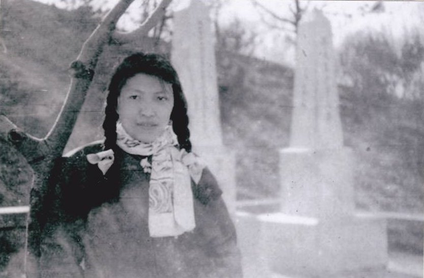
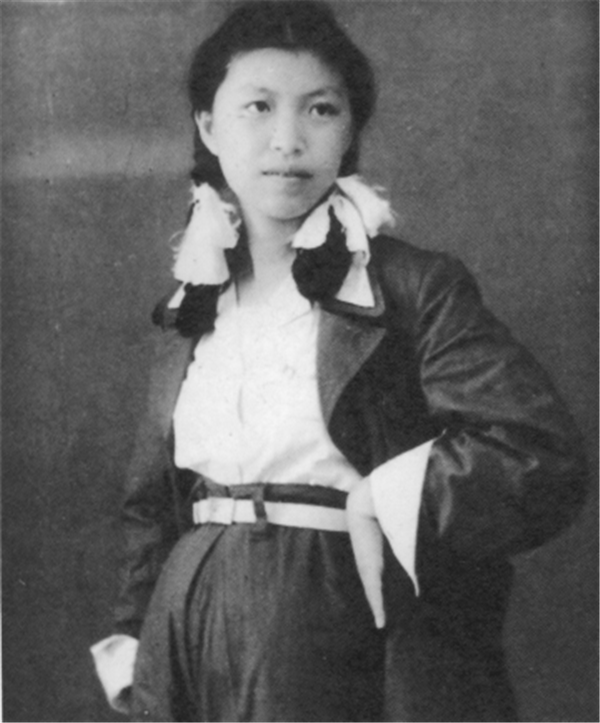
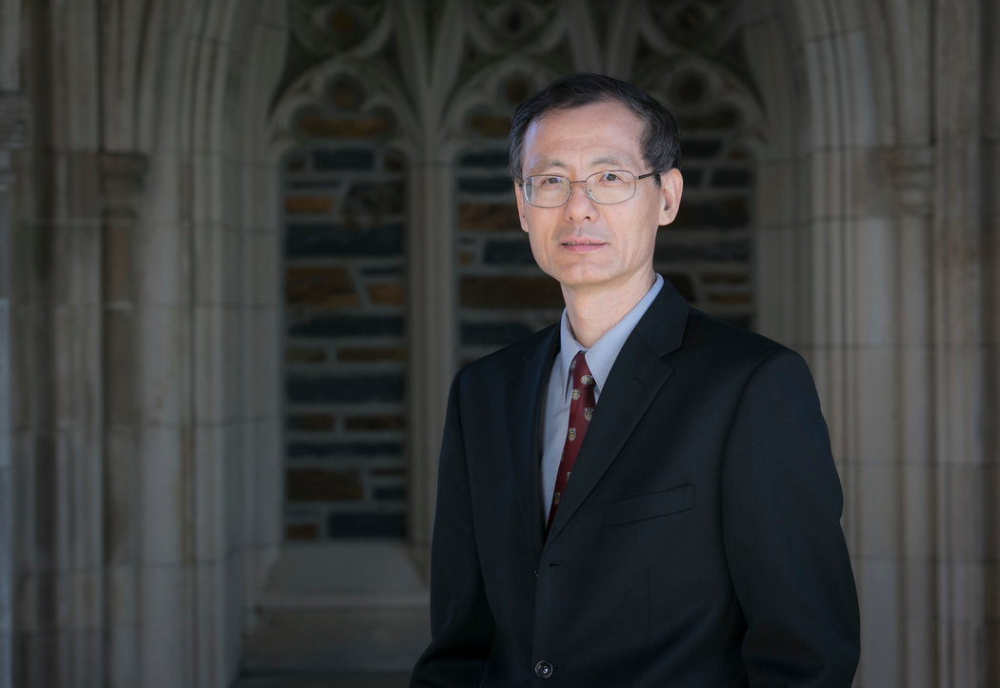
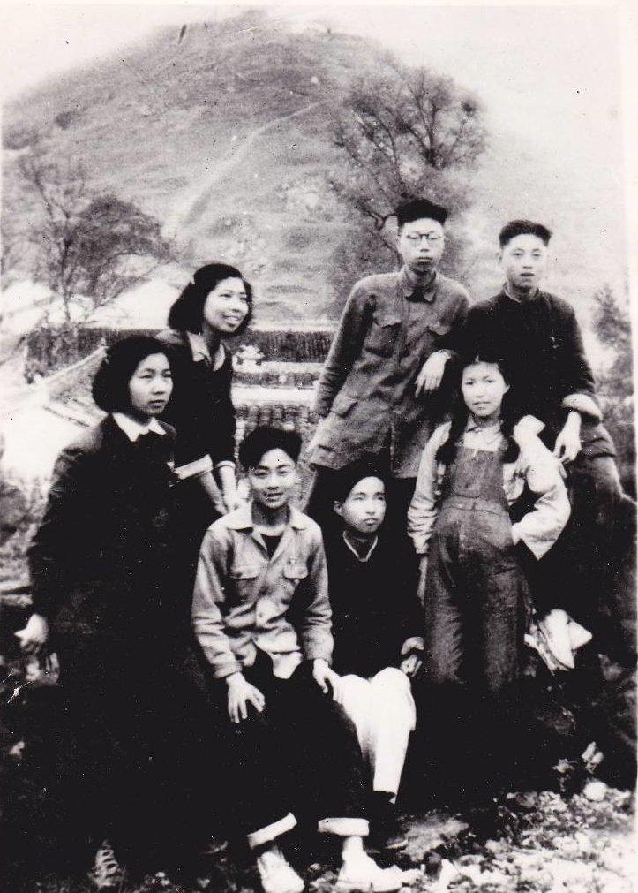
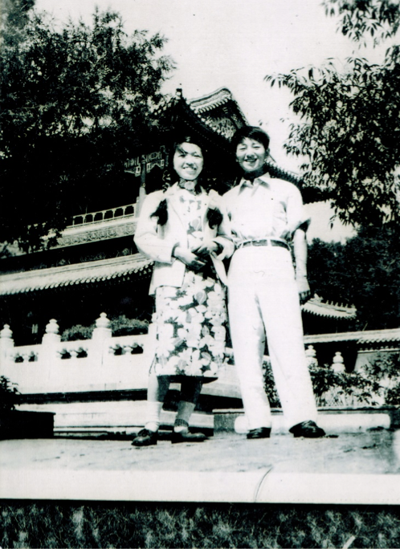

# 狱中血书：中共为何害怕死去的林昭 - 纽约时报中文网

罗四鸰

2019年2月13日

1959年，林昭在北京陶然亭，背景是高君宇及其女友石评梅的墓碑。高君宇墓碑侧面刻有一首海涅的诗：“我是宝剑，我是火花，我愿生如闪电之耀亮，我愿死如彗星之迅忽。” "The Collected Writings of Lin Zhao", via Lian Xi

无论是在当时那个疯狂的年代，还是在中国当代思想史上，林昭都是一个异类。1966年在上海劳改局为林昭加刑的报告上，这样写道：“关押期间（林昭）用发夹、竹笺等物，成百上千次地戳破皮肉，用污血书写了几十万字内容极为反动、极为恶毒的信件、笔记和日记……公开污蔑社会主义制度是：‘抢光每一个人作为人的全部一切的恐怖制度。’‘是血腥的极权制度。’她把自己说成是：‘反对“暴政”的“自由战士”和“青年反抗者”。’对无产阶级专政和各项政治运动进行了系统的极其恶毒的污蔑。”

去年林昭去世50周年前夕，杜克大学神学院(Duke University Divinity School)教授连曦博士的英文新著《血书：毛泽东时代中国的殉道者林昭鲜为人知的故事》(Blood Letters: The Untold Story of Lin Zhao, a Martyr in Mao’s China)在美国被出版。《纽约书评》(New York Review of Books)的一篇[文章](http://www.chinafile.com/library/nyrb-china-archive/breaking-eggs-against-rock)中，张彦(Ian Johnson)将《血书》称之为“近年来出版的有关共产革命时代捍卫人权的抗争最重要的书之一”。他指出，《血书》不仅是有关林昭的第一本英文传记，也是有关林昭的书写作最严谨的一部。

连曦也在书中特别探讨了宗教信仰在林昭政治抗争中所起的作用，他这样写道：

“她的基督教信仰使她在抗争中坚强。同时，信仰也制约了她的反抗。……她无法在这场斗争中认可暴力。‘作为一个基督徒、一个奉着十字架作战的自由志士在我看来：杀灭共产党并非反对以至清除共产党的最好方法。’”

2013年开始，连曦每年回国收集一些林昭的资料，并采访一些直接或是间接接触过林昭的人，比如她的未婚夫甘粹、她在北大曾爱恋过的同学沈泽宜、审查林昭案件的工作人员，以及当年曾关押过林昭的提篮桥监狱的工作人员以及政治犯。连曦博士甚至还特意住进提篮桥监狱附近的酒店，为了能从那里俯视提篮桥监狱。

林昭的生命虽然短暂却是复杂深刻的。1932年出生于江苏苏州一个知识分子家庭，原名彭令昭。1947年入苏州景海女子师范学校，并在这里受洗成为基督徒，这对她此后思想的形成起了关键作用。同时，她在此期间投身革命，并秘密加入中国共产党，改名林昭。不到一年，因不服从组织要求她从苏州撤退的命令，林昭失去党籍。此后，林昭努力为党工作，积极参加苏南地区的土改，希望能重新入党。1954年林昭考入北京大学中文系新闻学专业，在1957～58年反右运动中被划为右派，在中国人民大学新闻专业资料室接受群众“监督改造”。

1959年秋，因健康原因，林昭由母亲接回上海休养。期间，林昭认识了兰州大学的顾雁、张春元等人，他们正在筹办针砭时弊的《星火》杂志。1960年，第二期组稿完毕，欲出刊，其中有林昭的一首诗《海鸥》。连曦说，其中的几句透出了林昭效法基督殉难的情怀，也为她后来的狱中抗争埋下了伏笔：

_只要我的血象沥青一样，_

_铺平自由来到人间的道路，_

_我不惜把一切能够献出的东西，_

_完完全全地献作她自由的牲羊。_

1951年11月，林昭在苏州农工团土改工作组时留影。 "The Collected Writings of Lin Zhao", via Lian Xi

因被告密，“星火”定性为“反革命集团案”，43人被捕，25人被判刑。林昭被视为主犯之一，于1960年10月被捕入狱。

在她被囚将近7年期间，林昭共写有50万字左右，在《14万言书》、《血诗题衣》等作品中直接指出当时中共政权是极权制度，并讽刺毛泽东。没有纸笔时，林昭便用血在衬衫和被单上写下其中一部分。但连曦认为，林昭并不是没有思想上的彷徨。第一次入狱时，她曾写过一篇《个人思想历程的回顾与检查》，认为中共当时已经认识到“大跃进”的错误，并开始政治改革，因而表示：“像这样一个党，我是可以重新拥护并且觉着值得拥护的了！”

1962年，林昭保外就医，当时她意识到自己对中共民主化改革的希望不过是一厢情愿，再次立志反抗暴政。9月在苏州起草了“中国自由青年战斗联盟”的纲领和章程，并曾试图在海外发表《我们是无罪的》、《给北大校长陆平的信》等。12月，林昭再次被捕。

虽然此后她一直被关押在监狱，但在连曦看来，此时林昭的思想已经脱离了共产极权的枷锁。对于当时的“红太阳”毛泽东，林昭在第二次入狱后所写的《血诗题衣》用诗歌批评道：“只应社稷公黎庶，那许山河私帝王。”1965年5月作为“中国自由青年战斗联盟”反革命集团主犯判处有期徒刑20年。1966年“文革”开始，不久，林昭被列为应该处决的反革命分子。1968年4月29日关押在提篮桥监狱的林昭被改判死刑，当天执行枪决，年仅36岁。

1980年8月，上海市高级人民法院宣布为林昭平反；1981年12月，上海高院再次做出判决，宣布林昭无罪。林昭的事迹和思想才渐渐为世人所知。1982年，林昭墓在苏州老家修建，据报道，当时里面只有一缕头发，墓碑背后镌有林昭1964年写下的诗句：“自由无价，生命有涯，宁为玉碎，以殉中华。”

从此，去林昭墓前祭奠这位思想先驱和自由斗士，成为中国人争取自由的一个象征。在中国民间，对林昭的纪念不断，但在中国官方，林昭是一个被竭力抹杀的名字。

连曦博士主要从事中国基督教史研究。1960年代初出生于福建，1980年代末赴美国留学。已出版的英文学术著作包括《传教士的皈依：在华美国新教差会中的自由主义（1907—1932）》(The Conversion of Missionaries: Liberalism in American Protestant Missions in China, 1907-1932) 和《浴火得救——现代中国民间基督教的兴起》(Redeemed by Fire: The Rise of Popular Christianity in Modern China)。近日，连曦教授通过邮件接受了采访，访谈有删减。

杜克大学神学院教授连曦。 Courtesy of Lian Xi

**问：**林昭在她的年代，有没有人知道？有没有产生影响？

**答：**林昭在她的年代几乎无人知晓。在北大期间以及被打成右派以后，只有她的同学、难友和读过其诗文的人了解她的才华和思想的深度。《星火》在那个时代并没有在民众间流传的机会；1962年保外就医期间她给北大校长陆平写的请他效法蔡元培先生的榜样，保释北大“五·一九”民主运动的被捕者与被迫害者的呼吁信也石沉大海。入狱后，林昭的思想和文字更被挡在高墙之内。她的《致〈人民日报〉编辑部信》和《血诗题衣》七律组诗，以及她给联合国写的上诉书等都深锁狱中。

但林昭在狱中一直抱着一个不渝的信念，即她的文字和思想终会流传后世。她甚至在狱中给自己未来的文集取了名，叫《自由书》。这种自信与当权者对她思想及其影响的恐惧，形成了十分强烈的对比。

**问：**林昭是怎么进入公众视野的？

**答：**林昭进入公众视野同样经历了一个较为漫长的过程。1981年初，《人民日报》的长篇通讯《历史的审判》和陈伟斯在《民主与法制》上发表的《林昭之死》，是关于林昭被枪杀、当局向家属收取五分钱子弹费最早的报道。后来也出现了个别纪念文章。但林昭真正成为中国人追求民主自由的象征是在进入21世纪后。过去的十几年里，网上出现了不少纪念林昭的文章，但影响最大的是胡杰的纪录片《寻找林昭的灵魂》，和林昭在狱中写下的、后来登在网上的抗争文字，包括《14万言书》。

**问：**你是什么时候知道林昭的？是什么触动你决定为她写传记的？

**答：**我其实比较晚才开始关注林昭的生平和思想。在2011年底。当时一个朋友向我推荐胡杰拍的《寻找林昭的灵魂》。看了以后很受震撼，也就有了写林昭传的想法。我是研究历史的，所以得知斯坦福大学的胡佛研究所(Hoover Institution)收藏了林昭的狱中手稿后，翌年我就找机会去了胡佛。面对林昭那充满激情、闪烁着人性之光的文字，我不能不为之触动。

**问：**关于林昭，国内也有不少人研究。你的这本书与其他人的研究有何不同？你有没有新的发现？

**答：**我的研究是建立在国内一群林昭研究者们多年辛劳的基础上。他们收集整理了林昭文字，包括她15岁那年发表的文章，到被害前三个多月从提篮桥监狱写给母亲的最后一封家信。这是一份高尚的抢救史料的工作，所以我的林昭传献给了这个致力保存林昭精神遗产的群体，其中有她的胞妹、闺蜜、同窗、恋人和当年的反革命同案犯，还有多位当代的研究者。

1950年4月，林昭（前排右一）与苏南新专同学合影于惠山石门之巅。 "The Collected Writings of Lin Zhao", via Lian Xi

2000年长江文艺出版社发行了第一本纪念文集《林昭，不再被遗忘》，但比较全面地介绍林昭的生平和政治抗争的是独立制片人胡杰于2004年拍成的纪录片《寻找林昭的灵魂》，和赵锐于2009年在台湾出版的《祭坛上的圣女——林昭传》。我开始研究林昭后不久，倪竟雄女士、1960年因“星火反革命集团案”与林昭一起被捕的谭蝉雪女士和其他人一起编辑的《林昭文集》完成，其中收集的林昭文字是迄今为止最为完整的，包括二十几万字的狱中文稿《灵耦絮语》，是之前的林昭研究未采用的。

除了《林昭文集》，几年来我还采访了多位知情者，包括上海监狱和法院系统体制内人士，澄清了林昭生平的一些重要细节，比如林昭被害的地点不是龙华机场的跑道，毛泽东御审林昭之说并不成立，林昭的父亲未曾出国留学，林昭的死刑判决经历了从1966年12月到1968年4月的漫长、曲折的过程，以及林昭墓碑上所刻的、通常在网上看到的林昭出生日有误。我也到了新泽西州麦迪逊市的联合卫理公会档案馆，找到了有关林昭就读的教会学校景海女子师范学校的史料，包括林昭的传教士老师写的一本回忆录。这些史料让我们比较清楚地了解了林昭思想的成型过程。

**问：**林昭留下的血书有多少？内容是什么？

**答：**林昭以血为墨写下的狱中文字，我们可以确定的有二十几万字，1966年底上海市劳改局提交的林昭案加刑材料综合报告也提供了重要旁证。这些血书由她自己用墨水誊抄，后来归入了上海市高级人民法院内的林昭副档，也叫副本。林昭正档里可能保存了她被羁押上海第一看守所时所写、在她被判刑并移解提篮桥监狱时被扣留的血书。但是因为至今林昭的正档仍处于封存状态，故内容不得而知，须等到解密的那一天。

目前所知道的血书，篇幅最长的是既似剧本又是日记的《灵耦絮语》，以及痛斥毛泽东、道出“只应社稷公黎庶，哪许山河私帝王”的壮烈的《血诗题衣》七律组诗，还有记叙狱中艰难抗争的血书家信等。1980年代初，上海市高级人民法院将林昭狱中手稿退还家人时，林昭案卷的副本里仍保存了部分血书原件但并未退还。负责此案的审判员认为那些原件“太触神经了”。

**问：**你如何看待林昭在当代中国思想史上的作用、地位和影响？

**答：**在毛泽东的专制极权时代特别是“反右”运动后，中国思想史一度出现了空白。林昭以她充满人道激情和宗教情怀、兼顾社会公正和个人权利尊严的自由主义思想填补了这个空白。严格说来，当时一些知识分子默默坚持的独立思考和私自留下的文字（比如顾准日记），无论有何深度，对中国现当代思想史的贡献都十分有限。1960年代因言获罪的文人中有思想相对独立的大知识分子如吴晗、邓拓，但他们借古讽今的作品如《海瑞罢官》，其中的思想仍局限于改良中共统治，大多属于谏臣之言，如《燕山夜话》中的“王道和霸道”，旨在劝毛泽东多行王道。

放在“士”与统治者关系的历史大背景中来看，这些思想还没有脱离君臣之道。后者的特点是君臣认同和维护同一个道德和价值体系，其核心就是孔子所说的“为政以德，譬如北辰，居其所而众星共之”。为臣的即使犯上进谏、死谏也仍未偏离君臣共享的思想轨道。甚至被逼上梁山也还是只反贪官不反皇帝，所以被招安是一种自然的回归。这就是为什么有的遭受中共残酷迫害的知识分子平反后会对党感恩戴德，会把稿费、存款都交了党费。

显然，在毛泽东时代，马列主义已经取代德政成为中共统治的“北辰”。林昭也有过谏臣情结，但最终在这个充满仇恨与暴力的思想体系之外，找到了另一个道德“北辰”，这就是源于基督教信仰的自由主义。在中共统治时代，林昭是最早公开摒弃、颠覆君臣之道的思想者。

1959年左右，林昭与其未婚夫甘粹在北京景山公园。 Courtesy of Gan Cui

**问：**林昭思想主要源自哪里？和基督教信仰有多大的关系？

**答：**林昭的思想来源与同时代的中国自由知识分子有相通之处，包括“以天下为己任”的那种“士”的情怀。她写的“被捕七周年口号”里就有“家国在怀，兴亡在肩！”一句。另外，她与那一个时代自由知识分子同样继承了五四传统，也就是对精神独立和思想自由的追求。“反右”运动之后，有良知、有见识的中国知识分子普遍陷入沉默，是什么驱使林昭以卵击石、为良知和真理发声？我认为是基督教信仰带给她的道德认知、使命感和殉道精神起了关键作用。这个信仰也定格了她那有道德制约的政治抗争。

林昭的狱中手稿为此提供了大量的证据。林昭称自己是“作为一个基督徒、一个奉着十字架作战的自由志士”，她所捍卫的是“受自上帝的完整的人权”，而且她在狱中不断寻求“天父”赞同而且直接参与她的政治抗争的印证。

**问：**林昭是基督徒，曾经也是共产党员，你如何看待她的这种双重身份？

**答：**这种双重身份在现在看来不可思议，而在民国晚期却是常见的现象，比如大批毕业于教会学校燕京大学的爱国青年投奔延安，毛泽东还为此向司徒雷登炫耀过。当时腐败、专制的国民党政权摇摇欲坠，共产革命的乌托邦理想对那些有强烈社会责任感的青年人，包括许多教会学校培养出来的爱国青年特别有感召力。他们甚至觉得共产党人冒着生命危险与制度性的邪恶作斗争，比一般基督徒更为高尚，更有献身精神。

由于林昭对那个乌托邦理想太当真了，建国初期很难理解和接受当时感受到的一种不同的现实。用她的话来说，就是共产党干部“脱下草鞋换皮鞋，我们脱下皮鞋换草鞋！”不过她在1950年代的土改和“五反”运动中还是满腔热情地为党工作，在北大念书期间也为党做宣传，一直到“反右”运动后她对中共所抱的幻想才破灭。林昭参加革命的经历印证了前南斯拉夫共产党领导人米洛凡·吉拉斯(Milovan Đilas)在他的《新阶级》一书中所揭示的共产革命运动的内在规律。吉拉斯写道，革命成功之后，“那些曾完全接受革命思想和口号、天真地相信它们会真正变为现实的，通常都会被消灭。”

**问：**如今林昭墓前装满摄像头，还被强制迁墓。为什么当局如此害怕民众纪念林昭？

**答：**网上有人谈“活中共害怕死林昭”，这种怪象似乎有点费解。上海高级人民法院早已撤销林昭的死刑判决，宣告她无罪。为什么当局害怕民众纪念一个死于冤案的无罪的林昭？我想禁止民众祭奠林昭与迫使刘晓波骨灰海葬是同理。他们所象征的中国人对民主、自由和人权的追求，他们所传递的普世价值对中共统治的合法性构成了太大的威胁。  

罗四鸰，自由撰稿人，现居波士顿。

------

原网址: [访问](https://cn.nytimes.com/china/20190213/lin-zhao-blood-letters/?utm_source=tw-nytimeschinese&utm_medium=social&utm_campaign=cur)

创建于: 2019-02-13 21:50:45

