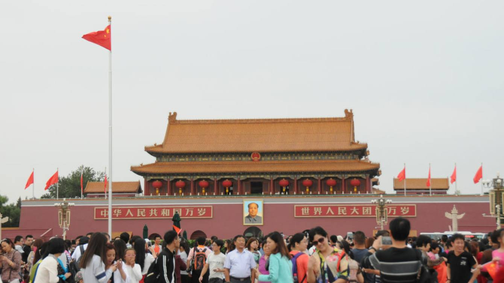

# 我的新年期待：缩小对改革的知行剪刀差 - FT中文网

吴思：2012年之后，中国社会对改革与自由的认知持续向上，实际感受却总体下行。我的新年期待就是，缩小知行剪刀差，回归改革开放。

更新于2019年2月13日 07:06 作者：历史学者、作家 [吴思](http://www.ftchinese.com/search/%E5%90%B4%E6%80%9D/relative_byline)

**【编者按】本文为知名历史学家、《潜规则》《血酬定律》作者吴思，应天则经济研究所2019“新年期许”论坛约稿所作，授权FT中文网发布。**

2018年初，我在天则所新年期许座谈会上谈了六点期待。一年过去，到底实现了多少？我先做回顾和评论。然后，根据最近几年的大走势，我再说一个大期待：缩小知行剪刀差。

## 一，回顾去年的新年期待

### 2018年，我的新年期待实现了两条。

第一条，我希望中国市场经济的自由度能提高几分，例如从52分提高到54分。只要降降税，产权保护程度提高一点，生产要素流动的自由多一点，政府对市场的干预减少一点，市场经济的纯度就会有相应提高。

我的愿望部分实现了。增值税税率降了，集体用地进入市场开始试点了，民企产权保护的承诺更多了，等等。

在美国传统基金会和华尔街日报2019年2月发布的评估报告上，我看到，中国经济的自由度，从2016年的52分，跃升到2017年的57分，2018年更进一步，提升至58.4分。虽然，50-60分仍然属于自由受到严重压抑的经济，但是能冲出十几年来52分上下的徘徊，还是让人眼睛一亮。

一定有人质疑美国人的评估。例如，税率在名义上降了，但政府的“金税三期”工程提高了征税技术，民营企业实际上交了更多的税。再如，以文件落实文件不等于政策落地。再加上环保一刀切或清除低端人口之类运动，一阵风就能刮走一堆法规和契约，毁掉一堆信心和预期，等等。这些质疑当然有理，“批示治国”的种种副作用当然也应该评估，但一码归一码，名义税率降了就是降了，文件上的进步也是进步。

一定也有人质疑进步的原因，到底是主动改革，还是被迫改革？我看两种说法都有理，形势比人强，人也要顺势而为，关键看实际结果。按照老子的说法，物或损之而益，或益之而损，主观动机与实际后果往往相反。作用力触发的反作用力，或许大于作用力，于是要用更大的作用力对冲，以保持稳定。

去年我的第二条期许是，我希望意识形态向邓小平时代靠拢，淡化红色话语。这个愿望也部分实现了。

在2018年11月最高领导人纪念刘少奇诞辰的讲话中，“初心”被定义为共产主义理想。而二十多天之后的12月18日，他在纪念改革开放四十周年的讲话中，一次也没有提起“共产主义”，将“初心”定义改为“为中国人民谋幸福，为中华民族谋复兴”。这就是向邓小平时代的意识形态政策回归——邓小平要把共产主义推迟到十几代、几十代人之后再说。更进一步，考虑到高层对民营企业密集而高调的肯定，或许意识形态的左转趋势见底反弹了？

一定有人反驳我，说意识形态管控和媒体网络管理更紧了。确实如此。但一码归一码，淡化红色话语本身也属于意识形态转型。我不敢确认的是：这种转向到底是趋势反转，还是昙花一现的反弹？

### 2018年，我的六点期待有两条没有实现。

第一条，我希望别加力打压公民社会，例如让独立智库天则所能够正常运作，有一个稳定的办公场所。结果，天则所的办公室被封门了，天则咨询有限公司的营业执照也被吊销了。

第二条，我希望建立制度化的反腐机制，比如说领导带头，官员公布个人财产。这一步尚未走出来。制度性建设跟不上，反腐败成果便难以长久留存，这是中国历史一再告诉我们的。

### 另外有两点期待，我不敢说实现了，也不敢说没有实现。

第一点在司法领域。中共十八大承诺司法文书上网公开，我希望公开率能比过去提高一些。我希望各大区建立的巡回法庭能发挥更大的作用，逐渐形成一种提供公共服务的竞争机制，与地方法院竞争，增加民众的选项。这些领域，到底是进步还是退步了？我说不清楚，需要中立公正的专业人员调查评估。

第二点涉及合宪性审查。全国人大法工委承诺，对合宪性审查申请，争取做到条条有回复。而据我所知，江平和盛洪等六人一年前提出的申请，也就是审查北京市驱赶低端人口和清理天际线所依据的规定是否合宪的申请，至今也没有得到回复。个别案例当然不能代表全部，但整体状况如何？恐怕只有人大法工委才能说明白。

为了解决说不清楚的问题，我想再强调一遍去年落空的两点期待。

第一，扩大公民社会的活动空间，至少不加力打压。

第二，官方承诺做到的事，例如对合宪性审查申请作出答复，如果不肯让公民组织评估兑现程度，至少应该自己定期回顾公布，善始善终。

## 二，近年的大走势和今年的大期待

五六年前，十八届三中和四中全会开出了一份改革清单，涉及六十个领域，细化为四百多个改革点。社会各界对不同改革点的评价不同，但对基本走向是赞赏的。这个基本走向就是提高市场自由度，提高依法治国的水平。

改革开放四十年的基本走势，在我的想象里，呈现为一个向右上方爬坡的M形，两上两下。最近几年，在自由度方面，依据人们的总体获得感评估，实际是往下走的。

十八届三四中全会本来承诺了上行，2012年之后在认知上持续向上，实际感受却为总体下行，呈现出一个知行剪刀差，这是为什么？在我看来，至少有四条原因。

### 第一条原因：改革尚在半途，主导规则左右冲突。

我们从一元化的公有制加计划经济走来，向多种所有制并存和市场经济的多元化方向走去。那么，贯穿全社会的主导规则，到底是一元化的权力命令，还是多元化的平等契约？三中四中全会决议，既要强化平等契约，又要强化一元化领导，这种顶层设计，包含了主导规则的冲突。欧美用契约规则整合社会，政治领域的基本契约就是纳税人选择购买公共产品，权力被关入契约笼子，如此解决了主导规则的冲突问题。我们在强调市场起决定性作用的同时，还在强调一元化领导全覆盖。

### 第二条原因：意识形态与其它领域冲突。

意识形态可以塑造社会基本氛围，具有全局性的影响。最近几年的意识形态左转，唱红、打右，对经济、社会、外交关系的影响相当显著。这种影响涉及最要紧的国内关系和国际关系：民营企业家的良好预期，国际社会的信任合作。

在意识形态紧张的气氛中，即使经济自由度提高，人们依然感觉紧张。这种感觉类似塔西佗陷阱：不管自由度实际提高还是下降，只要意识形态令人反感地收紧，人们的综合感觉就是弥漫性收紧。在中国，在舆论先行的政治传统中，这种感觉确实有历史依据。

### 第三条原因：一级问题与二级问题冲突。

改革开放三十多年，努力解决的一级问题是发展市场经济，提高社会自由度，政策的基本取向就是“放”。市场经济的发展带来了经济繁荣，也产生了两个副产品，一是两级分化，二是腐败。两级分化是市场经济的自然结果，腐败则是非法的权钱交易。这两个副产品属于二级问题。

胡温时期建立并扩大社保体系，取消农业税，努力解决贫富分化问题。本届领导班子大力解决腐败问题。反腐败是对改革开放的副作用的救治，在政治上和道德上都是正当的。但是，反腐败运动本身也有副作用。一个明显的副作用，就是自由的价格提高了。

中国改革从高度一元化的极权社会启程，现在走到了半极权半威权的位置。一路走来，民间自由一直处于稀缺状态。中共中央承诺改革开放，这是大方向，但具体在各个领域的实施，难免需要私下交易。行贿就是一种交易。在这个意义上，行贿，就是民众和资本向权力赎买自由。这是一种权钱交易的黑市。更进一步，资本还会以行贿的方式购买政治保护，甚至购买特权。这种交易导致了民间仇官仇富的情绪蔓延。

反腐败为民众出了一口气，降低了民变风险，但也提高了黑市上的自由的价格。同时，反腐败导致官员普遍不作为。在权力要素特别重要的中国，作为全要素组合者、“超级企业家”，地方政府官员失去了改革主动性，自由的主动供给就减少了。

总之，高强度的反腐、唱红、打右，导致政治和意识形态紧张，自由的黑市价格提高。当局为了解决腐败和两极分化等二级问题，压制了提高市场经济纯度和依法治国水平之类的一级趋势，下行态势由此形成。

### 第四条原因：各级官员的选择性执行。

在十八届三四中全会决议体现的顶层设计中，既要如何，又要如何，两边的话都要说到，已经埋下了内在冲突的伏笔。在整体布局中，既要提高自由度，又要唱红打右，内在冲突显现。在政策实施过程中，既要解决一级问题，又要解决二级问题，内在冲突增强。

在贯彻落实上级指示的过程中，各级官员趋利避害，是有选择性的。市场导向的改革开放是利益再分配，依法治国是对权力的限制。动权力的奶酪必定得罪官场中人，在反腐高压下风险比较大，于是改革推进乏力。反过来，反腐、唱红、打右，压缩自由度，投上所好，个人获利的机会比较多。

意识到“知行剪刀差”的存在，对我来说，只是数月之前的事情。反腐败运动与改革开放之间的复杂关系，解决一级问题和二级问题的恰当分寸，意识形态严控并左转对一级趋势的影响，等等，对我这个知识不足且见事颇迟的人来说，都是事先想不明白，只能当事后诸葛亮的。不过，从逻辑上说，一旦认清了知行剪刀差形成的原因，知行合一就是可以期待的，主动调整就是可能的。主动调整是风险最小的调整。

2019年，我的大希望是：缩小知行剪刀差，落实十八届三四中全会决议，回归改革开放的一级趋势。形势比人强，我认为这个希望实现的概率大于60%。

（注：本文仅代表作者个人观点。本文编辑邮箱 fang.wang@ftchinese.com）

版权声明：本文版权归FT中文网所有，未经允许任何单位或个人不得转载，复制或以任何其他方式使用本文全部或部分，侵权必究。

------

原网址: [访问](http://www.ftchinese.com/story/001081419?adchannelID=&full=y)

创建于: 2019-02-13 22:11:41